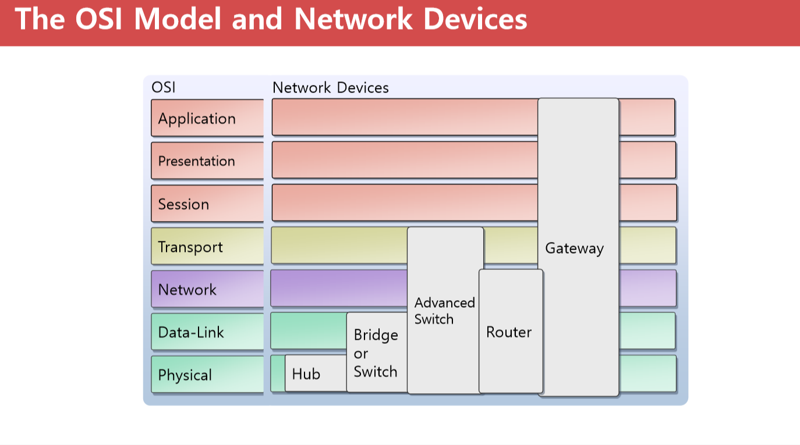

3일차 Azure Network 이해 하기 위한 Network 기초
==

1. IP address
2. subnetting, CIDR 표기법
3. OSI 7Layer
4. Network 장비(라우터, 스위치, 허브)
5. NAT
6. VPN
7. DNS

4일차 
module 5
533 module 2

## 복습

### 리소스 그룹 만들기

### Windows Server 2016 만들기
temporary storage는 D드라이브의 용량임

Premium disk는 ssd

MAX IOPS가 Page임.

[azure 문서](http://azure.microsoft.com)

[microsoft 문서 사이트](docs.microsoft.com)

ACU(Azure 컴퓨팅 단위) > VM 유형 및 크기

size(크기) 관리 탭에서 확인.

### 디스크 설정

OS disk type: standard SSD 선택

### 네트워크

NIC network security group도 하나의 서비스임.

만들어져있는 네트워크에 머신을 연결하는 것임

여러 대의 VM을 만들 때는 네트워크(가상 네트워크)를 만들고 그 안에 머신을 추가할 수 있음

### 관리

부팅 진단 옵셔을 켜면 좀 느림.

자동 종료는 off 해야 함.

백업 할 때는 recovery vault service가 실행되는 것임

> 실무에서는 리소스 그룹이름을 만들 때 인사부, 관리부 이런식으로 만듦

현재 멀티캠퍼스에서는 공인 아이피로 접속이 안돼서

## 1. IP Address v4 (32bit=2^32=42억9천개) v6(128bit=340언데실리온), 인터넷의 주소 체계

``A Class`` 0(;첫 비트가 0인 것) =>   00000000 00000000 00000000 00000000(첫 IP, 0.0.0.0)

                        01111111 11111111 11111111 11111111(마지막 IP, 127.255.255.255)

                        N.H.H.H 255.0.0.0

                        Network 수(2^7 - 2 = 126), Host 수 (2^24 - 2; 호스트 수는 항상 2개를 빼줌)

> 127로 시작되는 것은 특수한 IP라고 해서, Loop-back 이라고 함. 자기IP로 나감
> 0번도 특수하게 쓰임. 네트워크 식별

                        하나의 8비트를 옥텟이라고 함.

``B class`` 10 => 10000000 00000000 00000000 00000000 (128.0.0.0)

                  10111111 11111111 11111111 11111111 (191.255.255.255)

                  N.N.H.H 255.255.0.0

                  Network 수(2^14 = 16384), Host 수(2^16 - 2 = 65534)

                  

``C Class`` 110 => 192.0.0.0

                   223.255.255.255

                   N.N.N.H

                   Network 수 (2^21 = 2097152), Host 수 (2^8 - 2 = 254)

IP를 목적지로 찾기 위한 주소체계는 A~C까지만 쓰임.

``D Class`` 1110
멀티캐스팅 용도(1: 그룹통신), (Q. 1:그룹 통신이라는 것은 어떤 의미임?)

``E Class`` 11110

군사 용도 또는 예약 IP

        11111111

1bit 2^1=2
    0
    1
2bit 2^2=4
    00
    01
    10
    11

> ping을 한 번 넣으면 dns가 저장되어 있어서,
> ipconfig /flushdns 를 하면 dns 확인자 캐시를 삭제함

``C:\Windows\System32\drivers\etc\hosts`` 

이 파일이 메모리로 로드가 되게 되어 있음.

127.0.0.1(루프백 주소) 랜카드까지 갔다가 다시 돌아옴.(Q. loop-back 주소는 오직 127.0.0.1? A. 루프백 주소는 127.0.0.1이 아니라 아무 주소를 다 넣어도 동작함. 마지막 127.255.255.255는 동작 안함)

루프백 주소가 있는 이유는 개발자가 서버를 세팅해서 하기 어렵고, 자신의 컴퓨터에서 테스트 해보려고 있는 것임.

데이터 전송 방식이 세 가지가 있음.

- 유니캐스트(1:1 통신하는 방식): 대부분 이 방식으로 동작함, A, B, C 클래스의 IP
- 멀티캐스트(1:N 통신하는 방식): 하나의 데이터를 보내면서 여러명에게 동시에 전송할 수 있음. (D클래스 IP를 사용함)
- 브로드캐스트(1:모든(라우터에서 필터)): 브로드캐스트 IP를 씀. 라우터에서 필터링 되어 있음. 따라서 라우터 밖으로 나가지는 못하고 네트워크 내부에서 브로드캐스팅 됨.

IP Address = Network ID(네트워크를 식별; 우편번호; ISP에서 부여) + Host ID(네트워크 내의 시스템을 식별; 번지; 네트워크 관리자가 부여)

LAN을 네트워크라고 함.

라우터가 네트워크를 분리시켜주는 장비.

Network ID는 네트워크 자체를 말함

HOST ID의 모든 비트가 0일때: Network를 식별
Host ID의 모든 비트가 1일 때: BroadCast 데이터 전송시 사용

패킷의 source ip에 A~C클래스가 들어가면 유니캐스트, ip에 D클래스가 들어가면 멀티캐스트

IP를 관리하는 단체가 IANA임

``ISP``(Internet Service Provider)

ISP에서 IANA에 돈을 주고 IP를 구매함.

Network ID는 IANA > ISP > 회사 이런식으로 네트워크 ID를 부여 받음

Gateway IP: 라우터 장비에 부여 되는 IP, 내부네트워크와 외부 네트워크의 관문

이 경우에는 Network Address는 70.12.113.0

자신의 IP와 Subnet Mask를 AND 연산하여 자신의 Network ID를 식별하고

목적지 IP와 자신의 Subnet Mask를 AND 연산하여 목적지 Network ID를 식별

두 Network가 동일할 경우 Gateway 없이 통신하고 다를 경우 패킷을 Gateway에 전송

subnet mask가 없으면 네트워크 ID를 찾을 수가 없음

``첫 번째 비트부터 1이 들어가는 비트``까지 ``Network ID``

예전엔 이렇게 썼는데 요즘에는 IP낭비가 너무 심한 듯 하여 subnetting을 좀 다르게함.

CIDR(classless Inter-Domain Routing): Subnet Mask를 10진법으로 표기 하지 않고 2진법으로 표기

Class는 IP 낭비가 심함. 10진법 표기

우리 회사는 50개의 IP가 필요합니다. Subnet Mask?

ip/26 <=== Subnet Mask 1 비트수 (2진수에서 1이 들어간 비트 수)

ip/255.255.255.192  11111111 11111111 11111111 11000000

(아래의 문제에서 한문제 나옴. subnet mask가 어디까지 들어가면 좋겠느냐.)

우리회사는 300개의 IP가 필요합니다. 최적의 Subnet Mask? 23, 255.255.254.0

우리회사는 2000개의 IP가 필요합니다. 최적의 subnet mask? 21, 255.255.248.0

### Sub Network

ISP에서 70.12.113.0/24 를 부여받았다. 2개의 네트워크를 분할 해서 사용 하려고 한다.

서브 네트워크를 만드는 것을subnetting이라고 함.

라우터에 포트가 여러개가 있는데 router에 부여되는 ip가 gateway ip임.

router에 포트가 있고. 스위치나 허브가 물림.

router에 서브넷 마스크가 할당 됨.

ISP에서 70.12.113.0/24 를 부여 받았다. 2개의 네트워크를 분할 해서 사용 하려고 한다. 다음을 채우시오.

70.12.113.00000000 70.12.113.0/25

- Network ID: 70.12.113.0
- Broadcast IP: 70.12.113.127
- Host 수: 2^7 - 2 = 126대
- IP 범위: 1~126

70.12.113.10000000 70.12.113.128/25

- Network ID: 70.12.113.128
- Broadcast IP: 70.12.113.255
- Host 수: 2^7 - 2 = 126대
- IP 범위: 129~254 

`ISP에서 70.12.0.0/16 를 부여 받았다. 4개의 네트워크를 분할 해서 사용.`

70.12.0.0/18
70.12.64.0/18
70.12.128.0/18
70.12.192.0/18

> 첫 번째 network

- Network ID: 70.12.0.0
- Broadcast IP: 70.12.63.255
- Host 수: 2^14 - 2 = 16382
- IP 범위: 70.12.0.1 ~ 70.12.63.254

> 두 번째 network

- Network ID: 70.12.64.0
- Broadcast IP: 70.12.127.255
- Host 수: 2^14 - 2 = 16382
- IP 범위: 70.12.64.1 ~ 70.12.127.254

> 세 번째 network

- Network ID: 70.12.128.0
- Broadcast IP: 70.12.191.255
- Host 수: 2^14 - 2 = 16382
- IP 범위: 70.12.128.1 ~ 70.12.191.254

> 네 번째 network

- Network ID: 70.12.192.0
- Broadcast IP: 70.12.255.255
- Host 수: 2^14 - 2 = 16382
- IP 범위: 70.12.192.1 ~ 70.12.255.254

### Public IP(공인IP): 라우팅 되는 IP. 

### Private IP(비공인IP 또는 사설IP): 라우팅 되지 않는 IP.

    A 10.0.0.0 ~ 10.255.255.255

    B 172.16.0.0 ~ 172.31.255.255

    C 192.168.0.0 ~ 192.168.255.255

사용목적이 2가지임
- 보안
- NAT(network address translation; 사설 IP에서는 공인IP로 변환이 되어야 외부망과 통신을 할 수 있음. NAT는 사설IP를 공인IP로 변환해서 내보냄.)
  - 사설ip > 공인ip(사설망에서 외부로 패킷을 내보낼때 source ip 주소를 변경함)
  - 공인ip > 사설ip(외부망에서 내부 사설망으로 패킷이 들어올 때 dst ip 주소를 변경함)
  - NAT Table에 저장해 놨다가 내 보냄.
  - 즉 NAT는 하나의 공인IP를 가지고 있는 경우에 많은 컴퓨터가 망에 접속 되도록 하고 싶을 때.

    VM들은 사설 망을 씀.

### NAT
패킷의 Source IP ==> Public IP로 변환해서 인터넷 망으로 전달

Port: 데이터가 전송 되는 통로(0 ~ 65536)

잘 알려진 포트: 0 ~ 1023

- TCP: 신뢰성 있는 전송, 3way Handshake, 전송속도가 느리다.

handshake에서 못 받았다면, 새로 데이터를 보내준다. 전송속도가 느리다.

- UDP: 신뢰성 없는 전송, 전송속도가 빠르다.

잘 받았는지 확인 작업이 없음.

``

wellknown port가 기록되어 있는 경로(기억하기): `C:\Windows\system32\drivers\etc\services`

well known port는 IANA에서 정의해 놨음.

(여기서 한 문제 나옴)

- TCP 21: FTP
- TCP 22: SSH
- TCP 23: TELNET
- TCP 25: SMTP(Q. SMTP와 POP3 프로토콜의 차이점?)
- TCP 53: DNS 영역전송(Q. DNS 영역 전송? A. DNS 데이터베이스를 영역이라고 함. 1차 DNS가 있고 2차 DNS가 있음. 1차 DNS가 fail나면 2차 DNS가 작동함. 1차 DNS의 데이터베이스 파일을 2차 DNS의 데이터베이스로 복제 구성을 하게 됨. 즉, 1차 DNS 데이터베이스에서 2차 DNS 데이터베이스로 복제를 하는 것. zone을 복제함)
- UDP 53: DNS 이름(FQDN;전체 컴퓨터 이름)풀이
- UDP 67, 68: DHCP(67: 부트스트랩 프로토콜 서버, 68: 부트스트랩 프로토콜 클라이언트)
- TCP 80: HTTP
- TCP 1433: MS-SQL
- TCP 3389: RDP

포트 정보를 알아야 방화벽을 열어줄 수 있음

TCP 445번 포트는 SMB 서비스

``파일 및 프린터 공유``는 ``139``번 및 ``445``번 포트를 씀.

클라이언트는 다이나믹 IP를 씀(Q. 다이나믹 포트는 몇 번 부터 몇번 까지, 어떤 규칙으로 할당 되나요? )

``wf.msc(고급 방화벽), firewall.cpl(기본 박화벽)``

방화벽 컨트롤은 Inbound 컨트롤임. 들어오는 것만 패킷을 차단한다든지 컨트롤함.

시스템 및 보안 > windows Defender 방화벽 > 허용되는 앱

cisco는 네트워크 장비를 팔고 HP는 서버 장비를 팔았음. 둘이 짝짝꿍이 잘 맞아서 둘이서 협업해서 판매를 많이 했음

CISCO가 서버를 만들어서 팔기 시작하면서 갈라지고 싸우기 시작 했음. 

CISCO가 지금은 클라우드를 하겠다고 함. oracle, HP도 클라우드 하겠다고 함.

## What is Network?

네트워크는 연결임.

네트워크는 좁은 의미에서는 LAN을 의미.

네트워크는 넓은 의미로는 컴퓨터와 컴퓨터의 연결을 의미하는 것임

### P2P방식

10대 미만의 computer일 때 자신이 클라이언트가 될 수도 있고 서버가 될 수도 있을 때.(소규모)

### Client/server

100 ~ 1000대 서로서로 공유하는 것 보다는 서버를 두고 서버에 접속해서 서비스를 제공 받는 것.

네트워크에 있는 컴퓨터들이 통신하기 위해서는 동일한 프로토콜이 설치되어 있어야 함.

TCP, UDP, ISPX도 있음.

### Switch 장비

컴퓨터와 컴퓨터 사이에 공유기 처럼 물려 있음.

요즘엔 허브를 거의 안쓰고, 스위치를 씀.

- 허브: 허브에 물려있는 모든 컴퓨터에 데이터를 뿌림. B 컴퓨터만 자신의 컴퓨터이기 때문에 mac address로 식별해서 상단으로 올림. 다른 컴퓨터는 자신의 mac address와 일치하지 않기 때문에 packet을 drop함.(Q. 허브의 통신 프로토콜은 무엇인가요?)
- 스위치: 스위치는 네트워크에 물려 있는 정보들을 gathering 함. 따라서 포트에서 컴퓨터의 mac address가 어디에 있는지 알고 있음. 따라서 해당 주소의 컴퓨터에게만 정보를 보내줌.(Q. 스위치의 통신 프로토콜은 어떤 것인가요?)

요즘에는 허브를 쓰는 업체는 없음. 네트워크 장치가 가격이 매우 낮기 때문에, 허브는 거의 생산되지 않음.

라우터 IP는 첫 번째 IP로 세팅됨. 서브넷 마스크를 어떻게 하는지에 따라서 규모를 크게 할 수도 있고 작게 할 수도 있음.

라우터에 세팅되는 IP는 회사의 관리자가 세팅하는 것임. 1번을 쓸지 254번을 쓸지 아니면 임의의 IP를 쓸지.

흔하게 쓰는 것은 1번 또는 254임.

이 router장비는 다른 회사 라우터 장비와 연결되어 있음. 그리고 또 다른 회사와 연결되어있고.

그 회사는 스위치로 해서 컴퓨터들과 연결되어 있음.

전 세계 인터넷 망이 위의 그림과 같은 형식으로 되어 있음.

회사 네트워크를 private망 또는 on-premise망 이라고 함.

일반적으로 회사 네트워크는 공인 ip가 아닌 사설 ip로 세팅을 함

라우터들은 라우터와 통신을 하면서 네트워크id를 가지고 목적지network를 찾음

그 안에서 host id를 가지고 호스트를 식별함.

명령어: ``tracert www.google.com`` -> 어떤 경로를 경유해서 가는지. 방화벽에서 막혀있으면 출력이 안됨.

### OS 7 Layer

애플은 애플 톡이라는 프로토콜을 쓰고, 노벨이라는 회사는 IPX/SPX라는 프로토콜을 쓰고, 또 다른 회사는 또 다른 프로토콜을 씀.

프로토콜이 다르면 통신이 안됨.

초창기에 벤더 끼리의 통신은 불가능 했음.

`OSI 7계층`은 `이런 프로토콜을 가지고 통신을 해라 `라는 표준이다.

각 계층을 밑에서(물리 계층) 부터 L1(layer 1), L2, L3, ..으로 부른다.

문제가 발생한다면 어느 레이어에서 발생 했는지 찾아야 합니다.

데이터링크는 랜카드

3계층은 라우터

### Encapsulation / De-Encapsulation

A라는 컴퓨터에서 B라는 컴퓨터로 데이터를 보냄.

어플리케이션이나 네트워크를 통해서 보내려고 합니다.

그 밑 레이어로 내려 보내면서 프레젠테이션에서는 압축하고 암호화 하고 그런 작업을 합니다.(프레젠테이션 레이어)

세션 레이어에서는 연결 설정을 합니다.

transport 레이어에서는 데이터를 잘게 쪼갭니다. 그리고 번호를 붙입니다.

그 밑으로 데이터를 내려 보내면서 하나의 데이터에 네트워크에 대한 정보를 붙입니다.

검출 코드를 넣게 되고 헤더를 더 추가합니다.

그리고 랜 카드로 보내게 되는데, 디지털 신호를 전기 신호로 보내게 됩니다.

랜 카드는 데이터 신호를 전기 신호로 바꾸게 됩니다. (케이블이 인식하는)

그리고 HBA카드라는 것이 있는데, 일반 케이블이 아니라 광케이블이 있습니다.

이 HBA카드는 컴퓨터 신호를 광신호로 바꿔줍니다. 따라서 광케이블이 깔려있으면, HBA카드를 사용해야 합니다.

디지털 신호를 광신호로.

그리고 B컴퓨터 에서는 전기 신호를 데이터 신호로 변환합니다.

그리고 다시 위에 올려주는데 헤더들을 하나씩 제거합니다. 그리고 정보가 맞으면 헤더를 제거합니다.

그리고 transport 계층에서 데이터들을 재조립합니다.

이러한 위의 일련의 과정들을 `Encapsulation`이라고 합니다.

`한 덩어리의 데이터를 잘게 쪼개서 네트워크로 보낸다.`

반대로 De-encapsulation은 잘게 쪼개진 데이터를 합쳐서 받는 과정입니다.

이 패킷을 레이어마다 부르는 이름이 다름.

어플리케이션과 프레젠테이션, 세션 레이어에서는 데이터라고 부릅니다.

트랜스포트 계층에서는 세그먼트라고 부르고

네트워크 레이어에서는 패킷이라고 부릅니다.

데이터 링크 계층에서는 프레임이라고 부릅니다.

피지컬 레이어에서는 비트라고 부릅니다.

bit는 전기신호입니다.

다 동일한 용어이지만, 어느 레이어에서 보느냐에 따라서 이름을 좀 달리합니다.

### OSI Model and Network Devices

- 라우터는 L3장비
- 스위치는 L2 스위치가 있고, L4 스위치가 있음( L4 스위치가 좀 더 기능이 많음. L4 스위치는 방화벽 기능도 있음, 스위치는 L2 장비라고 하셨음)

## VPN

인터넷 망을 통해 외부 네트워크에서 회사망을 접속

터널링 프로토콜

- PPTP: 보안이 취약함. 아래로 내려갈 수록(IKEv2로 갈수록 보안성이 더 좋음. 요즘에는 PPTP를 거의 안 씁니다.) 
- L2TP: IPsec(암호화 시켜주는 도구)과 함께 써야함.
- SSTP: TCP 443번 포트 하나만 열어주면 됨. ssh를 사용함
- IKEv2: 이게 가장 새로나운 기술인데, 요즘 모바일을 많이 써서 모바일 장비를 통해서 무선으로 회사망에 접속을 할 수 있음. 기차에서 무선에서 다른 무선망으로 접속될 때, 세션이 끊긴다면 새로 접속해야 함. 그러나 IKEv2는 접속이 끊길 때 서버에서 클라이언트로 세션을 새로 맺음. 따라서 사용자들이 새로 로그온 안해도 됨. 

PPTP와 L2TP는 보안에 관한 이슈가 있어서 방화벽을 열어줘야함.

무선으로 데이터를 보내는 것은 AP라고 함.

회사 망이 있습니다. 회사에 서버들이 있습니다. 이 서버들이 여러 서버가 있어요. 이 서버들은

전부 사설 IP로 세팅되어 있습니다. 서버들도 private ip도 되어 있습니다.

10.10.0.0/16비트라고 가정하면

10.10이 네트워크 아이디고 0.0이 호스트ip입니다.

노트북을 가지고 출장을 외부로 갔습니다. 그런데, 회사는 프라이빗 망이기 때문에 사설 IP로 되어있습니다.

외부로 출장 나간경우에는 접속을 못합니다.

VPN이라는 기술을 통하면 회사 내부에 접속 가능합니다.

VPN서버가 회사 망에 있습니다. 이 서버는 공인ip와 사설ip를 둘 다 가지고 있습니다.

이 원격에 있는 컴퓨터가 마치 회사 내부에 있는 것처럼 해 줍니다.

이 것을 터널링 프로토콜이라고 합니다.

사용자가 VPN 서버를 통해서 회사망에 접근하게 되면 터널링이 만들어져서, 회사 망에 있는 IP가 부여됩니다.

VPN은 인터넷망을 이용해서 회사의private망에 있는 것처럼 만들어 주는것. 따라서 회사의 서버들에 접속 가능하게 됨.

회사 대 회사도 터널링을 만들 수 있음.

VPN은 라우터와 라우터 사이에서 VPN을 만들어 줄 수 있음. 이렇게 하면 마치 하나의 단일 네트워크처럼 사용 할 수 있음(ex. 본사와 지사의 라우터끼리 VPN 설정)

## DNS
module 10741이라는 과정에서 모듈 4에 있는 내용임.

`FQDN(fully qualified domain name; 전체 컴퓨터 이름)`

Adaptum은 여러분의 회사입니다.

AcctDirPC < 이것은 호스트 id, adaptum.com 여기까지가 네트워크 id

ip구조와 도메인 구조는 반대로 되어 있음.(ip와 host 부분이 반대로 되어 있음)

`A레코드, MX레코드` 언급됨

DNS서버

168.126.63.1, 2는 KT dns 서버 ip입니다.

dns 서비스는 이름 > ip로 변환하는 서비스입니다.

ping www.google.com

`ipconfig /displaydns`(dns 캐쉬에 있는 내용을 출력함) (ipconfig /flushdns)

위의 명령어를 치면 www.google.com이 TTL: 187, 레코드(172.217.27.68)

이름 풀이를 하면 우리 캐시를 먼저 확인해봄.

캐시가 우선수위가 제일 높음.

그 다음에 캐쉬가 없으면, DNS 서버에게 물어봄. 그리고 걔가 

시간이 지나면 캐시가 날라감

TTL만큼 시간에 있음(TTL 73: 73초 동안 내 컴퓨터의 메모리에 있음)

클라이언트가 영문 이름으로 접속함.

그걸 변환시켜주는 것이 TCP/IP에 셋팅된 DNS 서버에 요청하는 것임

[도메인을 만드는 사이트](http://www.internic.org)

도메인을 신청을 해야함. 누구나 만들 수 있고, 영문으로 된 dns를 사용할 수 있음

internic.net > register > Listing by Location of Registrar

여기에서 IANA에 등록된 사이트들을 볼 수 있음(ex. 도레지, 가비아 등 볼 수 있음)