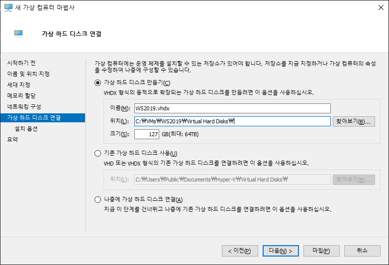

Microsoft Azure(1)
===

> 박정우 선생님
>
> 작은책 10979F 과정
>
> 큰책 10933 과정

## 1. TCP/IP구성하기

자동 구성: DHCP Server로 부터 할당 받는 구성

수동 구성: 아래의 4가지 항목을 직접 셋팅하는 구성 (고정IP)
- IP
- Subnet Mask
- Gateway
- DNS

### 1.1. 명령어
- ncpa.cpl < TCP/IP 네트워크 아이피를 잡을 때 바로 설정 할 수 있음
- ipconfig /all
- ping 8.8.8.8 < 구글의 dns ip
- net use v: \\70.12.113.130\share /user:a a<공유 폴더에 접속하기>

### 1.2. 참고사항
<!-- 다음 주 목요일 시험(5/2)(주/객 문항 있음.) -->

ipconfig /all에서 IPv4에서 기본 설정이라고 뜨면 제대로 잘 나오고 있는 것임

### 1.3. markdown-preview
vscode의 markdown extension을 깔고 ctrl + shift v

## 2. azure 소개(작은 책(10979) Module 1)
- azure subscription: 쓴 만큼 돈을 내는 방식. 

관리를 위해서 ``azure powershell``을 쓸 수 있습니다.

``azure cli``는 클라우드 베이스에 있는 서비스들을 관리 할 수 있음

이 과정에서 배우는 것은

- VM(Virtual Machine) 만들기
- azure의 disk 관리
- web-app
- ``Paas(Platform as a service), iaas, paas, sass``의 개념을 숙지해야함
- virtual network에 대해서 다룸

요즘 핫한 것이 containers와 serverless이다.

``4세대 가상화``가 ``컨테이너(도커)``와 ``서버리스(vm없이 함수 들로 작동되는 환경)``

클라우드 데이터 센터가 변화되고 있는 시점임

``azure AD(azure active directory)``를 통해서`` 기업내의 어플들에 접근`` 할 수 있음

클라우드 서비스를 쓰면 아주 빠르게 서비스를 할 수 있음

앞으로 점점 클라우드로 넘어가는 환경이다.

이러한 많은 것들을 ``dev-ops``이라고 함. 클라우드로는 많은 서버들을 효율적으로 관리 할 수 있음

azure는 가상화 상에서 동작하고 있어서 가상화를 이해해야함

active directory가 뭔지, 가상 머신도 만들고 이렇게 과정을 진행하도록 하겠습니다.

[마이크로 소프트 홈페이지](https://www.microsoft.com/)

마이크로 소프트 계정 만들기(숙제)

### 2.1. 사용자 만들기(로컬 계정)
공유 폴더에 접속이 안되는 경우 
컴퓨터 관리 > 시스템 도구 > 로컬사용자 > 사용자 > 새로만들기
- 암호 사용

### 2.2. 가상화 구현(2종류가 있음) 개요
- ``Type 1 가상화``: ``(실제 서비스), MS - Hyper, VMware v``
- CPU : 가상화 지원, RAM : (DEP 지원),
- ``HDD, LAN, CPU, RAM(시스템 성능을 좌우하는 4대 요소)`` 하나라도 떨어지면 시스템 성능을 떨어뜨림

APP

OS

HDD

app이 구동되기 위해 위와 같은 구성이 되어 있다.

- 가상화라는 것은 Lock을 해제하는 기술
OS는 하드웨어에 락이 걸려있음. (Q. OS에 락이 걸려있다는 것은 무엇?? 하드웨어에 종속되어 돌아간다는 뜻?? o)

가상화를 사용하게 되면, 하나의 하드웨어에 여러 개의 OS를 올릴 수 있음(VM)

가상화를 쓰지 않으면 하나의 하드웨어에는 하나의 OS만 올라가는데, 가상화 위에 올라가는

OS에 락킹이 걸려있음. 가상화를 쓰면 OS를 하드웨어와 분리 시켜서. VM끼리 같은 HW를 공유하고 VM을 떼어서 다른 곳(다른 하드웨어)으로 가져갈 수 있음

- portable APP은 어플리케이션에 대한 가상화임(다른 곳에서 설치하지 않아도 실행 됨)
- 운영체제에 대하여도 가상화가 있고, APP에 대해서도 가상화가 있음

하나의 하드웨어에 여러개의 VM을 올려서 사용할 수 있음

데이터 센터에 서버가 매우 많음. VM이 한 쪽의 서버에 부하가 많이 걸리면 다른 쪽 서버로 넘어감
VM이 다른 서버로 옮겨서 확장시키고 전원을 올림.

사용자들이 줄어들면 한쪽에 몰아주고, 전원을 내림.

이렇게 VM은 서버들을 왔다갔다하는데, 서버의 활용(utilization)을 극대화 시킴.

이렇게 데이터 센터는 ``elastic하게 확장``을 하게 됨. 

이런식으로 ``전기세``를 엄청나게 아낄 수 있음.

메인 서버는 전기료가 엄청 많이 나오는데, 끄지도 못하고, 매우 중요한 서버이기 때문에 종료 할 수도 없음.

사용하지도 않으면서, 전기료가 엄청 많이 발생함.

전부 유닉스 걷어내고 가상화 환경으로 점점 바뀌고 있음.

이런 가상화의 클라우드 라는 개념은 데이터 센터 자체가 가상화되어 있음.

``public cloud``도 있고, ``private cloud``도 있음.

``하이퍼 바이저는 vmware의 vSphere, 시트릭의 Xen, 리눅스의 KVM, MS hyper-v`` 등이 있음

- ``hyper-v``는 ``전체적으로 VM들을 관리해주는 툴``을 말함
- ``하이퍼 바이저``는 ``커널``임

``하드 웨어 위에 하이퍼바이저가 올라가고 VM이 올라감.``

- 하이퍼 바이저가 VM들이 하드웨어를 공유해서 쓸 수 있도록 지원 해주는 것임

``가상화를 하려면 CPU에서 지원을 해줘야함``

``메모리``에서 ``DEP를 지원해야함``.?? (Q. 왜 DEP를 지원해야함 => 보안적인 측면)

- ``Type 2 가상화``: ``(테스트, 개발), Oracle virtualbox, vmware player``

이것들은 CPU에서 지원하지 않아도, 동작함

최신 나온 virtualbox는 hyper-v와 호환이 되어, 동시에 사용 가능함. vmware plyaer는 hyper-v와 호환이 되지 않아, 동시에 사요이 불가능함

## 3. VM 만들기
### 3.1. hyper-v 설치
1. 제어판 > 프로그램 > windows 기능 켜기/끄기 > hyper-v

### 3.2. 가능 여부 체크
- windows 8.1 이상
- 가상화 사용 여부
- windows home edition x
- x64 시스템 부터는 기본적으로 돌아감

탐색기 > 내컴퓨터 > 마우스 오른쪽 > 속성
- 64비트 버젼의 시스템만 hyper-v를 설치 할 수 있음
- windows 10 Home 에디션에서는 hyper-v를 지원하지 않음
- 64bit 일때는 기본적으로 hyper-v를 지원하고, 서버의 기능과 같은 기능을 제공함.(>= windows 8.1부터 지원)

작업 메뉴줄 > 오른쪽 클릭 > 작업관리자 > 자세히 > CPU
"가상화: 사용" 이라는 것이 있어야 돌아감

hyper-v, hyper v 플랫 폼 > hyper-v 하이퍼바이저
hyper-v 하이퍼바이저가 커널임

hyper-v 관리자가 설치되면, 시작에서 검색 -> 작업표시줄에 고정

### 3.3. VM만들기
1. WS2019(windows server 2019)
2. CentOS

Host OS: 실체 H/W에 설치된 OS
Guest OS: VM

새로만들기 > 가상컴퓨터 > (새 가상 컴퓨터 마법사 진입)
이름 : WS2019

- ``azure는 1세대 vm만 지원함``

``1세대 VM: 바이오스, E-IDE(0:0) <== OS (Q. E-IDE는 무엇?? 프라이머리 컨트롤러??)``
``2세대 VM: 펌웨어, SCSI <== OS 스쿼시 컨트롤러에 설치됨(Q. 스쿼시 컨트롤러??)``
2세대는 시큐어 부팅이 가능함(Q. 시큐어 부팅??)

1세대 32비트/64비트 VM을(geustos) 지원함
2세대는 64비트 VM만 지원함

hostos의 메모리 보는 법은 작업표시줄 > 자업관리자 > 성능 > 메모리
현재 컴퓨터의 메모리는 16GB임.
실제 VM을 돌릴 때에는 메모리를 좀 더 쓰기 때문에, 넉넉해야함.
메모리 할당 2048으로 설정

default switch는 win10에 기본으로 포함되어 있고, NAT를 통해서 나가는 설정임.

가상 하드 디스크 만들기가 매우 중요한데,
VM의 확장자는 ``vhdx``라고 되어있음

가상 하드 파일
vhd: 2008에서 지원 <== Azure
vhdx : 2012, vhd보다 30% 성능 빠름.

회사에 있는 가상 머신을 azure로 옮길 수 있음. 그럴 때에는 vhd로 conversion 시켜줘야함.

127GB 그대로 두고 다음.

운영체제 설치파을 다음에 등록.

VHDX는 동적 확장이라고 되어있음.

기업에서 가장 많이 쓰는 리눅스 버젼은 RedHat Enterprise Edition임.

azure에서 리눅스VM도 많이 돌림.

그 중에서 centos는 레드햇 엔터프라이즈의 무료버젼임.

centos도 동일하게 

처음에는 4mb인데, centOS7.6.vhdx에 운영체제가 설치되어 파일 크기가 늘어남.

ncs 사이트가 크롬으로 최적화 되어 있어서 chrome 설치하기.

수업에 대한 정보 평가 등을 여기서 함.

http://e-ncs.kr

수업 평가 사이트.

클라우드와 반대되는 개념이 온프레미스이다.

클라우드는 온라인으로 환경 구축하는 것을 말한다.
온프레미스(on-premise)는 로컬에서 직접 환경 구축하는 것.

vendor에서 만드는 클라우드를 public cloud.
회사 내에서 만드는 클라우드를 private cloud.

## 가벼운 이야기
니콜라스 카, 2003, "IT는 중요하지 않다."
it부서는 정보교환, 소통을 하도록 함

이제 기업 내에 서버를 두지 않고 클라우드 서비스를 할 예정이니까..

스티브 발머, 2008, 200명 개발자 모아서 클라우드에 올인 지시

## 3.4. 운영체제 설치
가상 컴퓨터 선택 > 오른쪽 마우스 > 설정 > IDE 컨트롤러 > 하드드라이브

바이오스를 선택하면 부팅 순서가 나옴
CD > IDE > 레거시 네트워크 어댑터 > 플로피

standard evaulation이 표준 버젼임() 안에  desktop experience는 gui가 지원되는 버젼임

datacenter버젼으로 설치

## 3.5. 툴 설치

www.sysinternals.com <== ms의 협력업체였는데, ms의 관리 툴을 너무 잘만들어서 인수했음.

sysinternals suite는 모든 프로그램을 모아둔 것이라서, 이것 하나만 받으면 된다.

시스템 관리 툴들이 있음. process explorer

### 3.5.1. process explorer

메모장을 켜고, 망원경 옆의 동그라미 눌러서 메모장에 갖다 놓으면 
kill process 하면 프로세스를 죽임
property보면 아주 자세하게 나옴

### 3.5.2. zoomit
윈도우 시작할 때 실행하겠다
ctrl + 1 > 확대(esc하면 꺼짐)
ctrl + 2 > 글씨쓰기
ctrl + alt > 박스를 만듦

### 3.6. 암호 복잡성 요구
``대문자, 소문자, 특수문자, 숫자`` 중 3가지가 조합된 암호( Domain 환경)

내 PC > 속성 > 작업그룹

위와 같이 들어가면 workgroup으로 되어 있음. 

소속 그룹은 도메인과 작업 그룹 두 가지가 있는데, 기업 환경은 도메인으로 되어 있음.

작업 그룹일 때는 암호 복잡성을 요구하지 않는데, 도메인 환경에는 암호 복잡성을 요구함

azure의 계정은 Pa55w.rd 와 같이 되어 있음.(공인 암호임.)

1024 x 768의 해상도로 설정해서 연결!!

guest OS

현재 나에게 할당된 ip는 172.18.32.245임

- ``mstsc /v:192.168.54.23``(윈도우즈의 terminal service.)

windows server 2019
### 3.7. 원격 접속 허용
server manager => local server => remote desktop을 disabled에서 allow로 바꾸면 됨
그러나 바로 refresh가 되는 것이 아니라서, 상단의 깃발모양 옆의 refresh 버튼을 누르면 refresh가 됨.

서버 관리자로 취업하면 약 100대 정도는 관리하게됨.

복사: shift enter

바탕화면에서 원격서버 접속

파일 저장할 때, "WS2019.bat" 이런식으로 묶으면 파일 확장자 지정할 수 있음.

배치파일 안에는 mstsc /v:172.18.32.245 여기로 접속 하면됨.

검색해서 찾을 때는 ``원격 데스크톱 연결``임.

## 4. centos설치

install centos7

test this media & install centos 7

troubleshooting

두 번째 메뉴로 진행함.

실제 업무할 때 centos는 영문으로 설치함.

소프트웨어 선택 -> 기본환경 -> 서버 - GUI 사용.
숙련된 사람들이 최소설치로 함.

그래픽이 올라가는데 x-window로 올라감

시스템 - 설치대상 - 그냥 완료 누르기(자동으로 파티션 설정)

lancard의 ip설정

## 5. azure pass만들기
현재 마이크로소프트 계정 생성이 잘 안돼서, outlook 메일 계정을 만들어서 azure pass를 만들도록 함

[azure pass site](www.microsoftazurepass.com)

promotion code가 있어야함.

[azure portal](portal.azure.com)

여기로 접속이 됨.

all services > subscription

ifconfig를 쓰려면 nettool을 설치해야함.

원격 관리
- windows: 원격 데스크톱 연결(TCP 3389) <= GUI 환경
- Linux: SSH(TCP 22)

- linux 종료 명령 : shutdown -r now

## 6. Module 1
``클라우드 컴퓨터의 이점``(시험문제)
overview of cloud computing(1문제)
- 클라우드(Windows server 2012부터 클라우드에서 쓰는 운영체제이다. 2016, 2019 + system center) 컴퓨팅 솔루션의 특징(windows server 2012 + 시스템 센터(시스템을 중앙에서 관리하는 관리툴) => 클라우드를 환경을 구축 가능하다)
  1. on-demand self-service 셀프 서비스(azure에서 제공하는 서비스는 146개, 직접 만들어서 원하는 것을 가져다 쓰는 서비스. not 개발)
1.  broad network access``네트워크를 통해서 받는 모든 서비스(제일 큰 개념)``
  2. resource pooling 리소스가 풀링 되어있음. 데이터 센터에는 서버가 있음(ex. 만개) 하나의 데이터로 풀링 되어 있음(pooling, logical하게 그루핑 되어 있음.) 서버, 스토리지, 네트워크 장비들이 각각 하나로 풀링되어 있고 추상화 되어 있음.
  3. rapid elasticity. 사람들이 많이 접속하면, 서버의 리소스 풀을 많이 사용함. 하나의 단일 풀로 구성되어 있는데, 그것을 확장해 나갈 수가 있음. 풀링 되어 있기 때문. 사람들이 줄어들면 리소스 풀을 적게 사용함.
  4. measured service. 서비스 자체가 과금 모델임. 하나의 서비스는 하나의 과금의 대상이 됨
- 클라우드 컴퓨팅의 이점
  - managed services 누군가가 만들어놓은 것을 가져다만 쓰는 것을 말함. managed service에 접근할 수 있다.(without 개발)
  - 클라우드 서비스에서는 5분이면 서버를 올림. minimized or eliminated capital expenses.(서버, storage, network, os, 개발, DB, 보안, 패치)
  - 기업 내에서 서버 장비를 받으려면 6개월 정도 걸릴 수도 있음. 
  - lowered operational expenses. 서버가 천대가 있으면 패치를 계속 해줘야 하고, 관리해줘야 하는데, cloud에서 보안, 패치 등을 적용을 해줘서 편함.
  - usage-based billing model 사용한 만큼 과금된다.
  - improved agility(신축성이 좋음, ``신속한 확장성``)
cloud-computing models(1문제)
1. public cloud - azure, aws, gcp(google cloud platform ) 클라우드 업체 중에 가장 많은 지분 나눔 + sales force..., 클라우드 플랫폼 벤더 / 국내 네이버, kt(특정 서비스 위주로.)
2. private cloud - 우리 회사에서 클라우드 환경을 기반으로 그 회사의 데이터 센터에 풀링이 되어 있음. 우리의 회사를 on-premise라고 부르는 것임<=> cloud
3. hybrid cloud - public에서 글로벌하게 서비스하다가 on-premise로 가지고 올 수도 있는데, 그것을 hybrid 클라우드라고 함 => azure stack이라는 제품이 여기에 속함, public에서 사용한 azure portal 그대로 회사 내부망의 데이터 센터에 구축할 수 있음. hybrid 형태가 대세이다.
4. vendor에 있는 클라우드 : public cloud / 그 회사에 있는 cloud : private cloud
5. hybrid cloud
6. 아마존이나 gcp는 public clowd만 가지고 있음. 
- public cloud: 벤더에 있는 서비스를 쓰는 것
- 온 프레미스 환경에서 클라우드를 만드는 것(windows system center or windows server 2012~) => 프라이빗 클라우드를 구축할 수 있다.
types of cloud services(paas, saas, iaas)(1문제)
``paas, saas, iaas`` 의 타입과 장/단점을 각각 아는 것이 매우 중요함

각 구분은 vendor에서 어디까지 관리해주는지

서로다른 종류의 네트워킹 장비들이 하나로 그루핑 되어 있음 = 풀링 되어 있음.
software define network(SDN) : 소프트웨어로 정의된 네트워크를 말함(하나로 풀링되어 있으니까)
.png)

스토리지도 마찬가지임 EMC 스토리지, 레딧, 히닷지(Q. 히닷지는 뭐지...?).

서버는 연산하는 장치를 말함. 서버들을 하나의 단일서버로 풀링함(SDC, SDS;Software Defined Server)

servers, storage, network가 각각 풀링된 것이 (SDDC;software defined data center)이다.

SDDC는 엘라스틱하다. 신축성이 있다. 풀링되어 있고, 추상화 되어 있다.

SDDC로 구현된 데이터 센터를 private cloud라고 한다.

서버 위에 하이퍼 바이저(가상화)가 올라감.

iaas는 네트워크 장비 ~ 하이퍼바이저까지 벤더에서 관리함.

public cloud의 서비스 모델 IaaS, PaaS, SaaS 세가지 유형이 있다.

``IaaS``는 대표적으로 VM이 있음.

iaas에서는 o/s에서 직접 패치, 보안 관리를 해줘야함.

``PaaS``는 런타임(ex. 자바엔진, 닷넷 프레임워크)까지 관리를 함. => 프로그램 개발과 관리는 사용자가 해야함.

``SaaS``는 어플리케이션까지 관리해줌(ex. office365) => 장점: 관리에 대한 이슈가 전혀 없음.

점점 iaas에서 saas로 변화하는 추세이다.

aad domain service: azure ad domain service는 iaas 서비스

aad: azure ad는 paas

sql서비스도 VM에 설치하는 iaas 서비스가 있고, paas 환경의 sql 서비스도 있음. iaas 환경을 쓴다 하면, vm부터 만들고 sql을 올리는 것, 
paas에서는 sql 서비스에 있는 db만 쓸 수 있음.

iaas는 사용자가 신경써야할 부분이 많음 O/S까지. 다만, 커스터마이징할 수 있어서 활용도가 높음
paas는 관리할 부분은 적지만, 커스터마이징하기가 힘듦
saas는 관리할 부분이 매우 많음.

iaas는 관리가 vm부터구나!
paas는 런타임까지 벤더에서 관리해주구나! paas sql서비스는 사용자 db만 만들어서 사용하면 되겠구나 !, 백업이나 등등은 벤더가 알아서 다 해주는구나
따라서 같은 서비스라도 iaas, pass인지에 따라서 다르다.

VSTS, intune, dynamics, etc 등은 saas로 구분된다.

## Lession 2. Azure는 아마존이나 구글보다 데이터센터가 많음

현재 선도제품은 aws, azure, gdc 순이다.

Azure는 총 54개의 region을 가지고 있음

하나의 region은 pair로 돼있는데, ex. 한국의 서울region과 부산region이 pair이다.

구글은 내년에 국내에 들어온다고 함.

Azure는 on-premise 서비스이다. 146개의 서비스가 있고, azure에 접속해서 서비스를 만드는데, 미국region에 만들 수도 있고, 한국region에 만들어서
미국으로 복사할 수도 있음.

하나의 region에서 재해가 생기더라도 pair가 있기 때문에 복구할 수 있다.

azure같은 경우 on-premise 환경과 클라우드 환경이 integrate되어 있다. azure환경은 on-premise, public cloud 환경이 둘 다 있다.(azure stack)

pdf 교재

Compute는 계산하는 서비스

VM은 compute 시스템이다.

azure ad ds : iaas
azure ad : paas

container instances

아래와 같은 서비스들이 핵심적인 서비스임.

virtual network, virtual machines, conianer, load balancer, azure dns, traffic manager, storage, web apps, azure ad, site recovery

azure는 생물입니다.

6개월마다 새로운 서비스가 나와요.

자꾸자꾸 변화되기 때문에, 

## 시험
객관식 18문제, 주관식 3문제 정도

