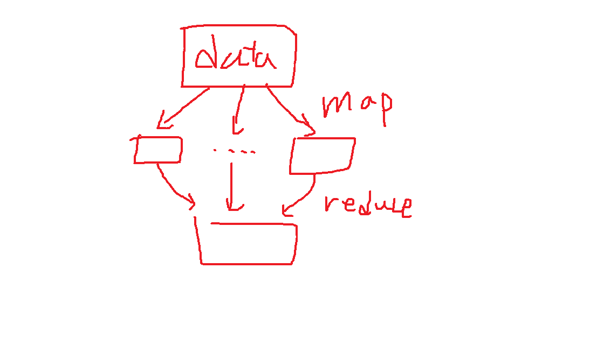

# 목차

0. 요약
1. 소개된 단어
2. 선생님 소개
3. 학습 방향 설정
4. 머신러닝 & 딥러닝
5. 데이터 분석
   5.1. 빅데이터의 실체(3V)
   5.2. 대표적인 빅데이터 처리 프로그램 - 하둡, 스파크
   5.3. 자연어 처리 사이트 구경 - KoNLPy
6. 빅데이터 사례
7. 한계 및 고려사항

# 0. 요약

1. 8시 50분 전에 도착해서 공부하기
2. 프로젝트를 많이 해보는 것이 도움이 됨
3. `데이터`를 얻기 전에 이론을 세우는 것은 `중대한 실수`이다.

# 1. 소개된 단어

- 베이즈 이론
- CNN
- RNN
- 의사 결정 트리
- 랜덤 포레스트
- KNN
- SVM
- GAN
- k-means 클러스터링
- cosine 유사도
- apriori - 중요하지 않은 것은 먼저 빼라는 알고리즘. 같이 배치함으로써 매출 극대화.
- PCA
- 공분산 행렬
- TF-IDF

# 2. 선생님 소개

박길식 선생님

gspark@gw.ac.kr

삼성전자 인재개발원 알고리즘 강의하셨음

# 3. 학습 방향 설정

> 8시 50분 전에 도착해서 공부하기

수학에서도 통계학쪽, 머신러닝의 알고리즘에 대해서 기본적으로 알고 있어야하고, **프로젝트를 많이** 해보는게 가장 좋아요

`kaggle`이라는 사이트가 있어요. kaggle이 좋은게 잘하는 사람들이 써놓은 코드들을 볼 수 있어요.

`베이즈 이론` 기반의 `베이지안 필터기`를 만들어서 여러분이 입력한 영화이름을 분류할 수 있는 분류기를 만들 수 있구요

`RNN`이라는 모델이 있는데, `시간의 흐름에 따른 단어의 등장 순서를 따져서 의미를 이해하는 알고리즘`이 있어요. 좀 더 공부하고 싶다 하면 논문을 보세요. 

데이터 분석은 insignt를 찾아내는 것을 합니다. 상관 분석을 하면 상관 계수가 나오는데, 혹은 feature라고 하는 것을 찾아 내고 합니다. 다양한 분석방법이 있는데, 이것을 통해서 다양한 데이터의 패턴을 찾아내게 됩니다.

대기업을 너무 쫓지 마세요

여러분들은 DB(mysql), 기초 알고리즘, R/Python, 통계, 데이터 분석, 머신러닝, 웹스크레이핑, 데이터 전처리를 배우게 됩니다.

데이터는 `정형 data`, `비정형 data`가 있습니다.

파이썬에서는 scikit-learn이라는 것을 사용하면 편합니다.

## 의사 결정 트리 & 정보 엔트로피

의사결정 트리에 대해서는 친구가 갑자기 본인의 집의 문을 두드리는데 정리가 하나도 안되어 있다고 합시다.

하나만 정리할 수 있다는 제약사항이 있으면, 볼펜 하나를 정리하는 것과 이불을 정리하는 것은 큰 차이가 있습니다. 큰 것을 먼저 정리하면 많이 깔끔해보이는 것처럼 큰 것을 어질러 놓는게 엔트로피가 큽니다. 엔트로피라는 것이 어떤 것인지 이해하고 쓰는 것이 중요합니다.

단순히 사용하는 것은 의미가 없고, 한 번 스스로 `decision tree`를 구현해봤는데 좋은 시간이었습니다.

# 4. 머신러닝 & 딥러닝

`랜덤 포레스트`, `KNN`, `SVM` 등 머신러닝 알고리즘을 배우게 됩니다. 다양한 알고리즘들을 알고있어야 하고, 적절하게 비교를 할 필요가 있는거죠. 모든 문제에 동일한 알고리즘을 적용할 수 있는게 아니고, 데이터 마다 다른 알고리즘을 구현할 수 있어야 합니다.

머신러닝에 관련된 공부를 하면서 실습을 굉장히 많이 하게 됩니다만, 분류기 합격이냐 불합격이냐 분류기, 여러가지 예측하는 것, 어떻게 분류 할 것이냐 등을 할거에요.

머신러닝은 성능이 약간 떨어집니다. 대체로. 딥러닝은 대체로 성능이 좋게 나옵니다. 우리과정은 딥러닝에 대해서 주로 배우게 됩니다. `CNN`, `RNN`을 다루게 되고 더 나아가서 `GaN`을 다루게 됩니다.

미국 FBI에서 뭘 만들었는데, 범죄 예측 시스템을 만들었습니다. 언제 어디에서 범죄가 일어날지를 예측했는데, 실제로 맞았습니다. 어쩌다가 맞은거긴한데...

**서울시에서는 버스 노선**을 조정을 했습니다. 머신러닝 기반으로 해서. 밤되면 택시 승차거부가 많이 있어요, 불만들이 많이 있어서 심야버스들을 연장운행을 하면서 노선변경을 고려했었습니다. 사람들이 많이 다니니까가 아니라 합리적으로 버스노선을 개선을 했어요. 서울시 지역들을 셀이라는 단위로 나눠서. 동이나 구 별로 나누는 것이 아니라 셀을 나눠서 서울시 지도를 나눈거에요. **셀에서 다른 셀로 이동하는 사람들에 대해서 직접 한 번 카운트**를 해본 거죠. 이걸 토대로 취합해보니까. 어디에서 어디로 많이 이동하더라를 바탕으로 버스 노선을 변경을 한 거죠. 더군다나 더 늦게까지 술을 더 먹더라 하니까 상인의 입장에서도 더 좋잖아요. 시민들도 편하고.

실제 상황에 다양한 사례가 많습니다.

`KNN`이라는 알고리즘을 이용하게 되면, 신약 개발할 때 많이 사용합니다.

`k-means`는 그루핑을 하는 것입니다. 데이터가 무엇인지 단정할 수 없는 데이터가 있는데, 분류하고 싶은거에요. 사회 분석을 할 때 많이 쓰이는 분석 기법입니다. 이 때 말하는 그룹이라는 것은 비슷한 것들 끼리 모아서 해석을 하는 거죠. 이거 나중에 우리 실습할 때, 미국에 고등학생들이 SNS를 사용하는 데이터가 있거든요. 데이터 분석을 한 번 해볼거에요.

3만개의 행이 있고, 열의 개수가 feature가 되는데 몇십만개의 column이 있겠죠. 이걸가지고 브리핑을 해보는 거죠. 3개의 그룹으로 나누면 비슷한 그룹으로 나뉩니다. 끼리끼리 모이게 되는데, 상관분석을 해보면 이쪽 그룹은 스포츠를 좋아하는 그룹이구나, 이 쪽은 굉장이 학구적인 그룹이구나. 학교 입장에서는 이번 학생들이 어떤 신입생들이 들어올지 궁금한거에요. 그래서 분석을 해보게 되는거죠. 이런 것들을 배우게 됩니다.

대출을 해줘야 하느냐 말아야하느냐. 정상적인 거래인가 아닌가 하는가. 유사도 같은걸 찾아서 해봅니다. 예를 들어서 cosine 유사도 같은 것들.

여러분 이런걸 해봐도 재밌을 거에요. 여러분 얼굴사진을 10개씩 모으는 거에요. 그걸 가지고 만들어서, 그 사람인지 맞추는 것들을 해봐도 재밌지 않을까요?

챗봇같은 것을 만들어보는 것도 좋아요. 과거에 농협이랑 같이 챗봇 만들었던 적이 있어요. 6시 넘어도 은행에 상담을 하고 싶다 하는 니즈가 있어서 만들게 된거죠.

>  ~를 하려면 어떻게 해야 하나요 => `민증, ~서류`가지고 오세요.

데이터를 전처리를 해요. 이런 작업을 딱 하고 나니까 20만건 중에서 3천건이 남더라구요.

쓸모 없는 데이터가 어떤거였냐면, 고객이 물어본거죠. 그런데, 상담원이 모르는 질문을 한거에요. 그냥 관련부서로 연결했습니다. 이런 데이터들을 날렸습니다. 만약에 이런걸로 챗봇 만들면 나중에 모른다고 답변이 나옵니다.

우리가 원하는 답변이 20퍼센트 정도가 나왔던가, 성능은 안 좋았습니다. 그래서 중요한게 데이터에요.

우리나라와 외국에 있는 은행의 F&Q같은거 싹 긁어와서 했는데, 그래도 데이터가 너무너무 부족합니다. 그리고 우리나라 말이 좀 어려워요. 영어는 챗봇만들기가 쉬워요. 축약형이 많은데, does not => does'nt 등의 처리만 잘 하면 되는데, **한국어는 어순이 달라져도 의미가 통하기 때문에 엄청나게 어려운 말**입니다. 외국에서 함부로 우리나라 못 들어오는 이유가 되죠.

자연어 처리쪽을 과거에 많이 했습니다. 자연어 처리쪽도 어렵습니다. 여러분 나중에 `감정 분석기`도 만들거에요. 텍스트가 주어지면, 이것은 정치 카테고리다. 사회 카테고리이다. 이런것도 해볼 겁니다. 이것들은 `베이즈이론`(조건부확률)을 기본으로 해서 하는 겁니다. 영국의 토마스 베이즈가 19세기 후반 영국의 유명한 수학자인데 베이지안 필터기라는 것을 만들었어요. 스팸 메일 분류기는 베이즈 이론 + RNN으로 만들어집니다. 베이즈 이론은 아주아주 중요한 이론입니다.

그리고 기본적인 영어는 할 줄 아는 것이 좋습니다. 영어 문서를 많이 보게 됩니다.

# 5. 데이터 분석

실용적이지 않으면, 필요가 없습니다.

`술 옆에 안주를 두는 것`을 `연관규칙`이라고 합니다. 연관분석에는 `apriori` 알고리즘이 있습니다.

**데이터 분석을 하는 이유는 insight를 얻기 위함**입니다.마트에서 술 옆에 땅콩을 팔아라고 사장에게 조언해준다면. 너 나가 하겠지만, 분석을 통해서 기저귀 옆에 맥주를 둔다면, 그건 보통 사람이 생각해내지 못하는거잖아요.

`웹 3.0 시대`는 **개인화 시대**입니다. 아직까지는 좀 부족한 실정이지만 10년이면 어느정도 개인화 서비스가 된다. 라고 할 수 있습니다.

## 5.1. 빅데이터의 실체

사용되는 분야
- 헬스케어
- Finance
- Log Analysis Search Quality

빅데이터 하면 3V라고 말을 많이 합니다. 
- 규모: 제타바이트 시대
- 다양성: 정형데이터는 형식이 정해져있는 데이터
- 속도(전송/생성): 매우 빠른 처리속도

데이터 폭증 시대의 두 가지 문제
- 얼마나 많이 저장 할 것인가?
- 얼마나 빨리 처리 할 것인가?

## 5.2. 대표적인 빅데이터 처리 프로그램
대표적인 빅데이터 처리 프로그램
- 하둡의 뜻?: 하둡 만든사람 아들이 애긴데 하둡! 하둡! 해서 하둡입니다.
- 하둡의 기능: 대용량 데이터를 `분산 처리`할 수 있는 분산 파일 시스템
- 3.0GHz짜리 CPU 한대가 있을 수 있고, 1.0GHz짜리 10대가 있는데 1.0GHz짜리 10대를 병렬 처리해서 처리하는 것이 훨씬 효율적입니다.
- 이렇게 처리해야 하는데, 큰 업무를 작은 업무로 나누는 것을 map이라고 합니다. 처리를 하겠죠. 그 처리는 병렬로 처리됩니다.

`하둡`은 `하드디스크에서 처리`를 하기 때문에 굉장히 느립니다. 그래서 나온것이 스파크입니다. `스파크`는 `메모리에서 빅데이터 처리`를 한 것을 스파크라고 합니다. 스파크도 내부적으로 머신러닝 모듈들이 다 들어가 있어요

## 5.3. 자연어 처리 사이트 구경 - KoNLPy(발음: 코NL파이)

KoNLPy를 통해서 다양한 자연어 처리를 할 수 있습니다.

단어 토큰, 문장 토큰, 형태소 토큰이 있습니다. NNG, SP 등은 형태소의 품사를 나타낸 것입니다.

# 6. 빅데이터 사례

## 아마존의 도서 추천 시스템

유진, 정현, 준행이라는 세명이 있을 때, 포도 사과, 수박이라는 아이템이 있습니다. 다른 사람들이 산 것을 바탕으로 해당 물품을 사면, 그 물품을 산 사람들이 다른 물품을 샀던 것들을 추천해줍니다.

## 패스트 패션(fast fasion)
자라

400여 개 도시에 진출한 각 매장의 실시간 판매,재고 데이터를 분석

## 월마트 빅데이터 분석

상관계수는 -1에서 1까지입니다. 0.5이면 상관관계가 있다. 0.7이면 매우 상관관계가 높습니다.

이 상품에 대해서 하나씩만 뽑아냅니다.

|       | 상품    |
|-------|---------|
| 손님1 | A,C,D   |
| 손님2 | B,C,E   |
| 손님3 | A,B,C,E |
| 손님4 | B,E     |

각 물판매량 파악하고, 이 후에 덜 팔린 상품을 뺍니다.

| 상품   | 판매량 |
|--------|--------|
| (A,C)  | 2      |
| (B,C)  | 3      |
| (B,E)  | 3      |
| (C, E) | 3      |

이런식으로 덜 팔린걸 뺍니다. 결론은 (B,C,E)의 판매량이 2이기 때문에 B,C,E를 묶어서 팔아야합니다.

**같이 배치함**으로서 **매출 극대화**

apriori(중요하지 않은 것은 먼저 빼라) 알고리즘이 이것입니다.

# 7. 한계 및 고려사항

## 구글 독감 프로젝트

구글 검색을 바탕으로 처음에는 되게 잘 맞았습니다. 지금은 망하고 없습니다.

왜냐면, 언론으로 인해서. 독감에 걸리지 않았는데도 독감을 검색을 했기 때문입니다. 이런 것을 본다면, 분석 결과물을 맹신해서는 안됩니다.

## 선거와 검색결과

고승덕의 검색결과가 매우 많았습니다. 고승덕이 인기가 많아서 검색이 많이됐나요 ? `고승덕 미안하다`, 등 검색이 많이됐는데, 가족 문제 때문에 검색이 많이 되었습니다. 인기가 많아서가 아닙니다.

## 초콜릿 노벨상 패러독스

한 나라에서 초콜릿 많이 먹는 것과 노벨상을 많이 타는 나라와의 상관계수가 높은데, 이것을 곧이곧대로 믿으면 안됩니다.

양의 상관관계는 하나가 커지면 같이 커지고, 음의 상관관계는 하나가 커지면 다른 것이 작아지는 것입니다. (반비례 관계는 음의 상관관계입니다.)

> `데이터`를 얻기 전에 이론을 세우는 것은 `중대한 실수`이다.

위의 말을 항상 명심하고 계셔야합니다.

`차원축소`를 해야 합니다. `PCA`라는 방법이 있습니다. 차원축소는 고유벡터 등을 공부해야 합니다.

따라서 `선형대수` 등을 공부해야 합니다.

Q. 자연어 처리를 하기 위해서는 어떤 것을 공부하는 것이 좋나요.

1. 언어(Python, R 등)
2. 데이터에 대한 전처리
3. 베이즈이론, RNN, 엔그램, 등 알고리즘
4. 웹으로부터 데이터 수집

어떤 지문(text)을 주면, 어떤 주제를 뽑아 내는 것을 할 수 있는데 `TF-IDF`를 알아야 함

`공분산 행렬`에서 고유벡터를 찾아내는 것이 중요합니다.

