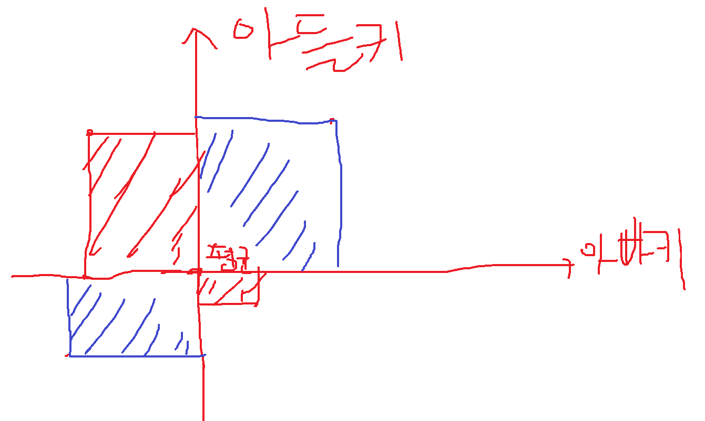

## 복습. 시각화

```R
library(ggplot2)
ggplot(data=mpg, aes(x=drv, y=cty))+
    geom_boxplot()

```

## 텍스트 마이닝

텍스트로부터 찾을 수 있는 패턴이라는 것은 어떠한 것이 있을까요.

문단의 의미, 문단의 주제, 문단에 대한 감성이 부정적인지 긍정적인지 등이 있습니다.

베이즈이론 -> 베이지안 필터기로 분류기를 만들어서, 이런 작업들을 해볼거에요. 파이썬에서요.

RNN이라고 해서, 신경망에서도 텍스트마이닝을 다룰거에요

결국 텍스트라는 것도 등장하는 시간에 따라 의미가 달라지기 때문에 텍스트마이닝으로 다룰 것입니다.

`문자로된 데이터에서 정보를 얻고자 하는 분석방법`을 `텍스트 마이닝`이라고 한다.

텍스트마이닝으로 분석을 할 때는 어떠한 방법으로 하게 되느냐

> 분석절차

1. 형태소를 분석
2. 품사 해당하는 단어 추출
3. 각각의 단어별로 빈도표 작성
4. 시각화

여기까지가 데이터 분석에서 하는거구요

좀 더 나아가잖아요. 머신러닝을 여기다가 모델링을 하는과정이 이어질 수 있죠.

여기서 더 나아가가지고, 알고리즘을 선택을 해서

분석은 여기까지에요.

5. 알고리즘 선택
6. 모델
7. 모델 -> 분류 / 예측 / 카테고리화(다중분류)

> 프로젝트 주제
- 음성생성, 텍스트생성, 챗봇
- 햄/스팸 분류 ==> 자신의 메일에서 제목만 보고 맞출 수 있도록, 분석하기.

`말뭉치(corpus)`: `분석대상 문서들의 집합`

욕을 많이하는 사람 근처에 있으면, 무의식중에 욕이 나올 수 있죠.

해당 분야들의 문서들의 집합

예를 들어서 여러분이 챗봇을 만들려고 하는데, 말뭉치가 당연히 필요하거든요.

모든 챗봇은요 챗봇이 자주 사용되는 대화들로 학습이 이루어져요

여러분들 전공이 있죠.

소피아 라는 것은 다양한 분야에 대한 데이터에 대해서 학습을 한 것이구요

일반적으로 챗봇은 해당 분야에 대해서만 학습을 하게 되요.

CORPUS > 문서 > 단락 > 문장 > 단어 > 형태소

우선 텍스트 마이닝을 하기에 앞서서 java가 설치되어 있어야 합니다.

text마이닝 관련된 패키지는 자바로 만들어져 있기 때문입니다.

`java se SDK 8u211으로 다운로드 하면 됩니다.`

`http://java.com/ko`에서 다운로드 할 수 있습니다.

영어를 분석할 때는 대문자는 대문자, 소문자면 소문자로 변환을 해줘야합니다.

nchar라는 함수가 있는데, nchar라는 함수는 문자의 수를 셀 때 사용합니다.
```R
nchar('korea')
```

`nchar("대한민국")`은 4글자로 나옵니다. 

### 문자열 분리

```R
library(ggplot2)
ggplot(data=mpg, aes(x=drv, y=cty))+
  geom_boxplot()

install.packages("rJava")
install.packages("KoNLP")
library(KoNLP)
library(rJava)
library(dplyr)

useNIADic()

txt<-readLines("Data/hiphop.txt")
txt

LETTERS[5]

letters
LETTERS

install.packages("stringr")
library(stringr)

tolower("Eye for eye")
toupper("Eye for eye")

nchar('korea')
nchar("대한 민국")

mysentence<-"Learning R is so interesting"
mystr<-strsplit(mysentence, split=" ")
strsplit(mystr[[1]][5], split="")

mysentence[[1]]

matrix()  # matrix를 만드는 함수

myletters<-list(rep(NA, 5)) # list를 NA 5개로 초기화.

rep(1, 5)   # 반복하는 함수


for(i in 1:5){
  myletters[i]<-strsplit(mystr[[1]][5], split="")
}

myletters
paste(myletters[[1]], collapse = "$") # col이라고 입력하고 잠깐 기다리면 collapse가 나옵니다.
# 달러 기호가 구분자가 되서 다닥다닥 붙여진 문자열이 보입니다.

myletters[[5]]
mywords<-list()
for(i in 1:5){
  mywords[i]<-strsplit(myletters[[i]], split="")
}
mywords

paste(mywords, collapse=" ")

rwiki<-"R is a programming language and free software environment for statistical computing and graphics supported by the R Foundation for Statistical Computing.[6] The R language is widely used among statisticians and data miners for developing statistical software[7] and data analysis.[8] Polls, data mining surveys, and studies of scholarly literature databases show substantial increases in popularity in recent years.[9]. as of May 2019, R ranks 21st in the TIOBE index, a measure of popularity of programming languages.[10]"
rwiki<-"R is a programming language and free software environment for statistical computing and graphics supported by the R Foundation for Statistical Computing.[6] The R language is widely used among statisticians and data miners for developing statistical software[7] and data analysis.[8] Polls, data mining surveys, and studies of scholarly literature databases show substantial increases in popularity in recent years.[9]. as of May 2019, R ranks 21st in the TIOBE index, a measure of popularity of programming languages.[10]

A GNU package,[11] source code for the R software environment is written primarily in C, Fortran and R itself,[12] and is freely available under the GNU General Public License. Pre-compiled binary versions are provided for various operating systems. Although R has a command line interface, there are several graphical user interfaces, such as RStudio, an integrated development environment.[13][14]"

rwiki

rwiki_para<-strsplit(rwiki, split="\n")
rwiki_sent<-strsplit(rwiki_para[[1]], split="\\.")  # 점으로 구분하겠다 했는데 이상하게 나옵니다.
# .같은 경우에는 반드시 역슬래쉬 2개를 줘야합니다. \\
# 이런것들을 정규표현식을 이용해서 날려줘야 합니다.

# 문장 -> 단어 분리

class(rwiki_para)
str(rwiki_para)

# 하나의 문서가 두개의 문단 단위로 분리되었다 할 수 있습니다.
# 문단을 다시 하나의 문장 단위로 분리를 해봐야되겠죠.
# 문장은 마침표가 나오고 그 다음에 공백이 나오게 됩니다.

rwiki_sent[[1]][1]

# 단어들은 결국 공백으로 구분되거든요.

strsplit(rwiki_sent[[1]][1], split=" ")
test="R?is#a 100programming한 language and free software environment for statistical computing and graphics supported by the R Foundation for Statistical Computing"
test

library(stringr)
str_replace_all(test, "[\\W\\d가-힣]", " ") # <string>, <pattern>, <replacement>
# \\W를 쓸 때에는 \만 쓰면 안되고, 역 슬래쉬를 2개 써야 합니다.
# 소문자 w를 쓰면, 특수문자만 뽑아내고, 대문자 W를 쓰면 특수문자가 아닌 것만 뽑습니다.
# \\d는 숫자만 날립니다.
# 한글은 가부터 힣까지 있기 때문에, 식으로 작성해야 합니다.

txt<-str_replace_all(txt, "\\w", " ")
# 특수문자 제거
txt 
# don't같은 것도 제거가 되었기 때문에, isn't는 is not으로 바꾼 다음에 처리해야합니다.
# he him his 같은 것들도 하나로 통일해주셔야 합니다.
library(KoNLP)
extractNoun("멀티캠퍼스는 강남구 역삼동에 위치합니다.")
# R에서 쓰는 것은 한나눔인데, 꼬꼬마 코모란 mecab, okt 총 5가지가 있습니다.
# 성능을 비교한 것이 어디에 있는데, 결론부터 말씀 드리면 okt가 가장 좋습니다.
# 예전에는 twitter였는데, 이름이 바뀌었습니다.
# python에서는 잘 돌아가는데, r에서는 잘 안됩니다.

# r은 텍스트 마이닝 도구가 아닙니다. 분석 도구이지.
# 분리가 되구나 하는 정도로만 아시면 되겠습니다.
library(dplyr)
txt<-readLines("Data/hiphop.txt")
extractNoun(txt)
nouns<-str_split(str_replace_all(txt[1:6200], "\\W", " "), " ")
nouns
# 리스트 1~6200번번
# 각 리스트에 저장된 단어들에 대한 
wordcount<-table(unlist(nouns))
wordcount
class(wordcount)

df<-as.data.frame(wordcount)
str(df)
rename(df, word=Var1, freq=Freq)

# 문자열의 길이를 구하는 함수 nchar()가 있음
# filter 함수 이용해서 filter( ,)
df<-as.data.frame(wordcount, stringAsFactors=F)
str(df)
df<-rename(df, word=Var1, freq=Freq)
str(df)
df<-filter(df, nchar(word)>=2)

str(df)

# df %>%
#   arrange(freq) %>% 
#   tail(5)

df %>%
  arrange(desc(freq)) %>%
  head(5)

arrange(desc(df$freq))

install.packages("wordcloud")

library(wordcloud)

# RColorBrewer는 일종의 파레트입니다. 글자를 다양한 스타일로 보기좋게 출력하려고 하는데,
# 얘를 보조적으로 사용하는 툴이에요. 지금 패키지를 보시면
# 좀 많이 쓰이는게 brwer.pal
# wordcloud를 만들기 위해서 함수를 호출합시다.
# wordcloud를 

pal<-brewer.pal(8, "Dark2")

# 많이 등장하는 단어는 크게 등장하잖아요. 작게 등장하는 글자는 작게 나오고.
# 그거를 지정하기 위한 옵션인데, 빈도수가 저장되있는 속성도 freq죠.
# str(df)
# min.freq는 한글자 이하인 것을 제거했음에도 불구하고 데이터가 많이 남아있어서
# 최소값을 지정하려고 할 경우사용합니다.
wordcloud(words=df$word, freq=df$freq, min.freq=3, max.words = 100, colors=pal, scale = c(4,1.2), random.order = F)

# r과 sns를 연동하기 위한 api가 다 있다구요
# 여러분의 경로로 들어가서 원하는 사람들의 데이터를 얻어올 수 있습니다.
```

wikipedia 영문페이지에서 R이라고 입력해볼게요.

처음의 두 문단을 가져와서 rwiki라고 저장하고, `strsplit(rwiki, split="\n")`을 해서 rwiki_para로 저장합니다.

`class(rwiki_para)`


### twitter로부터 데이터 분석하기

```R

###########################################################################################
############################## twitter 텍스트 마이닝 ######################################
###########################################################################################


# text<-read.csv("Data/twitter.csv", encoding = "UTF-8", header = T) 내가 작성한 코드
text<-read.csv("Data/twitter.csv", fileEncoding = "UTF-8", header = T)  # 선생님이 작성한 코드
# 앞으로 여러분이 데이터를 읽으실 때 factor로 읽으실지 아닐지를 고민하셔야하고,
# 특히 인코딩 같은 것을 고민해야 합니다. UTF는 unicode text format입니다.
text
str(text) # 첫번째 column에 아무런 header가 없기 때문에, 

text<-rename(text, no=번호, id=계정이름, date=작성일, tw=내용)
str(text)

text$tw<-str_replace_all(text$tw, "\\W", " ")
head(text$tw)

nouns<-extractNoun(text$tw)

# 이렇게 추출된 문자를 nous에다가 저장합시다.
# 이 nouns에는 명사들만 뽑혀있을 것으로 예상이 되는데, 출력을 해보니까 list로 나오는데요,

wordcount<-table(unlist(nouns))

# 단어들을 빈도를 조사하면, 테이블을 이용하면 된다고 했죠. 
# 필요 없는 단어는 제거를 하셔도 되고, 일련의 전처리 작업을 하시면 되는데 추출한 명사의 list를 vector로 변환한 다음에
# 빈도표를 만들어봤는데, 

df<-as.data.frame(wordcount, stringsAsFactors = F)
str(df)
# var1이나, Freq는 rename하는 것이 좋겠죠.
df<-rename(df, word=Var1, freq=Freq)
dfword<-filter(df, nchar(word)>=2)  # filter(<iterable>, <filtering condition>)

top20<-dfword %>% 
  arrange(desc(freq)) %>% 
  head(20)

library(ggplot2)
# 빈도를 나타내는 막대그래프 그리기. arrange(top20, freq)$word
order<-arrange(top20, freq)$word
top20_ordered<-arrange(top20, desc(freq))
ggplot(data=top20_orderd, aes(x=word, y=freq))+
  ylim(0,2500)+
  geom_col()+ 
  coord_flip()+   # 세로 그래프를 가로로 바꿨음
  scale_x_discrete(limit=order)+    # 정렬하는 속성 주기
  geom_text(aes(label=freq, hjust=-0.3))  # 텍스트를 빈도수로 출력하기

pal<-brewer.pal(8, "Pastel2") # Dark2도 괜찮은데 파스텔도 괜찮습니다. 최대 숫자가 8입니다.
wordcloud(words=dfword$word,
          freq=dfword$freq,
          colors = pal,
          min.freq = 10,
          max.words = 200,
          random.order=F)

```

### 공모전 입상 사례 소개

서울시 빅데이터 캠퍼스에서 우수상으로 수상한 것.

[링크](https://bigdata.seoul.go.kr/noti/selectNoti.do?r_id=P440&bbs_seq=282&sch_type=&sch_text=&currentPage=1)

### 연령별 임금 등 분석

```R

install.packages("foreign")
library(foreign)
library(readxl)
raw_welfare<-read.spss("koweps/koweps.sav", to.data.frame = T)
welfare<-raw_welfare
str(welfare)

welfare_names<-read_excel("Data/Koweps_Codebook.xlsx")
str(welfare_names)
View(welfare)

# 성별, 태어난 연도, 혼인, 종교, 급여,
# 직종코드, 지역코드
welfare<-rename(welfare,
  sex=h10_g3, # 성별
  birth=h10_g4, # 연도
  marriage=h10_g10, # 혼인 여부
  religion=h10_g11, # 종교
  income=p1002_8aq1, # 급여
  code_job=h10_eco9, # 직종코드
  code_region=h10_reg7
)

str(welfare)

# 데이터 분석이라는 것의 절차

table(welfare$income)

# 만약 welfare의 sex컬럼에 0이 있는 경우 전처리 하는 방법
welfare$sex<-ifelse(welfare$sex == 0, NA, welfare$sex)

table(is.na(welfare$sex))
# 실제론 온전한 데이터 찾기 어렵습니다. 전처리 많이 해줘야해요.

# 1은 male로 2는 female로 
welfare$sex<-ifelse(welfare$sex==1, "male", "female")
table(welfare$sex)

qplot(welfare$sex)

# income에 대해서 전처리 하기
class(welfare$income)
# table을 사용하지 않고, summary 함수를 사용하는 이뉴는 카테고리로 분류되는 것이 아니라, 다양한 값들로 되어있기 때문입니다.
summary(welfare$income)

qplot(welfare$income)+
  xlim(0, 1000)       # 2400까지 월급이 있는데, xlim을 해줌으로써 끝에 나와있는 값을 잘라버릴 수 있음

# 예를 들어 0, 9999의 값을 가지는 데이터는 이상치로 간주하고 빼 버리고 싶다. 하면, 아래와 같이 처리하면 됨.
table(is.na(ifelse(welfare$income %in% c(0, 9999), NA, welfare$income)))
# na: 12030 => 12044 로 변했는데, 0인 값이 14개 있던 것임.

# 성별에 따른 급여가 얼마나 있을까요?
ifelse(welfare$income %in% c(0, 9999), NA, welfare$income)
sex_income<-welfare %>% 
  filter(!is.na(income)) %>% 
  group_by(sex) %>% 
  summarise(meanIncome=mean(income))
sex_income
ggplot(data=sex_income, aes(x=sex, y=meanIncome))+
  geom_col()

# 몇 살 때 최고급여가 될까요?

# 1. 어떤 변수가 선택되어야 하는지를 고려해야 합니다.
# 나이가 증가함에 따라
summary(welfare$birth)

# 2. 결측치부터 확인해볼게요
table(is.na(welfare$birth))

# 지금은 9999등의 값이 없지만, 만약 있다면 아래와 같이 전처리할 수 있습니다.
welfare$birth<-ifelse(welfare$birth==9999, NA, welfare$birth)
table(is.na(welfare$birth)) # 확인하는 작업
# 나이를 알아야 되겠는데, 파생변수라고 하는 것을 말씀드렸었잖아요.

# 출생연도에서 나이라는 column을 새롭게 만들어냅니다.
welfare$age<- 2019-welfare$birth+1
summary(welfare$age)
qplot(welfare$age)
# 왼쪽 축이 빈도입니다.

# 나이에 따른 평균 급여
age_income<-welfare %>% 
  filter(!is.na(income)) %>% 
  group_by(age) %>% 
  summarise(meanIncome=mean(income))

# 연세 많은 사람들이 0이나 income으로 들어가 있었겠죠
head(age_income)

ggplot(data=age_income, aes(x=age, y=meanIncome))+
  geom_line()

# 대략 구간이 40~ 60 사이 정도에서 최대값을 가집니다. 2016년정도 까지 데이터가 있는 것입니다.

# 월요일에 오전 내내 다양한 분석을 해볼게요

# 연습문제 풀이
# 연령대별로 나눠서, 0~20세: 소년, 20~40세: 청년, 40~50: 중년 이런식으로 적당하게 나눠서 연령대 별로
# 1. 연령대별로 평균급여를 비교해보고(시각화)
# 2. 직종코드를 나눠서 어떤 직종이 급여 많이 수령하는지
```

sav파일은 sass에서 사용하는 확장자입니다.

```R
summary(welfare)
```

통계에서 평균이라는 것이 있는데, 절사평균도 있고 가중평균도 있습니다.

근데 이 평균을 구하게 되면 전체 데이터 합을 전체 데이터 수로 나눈거니까 절사평균이라는 것은

이상치같은 것을 날리는 거죠. 예를 들어 상위 하위 10%를 버린다든지.

가중평균같은 것은 가중치를 주는 거죠. 예들 들자면, 데이터 값을 그대로 쓰는 것이 아니고, 가중치를 주는 경우가 많이 있어요

그럴 때는 가중치를 줘서 가중치를 곱한 값을 가지고 평균을 구하는 것이 가중평균입니다.

평균이 가지고 있는 문제점이 많죠

중위수라는 것을 같이 사용하죠.

표준편차라는 것이 있고, 분산이라는 것이 있습니다.

그래서 인제, 분산을 구하겠다고 하는 것은 얘네들이 평균으로부터 얼마나 떨어져 있느냐 하는 것을 확인하겠다는 얘기입니다.

표준편차를 구할 때, n이라는 것은 자유도 문제가 있어서 모집단인 경우에는 n으로 나누고 표본집단인 경우에는 n-1로 나눕니다.

4개를 구한다고 했을 때, 3개만 구하면 나머지 하나는 구해지기 때문에 

분산이 얼마나 퍼져있느냐에 대한 통계치잖아요.

Q. 어떨 때, 표준편차를 구할 때 n으로 나누고 n-1로 나누나요.

`공분산`이라는 용어가 있어요.

영어로 하면, variance가 분산인데, covariance가 공분산 입니다.

하나가 변하면 다른 변수가 어떻게 변하느냐에 대한 것입니다.

아빠의 키와 아들의 키가 있다고 합시다.



1사분면, 3사분면에 값이 있으면 아빠키와 아들키가 비례한다는 근거가 될 수 있다는 것이고,

2, 4사분면에 있는 것은 반비례한다는 근거가 될 수 있다는 것입니다.

`공분산`이라는 것은 `1,3사분면의 면적에서 2,4사분면의 면적을 뺀 것입니다.`

`상관계수 = Cov/(아들의 표준편차*아빠의 표준편차)`

Q. 공식이 맞는지 질문하기.

`-1 <= 상관계수 <= 1 범위에 있습니다.`

이것으로 어떤 변수들 간에 상관관계가 있는지 확인할 수 있습니다.

여러분이 잘 아는 domain이면 상관없는데, 여러분이 잘 모르는 도메인이라면

예를 들어 mri라면 진단할 때 어떤 요소가 중요한지 어떻게 알겠습니까

따라서 전문가가 옆에 있으면 전문가의 힘을 빌려서 분석을 할 수 있지만,

그렇지 않은 경우가 대부분이기 때문에.

보통 상관계수는 0.2로 왔다갔다 하고,
```R
class(welfare$sex)

table(welfare$sex)

# 성별에 0이 들어가 있는 경우에는 NA로 처리 
```

TIPS

```text
도움되는 자격증들

기술사 자격증
CISA(감리사 쪽) 자격증 괜찮음
K-CISA도 있음. 스트레스 거의 없음.
노무사
문화관광해설사
```
