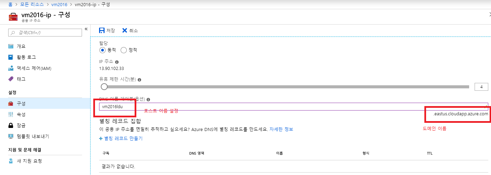

## 복습

### TCP/IP 구성(``ipconfig /all``)

자동 구성: DHCP server로 부터 할당 받는 구성
수동 구성: 직접 셋팅하는 구성(고정 IP)
IP, Subnet Mask, Gateway, DNS
``라우터``가 ``네트워크의 바운더리를 만들어줌``

외부 네트워크와 통신하려면 반드시 라우터를 거쳐야 함. 라우터 장비에 셋팅되는 ip가 gateway임.

외부 네트워크와 격리되어야 하는 내부 네트워크는 게이트웨이를 구성하지 않음. 

gateway ip는 일반적으로 마지막 ip를 1 또는 254(그 네트워크의 마지막 ip)를 많이 씀.

ipconfig /all 했을 때 인터넷이 제대로 연결 되어 있다면 IPv4 주소에서 <주소>(기본 설정) 이런식으로 저장됨

만약 중복되어 있다면, 중복이라고 기록되어 있음.

목차
- 클라우드의 정의
- 클라우드의 종류(public cloud vs private cloud)
- 클라우드의 특징 5가지, 이점 5가지.
- 

### 클라우드가 무엇이냐?

on-premise(우리 회사 네트워크의 서버들)

클라우드는 네트워크를 통해서 서비스를 받는 것

네트워크에 있는 서비스.

일반적으로 클라우드는 퍼블릭 클라우드를 뜻함.

클라우드 종류는 퍼블릭 클라우드, 프라이빗 클라우드가 있음.

on-premise에서 풀링할 수 있는 ms의 솔루션은 win server + sc(system center)

클라우드 서비스는 리소스(실제 일을 하는 애들)

리소스(서버, 스토리지, 네트워크 장비 등을 묶어 말하는 용어)

서버의 기능은 compute를 수행함.

서비스가 신축성 있게 확장됨. 수평확장도 되고 , 수직확장도 됨.

세팅함에 따라서 리소스를 엄청 많이 사용할수도 있고, 사양이 높은 것을 사용할 수도 있음.

self-service는 직접 만들어서 쓰는 서비스임.

특징 5가지.

이점 5가지.
- 벤더에서 관리해주는 서비스이다.
- 비용이 매우 절약된다.
- 관리도 매우 적게 할 수 있다.
- 사용한만큼 과금된다.
- 확장성이 아주 좋다(수직 확장, 수평 확장)

하이브리드 클라우드는 퍼블릭, 프라이빗 클라우드를 합친 것이다. ms

기아차에서 이벤트를 했음. 전 세계인이 접속해서 사용하는 이벤트였고, 전 세계에서 서비스를 해야 함.

전 세계에서 데이터 센터를 구축해야 하는데, 클라우드로 구성하면 좋다.

풀링된 네트워크 장비, 풀링된 스토리지, 풀링된 서버 => {SDN(software defined network), SDS(storage), SDC(software defined compute)} => SDDC(software defined data center)

private cloud를 엘라스틱하게 관리하는 것이 windows server + system center
public cloud를 엘라스틱하게 관리하는 것이 ms azure.

IaaS는 네트워크 ~ 하이퍼바이저까지, VM부터는 우리가 관리해줌
PaaS는 + VM ~ 런타임까지, 그 위에서 개발은 우리가 하는 것임
SaaS는 개발된 프로그램을 제공해주는 것임. ex. office 365

### overview of azure services

azure는 프라이빗 클라우드 서비스와 퍼블릭 클라우드 서비스를 둘 다 제공하고 있음.

azure backup이 site recovery로 통합되었음

MFA(다단계 인증)

- compute
- network service
- storage service
- web program service

compute service > iaas

mobile app > paas

vm > iaas

wep app , azure sql database > paas

## Azure management models

### Classic(Azure Service Management)
azure가 처음 나왔을 때의 클래식 모델임.

여러개의 서비스가 그루핑 되어 있는 모델.

그루핑 되어 있는 것을 배포하는 모델

클래식 모델은 확장하기가 어려움. Resource

### ARM(azure Resource Manager) 템플릿으로 나옴(시험 문제 나옴)

여러개의 서비스를 그루핑해서 배포 하는 것이 아니라 마이크로 서비스의 형태로 제공함.

여러개의 서비스는 묶어져 있어서 새로운 서비스를 만들 때 확장 하기가 힘듦.

``리소스``라는 개념은 ``방대함``. 클라우드에서 리소스라고 하면, 하드웨어 장비 자체를 말함
애저에서는 서비스 하나하나를 리소스라고 함.
실제로 작업을 처리하는 것을 리소스라고 함.
파일 하나하나를 리소스라고 함.

리소스는 실제 작업을 하는 애를 말함.

단일 서비스임.

azure recoure manager는 반드시 리소스 그룹 안에 있어야 함.

서비스를 만들 때 가장 처음에 만들어야 하는 것은 리소스 그룹을 만들어야 함.

2가지 방버 있음

서비스를 만들 때 기존에 있는 리소스 그룹에 포함 시킬 수도 있고, 새로운 리소스 그룹을 만들 수 잇음

리소스 그룹이라는 것은 각각의 서비스를 관리하는 바운더리.

리소스 그룹을 삭제하면 그룹 안에 있는 서비스가 다 날라감.

리소스 그룹에 권한을 적용하면 그룹 내에 있는 서비스에 모두 적용됨.

리소스 그룹별로 서비스를 관리함.(Q. 하나의 서비스는 여러개의 리소스 그룹에 포함 될 수 있는지?)

리소스 그룹은 태깅을 할 수 있음.

태깅은 리소스에 속성 값을 부여하는 것.

인사부에서만 쓰는 리소스를 가져와서 예산을 얼마나 썼는지 알 수 있음.

인사부라는 태깅을 넣으면 인사부가 들어간 리소스만 확인 할 수 있기 때문.

템플릿 베이스드 디플로이먼트가 가능함.

템플릿 이름은 ARM 템플릿임.

템플릿은 만들어져있는 굉장히 ㅁ낳은 템플릿이 있는데, 여러개의 서비스를 한꺼번에 할 수 있음.

템플릿을 그냥 배포하면, 템플릿 단에 있는 많은 서비스가 한꺼번에 배포됨.

템플릿은 json 형식으로 구성되어 있음

템플릿은 github에 공유되어 있음.

arm은 ``full RBAC(Rule Based Access Control)의 모든 기능을 지원함`` <=> classic은 제한된 RBAC을 지원함.

그룹을 만들고, 그룹에 권한을 부여합니다. 

이 권한을 리소스 그룹에 부여하게 되면, 리소스 그룹의 모든 서비스는 그 권한의 적용을 그대로 받음

Tanent에게 적용할 수도 있고 AAD에 있는 계정에 적용 할 수도 있음.(Q. tanent?) => 이렇게 룰을 만들어 특정 계정에게 권한 부여하는 것을 RBAC이라고 한다.

ARM에서 템플릿은 쉽게 배포하기 위한 것임.

### 클래식 모델

이런 기능들을 지원하는 것이 없고, 확장성이 부족하고. RBAC을 제한적으로 지원함.

따라서 가능하면 리소스 매니저 베이스로 배포해라.

## Lesson 3. Managing Azure.

[azure portal](http://portal.azure.com)

### 서비스 검색 후 즐겨찾기 등록

다단계 인증(multi pass authentication)을 하면,

로그인할 때 한번더 코드를 물어보는 절차가 있다.

상단 바의 setting icon

language type은 한글, 한국어 설정 하면 됨.

세팅에서 어둡게 테마를 바꿀 수도 있음.

알림 메세지는 반드시 사용해야함.

홈 > 모든 서비스 > 가상 머신

가상 머신이 2개가 있는데 가상머신, 가상머신(클래식)이 있음. 가상 머신을 만들면 VM도 만들어지고 가상 네트웤도 만들어지고 방화벽도 만들어지는데

클래식은 한번에 다 만들어지는 거고, 가상 머신은 하나만 만들어지는거 클래식은 클래식 베이스이고, 그냥 가상머신은 ARM 베이스임.

가상 머신(클래식) 체크

아래 있는 모든 리소스랑

위쪽에 있는 모든 서비스는 다른 것임.

모든 서비스 > 한글로 template 검색하면, 리소스 그룹, 템플릿 이렇게 2개가 나옴.

모든 서비스 > 키 검색
키 자격 증명 모음(``key vault``임)

영문으로 검색하는 것이 좀 더 나음

자주 쓰는 서비스는 등록하면 됨.

위에 있는 모든 서비스는 azure의 146개의 서비스고

아래쪽에 있는 모든 리소스(``모든 서비스``라고 하심)는 우리가 만들어 놓은 모든 서비스임.

리소스 그룹, 구독 등록 해야함.

Azure portal과 Account Center가 있음.

### 구독 서비스

구독 > Azure Pass - 스폰서쉽 > 내용 확인 가능

전자 메일 청구서를 클릭하면 송장을 메일로 받아볼 수 있음.

구독 > 계정 > 개요 > 관리 탭을 들어가면, account azure로 감.
[azure 구독에 관련된 내용](http://account.azure.com)

chrome 즐겨찾기에 azure 구독을 추가하기

구독 > 추가

### Azure billing and support options(책 p. 1-22)

- azure pass는 $100, 교육을 위해서 만든 것.
- microsoft reseller(영업 사원을 통해서 공급 받는 것) 영업사원에게 할인 받아서 사는 것
- enterprise agreement > EA계약, 사원들이 100명정도 있는데 100명이 azure를 사용 할 것이다. 한꺼번에 아주 저렴하게 구매를 할 수 있음.
- reserved VM: 남들이 안 쓸 때, 내가 쓰겠다 ! 남들이 놀 때 VM을 작동 시키겠다. 저렴하게 사용할 수 있음. 대량 계산 할 때 !
- MSDN, partner, bizSpark: 파트너를 통해서 공급 받는 방법

위의 것들을 subscription이라고 함.

### Azure 관리 툴
- Azure PowerShell(대량 관리를 위해서는 533 교재를 보면, 533교재는 CLI, powershell로 되어있음. 대량 관리를 위한 교재임.) 파워쉘 명령어는 (동사) - (명사)형태로 복잡함.
- Azure CLI <- az라는 명령어
- Visual Studio with Azure SDKs: 비쥬얼 스튜디오에서 azure의 리소스를 생성, 관리 할 수 있음.
- Azure Cloud Shell(포탈에서 명령어를 바로 지원해 주는 것): 클라우드 쉘은 powershell, cli, bash 쉘을 쓸 수 있음.
- Azure Security Center: 보안센터(방화벽 등)
- Azure Advisor: ``어떤 것을 하는 것이 좋다`` 알림을 주는 것
- Azure Monitor: azure를 모니터링 하는 것
> azure portal은 단일 관리 툴임

cloud shell을 만들기 위해서는 스토리지를 만들어야 함. (bash/power shell 선택 가능)
스토리지로 들어가서 새로고침을 눌러보면 스토리지가 만들어져 있음.

### VM 만들기

Virtual Machines(클래식 아님)

subscription 구독 단위

resource 그룹은 현재 없기 때문에, 만들어 줘야함.

이름은 ``RG_0424``(4월 24일이라서..)

VM 이름은 VM2019

Region은 

kubernetess, docker 등은 대한민국 region에 안 만들어지는 경우가 있기 때문에, East US로 하는 것이 좋음

Windows Server 2019 Datacenter로 하면 좋음

>id : ldu
>
>pw : Pa55w.rd!!!!

원격에서 열어줘야 하기 때문에 정해진 포트만 여는 방법을 선택함.

3389(RDP) 열었음.

디스크 탭으로 이동(아직 만들기 완료하는 것 아님)

프리미엄 SSD 같은 경우에는 비용이 비쌈.

VM을 만들 경우에 관리탭을 잘 봐야함

auto shutdown이 있는데 오후 7시만 되면 자동으로 꺼짐. 그것을 off로 설정하기

그렇게 만들면

하단에 템플릿으로 만들어 다운로드 할지를 물어봄.

클릭해서 템플릿으로 만들어 다운로드 하면 됨.

### 리소스 그룹 삭제 및 다시 만들기

리소스 그룹 선택 > 리소스 그룹 삭제

왼쪽 상단 바에 +리소스 만들기

새로만들기 > 계산 > Windows Server 2019 DataCenter

리소스 그룹 이름은 rg0424

vm이름은 vm2019

size는 standard DS1 v2
1. vcpu, 3.5gb 메모리

프리미엄 디스크 : ssd

VM 크기선택에서 옵션들을 지우면 더 많은 옵션들이 나타남.

D1 version2.

공용 바운드 포트: RDP 3389

확인하고 만들기

홈 > 리소스그룹 > rg0424 > vm2019

개요에서 중요한 것은 public IP와 private IP가 있음.

VM에 할당되는 개인 ip는 10.0.0.4 부터시작되는데 맨 마지막 자리가 4부터 시작됨.

공인 IP로 접속해야함.

공인 IP로 가면 사설 IP로 가는 것을 IP포워딩이라고 함.

VM2019에 메뉴를 보면 auto shutdown이 있음. 해제 하고 저장.

VM에 들어가서 연결을 누르면 가상머신에 연결이라는 메뉴가 뜸

RDP파일을 다운로드 받도록 되어 있음.

잘 안된다면, 멀티캠퍼스의 방화벽 문제일 수 있어서 어려움.

### 리눅스 가상머신 설치
리소스 그룹은 위에서 만든 것을 동일하게 사용하고
이름은 rhel76(레드헷 엔터프라이즈 리눅스 76)

미국 동부

표준 D2 v3

VM의 IP는 사설 ip인데, 공인 아이피에서 사설 ip로 포트 포워딩 하게 설정 되어 있음.

마이크로 소프트 데이터 센터, 구글 데이터 센터, 페이스북 데이터 센터 검색하면 동영상이 있음.

## What are Azure VMs?

### Use Azure VMs to:
azure vm은 수평확장, 수직확장도 할 수 있음.(agility)

<!-- 서버 장비는 비용이 많이 들기 때문에, -->

### differences when using Azure VMs
azure는 2세대 .vhdx를 지원하지 않음. 따라서 vhd 파일을 만들어서 해야함. 
azure는 dynamically expanding이나 diferencing disks를 지원하지 않음 (dynamic, fixed, differencing disk 총 3가지 종류가 있음)

vhd는 2TB까지 지원됨.

vhdx는 64TB까지 지원됨.

### 가상 디스크 타입
- 고정디스크    : 80GB로 만들 경우 80GB, 성능이 제일 빠름
- 동적 확장     : 80GB로 만들 경우 4MB --> 80GB, 공간 할당을 하지 않고 하기 때문에, 랜덤하게 저장해서 성능이 떨어짐.(일반적으로 프로덕션 환경에서 사용되지 않음.)
- 차이점 보관용 : Base 에서 변경된 내용만 저장. 하나의 부모에서 변경된 내용들만 저장하는 것임(일반적으로 프로덕션 환경에서 사용되지 않음.)

VM -> ``VHD(2TB)``, VHDX(64TB, 30%정도 빠르고 디스크 복구 기능이 들어가 있음), VHDS

### azure VM의 특징
- generation 1세대만 지원함
- vhdx x
- 고정디스크만 만들 수 있음
- 일기 전용 vm콘솔만 만들 수 있음

### Azure VM sizes
General Purpose: Av2, Dv2, DSv2, Dv3): CPU와 메모리의 적당한 비율을 맞춤

-Burstable
low cpu 

F : CPU와 메모리 성능을 높인 것

- Ls: Storage optimized
High-performance(disk I/O)

- GPU(NC, NCv3, NV, ...)
GPU를 지원하는 버젼

- H옵션 high performance computer, 

### Create a VM by using the Azure portal

VM name, Resource group and location, VM size 등을 셋팅을 햇음

### github에서 템플릿 다운받기

http://github.com/Azure/azure-quickstart-templates
create application gateway

한번만 클릭하면 바로 배포가 된다.

### Creating a VM from an Azure Resource Manager template

201-2-vms-internal-load-balancer

템플릿들을 가져와서 배포를 하면 매우 빠르다.

정렬이 됨.

버추얼 네트워크 인터페이스도 2개임 vm도 두개고,.availability

public ip가 없기 때문에 internal load valancer이다.

### configuring VM availability

zone과 set 두 가지가 있음

- availability zone: fault를 대비해 다른 데이터센터에 복제해 두는 것
  - 99.99%(포 나인이라고 함) availability SLA(service level agreement). 99.999%(파이브 나인)의 경우 1년에 5분 정도 down-time이 생김
  - 즉 서비스 zone을 생성을 하면 99.99%의 가용성을 구성하겠다. down-time이 8시간/1년 생김
- availability set: fault를 대비해 데이터 센터에 렉 단위로 중복해서 저장하는 것.
  - 99.95% avilavility set
  - 폴트 도메인은 하나의 렉임
  - 3대의 fault domain에 분산해서 저장하기 때문에 죽지 않는다는 것임.
  - ``몇 개의 렉에 분산 저장할지``가 ``fault domain``임
  - update domain은 서버가 패치를 하게 되면 서버를 리부팅 해야 함. rebooting이 적용되면 서비스가 중지됨. 따라서 update domain은 패치를 하고 
  - update domain 안에 있는 vm들은 한 꺼번에 update됨.
- Standalone VMs
  - 99.9% availability SLA를 적용해 주겠다. preminum disk(ssd)를 사용한다면.

SLA라는 것은 VM이 죽지 않도록 보장해 주겠다는 것임.

하나의 랙을 폴트 도메인이라고 함

렉에는 많은 서버가 있어요. 폴트 도메인이 2개다 하면 VM을 2개의 랙에 VM을 저장하는 것

- availability set 하나의 데이터 센터의 렉 단위 복제
  - 여기에서는 몇 개의 폴트 도메인을 할 지 지정을 해야하고, update domain을 지정해야 함.
- availability zone은 여러 개의 데이터 센터에서 데이터 단위 복제

하나의 렉(Lack) 안에 여러 개의 서버가 들어 있음.

+리소스 만들기 > windows server 2016 > 가용성 옵션 > 가용성 집합

fault domain은 하나의 렉을 뜻함

### azure에 관한 정보

[애저 포탈](https://azure.microsoft.com/ko-kr/)

여기에서 오른쪽 상단의 돋보기를 클릭해서 가용성 집합을 검색하면 됨

설명이 여기가 매우 잘 되어 있음

ko-kr을 en으로 바꾸면 영어로 됨

VM의 size에 들어가면 resize를 해서 확장을 할 수 있음

### Connecting to a VM

- Windows VMs
  - RDP(TCP/3389)
    - Password-based-authentication
    - By default, use .rdp file generated
  - WinRM
- Linux VMs
  - SSH: 명령어로 접근하는 것
  - RDP: 그래픽 화면으로 접근 하는 것
    - xfce4 - 
    - xrdp - RDP server
- Inbound connections ar subject to:
  - 운영체제의 방화벽(RDP, SSH는 기본으로 열려야함)

#### network

서버로 들어오는 규칙을 inbound port rules
서버에서 나가는 것을 outoubnd port rules

방화벽 세팅은 90% 이상이 inbound 규칙임.

Azure 시험을 보면, 방화벽 세팅을 하는 것이 나옴

Priority는 rule이 아님

기본 옵션은 Deny가 기본

deny하고 특정 포트만 allow 하는 것임

source의 모든 것이 Any
destination의 모든 ip가 Any
destination protoc

inbound port에서 add inbound를 누르면 추가가 됨

우선순위는 모든 것을 거부하는 것보다 높아야 함

웹서버 포트 80을 추가함.

22번 포트도 동일하게 TCP로 추가한다. ssh_tcp_22

암호 재설정 기능(password reset)도 있음

### Overview of azure VM storage

C, D가 기본 드라이브고 추가적으로 F 드라이브 등을 어태치 시켜줄 수 있음

- C: 운영체제가 설치된 드라이브
- D: Temporary disk라서 무엇인가 넣으면 날라감. D드라이브에는 페이지 파일이 들어감. 부팅하면 다 날라감. 절대 데이터를 저장하지 말 것. 데이터 소실 가능하기 때문

다른 스토리지를 생성해서 어태치 시킬 수 있음.

### Azure VMs disk mobility

실습 LAB URL

- [10979F](https://github.com/MicrosoftLearning/10979-MicrosoftAzureFundamentals)
- [20533E](https://github.com/MicrosoftLearning/20533-ImplementingMicrosoftAzureInfrastructureSolutions)

instruction > 여기서 ak는 좀 더 상세하게 설명해놓은 것., ak 없는 것은 메뉴만 보고 중간중간 스킵하면서 따라할 수 있는 것임.

ak는 스텝바이스텝으로 구성되어 있음.

vm2016으로 가서 DNS name 아래의 항목에, configure를 해줌.

``DNS``
- 이름 풀이 서비스(FQDN(full qualyfied domain name: 전체 컴퓨터 이름) ==> IP Address; A 레코드) <114> 짜장면을 먹고싶은데 전화번호를 모름. 
  - FQDN = 호스트 이름 + 도메인 이름
  - ex. www.naver.com ==> 210.89.164.90(by ping naver.com)
  - (www(호스트 이름)는 naver.com(도메임 이름)의 호스트임)
- 서비스의 위치를 알려 주는 서비스(SRV 레코드, A 레코드)
- 

> 원격 접속을 하는 명령어 : mstsc /v:vm2016ldu.eastus.cloudapp.azure.com ( 윈도우2016 서버)

id: ldu
pw: Pa55w.rd!!!!

패킷에는 소스ip와 port 받는 사람의 ip와 port가 들어감.
영문으로 된 이름은 반드시 ip로 반드시 변환이 돼야함.

rhel76ldu.eastus.cloudapp.azure.com (레드헷 엔터프라이즈 리눅스 7.6버전 )

짧은 이름 정하려면 alias를 짧은이름으로 정하면 됨

windows 10에는 기본적으로 ssh가 설치되어 있음.

ssh ldu@rhel76ldu.eastus.cloudapp.azure.com

- pwd(현재 위치)
- ls -al
- cd /
- ls

``ncpa.cpl``으로 네트워크 인터페이스에 접속

windows의 화면 지우는 명령어는 cls이다.

내일 시간에 네트워크를 나갈 것임.

ipconfig /all 에서
DHCP: YES라고 되어 있는 것은 IP를 자동으로 받는 것임.

현재 multicampus에는 공인 아이피를 입력해서 접속하면 접속이 잘 안됨.

서비스를 잠깐 만들었다가 지우고 이런 것은 과금이 안되는데,

2주동안은 계속 사용해도 문제가 안되는데, 사이즈가 큰 것을 선택하면 금방 돈이 차감이됨.

따라서 만들고 지우고 하는 것이 좋음.

### 오늘 했던 것 복습
메모리에 최적화 되었는지
계산에 최적화 되었는지
스토리지에 최적화 되었는지

이런 것을 보려면 filtering이 되어 있는게 기본이라서 filtering을 해제 해야 이런 것들을 볼 수 있음.

- VM 만들어 봤음
- 템플릿으로 배포(템플릿만 제공해주는 업체가 있음. 아주 유용함)
- 가용성(availability set:랙 단위 복제, availability zone: 센터 단위 복제)
- VM storage: D드라이브에 저장하면 안됨.

### 추가 질문. Q. kubernetes가 무엇인가요 ?

Kubernetes는 docker를 관리하는 도구임

Orchestration: 호스트단 서버가 쭉 있으면 pod(컨테이너들이 그루핑 한 것)사용자들이 많아지면 pod을 분산시킴.

swam <- kubernetes

도커랑 쿠버네티스를 잘 하면 좋다 !!

vm가상화 보다는 !!
