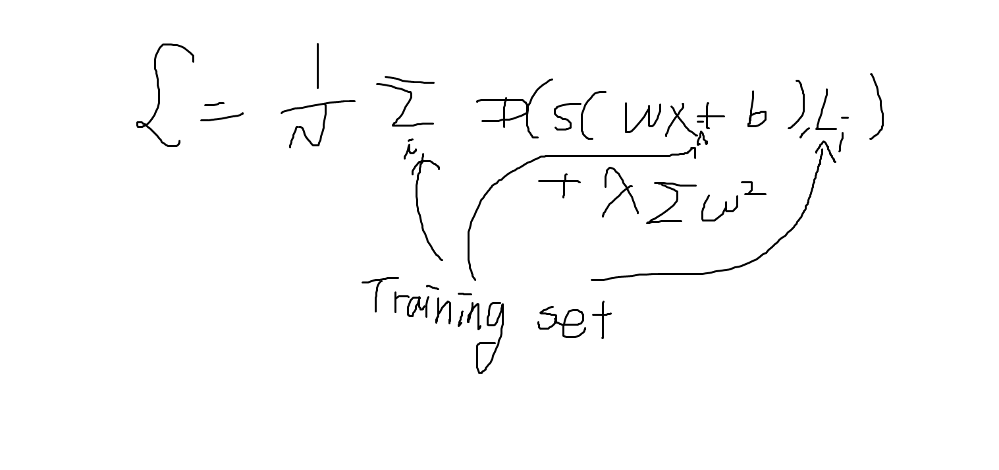

# 지난 시간 리뷰

그래프를 초기화 하는 initializer에는 

- he
- xavier
- randomization

세 가지가 있습니다.

xavier는 직전 층(layer)의 크기에 sqrt해서 초기값으로 삼는 것입니다.

he는 직전 층의 크기의 반에다 sqrt해서 초기값으로 삼는 것입니다.

# 과적합(Overfitting)

과적합의 해법

- 더 많은 훈련 데이터(training data)
- 특성(Feature)의 개수를 줄이자
- Regularization

과적합은 다른 말로 **High Variance**(높은 분산)라고도 합니다.

# 정규화(Overfitting)




CNN 어제 자료는 cs231 stanford 자료로 공부했었음

# ImageNet의 역대 우승작

- AlexNet
- ResNet
- VGGNet은 우승은 하지 못했지만, 사용하기가 용이합니다. VGG19, VGG16 등을 찾아보면 나옵니다.

# MNIST 데이터 가져오기

```python
from keras.datasets import mnist
(train_images, train_labels), (test_images, test_labels) = mnist.load_data()
train_images.shape
```

훈련을 하는 과정은 컴파일이라고 합니다.

# 옵티마이저

옵티마이저의 종류는 adam optimizer, rmsprop등 여러가지가 있습니다.

loss를 최소화 하는 방향으로 parameter를 조절하는 것이 우리의 최종의 목표인데,

예전에는 그 것을 하기 위해서 미분을 했었죠.

1. 경사 하강법(SGD): 기울기*학습률 => 가중치로 놓음
   - 모델이 단순하면 괜찮은데, 모델이 복잡하면 
2. 모멘텀 기법(학습률 alpha를 고정하지 않음): 운동량, 속도 크면 => 기울기를 크게 업데이트
3. AdaGrad(RMSProp을 사용: 기울기를 동일하게 하는 것이 아니고, 새로운 기울기만 학습률에 반영. 따라서 기울기가 점점 0에 가까워짐): 제곱 텀이 수식에 많이 들어감. 그래서 업데이트 하는데, 어려움이 있습니다.
4. Adam: 잘 모르겠으면 Adam을 써라 이런 얘기가 있습니다. Adam이 Ada와 momentum을 결합 해놓은 것입니다. 학습하는데 있어서 학습 속도를 좀 개선을 하자 이런 알고리즘입니다.
5. 기타, 비교해 놓은 논문이 있으니까 보면 좋음.

# keras와 tensorflow

keras로 구현하기에는 간편하지만, 커스터마이징이 어렵고,

tensorflow는 구현하기에는 어렵지만, 커스터마이징이 쉽습니다.

# Image 정보

Image는 일반적으로 (높이, 너비, 채널)의 형태로 저장되는 경우가 많습니다.

따라서 여러장의 Image가 있는 경우에는 (샘플 수, 높이, 너비, 채널)의 형태로 표현을 합니다.

하지만 프레임워크마다 표현 방법이 조금씩 다르기 때문에 프레임마다 확인을 하셔야 합니다.

텐서플로우는 keras도 지원해주고, Theano도 지원해줍니다.


동영상의 경우 (샘플 수, 프레임, 높이, 너비, 깊이)

ex. 만약 60초 영상이고 100x100 크기인 경우에는

(6, 360, 100, 100, 3) # 초당 6개의 샘플링을 하기 때문에 6*60으로 인코딩을 합니다.

전체 다 곱하면, 픽셀의 개수가 나옵니다.


영상같은 경우에는 일반 PC에서는 작업이 어렵고, GPU작업으로 해야합니다.

# 텍스트 처리(자연어 처리)

딥러닝의 꽃은 **RNN**이라고 합니다.

딥러닝의 아버지는 **힌튼**이라고 합니다.

비지도 학습 중에서 SOM(자기조직 지도), ART2, GAN 등의 분야가 있습니다.


# 한글 처리

**코퍼스**는 해당 도메인에 대한 말뭉치를 코퍼스라고 하는데,

문장을 나누고, 단어 단위로 나누는 것을 토큰화 라고 하는데,

```python
from nltk.tokenize import word_tokenize
```

위의 함수가 단어 단위로 토큰화하는 것이 위의 함수입니다.

```python
nltk.download() # 이렇게 하면 다운로드 창이 뜨고, 왼쪽에 
```


[KONLPY](http://konlpy.org/ko/) 사이트에서 API > Okt로 들어가기

okt가 twitter에서 바뀐 것인데, 대체로 성능이 좋음. 여기서 성능이 좋다는 것은 형태소 분석을 했을 때, 분석이 잘 된다는 것.


# 지도 그리는 library

folium

```python
pip install folium
```


```python
import folium
myMap = folium.Map(location=[36.123, 127.123], zoom_start=5, tiles='Stamen Toner') # zoom_start는 확대 축소 되는 정도
folium.Marker([36.123, 127.123], popup="우리집").add_to(myMap)
print(myMap)
```

