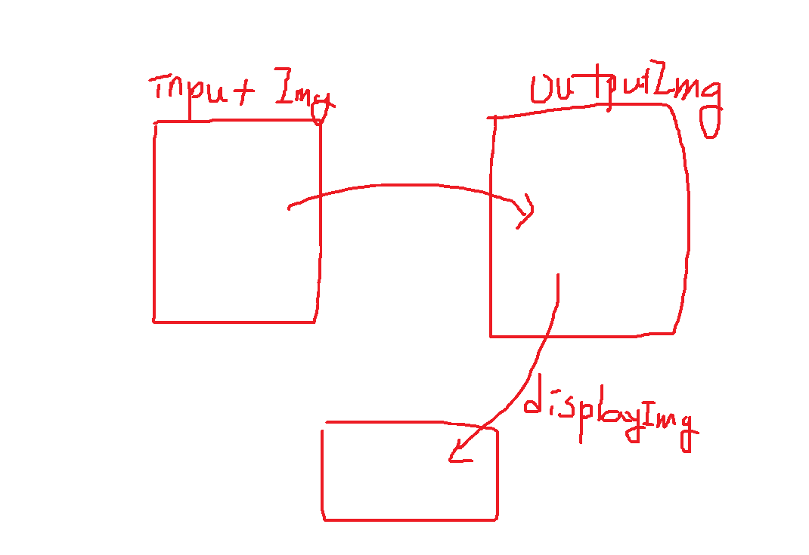

공부를 하는 기간에는 라이브러리를 최대한 배제하고 코딩하는 것을 권장합니다.

```python
LINE, CIRCLE = 0, 1
curShape = LINE # 이렇게 하는게 가독성이 좋습니다.
```

## 영상처리




jpeg같은 것도 `jpeg spec`이라고 검색하면 나옵니다.

하지만 가장 간단한 포맷이 `.raw`입니다. 우리는 이걸로 할 거에요

한 픽셀을 표현하기 위해서 4바이트(RGBA)가 필요합니다.

256x256x256가지 컬러를 `트루컬러`라고 합니다.

흑백 영상은 RGB를 동일한 값으로 표현한 것을 말합니다.

## 객체지향 프로그래밍

절차지향 프로그래밍 -> 구조형 프로그래밍 -> 객체지향 프로그래밍

클래스 이름은 대문자 이름으로 시작해요.

자동차: 색깔, 클락션

`클래스 안에 있는 변수`를 `속성`이라고 해요.

`추상클래스`라는 것이 필요합니다.


```python
equal() # 같은 함수
add() # 밝게하기
zoomit()
zoomout()

```

안 중요한 것은 길지만, 복붙해서 쓰는 것입니다.

알고리즘들은 이해해야해요.

전역변수들을 아예 쓰지 말라는 시절이 있었는데, 적절히 쓰는 것이 더 좋습니다.

다만, 변수명을 g를 앞에 붙이는 형식으로 하면 좋습니다.

컴퓨터 비전 알고리즘을 5개로 분류하는데,

분류를 하고 갈게요. 그걸 우리는 거기에다 딥러닝을 추가해서 6개를 할 수 있어요

window(벽) > canvas(게시판) > paper(종이;image)

canvas는 점이 안찍혀, 선밖에 못그려

50라인이 넘어가면 함수로 돌리는게 좋습니다.


6개의 알고리즘 중 하나가 pixel processing이에요(화소점 처리).

## 성능

컴퓨터 비젼에서는 성능 향상을 위해서 룩업테이블을 많이 써요


## 화소점 변환

픽셀의 값을 변환하는 것

## 기하학적 변화

축소, 회전, 이동 등

값 자체가 바뀌는 것이 아니라 위치가 변화하는 것


## 미션(6일차)

(1) 기하학 처리

- 오른쪽 90도 회전
- 이동 --> 상하/좌우
- 축소 --> 배율(2/4/8배..)
- 확대 --> 배율(2/4)
- (선택) 회전 --> 각도 입력

