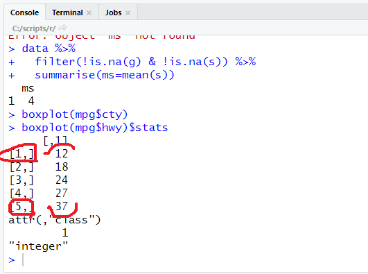

```R
mpg %>%
	group_by(manufacturer, drv) %>%
	summarise(meanCty=mean(cty)) %>%
	head(20)
```

# 자동차 제조사별로, suv자동차 추출,
# hwy, cty 연비 평균, 내림차순정렬, 상위5개만

쉐보레에서 만들어진 차량 중에 suv차량이 있죠

suv 차량들에 대한 도시연비와 고속도로 연비 사이에 대한 전체 평균을 구한거죠

내림차순 정렬을 하려면  arrange(desc(meanAvg))로 하면 됩니다.

이 문장을 수행하기 전에,

이 상태에서 이 작업이 수행된다고 보셔야되요.

mpg에서 그룹화를 하고

그 그롭홯하 ㄴ것으로 filter가 적용되고

위에서 아래로 내려가면서 수행되어지는거에요

순서가 가령 바뀌거나 해버리면, 여러분이 원하는 겨로가가 안나올 수 있어요

기상청에서 자료는 자정부터 3시간 단위로 해서 일주일 단위로 예보가 나옵니다.

## GROUP_BY

## MUTATE

## JOIN
```R
mid<-data.frame(sid=c(100,200,300,400,500),
                score_mid=c(90,90,50,70,100))
fin<-data.frame(sid=c(100,200,300,400,500),
                score_fin=c(70,90,60,70,100))

tot<-left_join(mid, fin)
View(tot)
```
여러분들이 어떤 것으로 조인하라고 하지 않아도, left_join을 하면 알아서 join을 합니다.

`by`라는 옵션을 줘서, 어떤 것으로 조인할지 정할 수 있습니다.

```R
tot<-left_join(mid, fin, by="sid")
```

```R
mid<-data.frame(sid=c(100,200,300,400,500),
                score_mid=c(90,90,50,70,100))
fin<-data.frame(sid2=c(100,200,300,400,500),
                score_fin=c(70,90,60,70,100))

tot<-left_join(mid, fin, by=c("sid"="sid2"))
```
컬럼의 이름이 다른 경우에는 위와 같이 조인합니다.

Q. 컬럼 이름이 여러개가 다른 경우에는 어떻게 조인합니까?

A. left_join의 경우에는 데이터프레임을 2개씩만 합칩니다.

```R
mid<-data.frame(sid=c(100,200,300,400,500),
                score_mid=c(90,90,50,70,100))
fin<-data.frame(sid2=c(600,700,800,900,1000),
                score_fin=c(70,90,60,70,100))

exam_all<-bind_rows(mid, fin)
exam_all
# 이렇게하면, 행들을 합치는데 score_mid와 score_fin이 각각 없기 때문에 빈 자리에는 NA로 채워집니다.
```

NA가 있을 때는 데이터를 날려버리기도 하고, NA를 knn의 방법을 통해서 추정할 수도 있습니다.

NA라는 것은 이미 상수로서 정의가 되어 있어요.

NA라는 것은 상수로 나오는거죠. 실제값 NA가 있을 수도 있죠.

"NA"와 NA가 구분이 안되기 때문에, 문자타입의 변수에는 NA값이 출력이 될 때, 꺽쇠 기호로 묶여서 나오게 됩니다.

```R
df<-data.frame(sex=c("F", "M", NA, "M", "F"),
               score=c(50,40,40,30,NA))
df
```


```R
df<-data.frame(sex=c("F", "M", NA, "M", "F"),
               score=c(50,40,40,30,NA))

is.na(df)
table(is.na(df))
table(is.na(df$sex))        # sex에 대해서만 na 조사
table(is.na(df$score))      # score에 대해서만 na 조사
```
데이터가 좀 더 커지면 눈으로 확인하지 않고, 위의 함수를 사용합니다.

데이터가 좀 더 커지면 table로 확인합니다.

어느 하나의 데이터도 

```R
df_nomiss<-df %>%   # 2개의 조건을 걸어줘서 na를 drop하는 방법
  filter(!is.na(score) & !is.na(sex))
df_nomiss

na.omit(df)         # na를 한꺼번에 전부 drop하는 방법

mean(df$score, na.rm = T)       # na를 제외한 상태에서 연산을 하는 것
sum(df$score, na.rm = T)       # na를 제외한 상태에서 연산을 하는 것

exam[2,]            # 2번 행만 선택하기
exam[c(2,5,10),]    # 2, 5, 10번 행을 한꺼번에 선택하기
exam[c(2,5,10), "science"]  # science에 곁따옴표가 없으면 변수로 인식하기 때문에, 곁따옴표를 넣어줘야 열로 인식합니다.

exam %>% summarise(meanSci=mean(science, na.rm=T))  # summerize할 때 rm=T를 두면 na값이 제거된 채로 summerise할 수 있습니다.
```

실제로 분석하기 전에, 조사를 했는데 공란인 것과 조사를 안하고 공란인 것을 구분해서 데이터를 잘 들여다 봐야 합니다.

상식적으로 생각해도 이해가 안되는 데이터들이 있을 거에요.

결측치를 평균으로 대체

```R
mean(exam$science, na.rm = T)

exam$science<-ifelse(is.na(exam$science) , 편균점수 , exam$science)
table(is.na(exam$science))
```


박스플롯에서 x1.5를 하는 것은 통계학자들이 찾아낸 것임.

대체로 1.5를 넘으면 outlier가 많더라 하는 것임

database에서 이상현상이라는 것 있습니다. 삭제이상, 갱신이상, 등.

삭제를 함으로써 중요한 정보가 같이 삭제되는 문제가 있을 수 잇습니다.

예를 들어 학사 정보 시스템에 저장되어 있는 학생들에 대한 데이터들을 가지고, 학생 데이터들을 조사를 해가지고

이상치에 해당하는 것을 삭제하려고 합니다.

이상치에 해당하는 것을 지워야 하는데 해당 학생에 대한 학번까지 지워버리면,

분석을 할 수 없는 문제가 생기게 됩니다.

학번이 사라져끼 때문에 학새엥 대한 일련의 분석을 할 수 없게 됩니다.

제거를 하게 되면 데이터가 많이 잇으면 상관 없는데 , 데이터가 별로 없으면 제거를 최대한 안하는 것이 좋습니다.

어떠한 방법이 있느냐, 정규화, 표준화를 함으로써 기존의 데이터를 최대한 살릴 수 있도록 고민을 ㅁ많이 해보셔야 합니다.

그리고 ㄷ이터 분석 뿐만이 아니라 모델리으읗 할 때 데이터는 항상 표준화 작어븡ㄹ 할 수 밖에 없습니다.

거리를 구할 때, 데이터의 편차가 심한 값 때문에 모델이 제대로 안 만들어질 수가 있겠죠.

n차원의 공간에 있을 때, 데이터 분석과 모델링을 할 때

축의 척도가 동일하면 문제가 되지 않습니다.

축의 크기가 동일 하지 않으면 값이 상당히 왜곡 될 수 있어요.

길이를 구할 때, sqrt((9000만)^2 + (8)^2) 이렇게 거리를 구한다면, 8은 거의 무시가 되기 때문에 표준화를 구해야 합니다.

### 이상치

이상한 데이터를 이상치라고 합니다.

크게 종류가 `2가지`가 있는데

`존재할 수 없는 값`이 있을 수 있어요.

이런 것들이 이상치이다.

초등학교 학년이 1학년 부터 6학년까지 있는데, -3학년 이라는 값이 있는거에요. 이런건 있을 수가 없죠

가령 성별을 나타내는 변수인데, 1과 2로 성별이 나누어져 있다고 했을 때, 5, 3, 같은 값은 있을 수가 없겠죠

또 어떤 것들이 이상치라고 볼 수 있냐면

범위를 크게 벗어나는 값을 이상치라고 볼 수 있습니다.

예를 들어서, 몸무게가 250kg에요.

첫 번째로, 존재할 수 없는 값은 어떻게 처리를 할 것이냐

다른 값으로 대체하거나 할 수 있겠죠

outlier 데이터를 한 번 만들어볼게요

```R
data<-data.frame(g=c(1,2,3,-3,6),
                 s=c(5,4,3,3,2))
data
```

그럼 이상치는 어떤식으로 확인합니까

테이블 함수도 이상치를 찾을 때 가능한 함수이고,

IQR*1.5를 해서 값이 얼마인지 알아낸 다음 그 값보다 크거나 작은 경우에 판별할 수 있어요

여려분 summary함수 사용하게 되면 요약 통계 나오게 되죠.

1사분위 수와 3사분위 수를 빼요. 그 값을 IQR이라고 합니다. 그 값에 1`.5를 곱합니다.

그 다음에 Q3에다 더해버리면 위쪽 경계가 되고, Q1에서 빼버리면 아래쪽에 대한 이상치를 나타내는 경계가 나오게 된다는 거에요.

또 함수도 있습니다.

이와같은 다양한 방법을 통해서 간단하게는

```R
table(data$g)
```

이런식으로 이상치를 확인할 수 있습니다.

이상치 -3을 찾은 후 NA로 대체를 하고자 합니다.

1차적으로 NA로 대체를 하고요. 2차적으로 NA를 평균을 구하든 다른 값으로 대체를 해주면 되겠죠.

```R
ifelse(data$g == -3, NA, data$g)

data$g<-ifelse(data$g == -3, NA, data$g)
data
# 성인 몸무게: 30kg~150kg
# iqr*1.5 벗어나는 경우, 상하위 0.3% 벗어나는 경우
boxplot(mpg$hwy)$stats # 첫 번째 값보다 작으면 이상치, 다섯 번째 값보다 크면 이상치.
boxplot(mpg$hwy)
```



```R
mpg$hwy<-ifelse(mpg$hwy< 12|mpg$hwy>37, NA, mpg$hwy) # lower whisker, upper whisker
table(is.na(mpg$hwy))

mpg %>%   # drv라는 컬럼 값에 따라서 group이 됨
  group_by(drv) %>% 
  summarise(hMean=mean(hwy, na.rm=T))
```

file읽을 때, 옵션을 주고 읽어야 합니다.

그러나 타입을 설정하지 않고 읽었을 때 변환할 수 있어야 합니다.
```R
x<-c("a","b","c")
str(x)
as.factor(x)

# levels에 a, b, c가 나오는데 각각을 카테고리라고 생각하면 된다. 
```

### matrix와 dataframe간의 데이터 구조 변환

```R
matrix(1:6) # 6행 1열
matrix(1:6, ncol=2) # 3행 2열
```

### 제어구문(if, for, while)

if

next는 반복문의 시작위치로 가게 해주는 구문입니다. (= continue)

```R
x<-1:5
x

ifelse(x %%2 == 0, "even numer", "odd number")    # x를 2로나눈 나머지

for(i in 1:10){
  print(i)
}


i<-0
while(i<10){
  i<-i+1
  print(i)
}
```

na값 제외하는 방법들.
```R
na.omit(x) # na가 포함된 행 제외
na.exclude(x) # na가 포함된 행 제외
na.pass(x)
```

```R
df<-data.frame(x=1:5, y=seq(2,10,2))
df
# y=wx+b에서 w, b를 찾으면 선형 모델이 만들어지는 것입니다

resid(lm(y~x, data=df, na.action=na.omit)) # 잔차를 나타내는 것. 
# 위의 명령어를 사용하면 선형 모델을 만들 수 있습니다.

lm # linearmodel의 약자입니다.
resid # 잔차. 실제값과 예상값의 차이를 계산하는 함수.

df[3,2]=NA

resid(lm(y~x, data=df, na.action=na.omit))    # 
resid(lm(y~x, data=df, na.action=na.exclude))
```

모델을 만드는 것은 결국 방정식이에요.

y=wx+b로 가정을 하자는 얘기죠.


### 함수

함수를 만드는 것도 간단합니다.

```R
f<-function(a, b){
  print(a)
  print(b)
}
f(1,2)
f(b=1, a=2)
```

또 이렇게도 가능해요.

iris data는 붓꽃입니다.

head(iris)

다변량인 상황에서 linear regression을 한거죠.

또한, species

multinomial classification으로 나눌 수 있습니다.

str(iris)

iris3는 iris와 똑같은 데이터인데 3차원 구조로 되어 있습니다.

```R
library(help=datasets)  # 데이터 set 탭이 하나가 열립니다.
str(AirPassengers)
```

titanic같은 경우에는 굉장히 유명한 데이터셋이죠.

분류에서 많이 사용되는 데이터 셋입니다.

airquality라는 데이터 셋도 많이 사용됩니다.

mtcars는 제동거리에 관한 데이터셋이 나옵니다.


