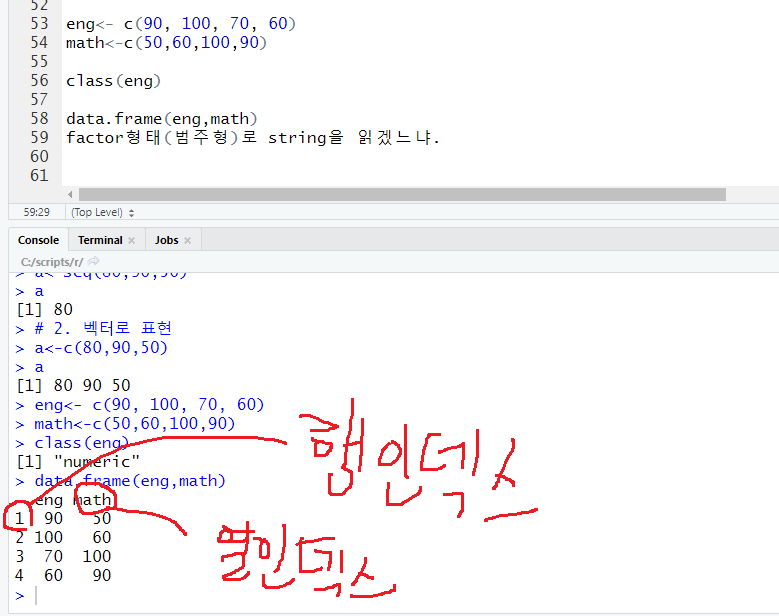

```R
var2<-c(1:5)
seq(1,5)
```

```R
var4<-seq(1,5,by=3)
var4+1      # 벡터연산
```

일반적인프로그래밍 언어는 var4+1같은 연산을 잘 못해요.

```R
var1+var2       # 이것도 가능한데, var1과 var2가 벡터라면 길이가 같아야함(요소간 덧셈)

str1<-"a"
str2<-"text"
str3<-"hello world"

c(str1, str2, str3)     # 벡터가 되었음
str1+str2 # 오류 -> c함수 사용
# 문자에 대해서는 이항 연산자를 적용 못함

x<-c(1,2,3)
mean(x)
max(x)
min(x)

str4<-c(str1, str2, str3)
paste(str4, collapse=",")   # 공백
paste(str4, collapse=" ")

install.packages("ggplot2")
library(ggplot2)

qplot(x)
mpg     # 이것은 함수가 아니라 데이터입니다.
```

mpg를 했을 때, 데이터프레임이라는 말이 있는데, 데이터프레임을 어렵게 생각하지 마시고

엑셀에서 시트이다. 라고 생각하시면 됩니다.

한 행을 관측치라고 합니다.

각각의 요소를 관측값이라고 합니다.

행 단위로 읽으면 관측치, 각각의 요소는 관측값으로 구성되어있습니다. 

mpg의 값들 설명
- cty는 시내 주행거리; 연비
- hwy: 고속도로에서의 연비. 시내보다 고속도로가 높게 나옴
- fl: fuel type
- displ: displace_motor; 배기량

```R
str(mpg)    # 구조를 확인하는 명령어: structure의 약자

qplot(data=mpg, x=hwy)      # qplot은 빈도 그래프

qplot(data=mpg, y=hwy, x=drv)   # 구동방식에 따른 연비가 어떤 것이 좋은가.

qplot(data=mpg, x=drv, y=hwy, geom="line")

qplot(data=mpg, x=drv, y=hwy, geom="boxplot")

qplot(data=mpg, x=drv, y=hwy, geom="boxplot", colour=drv) # 색상 구분을 x축에 따라 하기
```


이것을 통해서 `f` 타입의 구동형식(전륜 구동)의 고속도로의 연비가 좋은 것을 확인할 수 있습니다.


박스플롯에서는 이상치를 확인하고자 할 때 대표적으로 사용 가능한 도구입니다. 

박스의 가운데 선은 median입니다.

quantile이라는 것은 백분위수를 말합니다.

min. 25%지점(Q1). 50%지점(median). 75%지점(Q3). max.

`IQR = Q3(3분위수)-Q1(1분위수)`

윗쪽 선은 IQR*1.5 +Q1

아래쪽 선은IQR*1.5-Q1

아래선/윗쪽 선을 벗어나면 outlier라고 합니다. 그 outlier들은 점으로 나타냅니다.

1. 제거
2. 표준화(각각의 컬럼에 대한 평균을 구한 다음에 해당 값을 빼고 표준편차로 나눈 것을 말합니다. 표준편차로부터 몇배의 위치에 있느냐.; 평균보다 얼마나 잘했는지/못했는지 나타냄.)
3. 정규화(모든 값을 0~1 사이로 놔두는 것)

Q. 정규화의 대표적인 방식은 어떤 것들이 있나요?

plot을 이미지로 저장하려면 export를 눌러서 할 수 있습니다.

R은 작성하기에는 편한데, 취업하는 것을 고려하면 Python이 유리해요.

실제 수요는 python 개발을 할 수 있는 인력을 원해요

데이터 프레임: 시트(행: 한 사람의 정보, 열: 속성)

```R
eng<- c(90, 100, 70, 60,)
math<-c(50,60,100,90,)
class<-c(1,1,2,3,)
class(eng)

df<-data.frame(eng,math,class)
df
class(df)

mean(df$eng)
```




excel을 읽으려고 하면

readxl이라는 패키지를 설치해야 합니다.

```R
install.packages("readxl")
library(readxl)
df<-read_excel("Data/excel_exam.xlsx")

df<-read_excel("Data/excel_exam_novar.xlsx", col_names=F) # 이름이 없는 엑셀파일 읽기

df<-read_excel("./Data/excel_exam_sheet.xlsx", sheet=3) # sheet의 번호가 3

write.csv(df, file="mydf.csv")

save(df, file="mydf_s.rda") #작업환경을 파일로 저장
load("mydf_s.rda")      # 작업환경 불러오기

rm(df)      # 변수 삭제

exam<-read.csv("Data/csv_exam.csv")
str(exam)

head(exam)      # 처음 6 줄 출력
tail(exam)      # 마지막 6 줄 출력

View(exam)      # 값들 출력

dim(exam)       # 행, 열의 정보 출력

summary(exam)

as.data.frame(mpg)  # 이렇게 하면 완전한 데이터 프레임으로 함
class(mpg)          # 데이터 타입 확인

dim(mp)
str(mpg)

summary(mpg)
```

중위수는 element의 개수가 짝수인 경우에 애매하잖아요.

그 경우에는 가운데 2개를 평균내서 정합니다.

- Median :62.50  
- Mean   :59.45
이 경우에는 평균보다 많이 작은 값이 좀 더 있다라는 해석을 할 수 있음


변수는 데이터 분석에서 feature라고도 함.

기존에 제공되는 feature로부터

가공 -> 새로운변수(feature): 파생변수
```R
mydf<-data.frame(eng=c(70,80,90),
                 mat=c(50,60,70))
mydf
mydf$mysum<-mydf$eng+mydf$mat
mydf$mymean<-mydf$mysum/2
mydf

mpg$tot<-(mpg$cty+mpg$hwy)/2
mpg$tot

head(mpg)

mean(mpg$tot)
summary(mpg$tot)

hist(mpg$tot)
```

# 삼항연산자
# if 조건식: 참: 거짓

```R
# 평균연비가(tot) 23이상이면 -> gr_h, 거짓이면 gr_l
mpg$test<-ifelse(mpg$tot>=23, print("gr_h"), print("gr_l"))
# ifelse(조건식, 참, 거짓)
mpg$test

table(mpg$test) # 빈도표
qplot(mpg$test)
```

```R
exam<-read.csv("Data/csv_exam.csv")
exam
filter(exam, exam$math>=50)

exam %>% filter(class==3)# ctrl + shift + m. exam중에서 class가 3인것만 걸러내서 보여주세요.
exam %>% filter(class!=3) 
# 3반이 아니면서, science 50점 이상
exam %>% filter(class!=3 & science>=50)

exam %>% filter(science>=50 | math>=70)

volkswagen<-mpg %>% filter(manufacturer == "volkswagen")
audi<-mpg %>% filter(manufacturer == "audi")
mean(volkswagen$cty)
mean(audi$cty)

cars<-mpg %>% filter(manufacturer %in% c("hyundai", "chevrolet", "nissan"))
mean(cars$cty)

# 컬럼 추출: select함수
exam %>% select(science)
exam %>% select(science, math, class)
exam %>% select(-science, -math)

# %>% : dplyr 패키지에서 제공하는 기능이기 때문에, dplyr이 설치 및 로드 되어있어야 합니다.

# 3반 추출 -> math 추출

# 아래처럼 작성하는 것이 가독성이 좋습니다.

exam %>%
  filter(class==3) %>%
  select(math) %>%
  head(2)       # 2개만 추출

exam %>% arrange(math)  # 수학을 기준으로 오름차순으로 정렬됨
exam %>% arrange(desc(math))    # 내림차순으로 정렬됨
exam %>% arrange(math, english)    # 2차 정렬기준은 english

df<-rename(df, <newname>=<oldname>) # 이름바꾸기
```

