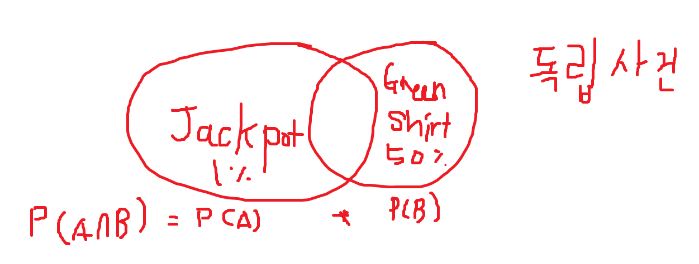
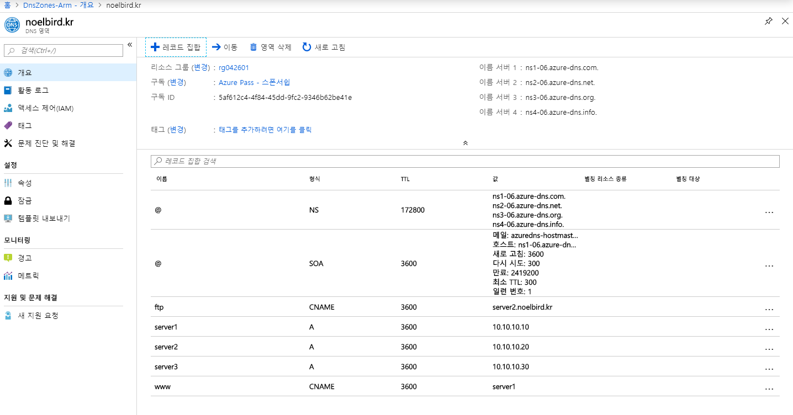
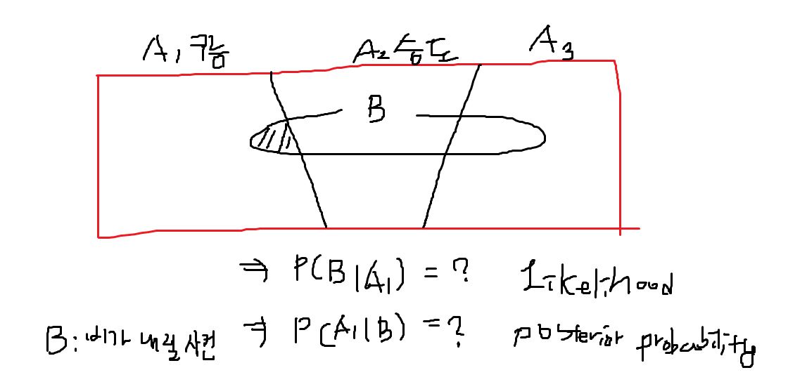
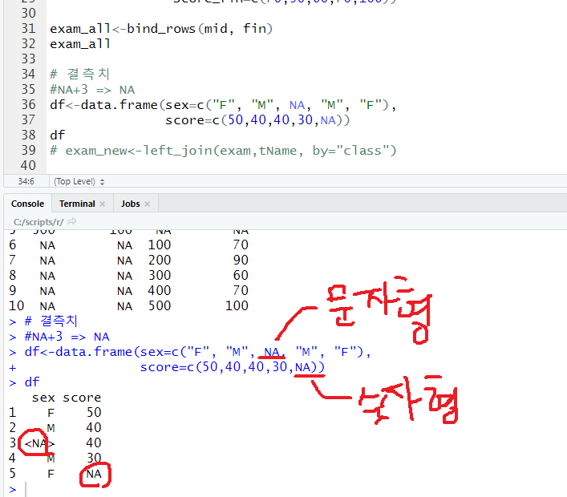

4일차
==

## 복습

1. IP Address

Q. 네트워크의 ID는 해당 네트워크 주소 만큼인지. 세팅하지 않는 IP는0번이므로, 호스트 주소를 0으로 채운만큼을 네트워크 ID라고 함.

A클래스에서 네트워크ID가 0 인것은 네트워크를 식별하기 위해서 있음.

D Class와 1110(Q. 멀티캐스트 데이터 전송: 1이라는 의미가 무엇인지?)

E Class는 1110(Q. 왜 D클래스와 E클래스가 같은지)

브로드캐스트IP는 호스트IP가 전부 1비트로 세팅된 것

Gateway 값은 넣어도 되고 안 넣어도 됨 > 안 넣으면 외부와 통신 할 수 없음

DNS 값은 넣어도 되고 안 넣어도 됨 > 안 넣으면 주소로 호스트에 접근할 수 없음.

라우터는 IP세팅할 때 IP나 서브넷 마스크만 넣음. 게이트웨이나 DNS는 넣지 않음. 왜냐하면 라우터 자체가 게이트웨이이기 때문에.

라우터의 서브넷마스크를 얼마나 크게 넣는지에 따라서 네트워크 규모를 결정할 수 있음

`브로드 캐스트 폭풍`: 하나의 네트워크에 컴퓨터가 엄청 많아서 브로드캐스팅이 많이 발생하는 것

`arp`는 맥 주소를 ip로 변환하고 ip를 맥 주소로 변환하는 프로토콜

이 프로토콜이 하나의 컴퓨터에서 다른 컴퓨터로 브로드캐스팅을 하기 때문에, 네트워크 성능이 느려짐.

### 서브 네트워크를 만드는 이유

1. 성능을 향상시키기 위해(네트워크가 너무 크면 느려지니까)
2. 보안을 위해서(인사부에 있는 사람들이 관리부의 네트워크에는 접근할 수 없도록)

실제로는 네트워크 낭비를 막기 위해 CIDR표기법으로 서브네팅을 함.(세밀하게 자를 수 있으니까)

## Resolving DNS names between zones

www.microsoft.com

1. DNS cache에서 정보가 있는지 없는지 확인.(장점1: cache를 쓰는 목적은 서버의 부하를 줄여줌; 장점2: 빠르게 알아볼 수 있음; 단점: 서버의 내용이 변경되었는데 그 내용을 받아올 수 없다; DNS cache는 자신의 컴퓨터에 저장되는 내용임;)
2. 캐쉬에 없다면, 자신의 TCP/IP에 DNS가 세팅되어 있습니다. 그 DNS의 서버(Local DNS Server)에게 물어봄
3. 로컬 DNS에 없으면 루트 DNS(전 세계에 13대만 있음)에게 물어봅니다.
4. 루트 서버는 .org, .dns 서버, .kr 도메인 서버 등의 위치를 알고 있음 .com dns서버 위치로 보냄
5. 이러한 과정이 1ms 내로 동작함.

DNS 이름 풀이 과정

1. DNS cache
   - C:\Windows\system32\drivers\etc\hosts(hosts파일은 users에 수정 권한이 없는데 수정하려면, 상속을 해제해야 권한변경을 할 수 있음)
   - ipconfig /displaydns <== DNS Cache 확인
   - ipconfig /flushdns   <== DNS Cache 삭제
2. Local DNS Server
   1. azure에서 dns zone 서비스 추가

1차 도메인 네임서버 정보 ~ 4차까지 넣을 수 있음

1차 dns가 fail날 경우를 대비해서 보통은 2차까지 넣음

dns 기반으로 동작하는 것들 : Active directory / mail server / webserver / ftp

add record set

Zone: DNS DataBase(zone을 DNS 데이터 베이스라고 부름) (multicampus.co.kr)

레코드 <== Zone 내에서 실제로 작업하는 애들이 레코드임 레코드를 묶은 것이 존. 레코드는 존 내에 존재함

### 레코드의 종류

- A: 호스트 이름을 IP로 변환
- CNAME: 호스트 이름을 다른 호스트 이름으로 변환
- MX: 메일 서버를 지정
- SRV: 서비스의 위치를 지정
 
Name을 www로 하고,

### Overview of Azure DNS(교재 533, 두꺼운책 p. 2-21)

기업의 포커스가 온프레미스에서 클라우드 환경으로 점점 가는 추세임

개발자는 기존에 개발만 했습니다. 클라우드에서 개발을 하려고 해요

클라우드에 들어가면 네트워크도 알아야하고, 스토리지도 알아야하고 서버도 알아야합니다

이걸 모르면 클라우드를 못써요

하둡이나 쿠버네티스를 로컬에서 설치하기는 거의 불가능한데, 클라우드에서 구현하기는 클릭 몇번으로 가능합니다

시스템 엔지니어들은 클라우드 환경에서는 관리할 필요가 없기 때문에 개발을 알아야 하고

개발자들은 서버를 알고 네트워크를 알아야 합니다.

그 베이스가 되는 부분은 dns 부분, 네트워크 부분 들이 있고 합니다.

서비스를 올리게 되면 이런 부분에서 막히게 되서 다시 볼 기회가 있을 겁니다.

두고 두고 약이 되지 않을까.

DNS는 회사 내에서 기본적으로 쓰는 것입니다. 로컬에서 dns 서버를 구성하면 서버를 둬야되죠. 운영체제 설치해야하죠, dns 설치 해야하죠

애져에서는 바로 서비스 만들어서 하면 됩니다.

- A 레코드(IPv4)는 address 레코드라고 하고, www는 호스트 이름이고 뒷쪽 부분이 네트워크 주소입니다.
- AAAA 레코드는 IPv6의 호스트 이름을 알려주는 레코드
- CNAME 레코드는 별칭을 알려주는 레코드(canonical name; ex. ftp.datum.com은 별칭이고 실제 호스트 이름은 host1.datum.com인 경우)
- MX레코드: 메일 서버의 주소를 알려주는 레코드(메일을 보내기 위한 레코드)
- SRV 레코드: 윗쪽에서 알려준 것은 이름풀이 서비스들인데, 이 레코드는 특정 서비스의 위치를 알려주는 서비스임. ex. Active directory 등의 서비스

> A레코드, CNAME 레코드 정도만 알아두면 됨. 나머지는 시스템 관리자가 알아서 하면 됨

dns 세팅하는 값들

자동으로 4대까지 복제를 함 

.co, .kr 등에 등록되려면 도메인 신청을 해야 함

이 도메인의 dns는 어디이다.

`root dns`와 `.com dns`는 `internic`에서 관리함

서버의 레코드를 수정할 때 TTL을 수정해서, TTL을 0을 넣어서 1시간 후에 수정하면 정확한 값이 됩니다.

### 파일 업로드

파일질라 설치

이름을 a로 접속하면 헷갈리니까 ftp.blah~로 설정한다.

### 쉬어가는 시간

백만장자 돈버는방법 브라이언 트레이시(더빙)  

### DNS zone 만들기

도메인 만들고 

> 호스트 이름 지정하지 않고 하면, www를 넣지 않고 접속 가능함.

## Module 5. Introduction to azure networking(얇은 책 5-1)

Azure의 네트워크는 가상 네트워크를 씀(풀링된 네트워크를 쓰기 때문에)

azure의 가상 네트웍은 자동으로 라우팅이 됨.

virtual network는 사설아이피 대역을 사용함

공인IP는 구매해서 사용해야 함.

일반적으로는 공인IP로 가상 네트워크를 사용하지 않음. 사설IP로 사용함. 비싸니까

vnet 밑에 subnet이 만들어지는 것임

만들고나서 새로고침 해야함

설정 > adress space에 주소가 들어가 있음
설정 > subnets 여기에 서브넷의 주소가 

원래는 서브넷 마스크가 24면 254개의 ip가 사용 가능하지만, 애저에서는 1, 2, 3번 호스트를 사용하기 때문에 4번부터 할당된다. 따라서 251(-5)개의 호스트를 사용가능함

azure에서 나눌 수 있는 서브넷의 비트는 최대 29비트까지 나눌 수 있음. 원래는 더 나눌 수 있는데. 29비트의 서브넷의 경우 호스트는 2^3 -5 해서 =3개만 가능하다.

가상 네트워크를 더 추가할 수 있다.

10.10.0.0/16 > VNet
1. 10.10.0.0/24
2. 10.10.1.0/24
3. 10.10.2.0/24

기본적으로 라우터 없어도 서브넷과 서브넷 사이에는 통신할 수 있다.

TCP/UDP/ICMP 지원해줌

V-net

### Determining the need for Azure virtual networks

- azure vm에서는 virtual network가 반드시 필요하다
- virtual machine scale sets (옆으로 확장하는 vm머신임)

> scale sets 해보기(실제로 적용하지는 않고 구경만..)
> `수평확장`은 `스케일 아웃`, `수직확장`은 `스케일 업`이라고 부름
- autoscale은 스케일업을 언제 할 것인지
vm이 많아지면 좋은 점은 부하가 분산된다.
규모확장(scale out)

기본 값: CPU 임계값이 75% 이상 늘어나면 증가할 VM 수: 1
scale out은 cpu 임계값이 따라서 VM을 얼마나 늘릴지를 결정하는 것!!
- application gate로 부하분산을 할수도 있고 로드 밸런서로 부하 분산을 할 수도 있음. `어플리케이션 게이트웨이` <- NLB(부하 분산 서비스) (`L7 레이어`)
- azure app service environment
- azure kubernetes service
- suervice fabfic

방금 위에서 말한 것들은 반드시 가상 네트워크가 있어야 하는 것들이고

다음에 대해서는 가상 네트워크를 지원한다.(필수는 아님)
- point-to-site VPN.
- service Endpoints: azure storage, sql database, cosmos DB, SQL Data(엔드 포인트를 통해서 들어가면, azure에 있는 데이터 베이스에 접근할 수 있는 것. vnet이 접근점이 됨)

azure ad, traffic manager, content delivery network 등은 가상 네트워크가 연동되어 있지 않다.

## Azure networking capabilities
1. 로드밸런싱이 있고
2. 트래픽 매니저가 있고

그렇습니다.

로드밸런싱은 어플리케이션 게이트웨이 같은건데 이건 L4 레이어에서 지원되는 부하 분산 장치임

네트워크 시큐리티 그룹은 방화벽, 어플리케이션 시큐리티 그륩이 있음. 둘다 방화벽인데 첫 번째는 네트워크에 대한 방화벽이고 두 번째는 어플리케이션에 대한 방화벽

virtual network connectivity인
- cross-premises: P2S(point to site) VPN
- cross-Vnet
에 관해서는 20533(p. 2-42)에서 자세하게 나와있음

Vnet peering이라는 것은 같은 네트워크로 만들어 주는 것임. 

site-to-site는 라우터에서 라우터로 들어가는 것

point-to-site는 호스트에서 vnet으로 터널링해서 들어가는 것

`express라우터`는 우리 회사에서 azure로 direct로 가는 터널을 뚫는 것(회사-azure 간의 전용선)

같은 데이터 센터 내에서 vnet과 vnet을 연결하는 것을 피어링이라고 함

`피어링`은 같은 `데이터센터 내에서 vnet과 vnet을 그루핑`하는 것

`vnet to vnet`은 `다른 데이터 센터 간에서 그루핑 하는 것`

### Creating and configuring Azure virtual networks

서브넷을 구분하는 것

사용자가 몰렸을 때 부하를 분산하는 장치. 로드밸런서

네이버의 경우에는 웹 서버만해도 2만대.

3tier(웹티어, 어플리케이션 티어, sql 티어) 

제일 앞 단에 웹 서버를 두고

중간에 어플리케이션 서버를 두고

마지막에 sql 서버를 두고.

vnet 앞에는 네트워크 시큐리티 그룹이 붙음

방화벽이 하나의 서비스로 붙음(Q. vnet 앞에 방화벽도 붙고, 로드 밸런서도 붙는데 어떤게 더 먼저 앞에 붙는지)

## 로드밸런서

### overview

로드배런서는 L4계층에서 작동하는 부하 분산 장치입니다.

https는 SSL 기술을 사용함(secure socket layer)

사용자들이 10만명정도 사용한다고 하면 로드밸런서가 있어야 한다.

로드밸런서 구성.

VM앞단에 붙어서 사용자들이 들어오면 VM들을 체크해서 부하를 분산처리해주는 장치이다.

### 로드 밸런서 실습

## 실습

네트워크를 만들고

로드밸런서는 NAT룰을 만들어줘야 함.

- 백엔드 풀 안에 VM1, VM2등 부하를 분산할 장치가 있음.

로드밸런서에서 부하 분산을 처리할 백엔드 풀을 구성해야 함.

- probe: VM들의 상태를 체크함(VM들이 일을 많이 하고 있는지, 건강한지 안한지 체크하는 애)
- LB(load balancer rule): 사용자가 패킷이 들어올 때 웹 서버 포트에 대해서 로드 밸런싱 처리를 할지, RDP 3389 포트에 관해서 로드배런싱을 할지. IP/port mapping 해서.
- NAT rule: 외부로 데이터를 내보내기 위해서 공인아이피로 패킷을 변환해서 던져줘야 합니다. VM들이 사설 IP이기 때문에.

> Exercie 1: creating virtual network
[instruction 주소](https://github.com/MicrosoftLearning/10979-MicrosoftAzureFundamentals/blob/master/Instructions/10979E_LAB_AK_05.md)

> Exercise 2: load balancer 만들기

pip에 공인ip를 

### Determing the need for Azure virtual networks

Cosmos DB는 microsoft에서 나온 mongoDB이다. 속도가 굉장히 빠르고 비싸다.

### Creating an Azure load balancer

로드밸런서에 퍼블릭IP가 들어가기 때문에 VM에는 공인IP를 만들면 안됨.

azure pass라서 약간의 제약 사항이 있었음.

> pass 서비스들임: azure storage, sql database, cosmos DB, sql data

기업들에서는 VPN을 설정하기가 어렵기 때문에, 라우터에서 VPN을 설정해서 가상 네트워크를 만든다.

피어링: 같은 데이터 센터 내에 vnet을 그루핑해서 같은 네트워크로 묶어주는 것

vnet to vnet: 다른 데이터 센터에서 vnet들을 그루핑해서 같은 네트워크로 묶어주는 것
> 이 경우에는 ip가 충돌되면 안된다.

vpn은 엔지니어단에서 세팅하는 것이고, 여러분은 쓰시면 됩니다.

