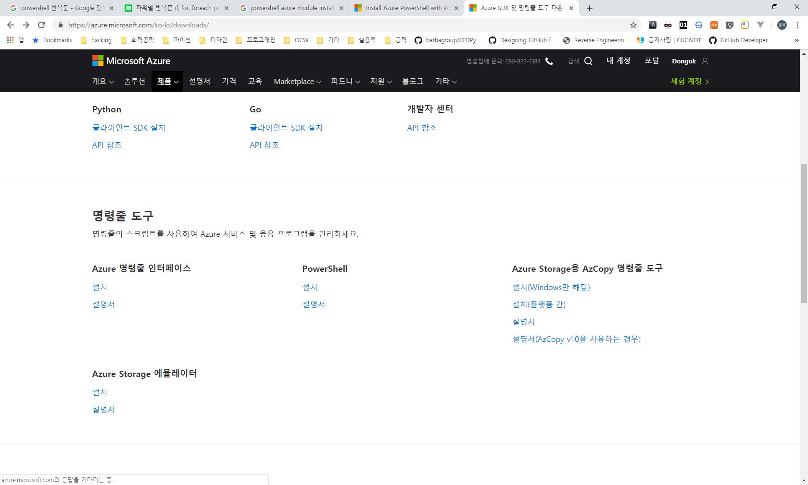
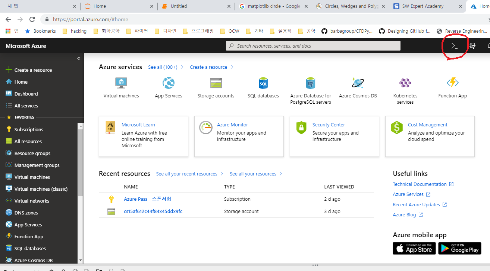

## 복습

Azure DNS는 PaaS 서비스

라우터라는 장비가 서브넷의 바운더리를 만들어주기 때문에

서브넷은 반드시 라우터가 필요함

자동으로 라우팅이됨.

안쪽의 IP는 공인IP보다는 사설IP를 씀

사설IP의 범위를 알아둬야함

172.16.0.0 ~ 172.31.255.255 (책에 나와있는거 오타났음)

## 피어링 실습

피어링은 공인 시험에서 굉장히 자주 등장하는 주제임

파워쉘과 CLI 둘다 알아야 함.

대량 관리, 자동화를 할 때 CLI를 씀

### 파워쉘
windows PowerShell은 5.1버전, powershell core는 6.0버전

Powershell ISE가 있음(powershell_ise.exe) <== GUI로 되어있고 스크립트로 만들 수 있음

windows PowerShell console(powershell.exe)

파워쉘은 모듈로 되어 있음

파워쉘의 명령어들의 집합을 모듈이라고 함

애져 파워쉘 모듈을 설치해야 애져 파워쉘 모듈을 사용할 수 있음

버전이 올라가면서 GUI화면이 점점 지원이 되고 있음

> $env:PSModulePath

$ 자리에 변수 명이 들어가고, 오른쪽은 값이 들어감

azure powershellmodule들은 다음과 같다.

각각 임포트 해줘야지 사용할 수 있음

- azure resource manager
- azure service management
- azure active directory
- azure rights management
- azure service fabric

로컬에서 사용하면 저런 것을 신경써줘야 함

하지만, 클라우드에서 쉘을 사용한다면 저런 것들을 신경 안써줘도 됨.

### 파워쉘 설치방법
- PowerShellGet: 파워쉘은 윈도우와 리눅스, 맥에서도 사용이 가능함.
- powershell web PI(windows only)
- MSI packages(Windows only)

## azure subscriptions를 관리하기(azure powershell을 사용해서)

PowerShell의 명령어의 형태는 동사-명사 형태로 되어 있음

### Azure Resource Manager
인증을 받아야함

- 인증
  - `Connect-AzureRmAccount`(매우 중요) : 인증하기

- Azure subscription을 선택하기
  - `Get-AzureRmSubscription`(매우 중요): 서브스크립션 보기
  - `Select-AzureRmSubscription`(매우 중요): 서브스크립션 선택

파워쉘에서 azure의 인증을 받아야 사용 가능함

rm이 항상 붙는 것은 리소스 매니저의 명령어이다 !!

ex. Get-AzureRmSubscription

Get-AzureSubscription(이런 식으로 붙은 것은 클래식 명령어이다)

### Service Management (classic) 구 서비스

## Azure-CLI - powershell보다 명령어가 쉽고 단순하게 되어있음
1.0은 azure로 시작되고, ARM과 클래식 둘 다 지원됨
2.0은 az로 시작됨, ARM만 지원됨

linux shell scripting 툴과 통합 사용돔

### 인증하기
azure login(v1) or az login(v2)

http://aka.ms/devicelogin (장치인증)

### 모드 바꾸기(v1 only)
- azure config mode arm
- azure config mode asm

## 파워쉘 실습

파워쉘은 기본적으로 관리자로 들어가야 함

윈도우 시작키 > powershell

파워쉘을 작업관리자에 등록

파워쉘만 등록하면 파워쉘-ISE도 자동으로 등록이 됨. 오른쪽 키 눌러서 관리자 모드로 시작하면 됨

> $env:PSModulePath

위의 경로에 모듈들이 설치되어 있음

tab을 누르면 자동완성기능이 있음

get-command (powershell에서 사용할 수 있는 모든 옵션을 사용할 수 있음)

get-command | more (파이프라인 사용 가능)

`get-help get-process`: help 보기. 업데이트를 먼저 하고 실행함

도스는 명령어 넣고 `/?`하면 되는데 파워쉘은 위의 방식으로 해야함.

`cls`: 화면 지우기

`Get-Process`: 메모리에 올라가 있는 앱들을 볼 때.

`Get-Module`: 현재 설치되어 있는 모듈

`add-azureAccount`: 현재 이 명령어를 실행하면, 모듈이 등록되어 있지 않기 때문에 실행이 안됨

`add-azureRmAccount`: 이 명령어도 실행이 현재 되지 않음

### PowerShell ISE

스크립트 창을 띄우기 > 보기 > 스크립트 창 표시(Ctrl + R)

위에 있는 창을 스크립트 창, 아래에 있는 창을 콘솔 창이라고 함

블럭을 잡고 선택 > F8하면 선택된 영역만 실행

F5 하면 전체 실행

스크립트를 저장

주석은 `# 주석입니다`

`Test-AppLockerPolicy`: 

### powershell의 Azure 모듈 설치

[다운로드-페이지](https://azure.microsoft.com/ko-kr/downloads/)

위의 사이트에서 하단에 

파워쉘 > 설치에 들어가서 다운로드

[다운로드](https://docs.microsoft.com/ko-kr/powershell/azure/install-az-ps?view=azps-1.8.0&viewFallbackFrom=azps-1.2.0)

`Install-Module -Name Az -AllowClobber`: 이 명령어를 복사해서 실행

예, 모두 예 눌러서 설치

그 명령어의 아래쪽에 보면 관리자 권한이 없는 사람은 현재 사용자에만 설치할 것이냐 묻는데, 기본으로 관리자 권한으로 설치하고, 안되면 현재 유저에 설치

- `Connect-AzAccount`: 이 명령어를 실행하기 위해서는 import-module을 먼저 해야 함
- `import-module AzAccount`: 하지만 모듈을 임포트 하려고 해도 보안 오류가 뜸
- `Get-ExecutionPolicy`: 이렇게 보면 restricted로 되어 있기 때문에
- `Set-ExecutionPolicy Unrestricted`: 이 명령어로 보안정책을 먼저 변경함
- `Set-ExecutionPolicy -ExecutionPolicy`(unrestricted가 생략된 형태): ps1 파일을 전혀 실행하지 못하게 하는 명령어

현재 상태는 azure에 마이크로 소프트 계정이 연결된 상태임.

> 교재랑 약간 상이한 부분

`Connect-AzAccount`: 이 명령어가 최신임. 교재에는 다른 명령어로 되어 있음

파워쉘의 문서파일 경로

[파워쉘의 문서](https://docs.microsoft.com/en-us/powershell/) => 주소를 ko-kr로 바꾸면 한국어 버전으로 나옴, 즐겨찾기에 등록하기

[Azure의 경로](https://docs.microsoft.com/en-us/azure/) => Azure는 번역이 잘되어 있음. en-us, ko-kr

매뉴얼도 전부 최신 버젼으로 바뀌었는데, AzureRM으로 되어 있던 것이, AZ로 전부 변경되었음(2019-04-29 확인일자)

20533교재는 전부 파워쉘로 되어 있어서, 좋음

10979(; instuctions에는 AK라고 있는데 answer key를 말하는 것임)

## Azure CLI 설치

[Azure CLI 다운로드](https://docs.microsoft.com/bs-latn-ba/cli/azure/install-azure-cli-windows?view=azure-cli-latest)

명령 프롬프트를 관리자 권한으로 실행

`az`를 입력했을 때 무엇인가 쭉 출력이 되면 잘 설치가 된 것임.

로그인

`az login`: 로그인 명령어

- `az` 
- `az account list`: (subscription) 리스트 보기(활성화 된 것만 출력됨(Get-AzureRMSubscription 명령어와 같음)
- `az account set --subscription <subscription-id>`: 계정을 선택하기 (Select-AzureRMSubscription 명령어와 같음)

### 클라우드 환경에서 로그인 해보기

클라우드 쉘에 접속

- `Connect-AzureRMAccount`: 
- `Get-AzureRmSubscription`: subscription 리스트가 보임
- `Select-AzureRmSubscription  --Subscription <subscription-id>`: get 해서 봤던 서브스크립션 아이디를 선택

## 실습

[실습주소](https://github.com/MicrosoftLearning/20533-ImplementingMicrosoftAzureInfrastructureSolutions/blob/master/Instructions/20533E_LAB_AK_02.md)

### 실습 전 설명

이번 실습에서는 10.10.0.0/16으로 서브넷을 사용함

> AzureRM보다 AZ가 더 최신 버전이다.

여기에서 $rg = .. 부분은 -Location에 'East Us'(공백이 들어가면 따옴표를 넣어줘야 함)를 넣어야 함

네트워크 대역이 다른 것을 각각 확인해야 함

`피어링`은 `같은 데이터 센터 내에서 VNet과 VNet`을 묶어 통신 되도록 함.

원래는 VNet과 VNet 사이에 통신을 하려면 반드시 라우터를 만들어줘야함.

피어링을 하면 같은 네트워크로 묶어줘서 라우터 없이도 서로 통신을 할 수 있음(VNet Peering)

다른 데이터 센터에서는 `VNet-to-VNet`이라고 부름

### 실습시간

Q. 10GB정도의 데이터를 전송하려면 가격이 얼마나 드나요

A. [Azure 가격 확인](https://azure.microsoft.com/ko-kr/pricing/) 페이지에서 확인하세요

실습할 경우 201 네트워크가 없기 때문에 203으로 만들고, 202는 204로 만듭니다.

### 실습시간 2 - LAB - VM(10979E-Part-2-Virtual-Machines-Microsoft-Azure-Fundamentals)

1. Virtual Network 만들기

가상 스위치 만들기

hyper-v로 들어가서 `가상 스위치 관리자` 확인

스위치를 만드는 것은 외부, 내부, 개인 세 개가 있음

스위치 이름은 굉장이 중요하고, 영문만 가능합니다.(private network; 한글로 입력하면 내부 컴퓨터들이 인식을 못해서 네트워크가 안됨)

이름: `Private Network`로 구성

2. VM 만들기(Mia-CLI1; 마이애미 클라이언트)

`C:\Program Files\Microsoft Learning\10979\Drives` 위치에 VM이 만들어집니다. (D를 C로 수정해야 합니다.)

`C:\Program Files\Microsoft Learning` 디렉토리에 Base라는 새 폴더를 만듭니다.

Base 폴더 안에 `Base18A-W10-1709.vhd` 파일을 붙여 넣습니다.

3. 스크립트 실행

스크립트 내에 인증서를 만들고, 인증서가 있는 파워쉘만 실행하라고 하면 됨

다음의 순서대로 실행해야 함
   1. CreateVirtualSwitches.ps1
   2. VM-Pre-Import-10979E.ps1 => Get-ExecutionPolicy 실행해서 Unrestricted 확인하고 c 두번 입력후 종료
   3. 10979E_ImportVirtualMachines.ps1

20533도 같은 방법으로 실행하면 됨

### default switch 추가하기(10979)

private Network가 하나가 있는데

default스위치 > 인터넷으로 나가는 NAT 스위치
   
`인터넷이 잘 되는지 확인`

github에 20533과정의 Allfiles 디렉토리는 실습에 필요한 모든 스크립트가 저장되어 있음
