## 복습

Azure는 6개월마다 업데이트됨.

새로운 서비스가 들어옴

파워쉘 ISE는 스크립트로 만들어서 저장할 수 있음

파워쉘은 시스템을 컨트롤 하는 것이기 때문에 기본 세팅은 restrict가 기본 정책이다.(Get-ExecutionPolicy;Set-ExecutionPolicy Unrestricted)

Module 임포트 하기 전에 실행정책이 허용되어 있어야 import됨

정책 확인 > 모듈 임포트 > 모듈 사용

만약 기업에 들어가면 3~5년차 사이에 azure 관리자가 될 것이고,

작은 기업에 들어가면 바로 관리자가 될 수도 있음

관리자가 된다면

관리자 서브스크립션

개발자 서브스크립션

테스트 서브스크립션

이런식으로 서브스크립션을 만들어야 함

### Azure CLI

Azure CLI는 bash shell 기준으로 작성되었습니다.

az account list는 subscription을 출력해주는데 json형식으로 출력해줍니다.

설치를 먼저 해야 함

az명령어가 잘 출력되면

로그인, 리스트 출력, subscription 선택

## 머신 간에 공유 설정 하기

가상 머신에서 메모리 세팅을 할 때는 가상머신이 종료 되어있어야 합니다.(다른 세팅도 마찬가지)

가상머신을 블록잡고 오른쪽 클릭해서 동시 실행

이후 엔터 치면 동시에 연결이 됨


하드 디스크도 SSD로 쓰는 것이 디스크에 부하가 적게 걸리고, HDD를 쓰면 느려짐

HDD에서 3개, 4개 돌리면 렉이 걸려서 느려서 작동이 잘 안됨

firewall.cpl

위의 명령어로 들어가서


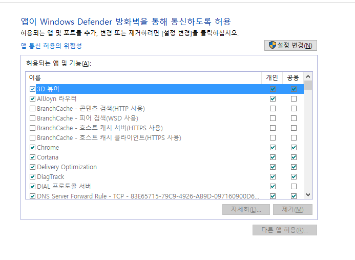

위로 들어가면 방화벽 세팅이 가능하다.

`ncpa.cpl`: 시험 문제에 나옴(1문제)

VM의 네트워크는  하나는 프라이빗 네트워크, 하나는 디폴트 스위치. 디폴트 스위치는 바깥으로 나가는 NAT 기능을 함

> 20533 가상머신 내

`ifconfig /all`: DHCP Enabled가 No라고 된 의미는 `고정IP이다`

> 10979 VM 내

ping에 대해서 열어주려면 ICMP에 대해서 설정 해줘야함

`wf.cpl` > new inbound rule wizard > predefined(포트를 한꺼번에 그루핑한 후 열어주는 것), 이걸로 안하고 custom > all programs > 


어떤 ip에 대해서 설정할 지는 src:dst = any:any로 설정하면 됨 > allow connection(선택), allow ~ secure는 암호화 된 접속을 허용해 주겠다 > domain, private, public 셋다 체크된 상태로 넘김 > 이름은 Ping으로 설정

xp에서는 공유에서 동시접속자수를 20명밖에 안됨, lock을 걸어 놨다고 할 수 있음.

서버를 쓰면 무제한으로 설정할 수 있음

> 533 VM

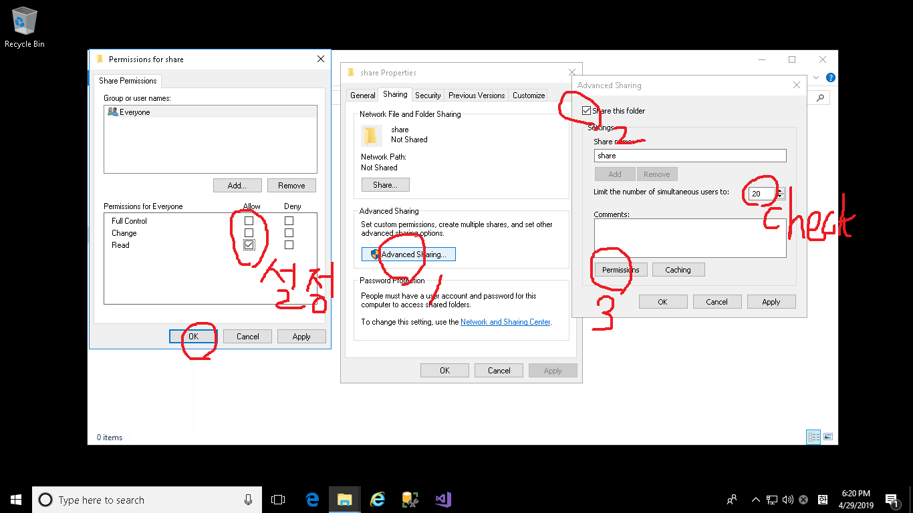

firewall.cpl 들어가보면 자동으로 방화벽이 열려있음 file and printer ... 열려있음

파일 프린트 쉐어링 하려면 포트가 4개 열려야 함(139번, 137번, 138번, 445번).

기본 방화벽에서는 체크 하나만 하면 다 열림. 고급 방화벽에서는 4개 열려있다는 것을 확인하고 세팅할 수 있지만, 기본 방화벽에는 그럴 수 없음

ipconfig에서 private network로 설정된 것은 바깥에서 안으로 들어갈 수 없음

> host 머신

이후, 쓰기 권한도 부여해서 

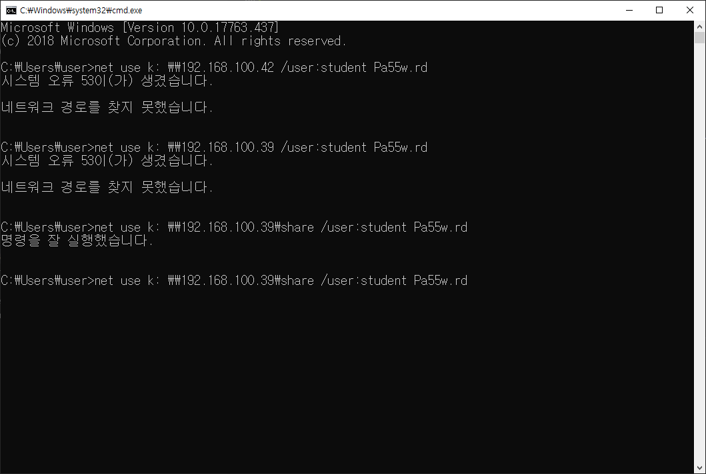

확인하면 k드라이브가 추가된 것을 볼 수 있음

`firewall.cpl`: 기본 방화벽

`wf.msc`: 고급 방화벽

해당 서비스를 설치하면 자동으로 방화벽이 오픈(Windows 2008 이상)

`UNC 경로`(SMB 프로토콜을 사용함): 공유폴더에 접근할 때 쓰는 이름(SMB 2.0, SMB 3.0이 있음;윈도우즈 2008까지는 2.0을 썼고 windows server 2012부터, windows 10부터 ~ 사용함

- \\IP_address\Share_Name (주의: 폴더 이름이 아니라, 공유이름임; 즉 공유이름과 폴더이름을 다르게 할 수 있음)
- \\Computer_Name\Share_Name
- \\DNS_Name\Share_Name

SMB 3.0이 되면서 라우터 밖에서도 접속 됨. 다른 라우터에서도 접근됨(2.0부터는 안됐음. ). 즉 인터넷 상에서도 접속 가능 한 것임

시스템의 관리자 계정에 관리자 암호가 부여 되어 있지 않으면 접근 불가(windows 10)

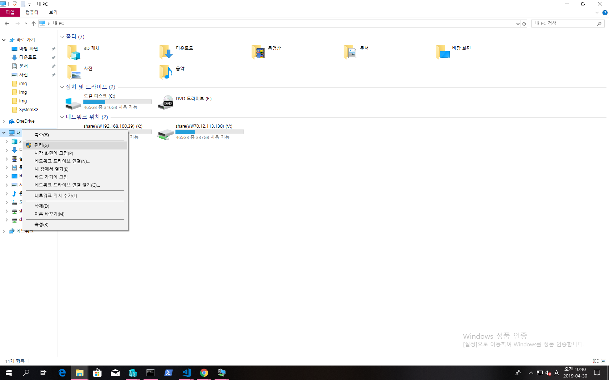

관리 > 로컬 사용자 및 그룹 > 사용자 > 새 사용자 > 사용자 이름, 암호, 암호확인을 a로 채우고 확인

하지만 42일이 지나면 원래는 암호가 파기가 되게 되어있음. 그러나 설정에서 암호 기간 설정 없음을 체크하면 됨

`gpedit.msc`: 로컬 정책을 보는 명령어

컴퓨터 구성 부분과 사용자 구성 부분이 있음

컴퓨터 구성 > Windows 설정 > 보안 설정 > 계정 정책 > 암호 정책

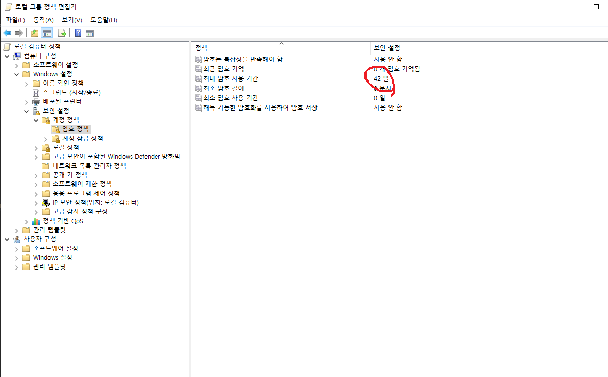

### 실습과정 따라하는 방법

[20533과정 깃](https://github.com/MicrosoftLearning/20533-ImplementingMicrosoftAzureInfrastructureSolutions)

ZIP파일로 다운로드 받으면 압축이 안풀립니다. 파일이름이 너무 길어서 그렇습니다.

이름을 수정해주고 압축을 풀어야 합니다.

Allfiles는 세팅을 하기 위한 구성들도 들어있음

ALLfiles에 modules > 모듈(파워쉘 함수)들이 있음. 

allfiles의 K드라이브에 붙여넣기 하기. allfile

먼저 K드라이브를 가상머신 공유폴더와 연결해 놓고

가상머신의 파워쉘 (관리자권한)로 들어간 다음

`Get-ExecutionPolicy`을 통해서 실행정책을 확인하고

`Set-ExecutionPoilicy -ExecutionPolicy Unrestricted`를 통해서 실행정책을 변경합니다.

`Add-20533EEnvironment`를 실행합니다.


region은 4번(eastUS)

size는 `11    Standard_D1_v2`로 설정

약 40분 정도가 걸림(실제로 15분이 걸렸으나, 다른 작업하면 1시간까지 느려질 수 있음)

만약 장시간이 멈춰져 있으면, 엔터를 누르면 다음으로 넘어감

실습이 다 끝나면 제거해야함

`Remove-20533EEnvironment` 명령어를 통해서 제거하면 됨

`Y/N/D`: 옵션에서 D는 다른 lab을 삭제하려는 경우에

혹시 gathering이 되고 있으면 리소스의 삭제가 제대로 안되었을 수 있으니까

azure portal에서 리소스가 잘 삭제 되었는지 확인해야 함

## ms technet

[ms technet](https://technet.microsoft.com/en-us/)

Technet은 학습자료가 많기 때문에 자주 방문해야 하는 사이트이다

[최신 제품 다운로드 주소](https://www.microsoft.com/en-US/evalcenter/)

## Module 6. Azure Storage and Data Service

SQL도 IaaS 환경의 PaaS 환경의 SQL이 있음.

SQL VM이 있음. VM 위에 SQL이 올라가는 것인데, 이것은 IaaS환경의 SQL이고, PaaS환경은 데이터베이스만 쓰는 것임

SQL 서비스를 쓸 때는 `1433 Port`가 열려있어야 함.


IaaS 환경의 SQL

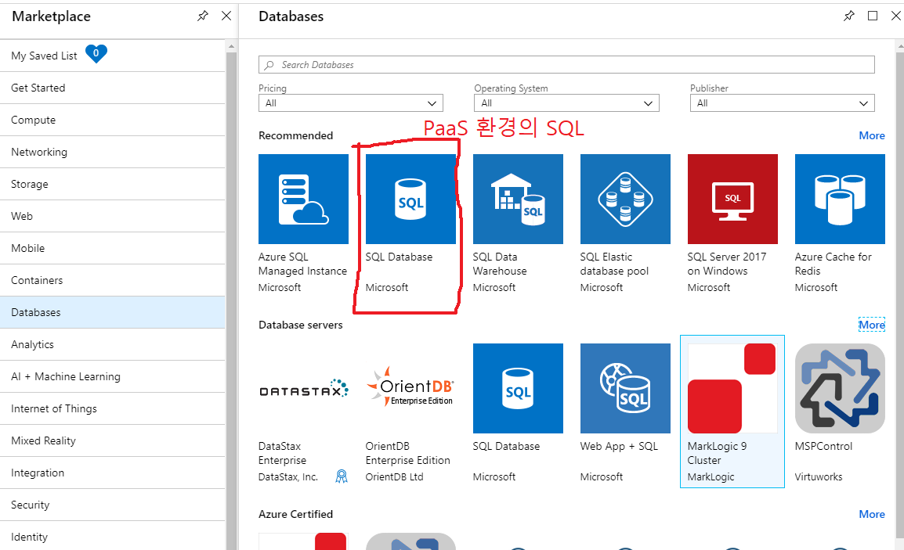
PaaS 환경의 SQL

### SQL 서버(SQL Server 2017 on Windows Server 2016) VM 생성(작은책 p. 6-20)

IaaS환경의 SQL 서버 생성


테스트 환경이니까 메모리를 적게 부여해도 괜찮음

실제 운영하는 곳에서는 CPU 8개, 메모리 56GB 정도는 써야함

Management tab > 부팅할 때 검사 off, auto-shutdown off

SQL Server setting > SQL Connection을 Public으로 변경

Automated Backup > 확인만 하기

R Service > ms에서 R을 인수했기 때문에 R서비스가 있음

SQL 서버는 관리를 해야될 부분이 너무 많음

운영체제부터 SQL 관리까지. 이런걸 MS가 알아서 다 해주니까 너무 편함.

VM으로 SQL을 관리하면 백업을 해줘야 하는데, VM은 용량도 매우 크고 관리해야할 포인트가 많아서 관리 비용이 늘어납니다

Azure SQL DataBase는 SQL만 만들기 때문에 굉장히 빠르게 만듦

SQL Server in an AzureVM은 VM을 만들기 때문에 배포가 느림

`VM`은 `virtual network`가 반드시 필요합니다

High availability > 하나가 망가지면 다른 것에 의해서 정상 작동하도록 하는 것. availability가 높은 것을 High availability라고 합니다

Scalability > 스케일을 쉽게 확장 할 수 있음

always on을 하려면 클러스터를 구성해줘야 함

시작 > SQL Server tools 17 > MS 

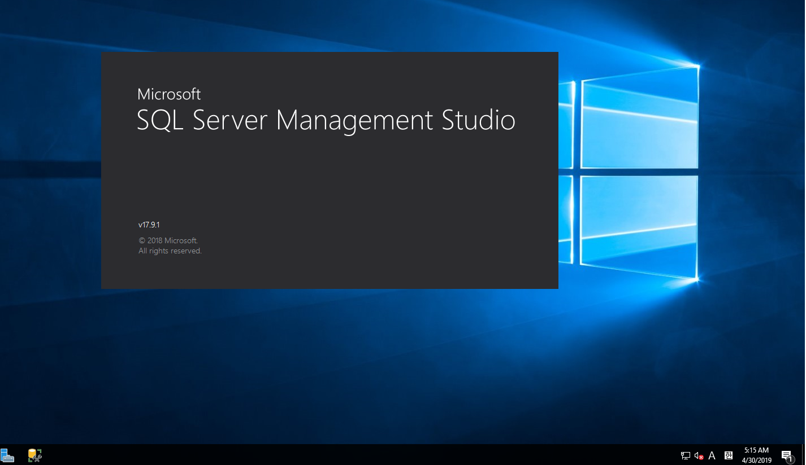

server name (자기 컴퓨터에 접속할 경우에는 .(또는 자신의 ip)을 찍으면 됨)

```sql
create database myDB01;
go
/* 블록으로 선택해서 F5하면 실행됨, 데이터베이스를 생성한 후 바로 반영되지 않기 때문에
새로고침을 해야 함*/
create database myDB02;
go

use myDB01
Create table MyTbl(
	idx int not null,
	name char(10) not null,
	phone varchar(50) null,
	email varchar(100) null,
	addr varchar(200) null
)

Select * from MyTbl;

insert into MyTbl(idx, name, phone, email, addr)
values (1, '김똘똘', '111-1111-1111', 'aaa@aaa.com', '서울')

insert into MyTbl(idx, name, phone, email, addr)
values (2, '김똘순', '111-1111-2222', 'bbb@aaa.com', '부산')

select * from MyTbl;

/* 이렇게 보면 이름들이 깨지는데, 로컬라이제이션이 안되서 그렇다. varchar 형태 대신 nvarchar 형태로 하면 깨지지 않는다.*/

```

```
평범한 텍스트
또 텍스트
```

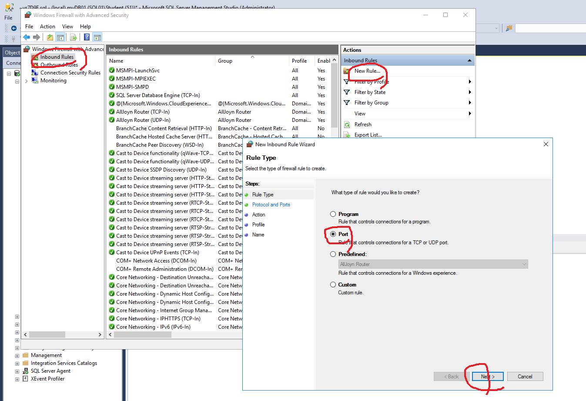

#### VM의 방화벽

`MSSQL(TCP_1433)`: 포트 번호는 이런식으로 지정해야지 보기가 좋음

SQL은 윈도우의 기본 내장된 서비스가 아니라서 방화벽 포트가 열리지 않습니다

DNS, 파일 프린트 공유는 방화벽 포트가 알아서 열립니다.

#### NSG(Network Security Group)의 방화벽

리소스 그룹 > nsg > 방화벽 3389 포트 해제

SQL Server의 인증 모드
- Windows 인증 (같은 도메인 환경일 때 사용), 보안이 강함, 중앙에서 관리; 주로
- 혼합 인증(Windows 인증 + MS SQL Server 인증)

`Credential`: `ID + Password`을 부르는 말

`인증`: Credential을 확인하는 과정

windows 인증(Active Directory에서 주로 windows 인증을 사용함)

windows 인증은 id와 password를 윈도우에서 관리하는 것이고, SQL인증은 SQL 서버에서 id와 password를 관리하는 것

인증 모드를 바꾸면 서비스를 다시 시작해야 합니다.

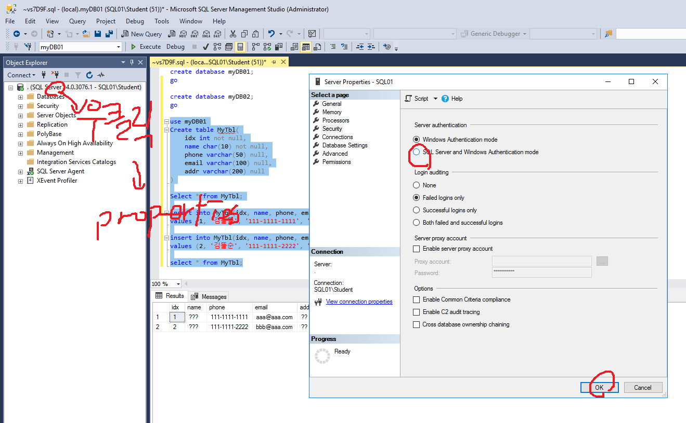

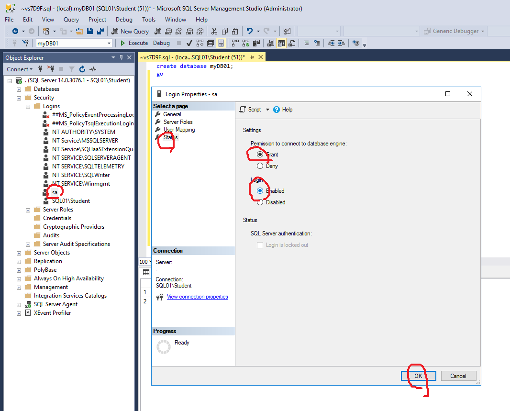

리소스 그룹 이름과, nsg(네트워크 보안그룹)의 이름을 스크립트에서 바꿔주고

아래의 내용을 실행합니다.
```
connect-azureRmAccount
get-azureRmSubscription
select-azureRmSubscription
Get-AzureRmNetworkSecurityGroup -Name "<<nsgName>>" -ResourceGroupName "<<GroupName>>" | 
    Add-AzureRmNetworkSecurityRuleConfig -Name "AllowPing" -Description "Allow Ping" -Access `
    "Allow" -Protocol "*" -Direction "Inbound" -Priority 4002 -SourceAddressPrefix `
    "*" -SourcePortRange "*" -DestinationAddressPrefix "*" -DestinationPortRange "0" |
    Set-AzureRmNetworkSecurityGroup
```

실행이 잘 되면 

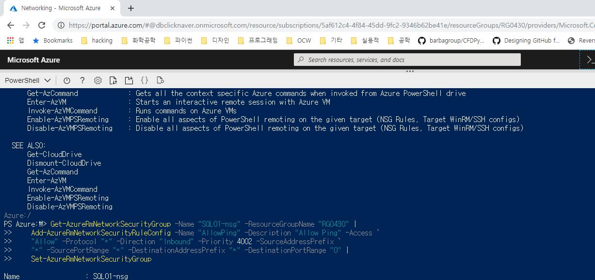

위와 같이 실행하면 잘 실행이 되고, 

nsg에서도 방화벽이 ICMP에 대하여 해제 되었으므로 ping이 잘 실행됩니다.

아래는 PaaS 서비스 입니다.
- Azure SQL Database
- Azure Database for MySQL
- Azure Database for PostgresSQL


아래는 IaaS 환경입니다.
- DB2
- Oracle DB
- SAP ASE
- SAP HANA

## PaaS환경의 database 만들기(pdf10979 p.21)

Create Resource > SQL Database > 

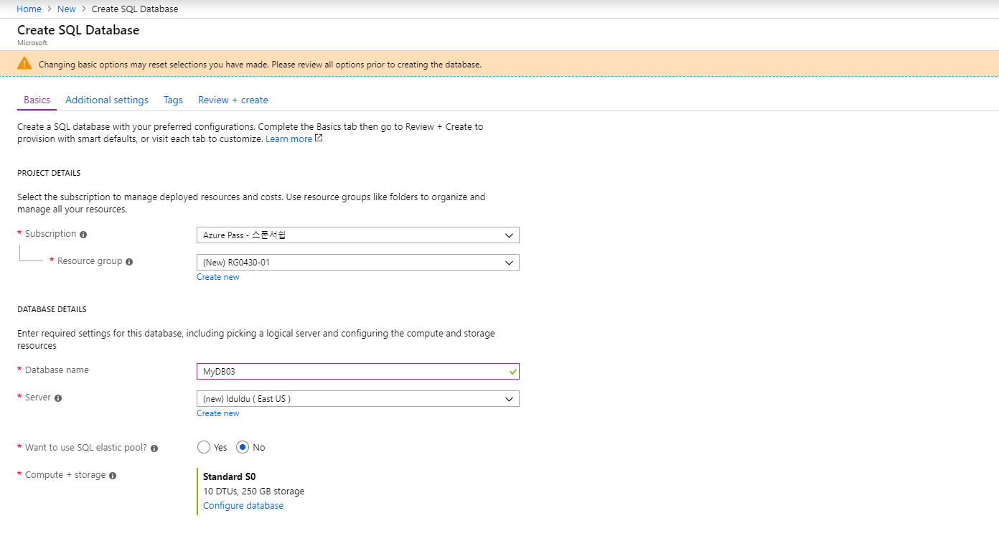


Elastic pool => 수평확장을 할 수 있음

DTU라는 것은 CPU사용률, I/O사용률 등을 계산해서 하는 과금 단위임

네트워크를 얼마나 전송했는지.

Basic은 DTU가 없습니다. 그리고 최대 사이즈가 2GB입니다.

Standard 는 250GB까지

프리미엄은 1TB까지 가능합니다.

백업 세팅을 automatic backup을 enable 시키면 다음과 같이 동작합니다.
- full weekly(전체 백업을 일주일에 한 번씩)
- Differential daily(증분 백업; 증가된 내용만 백업함)
- Incremental(transaction log) every five minutes(트랜젝션 로그 백업)

PaaS 환경에 데이터 베이스가 만들어지면 데이터 센터 내에서 복사본을 3개를 만들어 놓음. 

세 개중 하나가 fail나면 다른 db가 동작함

`Database Collation`: SQL_Korea_완성 <== 이런식으로 칠 수 있음(learn more를 눌러서 collation을 볼 수 있음)

PaaS DB를 만들면 Azure에서 하는 것보다는 SSMS에서 관리하는 것이 훨씬 쉽습니다.

PaaS db에서는 서버로 들어간 다음

new database를 클릭해서 데이터베이스 이름을 넣고

select blank database

location: east US

collation은 기본 옵션으로.

Master DB는 데이터베이스 환경설정들이 들어있음

외부에서 접속할 때에는 방화벽 설정은

 여기에서 하면 됨


`pdf10979 p. 24 참조`

IaaS를 쓸 수도 있음

`SQL Server Management Studio(SSMS)`에서 주로 관리함.(IaaS뿐만 아니라 PaaS까지; 로컬에 있는 db뿐만 아니라 원격의 컴퓨터도 관리 가능함)
Visual Studio에서 관리할 수도 있음
sqlcmd라는 명령 프롬프트를 통해서 관리할 수도 있음


LocalServer Groups > 오른쪽 클릭 > New Server Group > 이름 만들기

LocalServer Groups > 오른쪽 클릭 > New Server Registration > host이름 또는 ip 가져오고, 로그인 방식 설정하기(windows 인증 / sql 인증)

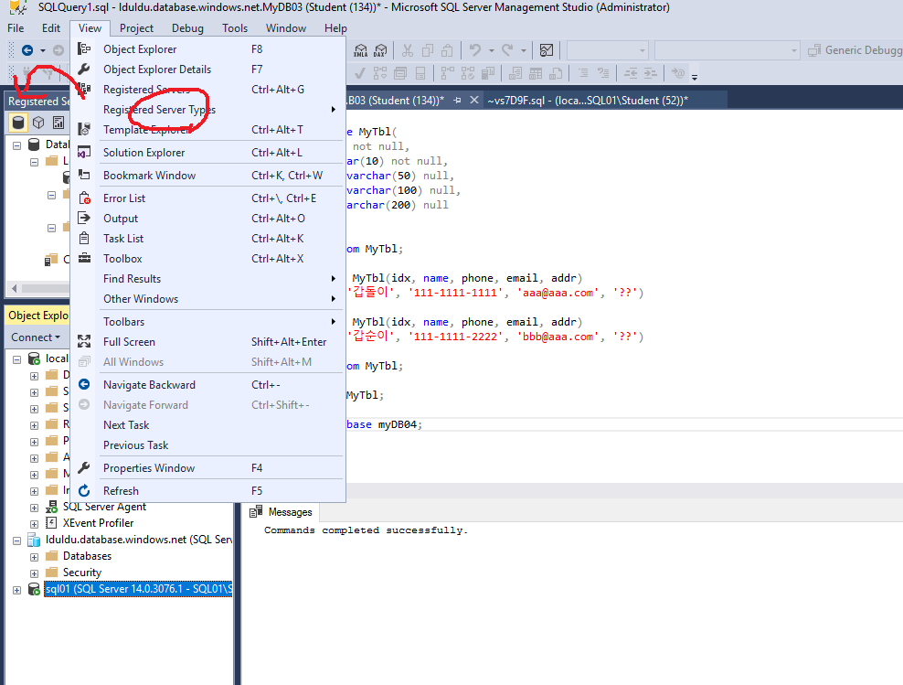

