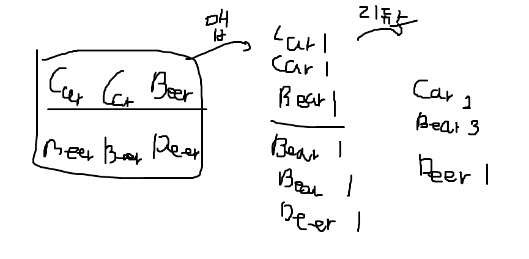
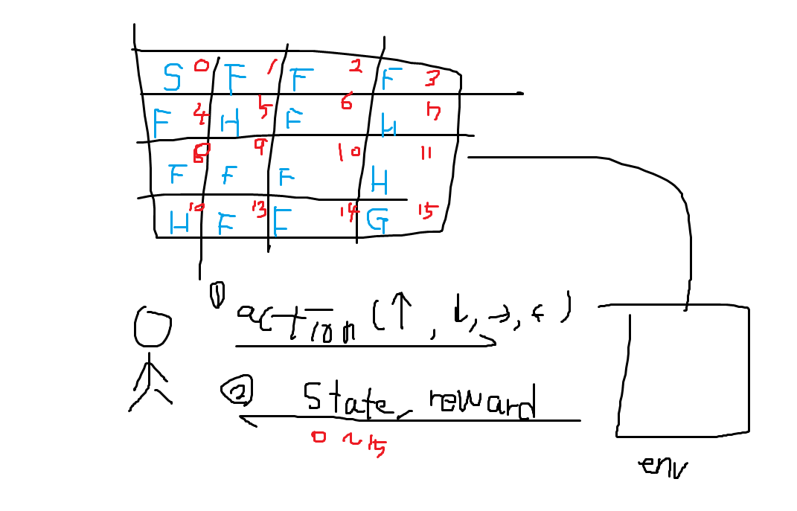

# 빅데이터 에코 시스템

1. 수집 기술: 플룸(클라우데라 회사에서 만든 것, 서버 로그 수집 도구), 카프카(링크드인에서 개발, 카프카: 비동기적으로 데이터를 주고 받는 기반 기술), NiFi(NSA에서 만든 것), sqoop(RDBMS, HDFS간에 데이터 전송을 할 수 있도록 만든 프레임 워크)
   -  
   
2. 작업 관리 기술: Azkaban, Airflow(데이터의 흐름, 스케쥴링을 시각화 해줌. workflow framework임). 하둡에서는 Hive, 데이터베이스에서는 DBMS와 연동해서 사용할 수 있습니다.

3. 데이터 직렬화: Avro(apache 하둡에 가보면), Thrift(Facebook에서 만든 것) (언어들이 짬뽕되어 있으면, 데이터 직렬화를 통해서 언어 상관없이 개발할 수 있는 것)

4. 저장: 대용량 저장, 안정성 / 속도가 중요함. HDFS(Java로 만들어진 파일 시스템), AWS S3, MS Azure Data Lake

5. 데이터 처리 기술: 스파크, Hive, HBase, 임팔라(C로 만들어져서 속도가 매우 빠름)

   - Apache Spark: MLib, SQL 기능 제공

   - Hive: Facebook에서 만듦. 하둡 기반의 데이터웨어 하우징 솔루션
     - 데이터 웨어 하우스는 여러 DB에서 필요한 특성에 해당하는 DB들만 모아서 만든 것이 데이터 웨어 하우스 입니다.
   - HBase: 구글 개발. 하둡 기반의 DB

   

6. 클러스터 관리: 클러스터 처리 효율적으로 할 수 있도록 클러스터를 관리하는 기술

   - yarn: 데이터 처리를 할 때, 클러스터 자원관리, 스케쥴링을 해주는 도구
   - 하둡의 버전은 yarn의 기준으로 버젼이 달라집니다. (현재는 3.0)

7. 분산 서버 관리

   - zookeeper: 어느 하나의 서버에만 부하가 몰리지 않도록 로드 밸런싱을 해주는 것. 서버 끼리 동기화도 해줘서 안정성을 보장해줌

8. 시각화

   - Zapplin: 시각화

9. 모니터링

   - Hue: 하둡 기반의 모니터링 도구

---

# 강화학습

Frozen Lake

한 판의 게임이 끝날 때 까지를 **에피소드**라고 합니다.

랜덤으로 왔다갔다 반복하는 과정을 **simulated annealing**이라고 합니다.

Q(State, Action)

Q(S1, LEFT)

Q(S1, RIGHT)

Q(S1, RIGHT)

Q(S1, UP)

Q(S1, DOWN)

$$
Max_a Q(S1, a) 0.5 \\
argmax_a Q(S1, a)
$$

$$
Optimal Policy (\pi^*) = argmax_a Q(S, a)
$$

