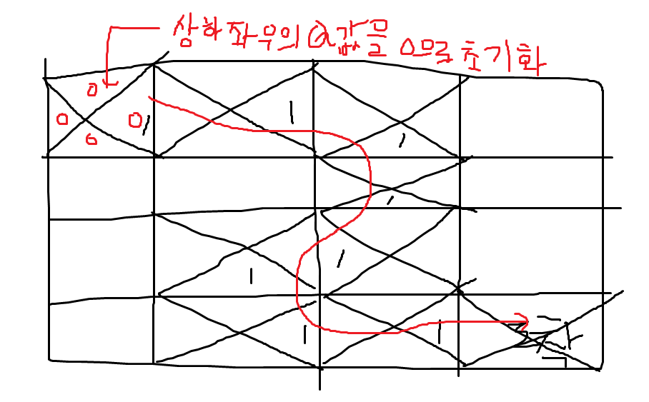

# 강화학습

-  강화학습 해결문제: Sequential Decision Problem

- 문제에 대한 수학적 정리: MDP(Markov Decision Problems)

- MDP 푸는 방법은 계산은 DP(Dynamic Programming)이고 학습하는 방법은 RL(Reinforce Learning)입니다.

- 상태공간 차원이 높을 때: Function Approximation

- 복잡하거나 어려운 문제는 Deep RL을 사용해서 해결합니다.

$$
s_0, a_0, r_1, s_1, a_1, ... s_{n-1}, a_{n-1}, r_n, s_n
$$

terminal state에서는 Action과 Reward가 없습니다.
$$
R = r_1 + r_2 + ... + r_n\\
R_t = r_t + R_{t+1}\\
R_t^* = r_t + max R_{t+1}\\
Q(s, a) = r + max_{a^`}(S^`, a^`)
$$

R은 현재의 reward를 말하는 것입니다.

R_t는 t라는 시점에서의 reward를 의미합니다.

Q(s, a)는 가치를 의미합니다.asterisk(*)의 의미는 최적화된 값이라는 의미입니다.

결국 Q값을 찾아가면서 Q 테이블이 만들어야 그 것을 기반으로 움직이게 됩니다.

$$
Q(S_{14}, a_{right}) = r + max(Q(S_{14}, a))) = 1 + max(0, 0, 0, 0) = 1 \\
Q(S_{13}, a_{right}) = r + max(Q(S_{14}, a)) = 0 + max(0, 0, 1, 0) = 1
$$

- MDP(Markov Decesion Process)

$$
S: 상태\\
A: 동작\\
r: 보상\\
\gamma: 할인율\\
P^a_{s, s'}: 상태 변환확률
$$