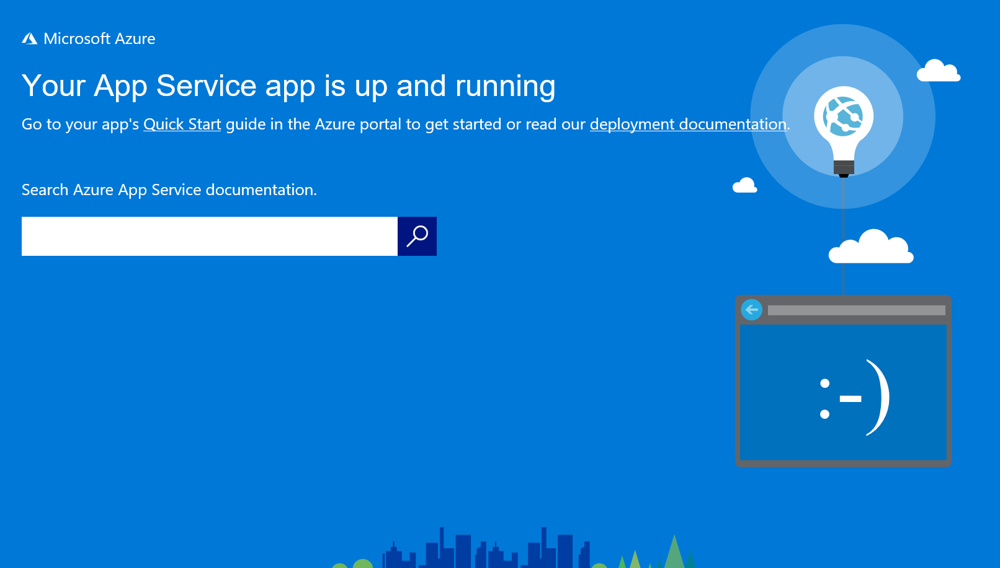
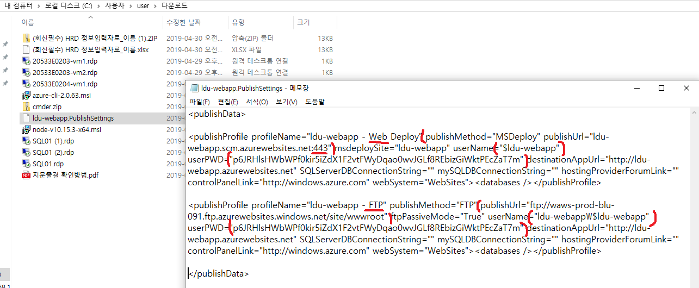
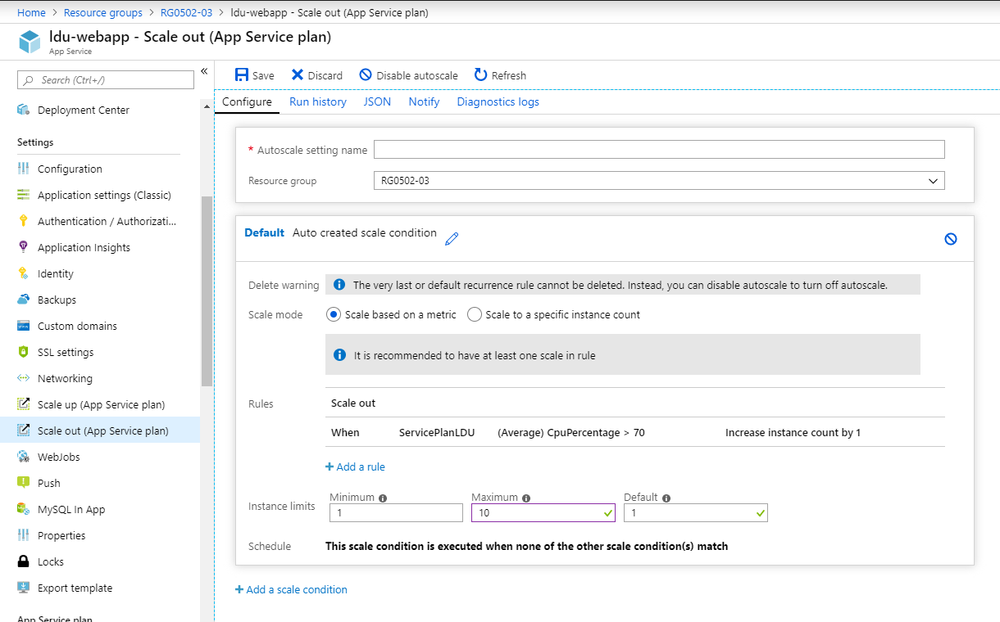
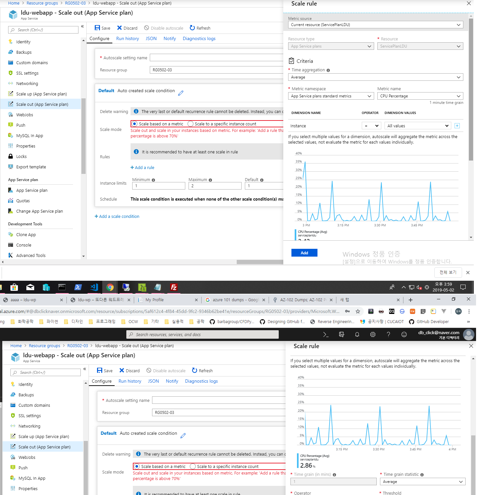
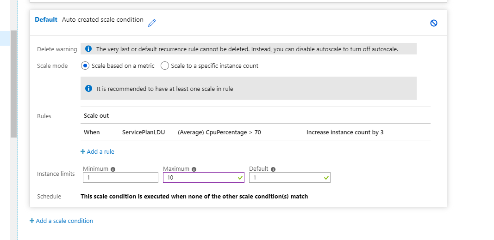
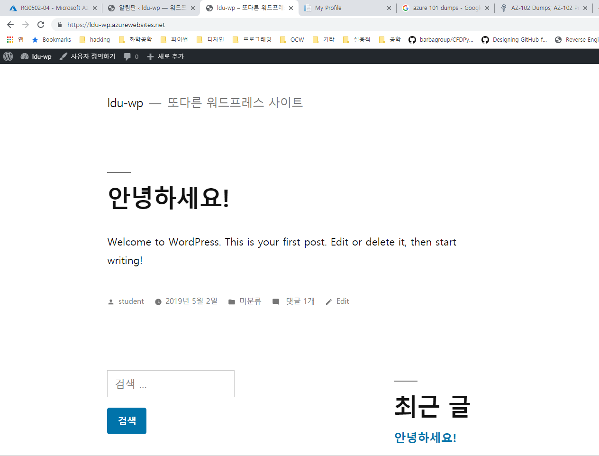
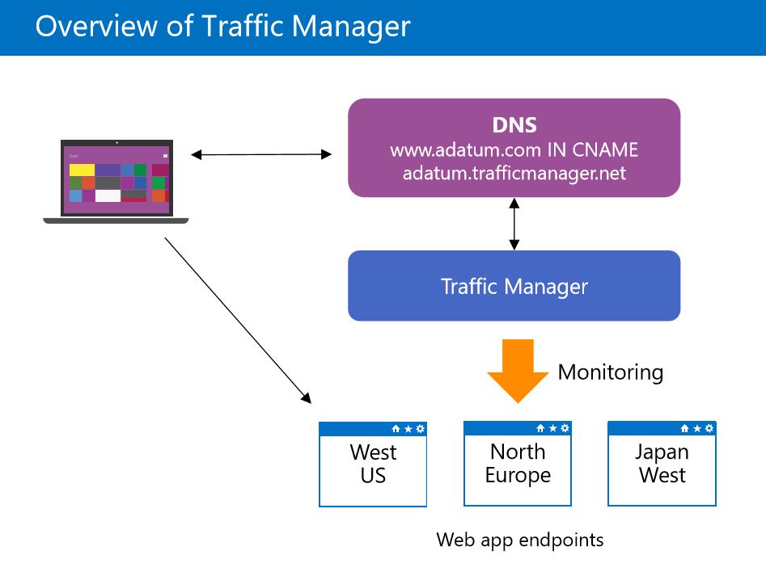

Azure Web App(10979 Module 4, 20533 Module 5)

## 1. 복습

IaaS 환경으로 SQL 생성함

이름 SQL01. 

IaaS 환경의 웹서비스를 해주려면

서버장비 구매, OS 설치, IIS 설치

### exam 관련 

[microsoft learning](www.microsoft.com/learning) 한국버전으로 보면 안됨

Certification & Exams > Become Microsoft Certified(Fundamental Certifications > Associate Certifications > Expert Certifications)

위와 같은 과정으로 자격증을 취득할 수 있는데, 굳이 Fundamental을 볼 필요는 없음. 바로 Associate 시험을 봐도 됨

### AZ-103과정은

시뮬레이션 문제가 16문제 나옴. 직접 Azure Portal 열어서 세팅하는 것

총 56문제가 일반문제가 나오고, Lab 2문제(시뮬레이션 문제), 하나의 Lab 당 8개의 step이 있습니다

즉 Lab 하나당 8문제 입니다. Lab문제는 어디서 나오나면 일반문제를 풀다가 중간에 나옵니다. Lab을 마치면 다시 Lab으로 못 돌아갑니다.

시간이 굉장히 부족합니다. 지금 여러분이 하셨던 방화벽 세팅, 피어링, VM 생성도 나옵니다.

AZ-103시험을 보면 Azure Administrator Associate가 될 수 있음

Azure Gold 파트너를 유지하기 위해서는 Azure Associate를 몇 명 유지해야 한다. 이런 것이 있음

Gold 파트너가 되면 MS에서 지원해주는 리소스가 달라집니다.

MS에 보면 백승주 부장이 있는데, 대학 때 국제 자격증을 50개나 땄음. 현재 Cloud쪽으로 일하고 계십니다

취업할 때 유리하다는 것입니다.

Azure는 조금 시험이 어렵습니다.

덤프에 나오는 시뮬레이션은 다 나온다고 보시면 됩니다.

시험은 AZ-103 클릭하시면 됩니다.

MS시험은 유효기간이 없었지만, Azure는 유효기간이 3년입니다.

한국으로 region을 바꾸면 11만원 정도입니다.

영문으로 보지 마시고, 한국으로 보셔야 좀 싸게 들어갈 수 있습니다. 웹사이트에서 스케쥴 잡고 보시면 됩니다.


## 2. Windows Server 2016
> IIS(Internet Information Service) 설치
- Web Server(TCP 80)
- FTP Server(TCP 21)

### 2.1. IIS 설치
Server Manager로 들어감

Local Server > 방화벽이 설정 되어있음

서버 매니저의 오른쪽 상단의 Tools의 각각의 항목은 `snap-in`이라고 함

오른쪽 상단의 Manage > Add Role & Features 클릭

### Role vs Feature
Role - 서버 서비스(16가지)가 들어있음; 웹서버, AD(Active Directory), DHCP 등

운영체제를 웹 서버로 쓸 거냐 도메인 컨트롤러로 쓸거냐 DNS로 쓸거냐 DHCP로 쓸거냐 등 16가지 서비스가 있습니다.


Feature - 기능(35가지)이 들어있음

Feature는 서버 서비스는 아니지만 윈도우에서 지원해주는 기능들이 들어있음

백업복구, 닷넷 등이 들어있음

웹서버를 설치를 하게 되면 관리 툴은 Feature에 들어있음


나머지는 전부 기본 옵션으로 next만 누름


FTP만 추가 설치합니다.

다음 화면에서 재시작이 필요하면 재시작 하라는 항목을 체크하고 설치합니다.


설치가 잘 되면 TOOLS 메뉴에 IIS가 추가됩니다.

wf.msc 화면에서 자동 갱신이 되지 않기 때문에 wf.msc 화면에서 새로고침해서 봅니다.

80포트가 자동으로 방화벽에서 열려있는 것을 확인할 수 있습니다

IIS에서 Student 선택해서

Sites > Default Web Site Home

오른쪽 메뉴에 바인딩 > 잘 되어있는지 확인(잘 설정되어 있으면 80번 포트가 추가되어있음)

Basic Setting > Physical Path(이 폴더를 웹서버 홈 디렉토리라고 합니다.)

`%SystemDrive%\inetpub\wwwroot`가 기본적으로 세팅되어 있습니다.

Default Document(기본 문서): wwwroot에서 가장 먼저 열리는 문서. 웹서버는 홈 디렉토리를 관리합니다. 클라이언트들이 접속 했을 때 많은 문서들 중에서 client가 접근 했을 때 첫 번째로 Client에게 던져줘야 할 문서


여기 들어갔을 때 상위에 있는 순서로 먼저 들어가게 됩니다.

웹 브라우저의 종류는 엣지, IE, 크롬, FireFox, 오페라, 사파리 등이 있습니다.

동적 페이지들은 서버가 해석하고, 정적 페이지들은 클라이언트들이 해석합니다.


## 3. Linux(CentOS 7.6)
### 3.1. APM설치 (Apache, PHP, MySQL(MariaDB))

mySQL은 오라클에서 가져갔고, 데이터베이스는 오라클이라고 할 정도로 

mySQL만든 사람이 오라클에 mySQL을 팔아먹고, mariaDB를 또 만들어서 리눅스에서 무료로 사용할 수 있음

```bash
$ sudo yum install httpd php php-mysql php-pod php-gd php-mbstring mariadb mariadb-server
# php와 커넥트 모듈까지 설치를 해줘야 합니다.
# mariadb는 서버가 아니라 서버에 접속하기 위한 클라이언트 프로그램입니다. mariadb-server가 서버입니다.
```

7개의 프로그램을 설치하려고 했는데 의존성 떄문에 총 30개 정도의 프로그램이 설치됩니다.

```bash
$ rpm -qa http
# 정상적으로 설치되었는지 확인하는 명령어
$ rpm -qa mariadb
# mariadb도 확인
```

### 3.2. 서비스 자동 등록 - 리눅스가 부팅될 때 자동으로 시작하게 함

```bash
$ sudo systemctl enable httpd
$ sudo systemctl enable mariadb
```

### 3.3. 서비스 시작

예전 버젼에서는 service로 했는데, 요즘 버전에서는 systemctl로 서비스를 시작함
```bash
$ sudo systemstl start httpd
$ sudo systemctl start mariadb
```
아무 메세지가 뜨지 않는다면 정상 작동 되는 것입니다.

### 3.4. 정상 작동 확인
```bash
$ sudo systemctl status httpd
$ sudo systemctl status mariadb
```

### 3.5. 방화벽 확인 및 시작
```bash
$ sudo systemctl status firewalld

$ sudo systemctl enable firewalld
$ sudo systemctl start firewalld

$ sudo firewall-cmd --permanent --add-port=80/tcp
$ sudo firewall-cmd --permanent --add-port=21/tcp
$ sudo firewall-cmd --permanent --add-port=3306/tcp # mariadb 포트 3306
$ sudo firewall-cmd --reload
$ sudo firewall-cmd --list-ports
```

리눅스 7.0 이하에서는 iptable을 많이 썼는데, 동적 환경일 때 대응을 하기가 힘듦. linux 7.0부터 docker container, software defined network 등에선 ip가 유동적으로 변하고 방화벽도 유동적으로 변화가 일어나야합니다. 

firewalld는 동적으로 바뀌는 환경을 지원하기 위하여 사용함.

명령어는 `iptable`이 아니라 `firewall-cmd`를 씀

커널 구조가 iptable이 아니라 firewalld를 지원함

iptable에서는 중간에 방화벽 설정을 변경하면 서비스를 재시작해야 했으나, firewall-cmd는 구성 변경을 하더라도 그냥 reload만 시켜주면 됨.

### 3.6. 웹서버 설정 파일 (httpd.conf)
```bash
$ find / -name httpd.conf
$ cat -n /etc/httpd/conf/httpd.conf |grep DocumentRoot # document의 디렉토리
$ cat -n /etc/httpd/conf/httpd.conf | grep DirectoryIndex # index.html을 첫 문서로 여는데, 이름이 무엇인지(윈도우즈는 defaultDocument)

$ sudo vi /var/www/html/index.html # 수정한 다음 저장하고 빠져나오기 :wq
```

### 3.7. PHP 작동 여부 확인
```bash
$ sudo vi /var/www/html/phpinfo.php
```

```php
// 다음과 같이 입력하고 실행
<?php       // php 안 넣으면 동작 안함
    phpinfo();
?>
```

## Module 4. Azure Web Apps

PaaS 환경

Web > Web App

Home > New > Web App > App Service plan > New App Service Plan

Dev/Test에서 F1은 Free

Isolated는 별도의 서버를 대여해 주는 것임. 다만 별도의 서버를 대여해 주는 것이기 때문에 가격이 좀 높음


S1을 선택

Azure Portal의 왼쪽 사이드바의 App Services 에서 볼 수 있음


IExplore의 보안 기능을 해제한 후 


다운로드 받으면 Azure App으로 Azure Portal에 들어갈 수 있음




위와 같이 샘플 페이지가 뜹니다.

또한 ASP.NET / Java / PHP / Python 등으로 개발 할 수 있습니다.

[azure App 다운로드 주소](https://portal.azure.com/App/Download)

[visual studio 주소](visualstudio.microsoft.com/downloads)

2019의 경우 community version은 무료입니다.

visual Studio Code를 다운받습니다.

설치 누르기 직전 Other Option들 전부 체크했음


Azure에 대한 확장 기능을 설치하면 Azure의 아이콘이 확장 기능 아래에 추가된다.

vscode에서는 ctrl+(+키) 를 누르면 글자 확대가 가능하다.

화면 테마를 바꾸는 기능은 File > Preferences > color theme에 들어가서 할 수 있다.

App Services > subscription 선택 > web-app 이름 선택 > Files > hostingstart.html

위의 파일을 수정함으로써 간단하게 서비스 할 수 있습니다.

웹서비스로 들어가서 다음 페이지로 접속하면, 다음 그림과 같은 화면이 나오면서 파일이 다운로드 됩니다.




위의 정보들을 확인하면 접속 정보를 알 수 있습니다.

반은 https에 관한 내용이고, 반은 ftp에 관한 내용입니다.

### web app 설정

webapp의 왼쪽 메뉴바에 `scaleout` 옵션: `Enable autoscale` 옵션을 적용할 수 있습니다. > Add rule를 통해서 적용을 할 수 있음







increase rule과 limit이 충돌 날 수 있기 때문에 최대 instance 개수는 10개로 지정합니다.

`Deployment slots`: 슬롯이라는 것이 있습니다.

얘는 프로덕션 환경이 있고, slot을 클릭해 볼 수 있다. slot은 개발 환경입니다.

slot이라는 환경은 개발하는 환경에 있고, 슬롯 환경이 있습니다. 이 슬롯 환경은 바로 서비스하는 환경이 아니고

테스트하는 환경입니다.


프로덕션 환경에 개발된 내용이 있고, 똑같이 슬롯에 복사를 해서 수정을 한 후 프로덕션 환경으로 스와핑을 하면 됩니다.


### word press 깔아보기

webapp 위에 php로 만든 홈페이지를 만들 수 있습니다.

워드 프레스가 깔려있는 웹 앱이 있습니다.


wordpress version: 5.7

name: student

나머지는 기본세팅으로


위의 주소를 클릭하면 초기 설정이 됩니다.

언어를 선택하고, 사이트 제목, 사용자명을 넣으면 됩니다.


위의 설정으로 하고 저장합니다.

비밀번호는 이메일로 전송되기 때문에 정확하게 적어줘야 합니다.



블로그에 첫 글을 넣을 수 있습니다.

페이지 디자인도 할 수 있고, 스킨도 넣을 수 있습니다.

## Overview of Traffic Manager(20533 교재 Module 5 pdf 33)

Load Balancer는 데이터 센터 내에 VM들 간의 부하를 분산 시켜주는 장치

Traffic Manager는 region 간의 부하를 분산 시켜주는 장치

Traffic Manager는 DNS 이름 기반의 서비스입니다.

Load Balancer는 L4계층에서 동작합니다. TCP/UDP의 포트 단위로 룰을 만듭니다. 특정 포트로 들어온 것을 분산처리 하겠다.

Traffic manager는 application 레벨에서 DNS기반으로 부하 분산 처리해줍니다.



1. 웹앱 만들기
2. web app deploying
3. 프로덕션 환경에서 슬롯 환경의 웹앱을 만들고 스왑
4. 트래픽 매니저 구축해보기

## 실습


MIAMI 20533 가상머신에서 실습을 진행합니다.

객관식 30문제 주관식 4문제.

