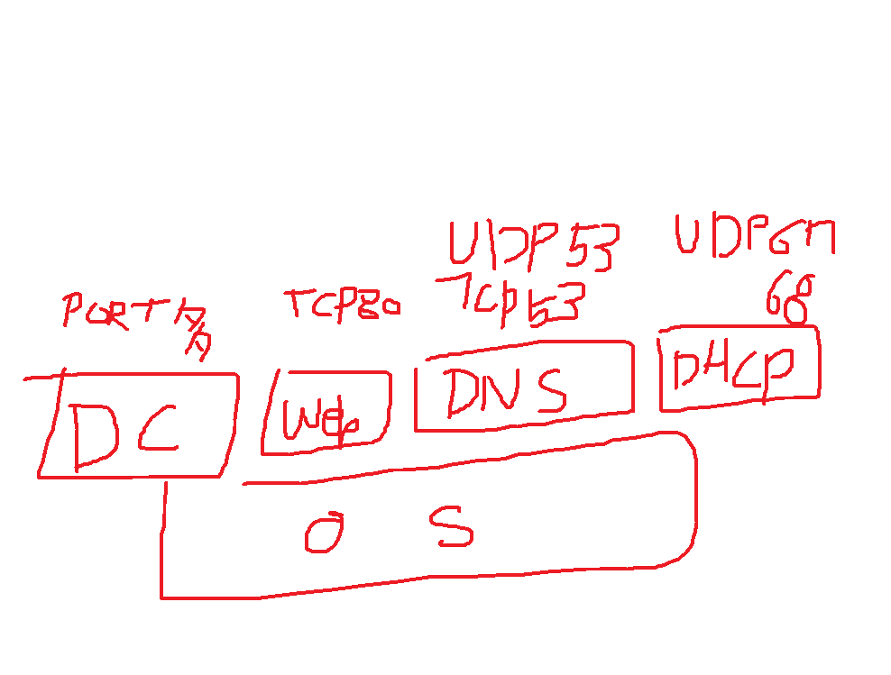
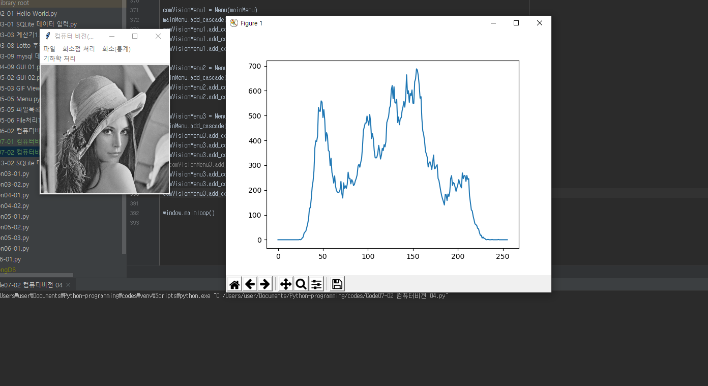

실제 프로젝트를 하면, 기능을 완성하는데 시간이 총 시간의 20% 정도밖에 들지 않습니다.

5배 정도 기간을 디버깅하는데 더 잡습니다.

정말 중요한 이슈는 10배 정도 기간을 더 잡습니다.

블랙박스 기법입니다. 엑셀 밟으면 앞으로 나가는게 아니야,

엑셀 밟으면 연료를 분사시켜서 복잡한 과정을 거치는데, 여러분이 그걸 항상 신경쓰고 운전 못한단말이야

하지만 카레이서라면, 한 번쯤은 그런 것을 고려해야합니다.

여러분이 잘 하잖아요. 눈빛만 보고 알아주지 않아요.

자꾸 표현을 해야하고, 요즘 블로그도 괜찮고

블로그보다는 youtube가 좋아요.


포워드 방식으로 할 지, 백워드 방식으로 할 지

```python
# 포워드 방식
for i in range(inH):
    for k in range(inW):
        outImage[i//scale][k//scale] = inImage[i][k]
        
# 백워드 방식
for i in range(outH):
    for k in range(outW):
        outImage[i][k] = inImage[i*scale][k*scale]
```


## 확대에서 생기는 문제


pdf 08 기하학적 변환 p. 20

선형 보간법으로 보간하면 화질이 덜 깨짐


## 회전에서 생기는 문제

forward 방식에서 하는 것 대신 backward를 쓰면 됨

forward 방식은 input image의 점을 이용해서 for문을 돌면서 픽셀 처리를 하는 것이고

backward 방식은 output image의 점으로부터 어떤 것이 들어올지로부터 for문을 돌면서 처리하는 것

## 도식화와 시각화

Python for data analysis p. 305(도식화와 시각화)

히스토그램을 추가하면 색깔에 대한 분포가 보이는데, 거친 모양이 확대가 잘 못 돼서 그렇습니다.





RGB 컬러 영상의 히스토그램

## 이미지 스트레칭


$$
new pixel = \frac{old pixel - minVal}{maxVal - minVal}
$$


## end-in 탐색

minVal에서 특정 값을 더하고, maxVal에서 특정 값을 빼서 stretch해줌


## 히스토그램 평활화

- 1단계: 히스토그램 카운트
- 2단계: 누적합 생성
- 3단계: 정규화(n = 누적합x(1/총 픽셀 수)x최대 Value)


| 2    | 4    | 4    | 3    |
| ---- | ---- | ---- | ---- |
| 2    | 1    | 3    | 3    |
| 1    | 0    | 1    | 2    |
| 0    | 1    | 1    | 2    |


| 4    | 7    | 7    | 3    |
| ---- | ---- | ---- | ---- |
| 4    | 3    | 3    | 3    |
| 3    | 0    | 3    | 4    |
| 0    | 3    | 3    | 4    |


딥러닝 할 때도 사진을 먼저 보정하고 해줘야 하는데,

그 때 평활화 해서 보정하면 좋음


## 회사 TIP

>  실력이 진짜 어떤지는 관심 없고, 나한테 잘 해주는 사람이 좋은 사람
>
> - 카네기 인간관계론

열심히 일하는 건 맞다고 생각해요. 자신을 위해서 열심히 일하면, 자신에게 도움이 되고,

회사도 회사를 위해서 열심히 일하는지 착각하게 됩니다.


## 화소 Area 처리

pdf ch06. 화소 영역 처리

블러링, 샤프닝, 엠보싱, 엣지 디텍션 등

하나만 이해해서 구현하면 나머지도 다 같은 방식으로 구현되어 있어서 쉽다 !

핵심용어는 마스크!

> 엠보싱 마스크

| -1   | 0    | 0    |
| ---- | ---- | ---- |
| 0    | 0    | 0    |
| 0    | 0    | 1    |


영상처리 마스크는 수식으로 계산해서 마스크로 발표한거에요

### 경계값 처리

0 삽입 방법 - 경계에 0으로 넣을 수 있음

단점은 0으로 주변을 채워서 까맣게 나올 가능성이 높음

좋은 방법은 주변에 비슷한 값을 넣는 것인데, 코드가 더러워짐


더 큰 마스크도 가끔 있음

3x3, 5x5, 7x7 등 홀수로 감

90% 이상의 마스크가 3x3마스크임

## new title

마스크가 전체 합계가 0인 마스크가 있고, 전체 합계가 1인 마스크가 있음

마스크가 전체 합계가 0인 마스크는 어두워지고, 전체 합계가 1은 밝아짐

```python
S = 0.0 # 0.0으로 처리한 것은 이런 이유임
```


