# Static 파일 전송, Media 파일 업로드

목차

- 종합 프로젝트 설계 풀이(9일차)
- Static File 전송
- Media File 업로드


## 종합 프로젝트 설계 풀이(영화 평점 사이트)


## Static File 전송

새로 프로젝트를 만들어줍니다.

static file들에 관련된 프로젝트니까 statics(?)라고 지어줍니다.


프로젝트 준비하기

```bash
$ python -m venv venv
$ activate
(venv) $ pip install django
(venv) $ django-admin startproject django_static .
(venv) $ python manage.py startapp articles
```


settings.py 설정

```python
# settings.py

...

INSTALLED_APPS = [
    'articles', # 방금 만든 앱을 장고에 추가해 줍니다.
    
    ...

LANGUAGE_CODE = 'ko-kr' # 랭귀지 코드를 한글로 변경해 줍니다.
    
TIME_ZONE = 'Asia/Seoul' # 타임 존을 서울로 변경해 줍니다.
```


urls.py 설정(프로젝트의 urls.py 파일)

```python
# urls.py

"""django_static URL Configuration

The `urlpatterns` list routes URLs to views. For more information please see:
    https://docs.djangoproject.com/en/2.2/topics/http/urls/
Examples:
Function views
    1. Add an import:  from my_app import views
    2. Add a URL to urlpatterns:  path('', views.home, name='home')
Class-based views
    1. Add an import:  from other_app.views import Home
    2. Add a URL to urlpatterns:  path('', Home.as_view(), name='home')
Including another URLconf
    1. Import the include() function: from django.urls import include, path
    2. Add a URL to urlpatterns:  path('blog/', include('blog.urls'))
"""
from django.contrib import admin
from django.urls import path, include

urlpatterns = [
    path('admin/', admin.site.urls),
    path('articles/', include('articles.urls')),
]

```


앱의 urls.py 파일을 articles 폴더 하위에 만들고 다음과 같이 설정해줍니다.

```python
# articles/urls.py

from django.urls import path
from . import views

app_name = 'articles' # 추후에  태그를 쓰기 위해서 설정해 줍니다.

urlpatterns = [
    path('', views.index, name='index'),
    # name을 지정하는 것은 url에서 앱들이 여러개 있는 경우 경로가 겹칠 수 있기 때문입니다.
]
```


views.py

```python
# articles/views.py

from django.shortcuts import render

# Create your views here.
def index(request):
    return render(request, 'articles/index.html')
```


템플릿 만들기

공통된 부분을 먼저 만들어 주기 위해서 base.html파일을 만든 다음

base.html을 상속해서 여러 템플릿들을 만들겠습니다.


```bash
(venv) $ pwd # 현재 경로 확인
/c/Users/db_cl/Desktop/statics
(venv) $ mkdir templates
(venv) $ cd templates
(venv) $ touch base.html
```


base.html

```html
<!-- templates/base.html -->

<!DOCTYPE html>
<html lang="ko"> <!-- en -> ko -->
<head>
    <meta charset="UTF-8">
    <meta name="viewport" content="width=device-width, initial-scale=1.0">
    <meta http-equiv="X-UA-Compatible" content="ie=edge">
    <title>Django Static</title>
</head>
<body>
     <!-- 이 부분에 다른 코드들이 들어옵니다. -->
    
</body>
</html>
```


articles 앱의 index.html

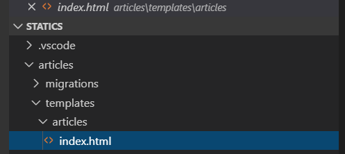

위와 같이 파일을 만들어주고 index.html 파일에 다음과 같이 입력합니다.


저는 반복된 입력을 피하기 위해서 snippet을 사용하겠습니다 :ㅇ


위와 같이 클릭하고, new global snippet files -> django 입력

django.code-snippets 파일이 아래와 같이 나타납니다.

```json
{
	// Place your global snippets here. Each snippet is defined under a snippet name and has a scope, prefix, body and 
	// description. Add comma separated ids of the languages where the snippet is applicable in the scope field. If scope 
	// is left empty or omitted, the snippet gets applied to all languages. The prefix is what is 
	// used to trigger the snippet and the body will be expanded and inserted. Possible variables are: 
	// $1, $2 for tab stops, $0 for the final cursor position, and ${1:label}, ${2:another} for placeholders. 
	// Placeholders with the same ids are connected.
	// Example:
	// "Print to console": {
	// 	"scope": "javascript,typescript",
	// 	"prefix": "log",
	// 	"body": [
	// 		"console.log('$1');",
	// 		"$2"
	// 	],
	// 	"description": "Log output to console"
	// }
}
```


아래와 같이 고쳐주겠습니다.

```json
{
	// Place your global snippets here. Each snippet is defined under a snippet name and has a scope, prefix, body and 
	// description. Add comma separated ids of the languages where the snippet is applicable in the scope field. If scope 
	// is left empty or omitted, the snippet gets applied to all languages. The prefix is what is 
	// used to trigger the snippet and the body will be expanded and inserted. Possible variables are: 
	// $1, $2 for tab stops, $0 for the final cursor position, and ${1:label}, ${2:another} for placeholders. 
	// Placeholders with the same ids are connected.
	// Example:
	"DTL code block": {
		"scope": "html",
		"prefix": "django-code-block",
		"body": [
			"",
			"",
			"$2",
			""
		],
		"description": "django code block snippet"
	}
}
```


이제 html파일들에서 dja 정도만 입력하고 탭을 하면 자동 완성이 됩니다.

```html
<!-- articles/templates/articles/index.html -->



<h2>Articles</h2>

```


이제 base.html 위치를 articles 앱에서도 인식하게 하기 위해서 settings.py를 다시 수정해야 합니다.

```python
# settings.py

...

TEMPLATES = [
    {
        'BACKEND': 'django.template.backends.django.DjangoTemplates',
        'DIRS': [os.path.join(BASE_DIR, 'django_static', 'templates')],
...
```


이제 서버를 실행해 봅시다!!!

```bash
(venv) $ python manage.py runserver
```


## 정적 파일 전송

방금 기본적인 연결은 했으니 정적 파일(css, html, js, image 등)을 사용자에게 전송하는 방법을 알아보겠습니다.


사진을 하나 다운 받아서 `articles/static/articles/flower.jpg`와 같은 경로로 저장합니다. static 폴더를 만들어서 그 하위에 articles를 또 한번 더 두는 이유는

templates폴더 하위에 articles를 한 번 더 두는 이유와 같습니다.


```html
<!-- articles/templates/articles/index.html -->




<h2>Articles</h2>


```

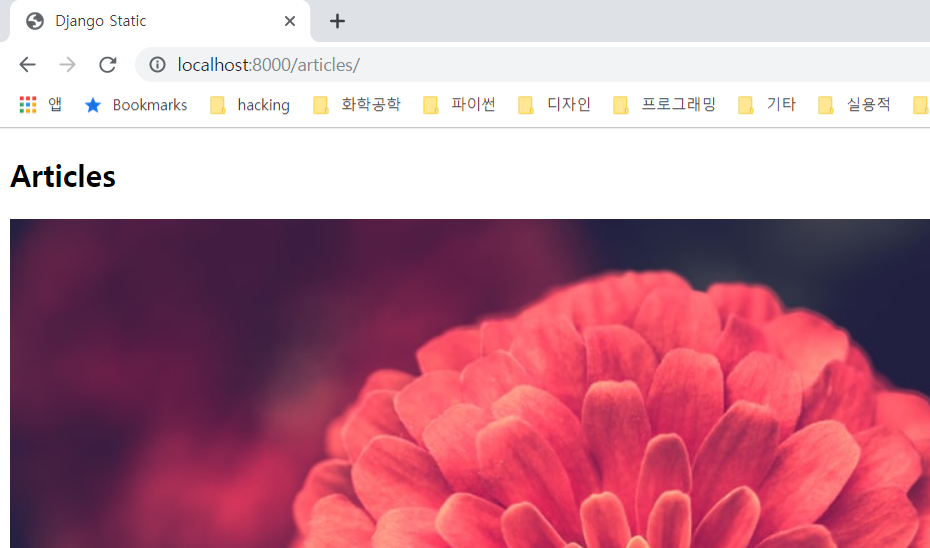


다음은 임의의 위치에 static file을 저장하는 방법입니다.

아래와 같이 설정하고 my_images 폴더를 만들어 줍니다.

```python
# settings.py

...

STATIC_URL = '/static/'
STATICFILES_DIRS = [
    os.path.join(BASE_DIR, 'my_images'),
]
```

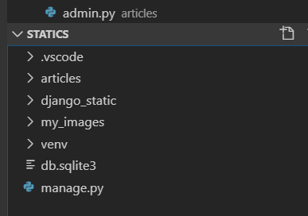


위와 같이하면 여러 장고 앱이 같이 공유할 수 있는 static folder를 만들 수 있습니다.


```html
<!-- articles/templates/articles/index.html -->




<h2>Articles</h2>



```


그림 두 개가 성공적으로 나옵니다.

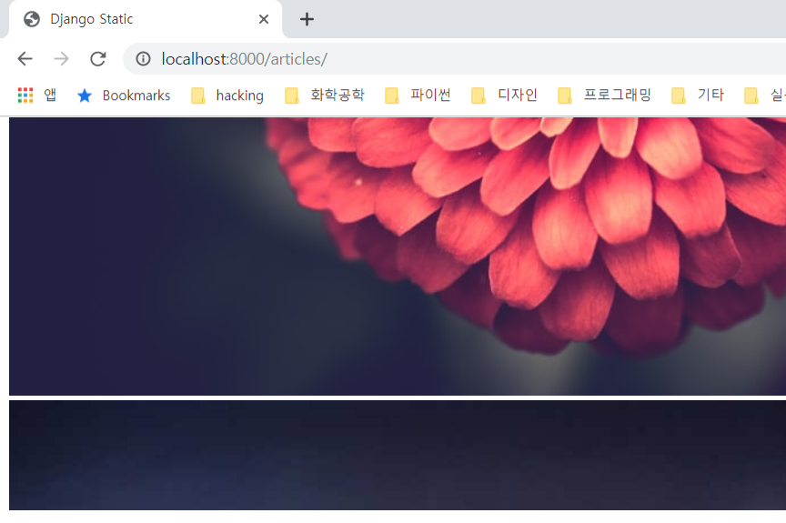


## 미디어 파일 업로드

장고에서는 서버에서 보내는 정적 파일은 `static file`이라고 하고,

사용자가 업로드하는 그림 등은 `media file`이라고 합니다.

미디어 파일 실습을 위해서 CRUD 모델을 만들어봅시다.


```python
# articles/models.py

from django.db import models

# Create your models here.
class Article(models.Model):
    title = models.CharField(max_length=50)
    content = models.CharField(max_length=50)
    image = models.ImageField() # 이미지 필드
    created_at = models.DateTimeField(auto_now_add=True)
    updated_at = models.DateTimeField(auto_now=True)

    def __str__(self):
        return self.title
```


이렇게 모델을 만들고 server를 실행시켜보면 아래와 같은 오류가 나옵니다.

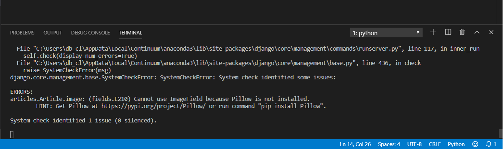

Pillow!!!를 설치!!! 해줘야 합니다.


```bash
(venv) $ pip install Pillow
```


일단 모델을 만든 것을 sql에 적용합시다

```bash
(venv) $ python manage.py makemigrations
(venv) $ python manage.py migrate
```


admin 설정

```bash
(venv) $ python manage.py createsuperuser
# 위의 명령어를 통해서 superuser를 만듭니다.
# email은 적어주지 않아도 됩니다.
```

```python
# articles/admin.py

from django.contrib import admin
from .models import Article

# Register your models here.
class ArticleAdmin(admin.ModelAdmin): # admin.ModelAdmin이 잘 안외워집니다...ㅠㅠ
    list_display = ('pk', 'title', 'content', 'image', 'created_at', 'updated_at')

admin.site.register(Article, ArticleAdmin)
```


이제 `python manage.py runserver`를 하고 `http://localhost:8000/admin/`로 들어가 보면, 다음과 같은 화면이 나옵니다.

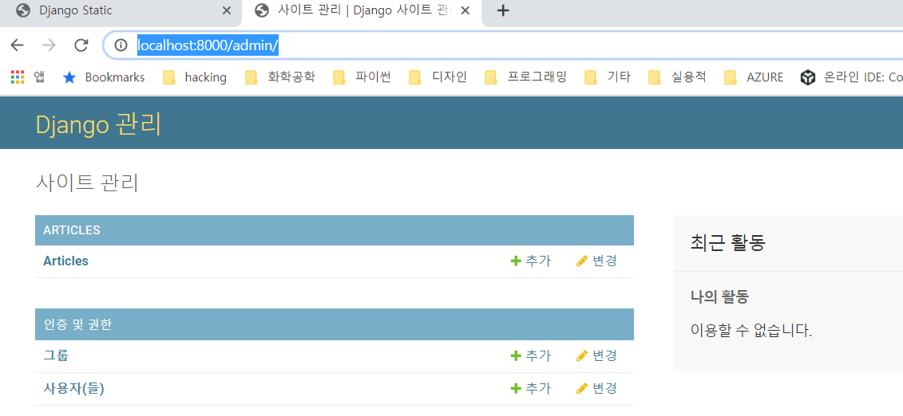


게시물 생성 페이지 만들기


url을 먼저 설정해 줍시다.

```python
# articles/urls.py

from django.urls import path
from . import views
app_name = 'articles'

urlpatterns = [
    path('', views.index, name='index'),
    path('create/', views.create, name='create'),
]
```


view는 다음과 같이 만들어 줍니다.

new라는 url을 만들어서 get 요청을 받고

create라는 url을 만들어서 new라는 url로부터 post 요청을 받을 수도 있지만


그냥 한 번에 create라는 view로 통합을 해줍시다.


```python
# articles/views.py

from django.shortcuts import render, redirect # redirect import 잊지말기!!
from .models import Article

# Create your views here.
def index(request):
    return render(request, 'articles/index.html')


def create(request):
    if request.method == 'POST':
        # 메소드가 POST인 경우에는 db에 레코드 추가
        title = request.POST.get('title')
        content = request.POST.get('content')
        image = request.FILES.get('image') # 파일의 경우에는 이렇게 받습니다.
        article = Article(title=title, content=content, image=image)
        article.save()
        return redirect('articles:index')
    else:
        # 이외에는 폼 보여주기
        return render(request, 'articles/create.html')
```


```html
<!-- articles/templates/articles/create.html -->




<form action="" method="POST">
     <!-- method가 POST인 경우에는 반드시 csrf_token -->
    <input type="text" name="title"><br>
    <input type="text" name="content"><br>
    <input type="file" name="image"><br>
    <input type="submit">
</form>

```


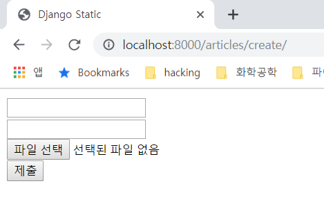

실행해보고, admin을 살펴보면 다른 것들은 잘 들어오는데 image가 들어오지 않았습니다.

`create.html` form에서 encoding type을 multipart/form-data로 지정하지 않았기 때문입니다.


다시 다음과 같이 수정하고 글을 생성해봅시다.

```html
<!-- articles/templates/articles/create.html -->




<form action="" method="POST" enctype="multipart/form-data">
    
    <input type="text" name="title"><br>
    <input type="text" name="content"><br>
    <input type="file" name="image"><br>
    <input type="submit">
</form>

```

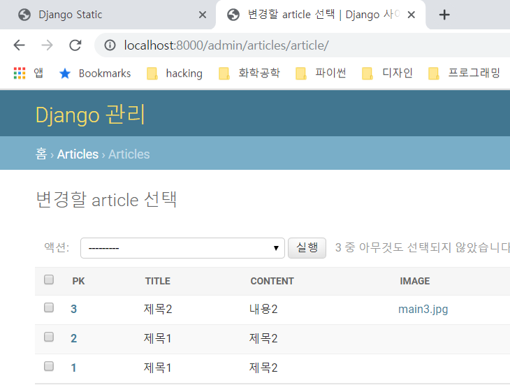

이번에는 제대로 Image가 넘어옵니다 !!!


하지만 미디어 파일(main3.jgp)이 어디에 업로드가 되었나 확인해 보니 원치 않는 곳에 저장이 되었습니다.

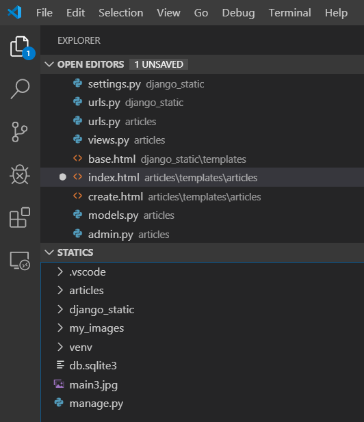

단순히 루트폴더에 저장되었기 때문에 다른 폴더로 저장되도록 해줍시다.


```python
# settings.py

...

STATIC_URL = '/static/'
STATICFILES_DIRS = [
    os.path.join(BASE_DIR, 'my_images'),
]

# STATIC_URL과 비슷
# 업로드된 주소를 만들어 준다
MEDIA_URL = '/media/'

# 파일의 업로드가 끝나면 파일을 저장하는 경로
MEDIA_ROOT = os.path.join(BASE_DIR, 'media')
```


이제 실행해보니 지정된 서버의 로컬 경로에 잘 저장이 됩니다.

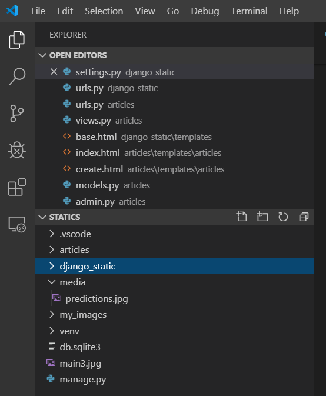


이제 Image를 출력하는 CRUD 모델을 만들어 보겠습니다.

```python
# articles/views.py

...

# Create your views here.
def index(request):
    articles = Article.objects.all()
    context = {
        'articles': articles
    }
    return render(request, 'articles/index.html', context)

...
```

```html
<!-- articles/templates/articles/index.html -->




<h2>Articles</h2>


<p>
    title: {{article.title}}<br>
    content: {{article.content}}<br>
    image: <br>
</p>
<hr>




```


하지만 오류가 뜹니다.

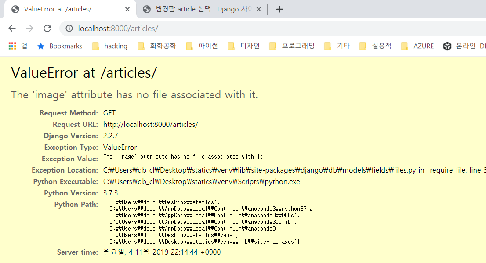

왜냐하면 index.html 파일에서 image를 띄울 때 `article.image.url`으로 접근하는데, image를 처음에 받지 않은 경우에는 아예 url 값이 존재하지 않기 때문입니다.


이제 그 문제는 해결되었지만 여전히 이미지는 보이지 않습니다. 왜냐하면 서버에 저장된 image를 웹의 주소와 연결해 놓지 않았기 때문입니다!!


프로젝트의 urls 파일을 다음과 같이 수정해줍니다.

```python
# urls.py

"""django_statics URL Configuration

The `urlpatterns` list routes URLs to views. For more information please see:
    https://docs.djangoproject.com/en/2.2/topics/http/urls/
Examples:
Function views
    1. Add an import:  from my_app import views
    2. Add a URL to urlpatterns:  path('', views.home, name='home')
Class-based views
    1. Add an import:  from other_app.views import Home
    2. Add a URL to urlpatterns:  path('', Home.as_view(), name='home')
Including another URLconf
    1. Import the include() function: from django.urls import include, path
    2. Add a URL to urlpatterns:  path('blog/', include('blog.urls'))
"""
from django.contrib import admin
from django.urls import path, include

from django.conf.urls.static import static # static file의 전송을 위해 import
from django.conf import settings # MEDIA_ROOT값을 가져옴


urlpatterns = [
    path('admin/', admin.site.urls),
    path('articles/', include('articles.urls')),
] + static(settings.MEDIA_URL, document_root=settings.MEDIA_ROOT)
# MEDIA파일의 URL과 파일이 실제로 위치한 경로를 매칭시켜줌
```


이제 드디어 제대로 출력이 됩니다.

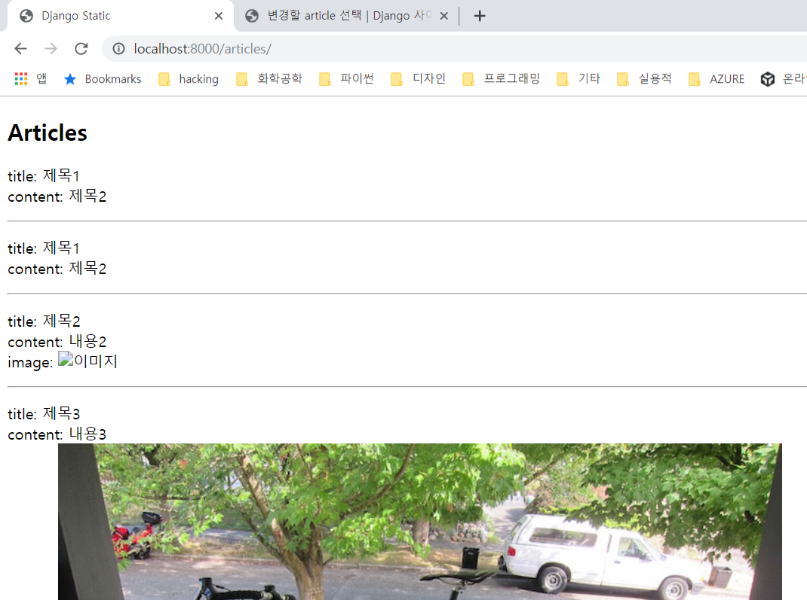


### detail page만들기

```python
# articles/urls.py

from django.urls import path
from . import views

app_name = 'articles'

urlpatterns = [
    path('', views.index, name='index'),
    path('create/', views.create, name='create'),
    path('<int:article_pk>/', views.detail, name='detail'),
]
```


```python
# articles/views.py

...

def detail(request, article_pk):
    article = Article.objects.get(pk=article_pk)
    context = {
        'article': article
    }
    return render(request, 'articles/detail.html', context)

...
```


```html
<!-- articles/templates/articles/detail.html -->



<p>
    title: {{ article.title }}<br>
    content: {{ article.content }}<br>
    
    
    
</p>

<a href="">[BACK]</a>

```


detail 페이지와 index페이지를 연결해 주기 위해서 index.html파일에 링크도 추가해 줍시다.

```html
<!-- articles/templates/articles/index.html -->




<h2>Articles</h2>


<p>
    title: <a href="">{{article.title}}</a><br>
    content: {{article.content}}<br>
    
    image: <br>
    
</p>
<hr>




```


detail 페이지에 내용들이 잘 표시가 됩니다.


### update 페이지 만들기


urls.py에 update 경로를 추가해 줍니다.

create와 마찬가지로, change, update 경로를 나누어서

change 경로에서 폼 입력을 받고, 전송 버튼을 누르면

update에서 POST 입력을 받아서 처리를 하는 식으로 작성할 수 있지만,

한 번에 update에 넣어줍시다.

```python
# articles/urls.py

from django.urls import path
from . import views

app_name = 'articles'

urlpatterns = [
    path('', views.index, name='index'),
    path('create/', views.create, name='create'),
    path('<int:article_pk>/', views.detail, name='detail'),
    path('<int:article_pk>/update/', views.update, name='update'),
]
```


```python
# articles/views.py

...

def update(request, article_pk):
    article = Article.objects.get(pk=article_pk)
    if request.method == 'POST':
        title = request.POST.get('title')
        content = request.POST.get('content')
        image = request.FILES.get('image')

        article.title = title or article.title
        article.content = content or article.content
        article.image = image or article.image

        article.save()
        return redirect('articles:detail', article_pk)
    else:
        context = {
            'article': article
        }
        return render(request, 'articles/update.html', context)
```


```html
<!-- articles/templates/articles/update.html -->



<form action="" method="POST" enctype="multipart/form-data">
    
    <input type="text" name="title" value="{{article.title}}">
    <input type="text" name="content" value="{{article.content}}">
    <input type="file" name="image">
    <input type="submit">
</form>

```


detail.html에 update.html로 이동할 수 있는 링크를 추가합니다.

```html
<!-- articles/templates/articles/detail.html -->



<p>
    title: {{ article.title }}<br>
    content: {{ article.content }}<br>
    
    
    
</p>

<a href="">[UPDATE]</a>
<a href="">[BACK]</a>

```


update 동작 역시 잘 됩니다.


### delete 동작 구현

이제 마지막으로 delete 동작 구현입니다.


```python
# articles/urls.py

from django.urls import path
from . import views

app_name = 'articles'

urlpatterns = [
    path('', views.index, name='index'),
    path('create/', views.create, name='create'),
    path('<int:article_pk>/', views.detail, name='detail'),
    path('<int:article_pk>/update/', views.update, name='update'),
    path('<int:article_pk/delete/', views.delete, name='delete'),
]
```


```python
# articles/views.py

...

def delete(request, article_pk):
    article = Article.objects.get(pk=article_pk)
    article.image.delete() # 서버에 저장된 이미지 삭제
    article.delete() # 현재 article 삭제
    return redirect('articles:index')
```


```html
<!-- articles/templates/articles/detail.html -->



<p>
    title: {{ article.title }}<br>
    content: {{ article.content }}<br>
    
    
    
</p>

<a href="">[UPDATE]</a>
<!-- GET보다는 POST로 받아서 삭제하는 주소를 보이지 않게 해줍시다. -->
<form action="" method="POST">
    
    <input type="submit" value="삭제">
</form>
<a href="">[BACK]</a>

```


이상으로 STATIC_FILE에 관련된 CRUD 정리를 마칩니다.

