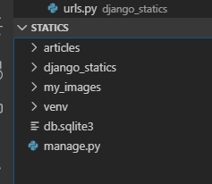

# 정적 파일

이번 수업에서는 사용자가 올리는 파일을 미디어 파일, 장고가 제공하는 정적 파일을 스태틱 파일 이라고 부를거에요


```bash
$ python -m venv venv
$ activate
$ 
$ django-admin startproject django_statics .
$ python manage.py startapp articles
```


base template 설정

```html
<!-- templates/base.html -->

<!DOCTYPE html>
<html lang="ko">
<head>
    <meta charset="UTF-8">
    <meta name="viewport" content="width=device-width, initial-scale=1.0">
    <meta http-equiv="X-UA-Compatible" content="ie=edge">
    <title>Django Statics!</title>
</head>
<body>
    
    
</body>
</html>
```

```python
# urls.py

"""django_statics URL Configuration

The `urlpatterns` list routes URLs to views. For more information please see:
    https://docs.djangoproject.com/en/2.2/topics/http/urls/
Examples:
Function views
    1. Add an import:  from my_app import views
    2. Add a URL to urlpatterns:  path('', views.home, name='home')
Class-based views
    1. Add an import:  from other_app.views import Home
    2. Add a URL to urlpatterns:  path('', Home.as_view(), name='home')
Including another URLconf
    1. Import the include() function: from django.urls import include, path
    2. Add a URL to urlpatterns:  path('blog/', include('blog.urls'))
"""
from django.contrib import admin
from django.urls import path, include

urlpatterns = [
    path('admin/', admin.site.urls),
    path('articles/', include('articles.urls')),
]

```

```python
# articles/urls.py

from django.urls import path
from . import views

app_name = "articles"

urlpatterns = [
    path('', views.index, name="index")
]
```


articles 밑에 static 폴더를 만들어 줍니다.

static폴더 밑에 바로 `pika.jpg`를 넣으면 인식이 됩니다.

하지만, 다른 앱들과 겹칠 수 있기 때문에 분리해 줍니다.


```python
# settings.py

...

STATIC_URL = '/static/'
STATICFILES_DIRS = [
    os.path.join(BASE_DIR, 'my_images'),
]

```


my_images를 다음과 같은 루트 경로에다 만들어 줍니다.

