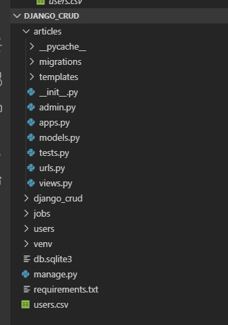
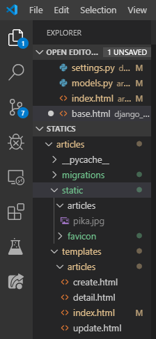
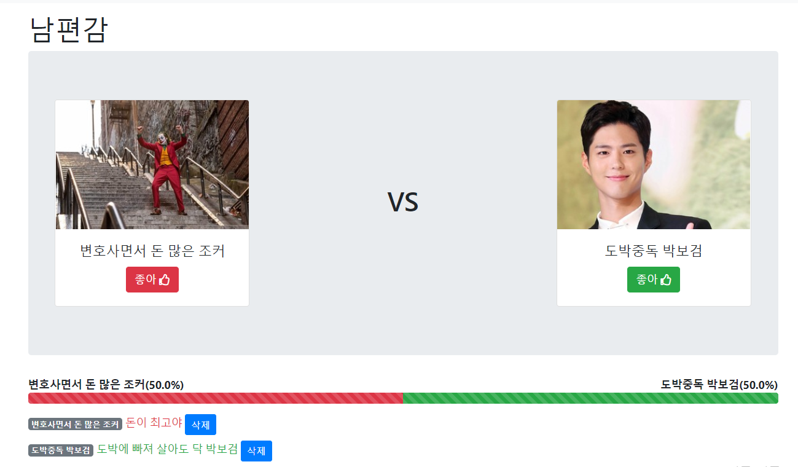

## 장고 ORM 연습

예전에 만들었던 django_crud프로젝트에서 계속 진행해 줍니다.


```bash
# cd django_crud
$ activate
(venv) $ python manage.py startapp users

```


모델을 다음과 같이 설정해 줍니다.

```python
# users/models.py

from django.db import models

# Create your models here.
class User(models.Model):
    first_name = models.CharField(max_length=10)
    last_name = models.CharField(max_length=10)
    age = models.IntegerField()
    country = models.CharField(max_length=10)
    phone = models.CharField(max_length=15)
    balance = models.IntegerField()
```


```bash
(venv) $ python manage.py makemigrations
(venv) $ python manage.py migrate
```


프로젝트 폴더에 사람들 연락처가 적힌 csv파일을 놔둡니다.



### csv direct import in sqlite3

```bash
(venv) $ sqlite3 db.sqlite3
```

```sqlite
sqlite> .tables
articles_article            auth_user_user_permissions
articles_comment            django_admin_log
auth_group                  django_content_type
auth_group_permissions      django_migrations
auth_permission             django_session
auth_user                   jobs_job
auth_user_groups            users_user
-- 아까 ORM으로 만들었기 때문에 users_user 테이블이 있습니다.

sqlite> .mode csv -- CSV 모드로 바꿉니다.
sqlite> .import users.csv users_user -- users.csv 파일을 users_user 테이블로 import
users.csv:1: INSERT failed: datatype mismatch
sqlite> select count(*) from users_user;
100
```


### ORM 문제 풀기

```bash
$ python manage.py shell_plus
```


### tip

```python
>>> User.objects.raw('SELECT * FROM users_user') # 가능
```


[ORM 연습](ORM구문.md)


## 장고 이미지 처리(리사이징)


`django_statics`에서 이어서 합니다.

```bash
(venv) $ pip install pillow
(venv) $ pip install pilkit
(venv) $ pip install django-imagekit
```


imagekit을 장고에 적용하기 위해서 settings.py를 수정합니다.

```python
# settings.py

...

INSTALLED_APPS = [
    'articles',
    'django.contrib.admin',
    'django.contrib.auth',
    'django.contrib.contenttypes',
    'django.contrib.sessions',
    'django.contrib.messages',
    'django.contrib.staticfiles',
    'imagekit',
]

...
```


```python
# articles/models.py

from django.db import models
from imagekit.models import ProcessedImageField
from imagekit.processors import Thumbnail

def articles_image_path(instance, filename):
    # return f'articles/{instance.pk}번글/images/{filename}' # 좋은 practice가 아닙니다.
    # 왜냐하면 새 글을 작성하는 경우에 pk가 없을 수도 있기 때문에.
    return 'articles/%Y/%m/%d'


# Create your models here.
class Article(models.Model):
    title = models.CharField(max_length=50)
    content = models.CharField(max_length=100)
    created_at = models.DateTimeField(auto_now_add=True)
    updated_at = models.DateTimeField(auto_now=True)
    # image = models.ImageField(blank=True) # 이미지를 저장하는 것이 아니라, 이미지가 있는 경로를 저장하게 됨
    # ImageField는 pillow 라이브러리를 설치해야 합니다.

    # image = models.ImageField(blank=True, upload_to='articles/%Y/%m/%d')
    image = ProcessedImageField(
        processors=[Thumbnail(200, 300)],
        format='JPEG', # 저장 포맷
        options={'quality': 90}, # 추가 옵션
        upload_to='articles/images' # 저장 위치 (MEDIA_ROOT/articles/images)
        # upload_to='articles/%Y/%m/%d' # 저장 위치
    )
    
    def __str__(self):
        return self.title
```


### favicon 바꾸기

 https://www.favicon-generator.org/

위의 사이트에서 우선 favicon을 만들어 줍니다.

전체 압축파일을 다운로드 받아서 `articles/static/favicon`이라는 경로를 만들어서 그 안에 모든 그림파일들을 넣어줍니다.



```html
<!-- templates/base.html -->


<!DOCTYPE html>
<html lang="ko">
<head>
    <meta charset="UTF-8">
    <meta name="viewport" content="width=device-width, initial-scale=1.0">
    <meta http-equiv="X-UA-Compatible" content="ie=edge">
    <link rel="icon" href="" type="image/png">
    <title>Django Static Files</title>
</head>
<body>
    
    
</body>
</html>
```


tip - short-circuit evaluation

> A and B 이면 B가 들어갑니다.


## 실습

either project

either.io 비슷한 사이트 만들기

[명세](README.md)


[결과물]

