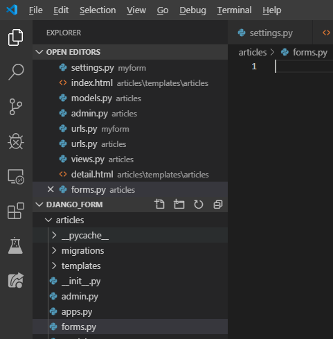
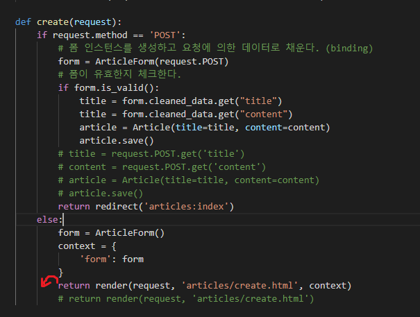
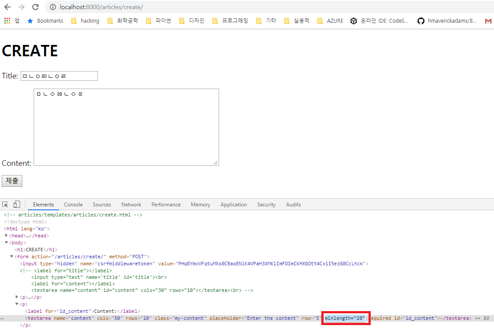
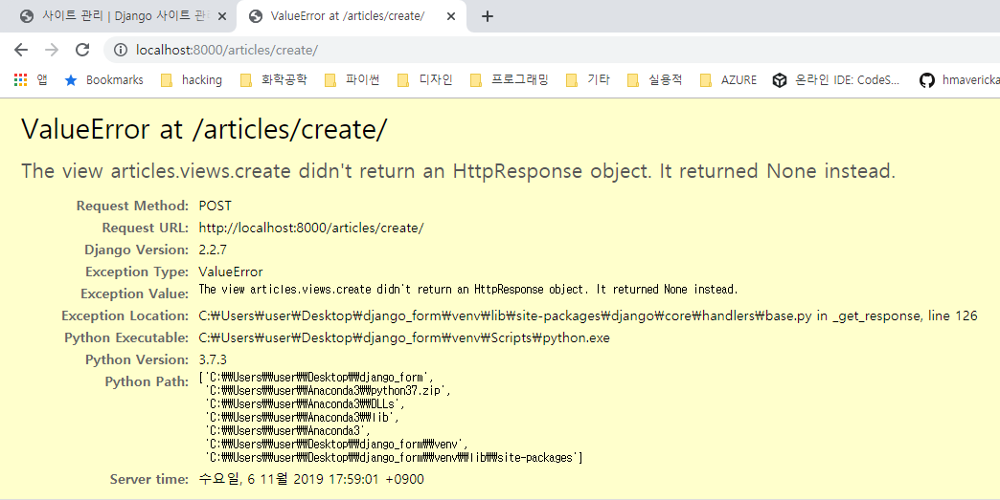
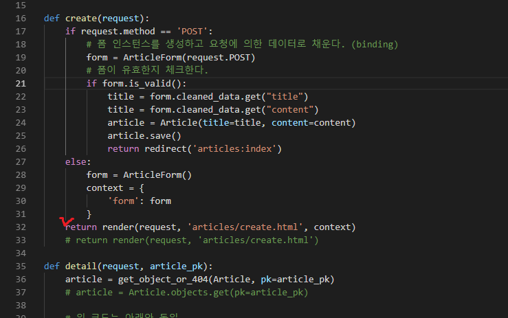
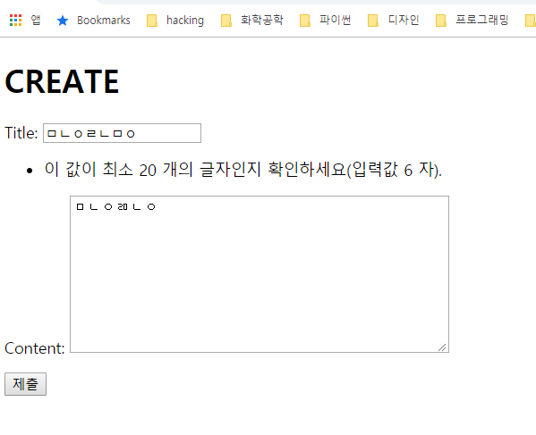

# Eithers 풀이 및 Form 사용


## Eithers 구현 풀이


다음과 같이 구현하면, question에 새로운 columns를 추가함으로써 간편하게 데이터를 처리할 수 있습니다.

```python
# eithers/views.py

# in def index(request):

# annotate를 사용해서 퍼센트를 표현하는 방법

# questions = Question.objects.all()
questions = Question.objects.annotate(
    sum_ab=Count('answer'), 
    count_a=Count('answer', filter=Q(answer.pick=0)),
    count_b=Count('answer', filter=Q(answer_pick=1))
).get(pk=question_pk)

a_per = round(question.count_a / (question.sub_ab or 1) * 100, 2)
b_per = round(question.count_b / (question.sub_ab or 1) * 100, 2)
```

위와 같이 사용하면, questions에 sum_ab, count_a, count_b 속성을 만들어서 날려줄 수 있습니다.

제가 짰던 코드는 다음과 같습니다. 

```python
question = Question.objects.order_by('?')[0]
    answers = question.answers.all()
    if answers.count():
        count_a = answers.filter(pick=1).count()/answers.count()*100
        count_b = 100 - count_a
    else:
        count_a = 0
        count_b = 0
    counts = {'count_a': count_a, 'count_b': count_b}
    context = {
        'question': question,
        'answers': answers,
        'counts': counts
    }
    return render(request, 'eithers/index.html', context)
```


### 성능 개선


모든 부분은 예전에 배웠던 대로 하면 문제가 없습니다.

다만, 성능적인 측면에서 개선할 포인트가 있습니다.

views.py 파일에서 index 메소드에서

`Question.objects.all()`을 사용하고,  `answers`를 추후에 받아오는 방법으로 하면 쿼리를 여러번 날리게 됩니다.

따라서 아래와 같이 고쳐서 쿼리를 여러번 날리지 않도록 수정해주면 좋습니다.

```python
# answers = question.answers.all()
# 위와 같이 하면, DTL에서 for문을 돌 때 1000개의 answer가 있으면 query를 1000개 날리는데
# 아래와 같이 쓰면, query를 한 번에 날릴 수 있습니다.
# 다만 1:N인 경우에 사용할 수 있습니다.
question = Question.objects.prefetch_related('answer_set')

# N:1인 경우에는 다음과 같이 사용합니다.
answer = Answer.objects.selected_related('') #TODO: selected_related('')에 무슨 문자열이 들어갈지
```


## Django Form을 사용하는 예제

django form이라는 폴더를 만들어서 새로운 프로젝트를 시작합니다.


```bash
$ mkdir django_form 
$ cd django_form
$ python -m venv venv
$ activate
(venv) $ pip install django
(venv) $ django-admin startproject myform .
(venv) $ python manage.py startapp articles
```


이후 settings.py를 수정합니다.

```python
# settings.py

...

INSTALLED_APPS = [
    'articles',
    ...
    
TEMPLATES = [
    {
        'BACKEND': 'django.template.backends.django.DjangoTemplates',
        'DIRS': [os.path.join(BASE_DIR, 'myform', 'templates')],
        'APP_DIRS': True,
        ...


LANGUAGE_CODE = 'ko-kr'

TIME_ZONE = 'Asia/Seoul'
...
```


MTV(Model Templates View)에서 model을 제일 먼저 만들어주겠습니다.

```python
# articles/models.py

from django.db import models

# Create your models here.
class Article(models.Model):
    title = models.CharField(max_length=100)
    content = models.TextField()
    created_at = models.DateTimeField(auto_now_add=True)
    updated_at = models.DateTimeField(auto_now=True)

    class Meta: # 순서를 역순으로 불러올 수 있게끔 설정
        ordering = ('-pk', )

    def __str__(self):
        return self.title
```


아래의 명령어를 줘서, 실제 db에 반영합시다

```bash
(venv) $ python manage.py makemigrates
(venv) $ python manage.py migrate
```


그리고 admin계정을 만들고, admin view에 적용합니다

```bash
(venv) $ python manage.py createsuperuser
```


```python
# articles/admin.py

from django.contrib import admin
from .models import Article

# Register your models here.
class ArticleAdmin(admin.ModelAdmin):
    list_display = ('pk', 'title', 'content', 'created_at', 'updated_at')

admin.site.register(Article, ArticleAdmin)
```


아래의 소스코드들에 대해서는 여러번 반복했기 때문에 설명은 생략하도록 하겠습니다.


url 만들기

```python
# myform/urls.py

"""myform URL Configuration

The `urlpatterns` list routes URLs to views. For more information please see:
    https://docs.djangoproject.com/en/2.2/topics/http/urls/
Examples:
Function views
    1. Add an import:  from my_app import views
    2. Add a URL to urlpatterns:  path('', views.home, name='home')
Class-based views
    1. Add an import:  from other_app.views import Home
    2. Add a URL to urlpatterns:  path('', Home.as_view(), name='home')
Including another URLconf
    1. Import the include() function: from django.urls import include, path
    2. Add a URL to urlpatterns:  path('blog/', include('blog.urls'))
"""
from django.contrib import admin
from django.urls import path, include

urlpatterns = [
    path('admin/', admin.site.urls),
    path('articles/', include('articles.urls')),
]

```

```python
# articles/urls.py

from django.urls import path
from . import views

app_name = "articles"

urlpatterns = [
    path('', views.index, name='index'),
]
```


view 만들기

```python
# articles/views.py
from django.shortcuts import render
from .models import Article


# Create your views here.
def index(request):
    articles = Article.objects.all()
    context = {
        'articles': articles
    }
    return render(request, 'articles/index.html', context)
```


```html
<!-- articles/templates/articles/index.html -->



<h2>Articles</h2>

<p>{{ article.pk }}</p>
<p>{{ article.title }}</p>
<hr>


```


이후 crud를 만들어줍니다.

마찬가지로 설명은 생략하겠습니다.

```python
# articles/urls.py

from django.urls import path
from . import views

app_name = "articles"

urlpatterns = [
    path('', views.index, name='index'),
    path('create/', views.create, name='create'),
    path('<int:article_pk>/', views.detail, name='detail'),
    path('<int:article_pk>/delete/', views.delete, name='delete'),
]
```

```python
# articles/views.py

from django.shortcuts import render, redirect
from .models import Article
from .forms import ArticleForm

# Create your views here.
def index(request):
    articles = Article.objects.all()
    context = {
        'articles': articles
    }
    return render(request, 'articles/index.html', context)

def create(request):
    if request.method == 'POST':
        title = request.POST.get('title')
        content = request.POST.get('content')
        article = Article(title=title, content=content)
        article.save()
        return redirect('articles:index')
    else:
        return render(request, 'articles/create.html')

def detail(request, article_pk):
    article = Article.objects.get(pk=article_pk)
    context = {
        'article': article
    }
    return render(request, 'articles/detail.html', context)
```

```html
<!-- articles/templates/articles/detail.html -->



<h1>DETAIL</h1>
<hr>
<p>글 번호: {{article.pk}}</p>
<p>글 제목: {{article.title}}</p>
<p>글 내용: {{article.content}}</p>
<p>글 생성 시각: {{article.created_at|date:'SHORT_DATE_FORMAT'}}</p>
<!-- date: 'M, j, Y'는 11월, 6, 2019로 표시되고, j는 날짜에서 06이 아니라 6으로 표시합니다. 06으로 표시하려면 j대신 d -->
<p>글 수정 시각: {{article.updated_at|date:'M, j, Y'}}</p>
<a href="">[BACK]</a><br>


```

```html
<!-- articles/templates/articles/create.html -->



<h1>CREATE</h1>
<form action="" method="POST">
    
    <label for="title"></label>
    <input type="text" name='title' id='title'><br>
    <label for="content"></label>
    <textarea name="content" id="content" cols="30" rows="10"></textarea><br>
    <input type="submit" value='제출'>
</form>

```


## django Form으로 변형하기

django form을 사용하는 이유는 크게 두가지가 있습니다.

- 첫 번째로는 유효성 검사를 하기가 쉬워집니다.
- 두 번째로는 템플릿을 재사용할 수 있습니다.


forms.py를 articles의 밑에다 만들어줍니다. `articles/forms.py`




### create 메소드 수정


수정 전

```python
# articles/views.py

from django.shortcuts import render, redirect
from .models import Article
from .forms import ArticleForm

# Create your views here.
def index(request):
    articles = Article.objects.all()
    context = {
        'articles': articles
    }
    return render(request, 'articles/index.html', context)

def create(request):
    if request.method == 'POST':
        title = request.POST.get('title')
        content = request.POST.get('content')
        article = Article(title=title, content=content)
        article.save()
        return redirect('articles:index')
    else:
        return render(request, 'articles/create.html')

def detail(request, article_pk):
    article = Article.objects.get(pk=article_pk)
    context = {
        'article': article
    }
    return render(request, 'articles/detail.html', context)
```


수정 후

```python
# articles/views.py

...

def create(request):
    if request.method == 'POST':
        # 폼 인스턴스를 생성하고 요청에 의한 데이터로 채운다. (binding)
        form = ArticleForm(request.POST)
        # 폼이 유효한지 체크한다.
        if form.is_valid():
            title = form.cleaned_data.get("title")
            title = form.cleaned_data.get("content")
            article = Article(title=title, content=content)
            article.save()
        # title = request.POST.get('title')
        # content = request.POST.get('content')
        # article = Article(title=title, content=content)
        # article.save()
        return redirect('articles:index')
    else:
        return render(request, 'articles/create.html')
...

```


create.html에 form을 적용하기 위해서 다음과 같이 바꿔줍니다.


html태그들을 간단하게 {{form}}으로 대체할 수 있습니다.


수정 전

```html
<!-- articles/templates/articles/create.html -->



<h1>CREATE</h1>
<form action="" method="POST">
    
    <label for="title"></label>
    <input type="text" name='title' id='title'><br>
    <label for="content"></label>
    <textarea name="content" id="content" cols="30" rows="10"></textarea><br>
    <input type="submit" value='제출'>
</form>

```


수정 후

```html
<!-- articles/templates/articles/create.html -->



<h1>CREATE</h1>
<form action="" method="POST">
    
    <!-- <label for="title"></label>
    <input type="text" name='title' id='title'><br>
    <label for="content"></label>
    <textarea name="content" id="content" cols="30" rows="10"></textarea><br> -->
    {{form}}
    <input type="submit" value='제출'>
</form>

```


### form의 세부적인 컨트롤

좀 더 세부적으로 컨트롤 하려면(CSS를 이쁘게 입히고 싶으면) {{form}} 대신에 다음과 같이 사용할 수 있습니다.

```html
<!-- articles/templates/articles/create.html -->



<h1>CREATE</h1>
<form action="" method="POST">
    
    <!-- <label for="title"></label>
    <input type="text" name='title' id='title'><br>
    <label for="content"></label>
    <textarea name="content" id="content" cols="30" rows="10"></textarea><br> -->
    {{form.title.label_tag}}
    {{form.title}}
    {{form.content.label_tag}}
    {{form.content}}
    <input type="submit" value='제출'>
</form>

```


폼을 p태그로 구분하고 싶으면 `{{form}}` 대신`{{form.as_p}}`로 표시하면 됩니다.

하지만 `articles/views.py`에서 create를 다음과 같이 만들면 문제점이 있습니다.

post로 요청을 받았는데, 유효하지 않은 경우에 return을 해주지 않기 때문에,

서버에 오류가 생깁니다. 따라서 return을 다음과 같이 설정해줍니다.



예를 들어 사용자가 `minlength="20"`를 지우는 시나리오를 가정해 보겠습니다.

(이 부분은 시간이 없으면 안 보셔도 됩니다.)




윗 부분을 지우고 POST 요청을 날리면, 



위와 같은 오류가 납니다.

만약 `return render(request, 'articles/create.html', context)`를 



위와 같이 한다면, 이제 방금과 같은 오류가 뜨지 않고, 한 번 더 유효성 검사를 하도록 됩니다.




### forms를 조금 더 꾸미기

forms를 조금 더 이쁘게 꾸미기 위해서 다음과 같이 수정해 줍니다.

```python
# articles/forms.py

from django import forms

class ArticleForm(forms.Form):
    # CharField에서 max_length / min_length 두 개의 옵션을 줄 수 있습니다.
    # 하지만, models.py와는 다르게 필수는 아닙니다.
    title = forms.CharField(
        max_length=10,
        widget=forms.TextInput(
            attrs={
                'class': 'my-title',
                'placeholder': 'Enter the title!'
                }
            )
        )
    content = forms.CharField(min_length=20, widget=forms.Textarea(
        attrs={
            'class': 'my-content',
            'placeholder': 'Enter the content',
            'row': 5,
            'cols': 50
            }
        )
    ) # widget을 Textarea로 바꾸기
    
```


### detail page의 경로가 없는 경우 404 에러 띄우기

```python
# articles/views.py

from django.shortcuts import render, redirect, get_object_or_404
from .models import Article
from .forms import ArticleForm

...

def detail(request, article_pk):
    article = get_object_or_404(Article, pk=article_pk)
    # article = Article.objects.get(pk=article_pk)

    # 위 코드는 아래와 동일
    # try:
    #     article = Article.objects.get(pk=article_pk)
    # except Article.DoesNotExist:
    #     # from django.http import Http404
    #     raise Http404("No article matches the given query.")
    context = {
        'article': article
    }
    return render(request, 'articles/detail.html', context)
```

잘못된 url로 접근했을 때 이렇게 하면 5xx 에러가 아닌 404 에러가 납니다.

5xx 에러는 원인이 명확하지 않은 경우가 많은데, 404 에러는 페이지가 없다는 것을 정확하게 명시하기 때문에

404 에러로 바꾸는 것이 낫습니다.


### delete 메서드 작성

delete 메서드도 아래와 같이 get_object_or_404 메소드를 쓸 수 있습니다.

```python
# articles/views.py

...

def delete(request, article_pk):
    article = get_object_or_404(Article, pk=article_pk)
    if request.method == 'POST':
        article.delete()
        return redirect('articles:index')
    return redirect('articles:detail', article_pk)
```


