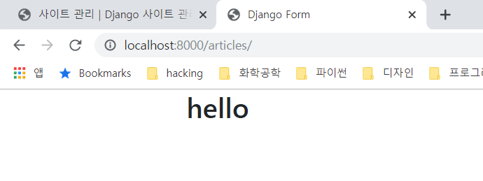
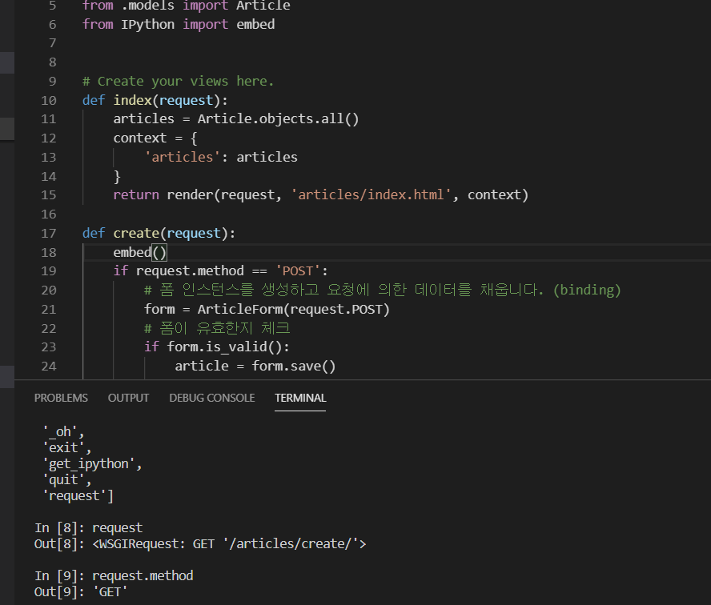
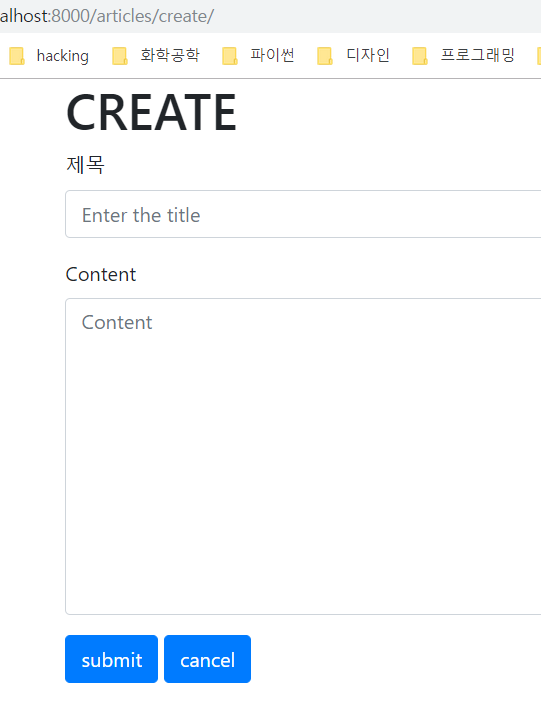

# Django Form with bootstrap


## 기본 설정

프로젝트를 하기위한 기본 세팅을 다시 해줍니다.

여러번 해본 과정이기 때문에, 익숙하신 분들은 이 부분을 넘어가셔도 좋습니다.


기본적인 설정들을 해줍니다.

```bash
$ makedir django_form && cd django_form
$ python -m venv venv
$ activate
(venv) $ pip install django
(venv) $ django-admin startproject myform .
(venv) $ python manage.py startapp articles
```


그리고 이번엔 순서대로가 아니라 한꺼번에 기본 세팅을 해주겠습니다.

```python
# settings.py

INSTALLED_APPS = [
    'articles',
    'django.contrib.admin',
    ...
    
TEMPLATES = [
    {
        'BACKEND': 'django.template.backends.django.DjangoTemplates',
        'DIRS': [os.path.join(BASE_DIR, 'myform', 'templates')],
        ...

LANGUAGE_CODE = 'ko-kr'

TIME_ZONE = 'Asia/Seoul'

...
```


프로젝트의 urls.py 파일 설정

```python
# urls.py

"""myform URL Configuration

The `urlpatterns` list routes URLs to views. For more information please see:
    https://docs.djangoproject.com/en/2.2/topics/http/urls/
Examples:
Function views
    1. Add an import:  from my_app import views
    2. Add a URL to urlpatterns:  path('', views.home, name='home')
Class-based views
    1. Add an import:  from other_app.views import Home
    2. Add a URL to urlpatterns:  path('', Home.as_view(), name='home')
Including another URLconf
    1. Import the include() function: from django.urls import include, path
    2. Add a URL to urlpatterns:  path('blog/', include('blog.urls'))
"""
from django.contrib import admin
from django.urls import path, include

urlpatterns = [
    path('admin/', admin.site.urls),
    path('articles/', include('articles.urls')),
]

```


앱의 urls.py 설정

```python
# articles/urls.py

from django.urls import path
from . import views

app_name = 'articles' # app_name을 깜빡하고 설정 안하기가 쉽습니다. 숙지 !!

urlpatterns = [
    path('', views.index, name='index'),
]
```


앱의 views.py 설정

```python
# articles/views.py

from django.shortcuts import render

# Create your views here.
def index(request):
    return render(request, 'articles/index.html')
```


템플릿들 설정

```html
<!-- myform/templates/base.html -->

<!DOCTYPE html>
<html lang="ko">
<head>
    <meta charset="UTF-8">
    <meta name="viewport" content="width=device-width, initial-scale=1.0">
    <meta http-equiv="X-UA-Compatible" content="ie=edge">
    <title>Django Form</title>
</head>
<body>
    
    
    
</body>
</html>
```

```html
<!-- articles/templates/articles/index.html -->



<h2>hello</h2>

```


## 모델 만들기

장고의 MTV 패턴에서 Model을 먼저 만들도록 하겠습니다.


```python
# articles/models.py

from django.db import models

# Create your models here.
class Article(models.Model):
    title = models.CharField(max_length=10)
    content = models.TextField()
    created_at = models.DateTimeField(auto_now_add=True)
    updated_at = models.DateTimeField(auto_now=True)

    class Meta: # def가 아니라 class Meta입니다.
        ordering = ('-pk', )

    def __str__(self):
        return self.title


class Comment(models.Model):
    content = models.CharField(max_length=140)
    created_at = models.DateField(auto_now_add=True)
    updated_at = models.DateField(auto_now=True)
    article = models.ForeignKey(Article, on_delete=models.CASCADE)

    def __str__(self):
        return self.content

```


위와 같이 2개의 모델을 만들어 줍니다.


그리고 실제 db에 적용합시다.

```bash
(venv) $ python manage.py makemigrations
(venv) $ python manage.py migrate
```


관리자를 만들고 관리자 페이지에서 해당 모델이 보이도록 설정해줍시다.


```bash
(venv) $ python manage.py createsuperuser
```


(위에서는 이메일은 따로 설정해주지 않아도 좋습니다.)


admin.py를 수정해줍시다.

```python
# articles/admin.py

from django.contrib import admin
from .models import Article, Comment

# Register your models here.
class ArticleAdmin(admin.ModelAdmin):
    list_display = ('pk', 'title', 'content', 'created_at', 'updated_at')

class CommentAdmin(admin.ModelAdmin):
    list_display = ('pk', 'content', 'created_at', 'updated_at')

admin.site.register(Article, ArticleAdmin)
admin.site.register(Comment, CommentAdmin)
```


## 부트스트랩4 설치


부트스트랩을 pip를 통해서 설치해줍니다.

```bash
(venv) $ pip install django-bootstrap4
```


그리고 부트스트랩 앱을 장고에 등록해줍니다.

```python
# settings.py

INSTALLED_APPS = [
    'articles',
    'django.contrib.admin',
    'django.contrib.auth',
    'django.contrib.contenttypes',
    'django.contrib.sessions',
    'django.contrib.messages',
    'django.contrib.staticfiles',
    'bootstrap4',
]
```


이후에 base.html을 bootstrap을 적용하도록 설정하고 저장합니다.

```html
<!-- myform/templates/base.html -->



<!DOCTYPE html>
<html lang="ko">
<head>
    <meta charset="UTF-8">
    <meta name="viewport" content="width=device-width, initial-scale=1.0">
    <meta http-equiv="X-UA-Compatible" content="ie=edge">
    
    <title>Django Form</title>
    
    
</head>
<body>
    <div class="container">
        
        
    </div>
    
</body>
</html>
```


이후에 서버를 실행시켜보면 왼쪽 여백이 많이 당겨져 있어서,


container class가 잘 적용되어 있습니다. 따라서 bootstrap이 잘 적용되어 있군요 :D




CRUD 모델을 만들기 위해서 아래와 같이 index.html 파일을 수정해 줍니다.


```html
<!-- articles/templates/articles/index.html -->



<h1>Articles</h1>
<a href="">[NEW]</a>
    
        <p>{{article.pk}}</p>
        <p>{{article.title}}</p>
        <a href="">[DETAIL]</a>
        <hr>
    

```


그리고 현재 detail, create에 해당하는 url이 없기 때문에 urls.py도 수정해 줍시다.

```python
# articles/urls.py

from django.urls import path
from . import views

app_name = 'articles'

urlpatterns = [
    path('', views.index, name='index'),
    path('create/', views.create, name='create'),
    path('<int:article_pk>/', views.detail, name='detail'),
]
```


이제 폼을 만든 후에, views.py에서 템플릿들로 폼을 넘겨줍니다.

```python
# articles/forms.py

from django import forms
from .models import Article, Comment

class ArticleForm(forms.ModelForm):
    title = forms.CharField(
        label='제목',
        max_length=10,
        widget=forms.TextInput(
            attrs={
                'class':'title',
                'placeholder':'Enter the title',
            }
        )
    )
    class Meta:
        model = Article
        fields = '__all__'

class CommentForm(forms.ModelForm):
    class Meta:
        model = Comment
        fields = ('content', )

# 여러개의 필드를 넣을 경우에는 아래와 같이 작성합니다.
# class ArticleForm(forms.Form):
#     # max_length / min_length
#     title = forms.CharField(
#         max_length=10,
#         label='제목',
#         widget=forms.TextInput(
#             attrs={
#                 'class': 'my-title',
#                 'placeholder': 'Enter the title!',
#             }
#         )
#     )

#     content = forms.CharField(
#         min_length=20,
#         widget=forms.Textarea(
#             attrs={
#                 'class': 'my-content',
#                 'placeholder': 'Enter the content!',
#                 'row': 5,
#                 'cols': 50,
#             }
#         )
#     )
```


위와 같이 폼을 작성해 줍니다.

이제 views.py를 수정하려고 합니다.

디버깅을 조금 더 쉽게 하기 위해 IPython의 embed() 함수를 써서 IPython shell에 접근 할 수도 있습니다.

```bash
(venv) $ pip install IPython
```

IPython을 설치하고 views를 다음과 같이 수정합니다.

```python
# articles/views.py

from django.shortcuts import render, redirect
from .forms import ArticleForm, CommentForm
from .models import Article
from IPython import embed


# Create your views here.
def index(request):
    articles = Article.objects.all()
    context = {
        'articles': articles
    }
    return render(request, 'articles/index.html', context)

def create(request):
    embed()
    ...
```

만약 위와 같이 views.py를 작성하고 http://localhost:8000/articles/create/ 로 들어간다면,

서버에는 다음과 같이 IPython shell로 진입되어

request 값을 디버깅 할 수 있습니다.




이제 마저 create를 작성해 보도록 하죠


```python
# articles/views.py

from django.shortcuts import render, redirect
from .forms import ArticleForm, CommentForm
from .models import Article

# Create your views here.
def index(request):
    articles = Article.objects.all()
    context = {
        'articles': articles
    }
    return render(request, 'articles/index.html', context)

def create(request):
    if request.method == 'POST':
        article = Article()
        article.title = request.POST.get('title')
        article.content = request.POST.get('content')
        article.save()
        return redirect('articles:index')
    else:
        form = ArticleForm()
        context = {
            'form': form
        }
        return render(request, 'articles/create.html', context)

def detail(request, article_pk):
    pass
```


```html
<!-- articles/templates/articles/create.html -->




    <h1>CREATE</h1>
    <form action="" method="POST">
        
        
        
        
        <!-- <input type="submit" value='submit'> -->
    </form>

```


이제 CREATE 동작이 원활하게 됩니다.



하지만, form을 사용하기 때문에 조금 더 문법을 간결하게 만들 수 있습니다.

```python
# articles/views.py

...

def create(request):
    if request.method == 'POST':
        # 폼 인스턴스를 생성하고 요청에 의한 데이터를 채웁니다. (binding)
        form = ArticleForm(request.POST)
        # 폼이 유효한지 체크
        if form.is_valid():
            article = form.save()
            # article = Article()
            # article.title = request.POST.get('title')
            # article.content = request.POST.get('content')
            # article.save()
            return redirect('articles:detail', article.pk)
    else:
        form = ArticleForm()
        context = {
            'form': form
        }
    return render(request, 'articles/create.html', context)

...
```

return render를 else문 안에 넣는 실수는 빈번한 실수이니 피해야 합니다.


detail page도 만들어줍시다.

```python
# articles/views.py

from django.shortcuts import render, redirect
from .forms import ArticleForm, CommentForm
from .models import Article
from IPython import embed


# Create your views here.
def index(request):
    articles = Article.objects.all()
    context = {
        'articles': articles
    }
    return render(request, 'articles/index.html', context)

def create(request):
    # embed()
    if request.method == 'POST':
        # 폼 인스턴스를 생성하고 요청에 의한 데이터를 채웁니다. (binding)
        form = ArticleForm(request.POST)
        # 폼이 유효한지 체크
        if form.is_valid():
            article = form.save()
            # article = Article()
            # article.title = request.POST.get('title')
            # article.content = request.POST.get('content')
            # article.save()
            return redirect('articles:detail', article.pk)
    else:
        form = ArticleForm()
        context = {
            'form': form
        }
    return render(request, 'articles/create.html', context)

def detail(request, article_pk):
    article = Article.objects.get(pk=article_pk)
    context = {
        'article': article
    }
    return render(request, 'articles/detail.html', context)
```


디테일 페이지의 템플릿을 만들어 줍니다.

```html
<!-- articles/templates/articles/detail.html -->



<h1>DETAIL</h1>

<p>글 번호: {{article.pk}}</p>
<p>글 제목: {{article.title}}</p>
<p>글 내용: {{article.content}}</p>
<p>글 생성 시각: {{article.created_at|date:'SHORT_DATE_FORMAT'}}</p>
<p>글 수정 시각: {{article.updated_at|date:'M, j, Y'}}</p>
<hr>
<!-- 댓글 -->
<form action="" method="POST">
    
    {{comment_form}}
    <input type="submit" value='submit'>
</form>
<a href="">[BACK]</a>

```


## Article 삭제 기능 구현

```python
# articles/urls.py

from django.urls import path
from . import views

app_name = 'articles'

urlpatterns = [
    path('', views.index, name='index'),
    path('create/', views.create, name='create'),
    path('<int:article_pk>/', views.detail, name='detail'),
    path('<int:article_pk>/delete/', views.delete, name="delete"),
    ...
```

```python
# articles/views.py

...

from django.views.decorators.http import require_POST

...

@require_POST
def delete(request, article_pk):
    # article = Article.objects.get(pk=article_pk)
    article = get_object_or_404(Article, pk=article_pk)
    article.delete()
    return redirect('articles:index')
```


detail.html에 삭제 버튼을 추가해 줍니다.

```html
<!-- articles/templates/articles/detail.html -->



<h1>DETAIL</h1>

<p>글 번호: {{article.pk}}</p>
<p>글 제목: {{article.title}}</p>
<p>글 내용: {{article.content}}</p>
<p>글 생성 시각: {{article.created_at|date:'SHORT_DATE_FORMAT'}}</p>
<p>글 수정 시각: {{article.updated_at|date:'M, j, Y'}}</p>
<hr>
<!-- 댓글 -->
<form action="" method="POST">
    
    {{comment_form}}
    <input type="submit" value='submit'>
</form>
<form action="" method="POST">
    
    <input type="submit" value='삭제'>
</form>
<a href="">[BACK]</a>

```


## Update 기능 추가하기


우선적으로 get요청에 대한 페이지 먼저 만들어 줍니다.

```python
# articles/urls.py

from django.urls import path
from . import views

app_name = 'articles'

urlpatterns = [
    path('', views.index, name='index'),
    path('create/', views.create, name='create'),
    path('<int:article_pk>/', views.detail, name='detail'),
    path('<int:article_pk>/delete/', views.delete, name="delete"),
    path('<int:article_pk>/update/', views.update, name="update"),
```

```python
# articles/views.py

...

def update(request, article_pk):
    article = get_object_or_404(Article, pk=article_pk)
    if request.method == 'POST':
        pass
    else:
        form = ArticleForm(instance=article)
        context = {
            'form': form
        }
        return render(request, 'articles/update.html', context)

...
```

```html
<!-- articles/templates/articles/update.html -->




    <h1>UPDATE</h1>
    <form action="" method="POST">
        
        
        
        
        <!-- <input type="submit" value='submit'> -->
    </form>

```


POST 요청 처리 부분입니다.

```python
# articles/views.py

...

def update(request, article_pk):
    article = get_object_or_404(Article, pk=article_pk)
    if request.method == 'POST':
        form = ArticleForm(request.POST, instance=article)
        if form.is_valid():
            form.save()
            return redirect('articles:detail', article_pk)
    else:
        form = ArticleForm(instance=article)
    context = {
        'form': form
    }
    return render(request, 'articles/update.html', context)

...
```


create.html 파일과 update.html 파일은 상당히 내용이 비슷하기 때문에,

하나의 템플릿만 사용해서 처리해줘도 충분해 보입니다.


따라서,

create.html을 다음과 같이 바꾸고, 위의 articles/update.html 부분을 articles/create.html로 바꿔줍시다.

```html
<!-- articles/templates/articles/create.html -->




    
    <!-- url이름이 create와 match되는게 있으면 CREATE 아니면 UPDATE -->
    <h1>CREATE</h1>
    
    <h1>UPDATE</h1>
    
    <form action="" method="POST">
        
        
        
        
        <!-- <input type="submit" value='submit'> -->
    </form>

```


## 댓글 기능 추가

```python
# articles/urls.py

from django.urls import path
from . import views

app_name = 'articles'

urlpatterns = [
    path('', views.index, name='index'),
    path('create/', views.create, name='create'),
    path('<int:article_pk>/', views.detail, name='detail'),
    path('<int:article_pk>/delete/', views.delete, name="delete"),
    path('<int:article_pk>/update/', views.update, name="update"),
    path('<int:article_pk>/comments/', views.comments_create, name='comments_create'),
    path('<int:article_pk>/comments/<int:comment_pk>/delete', views.comments_delete, name='comments_delete'),
]
```


```python
# articles/views.py

...

@require_POST
def comments_create(request, article_pk):
    article = get_object_or_404(Article, pk=article_pk)
    comment_form = CommentForm(request.POST)
    if comment_form.is_valid():
        comment = comment_form.save(commit=False) # 외래 키와 연관시킬 때는 commit=False로 저장시켜 놓고
        comment.article = article # 외래 키를 연관 시키고
        comment.save() # 저장합니다.
    return redirect('articles:detail', article_pk)

@require_POST
def comments_delete(request, article_pk, comment_pk):
    comment = get_object_or_404(Comment, pk=comment_pk)
    comment.delete()
    return redirect('articles:detail', article_pk)
```


```html
<!-- articles/templates/articles/detail.html -->



<h1>DETAIL</h1>

<p>글 번호: {{article.pk}}</p>
<p>글 제목: {{article.title}}</p>
<p>글 내용: {{article.content}}</p>
<p>글 생성 시각: {{article.created_at|date:'SHORT_DATE_FORMAT'}}</p>
<p>글 수정 시각: {{article.updated_at|date:'M, j, Y'}}</p>
<hr>
<!-- 댓글 -->
<form action="" method="POST">
    
    {{comment_form}}
    <input type="submit" value='submit'>
</form>
<hr>
<p>댓글목록</p>

<div>
    댓글 {{comment.content}}
    <form action="" method="POST">
        
        <input type="submit" value='삭제'>
    </form>
</div>


<form action="" method="POST">
    
    <input type="submit" value='삭제'>
</form>
<a href="">[UPDATE]</a>
<a href="">[BACK]</a>

```


이로서 form을 bootstrap과 사용하는 법, 그리고 decorator를 사용하는 법을 익혀봤습니다.


## 전체 소스 코드

```bash
(venv) $ cat requirements.txt
backcall==0.1.0
beautifulsoup4==4.8.1
colorama==0.4.1      
decorator==4.4.1     
Django==2.2.7        
django-bootstrap4==1.0.1
ipython==7.9.0
ipython-genutils==0.2.0
jedi==0.15.1
parso==0.5.1
pickleshare==0.7.5
prompt-toolkit==2.0.10
Pygments==2.4.2
pytz==2019.3
six==1.13.0
soupsieve==1.9.5
sqlparse==0.3.0
traitlets==4.3.3
wcwidth==0.1.7
```


### 프로젝트 파일

```python
# myform/settings.py

"""
Django settings for myform project.

Generated by 'django-admin startproject' using Django 2.2.7.

For more information on this file, see
https://docs.djangoproject.com/en/2.2/topics/settings/

For the full list of settings and their values, see
https://docs.djangoproject.com/en/2.2/ref/settings/
"""

import os

# Build paths inside the project like this: os.path.join(BASE_DIR, ...)
BASE_DIR = os.path.dirname(os.path.dirname(os.path.abspath(__file__)))


# Quick-start development settings - unsuitable for production
# See https://docs.djangoproject.com/en/2.2/howto/deployment/checklist/

# SECURITY WARNING: keep the secret key used in production secret!
SECRET_KEY = 'r9zrza3)!eluoul33u^-@706b*71#epu^!v$izn=%+35m2e4dr'

# SECURITY WARNING: don't run with debug turned on in production!
DEBUG = True

ALLOWED_HOSTS = []


# Application definition

INSTALLED_APPS = [
    'articles',
    'django.contrib.admin',
    'django.contrib.auth',
    'django.contrib.contenttypes',
    'django.contrib.sessions',
    'django.contrib.messages',
    'django.contrib.staticfiles',
    'bootstrap4',
]

MIDDLEWARE = [
    'django.middleware.security.SecurityMiddleware',
    'django.contrib.sessions.middleware.SessionMiddleware',
    'django.middleware.common.CommonMiddleware',
    'django.middleware.csrf.CsrfViewMiddleware',
    'django.contrib.auth.middleware.AuthenticationMiddleware',
    'django.contrib.messages.middleware.MessageMiddleware',
    'django.middleware.clickjacking.XFrameOptionsMiddleware',
]

ROOT_URLCONF = 'myform.urls'

TEMPLATES = [
    {
        'BACKEND': 'django.template.backends.django.DjangoTemplates',
        'DIRS': [os.path.join(BASE_DIR, 'myform', 'templates')],
        'APP_DIRS': True,
        'OPTIONS': {
            'context_processors': [
                'django.template.context_processors.debug',
                'django.template.context_processors.request',
                'django.contrib.auth.context_processors.auth',
                'django.contrib.messages.context_processors.messages',
            ],
        },
    },
]

WSGI_APPLICATION = 'myform.wsgi.application'


# Database
# https://docs.djangoproject.com/en/2.2/ref/settings/#databases

DATABASES = {
    'default': {
        'ENGINE': 'django.db.backends.sqlite3',
        'NAME': os.path.join(BASE_DIR, 'db.sqlite3'),
    }
}


# Password validation
# https://docs.djangoproject.com/en/2.2/ref/settings/#auth-password-validators

AUTH_PASSWORD_VALIDATORS = [
    {
        'NAME': 'django.contrib.auth.password_validation.UserAttributeSimilarityValidator',
    },
    {
        'NAME': 'django.contrib.auth.password_validation.MinimumLengthValidator',
    },
    {
        'NAME': 'django.contrib.auth.password_validation.CommonPasswordValidator',
    },
    {
        'NAME': 'django.contrib.auth.password_validation.NumericPasswordValidator',
    },
]


# Internationalization
# https://docs.djangoproject.com/en/2.2/topics/i18n/

LANGUAGE_CODE = 'ko-kr'

TIME_ZONE = 'Asia/Seoul'

USE_I18N = True

USE_L10N = True

USE_TZ = True


# Static files (CSS, JavaScript, Images)
# https://docs.djangoproject.com/en/2.2/howto/static-files/

STATIC_URL = '/static/'

```


urls.py

```python
# myform/urls.py

"""myform URL Configuration

The `urlpatterns` list routes URLs to views. For more information please see:
    https://docs.djangoproject.com/en/2.2/topics/http/urls/
Examples:
Function views
    1. Add an import:  from my_app import views
    2. Add a URL to urlpatterns:  path('', views.home, name='home')
Class-based views
    1. Add an import:  from other_app.views import Home
    2. Add a URL to urlpatterns:  path('', Home.as_view(), name='home')
Including another URLconf
    1. Import the include() function: from django.urls import include, path
    2. Add a URL to urlpatterns:  path('blog/', include('blog.urls'))
"""
from django.contrib import admin
from django.urls import path, include

urlpatterns = [
    path('admin/', admin.site.urls),
    path('articles/', include('articles.urls')),
]

```


base.html

```html
<!-- myform/templates/base.html -->



<!DOCTYPE html>
<html lang="ko">
<head>
    <meta charset="UTF-8">
    <meta name="viewport" content="width=device-width, initial-scale=1.0">
    <meta http-equiv="X-UA-Compatible" content="ie=edge">
    
    <title>Django Form</title>
    
    
</head>
<body>
    <div class="container">
        
        
    </div>
    
</body>
</html>
```


### articles 앱 관련

models.py

```python
# articles/models.py

from django.db import models

# Create your models here.
class Article(models.Model):
    title = models.CharField(max_length=10)
    content = models.TextField()
    created_at = models.DateTimeField(auto_now_add=True)
    updated_at = models.DateTimeField(auto_now=True)

    class Meta:
        ordering = ('-pk', )

    def __str__(self):
        return self.title


class Comment(models.Model):
    content = models.CharField(max_length=140)
    created_at = models.DateField(auto_now_add=True)
    updated_at = models.DateField(auto_now=True)
    article = models.ForeignKey(Article, on_delete=models.CASCADE)

    def __str__(self):
        return self.content

```


admin.py

```python
# articles/admin.py

from django.contrib import admin
from .models import Article, Comment

# Register your models here.
class ArticleAdmin(admin.ModelAdmin):
    list_display = ('pk', 'title', 'content', 'created_at', 'updated_at')

class CommentAdmin(admin.ModelAdmin):
    list_display = ('pk', 'content', 'created_at', 'updated_at')

admin.site.register(Article, ArticleAdmin)
admin.site.register(Comment, CommentAdmin)
```


urls.py

```python
# articles/urls.py

from django.urls import path
from . import views

app_name = 'articles'

urlpatterns = [
    path('', views.index, name='index'),
    path('create/', views.create, name='create'),
    path('<int:article_pk>/', views.detail, name='detail'),
    path('<int:article_pk>/delete/', views.delete, name="delete"),
    path('<int:article_pk>/update/', views.update, name="update"),
    path('<int:article_pk>/comments/', views.comments_create, name='comments_create'),
    path('<int:article_pk>/comments/<int:comment_pk>/delete', views.comments_delete, name='comments_delete'),
]
```


views.py

```python
# articles/views.py

from django.shortcuts import render, redirect, get_object_or_404
from .forms import ArticleForm, CommentForm
from .models import Article, Comment
from IPython import embed
from django.views.decorators.http import require_POST


# Create your views here.
def index(request):
    articles = Article.objects.all()
    context = {
        'articles': articles
    }
    return render(request, 'articles/index.html', context)

def create(request):
    # embed()
    if request.method == 'POST':
        # 폼 인스턴스를 생성하고 요청에 의한 데이터를 채웁니다. (binding)
        form = ArticleForm(request.POST)
        # 폼이 유효한지 체크
        if form.is_valid():
            article = form.save()
            # article = Article()
            # article.title = request.POST.get('title')
            # article.content = request.POST.get('content')
            # article.save()
            return redirect('articles:detail', article.pk)
    else:
        form = ArticleForm()
        context = {
            'form': form
        }
    return render(request, 'articles/create.html', context)

def detail(request, article_pk):
    # article = Article.objects.get(pk=article_pk)
    article = get_object_or_404(Article, pk=article_pk)
    comments = Comment.objects.filter(article=article)
    comment_form = CommentForm()
    # 위 코드는 아래와 동일
    # try:
    #     article = Article.objects.get(pk=article_pk)
    # except Article.DoesNotExist:
    #     # from django.http import Http404
    #     raise Http404("No article matches the given query.")

    context = {
        'article': article,
        'comment_form':comment_form,
        'comments':comments
    }
    
    return render(request, 'articles/detail.html', context)

def update(request, article_pk):
    article = get_object_or_404(Article, pk=article_pk)
    if request.method == 'POST':
        form = ArticleForm(request.POST, instance=article)
        if form.is_valid():
            # article.title = form.cleaned_data.get('title')
            # article.content = form.cleaned_data.get('content')
            # article.save()
            form.save()
            return redirect('articles:detail', article_pk)
    else:
        form = ArticleForm(instance=article)
    context = {
        'form': form
    }
    return render(request, 'articles/create.html', context)

@require_POST
def delete(request, article_pk):
    # article = Article.objects.get(pk=article_pk)
    article = get_object_or_404(Article, pk=article_pk)
    article.delete()
    return redirect('articles:index')

@require_POST
def comments_create(request, article_pk):
    article = get_object_or_404(Article, pk=article_pk)
    comment_form = CommentForm(request.POST)
    if comment_form.is_valid():
        comment = comment_form.save(commit=False) # 외래 키와 연관시킬 때는 commit=False로 저장시켜 놓고
        comment.article = article # 외래 키를 연관 시키고
        comment.save() # 저장합니다.
    return redirect('articles:detail', article_pk)

@require_POST
def comments_delete(request, article_pk, comment_pk):
    comment = get_object_or_404(Comment, pk=comment_pk)
    comment.delete()
    return redirect('articles:detail', article_pk)
```


forms.py

```python
# articles/forms.py

from django import forms
from .models import Article, Comment

class ArticleForm(forms.ModelForm):
    title = forms.CharField(
        label='제목',
        max_length=10,
        widget=forms.TextInput(
            attrs={
                'class':'title',
                'placeholder':'Enter the title',
            }
        )
    )
    class Meta:
        model = Article
        fields = '__all__'

class CommentForm(forms.ModelForm):
    class Meta:
        model = Comment
        fields = ('content', )


# 여러개의 필드를 넣을 경우에는 아래와 같이 작성합니다.
# class ArticleForm(forms.Form):
#     # max_length / min_length
#     title = forms.CharField(
#         max_length=10,
#         label='제목',
#         widget=forms.TextInput(
#             attrs={
#                 'class': 'my-title',
#                 'placeholder': 'Enter the title!',
#             }
#         )
#     )

#     content = forms.CharField(
#         min_length=20,
#         widget=forms.Textarea(
#             attrs={
#                 'class': 'my-content',
#                 'placeholder': 'Enter the content!',
#                 'row': 5,
#                 'cols': 50,
#             }
#         )
#     )

```


템플릿 파일들


index.html

```html
<!-- articles/templates/articles/index.html -->



<h1>Articles</h1>
<a href="">[NEW]</a>
    
        <p>{{article.pk}}</p>
        <p>{{article.title}}</p>
        <a href="">[DETAIL]</a>
        <hr>
    

```


detail.html

```html
<!-- articles/templates/articles/detail.html -->



<h1>DETAIL</h1>

<p>글 번호: {{article.pk}}</p>
<p>글 제목: {{article.title}}</p>
<p>글 내용: {{article.content}}</p>
<p>글 생성 시각: {{article.created_at|date:'SHORT_DATE_FORMAT'}}</p>
<p>글 수정 시각: {{article.updated_at|date:'M, j, Y'}}</p>
<hr>
<!-- 댓글 -->
<form action="" method="POST">
    
    {{comment_form}}
    <input type="submit" value='submit'>
</form>
<hr>
<p>댓글목록</p>

<div>
    댓글 {{comment.content}}
    <form action="" method="POST">
        
        <input type="submit" value='삭제'>
    </form>
</div>


<form action="" method="POST">
    
    <input type="submit" value='삭제'>
</form>
<a href="">[UPDATE]</a>
<a href="">[BACK]</a>

```


create.html

```html
<!-- articles/templates/articles/create.html -->




    
    <!-- url이름이 create와 match되는게 있으면 CREATE 아니면 UPDATE -->
    <h1>CREATE</h1>
    
    <h1>UPDATE</h1>
    
    <form action="" method="POST">
        
        
        
        
        <!-- <input type="submit" value='submit'> -->
    </form>

```

