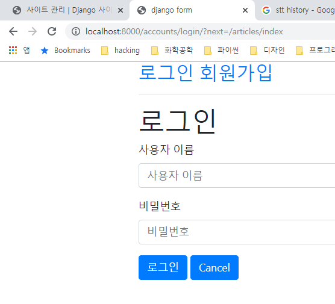
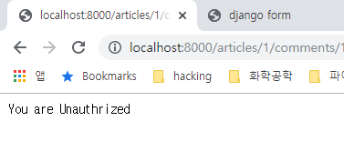
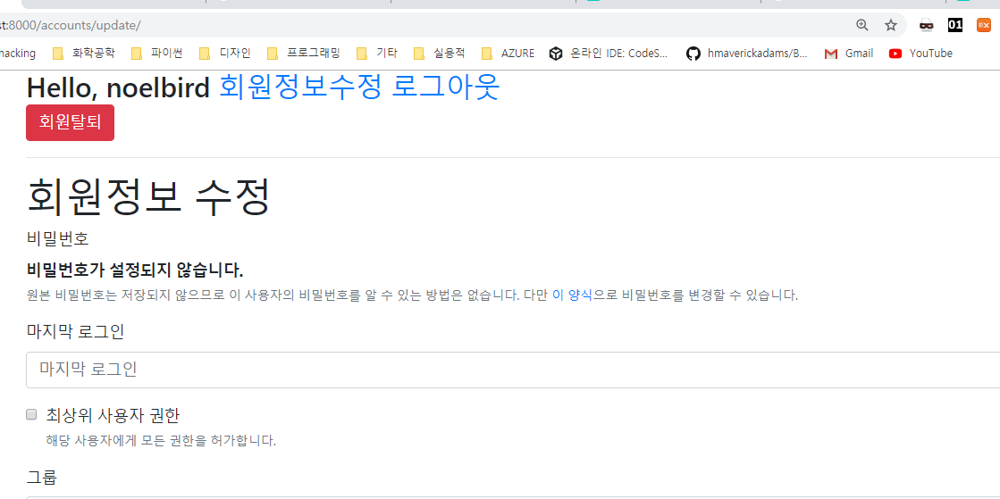
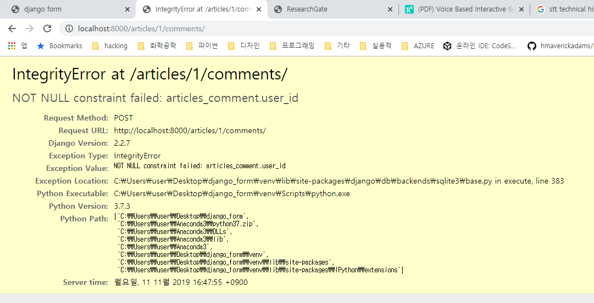

# Auth 사용하기

13일차에서 했던 `django_form`에서 이어서 진행합니다.

Auth 사용을 위해서 다음과 같이 `accounts`라는 앱을 만들어 줍니다.

```bash
$ activate
(venv) $ python manage.py startapp accounts
```


그리고 settings.py에 accounts를 등록해 줍니다. 

```python
# settings.py

...

INSTALLED_APPS = [
    'articles',
    'accounts',
    'django.contrib.admin',
    ...
```


프로젝트의 urls.py 파일에도 accounts 경로를 적어줍니다.

```python
# myform/urls.py

from django.contrib import admin
from django.urls import path, include 

urlpatterns = [
    path('admin/', admin.site.urls),
    path('articles/', include('articles.urls')),
    path('accounts/', include('accounts.urls')),
]

```

```python
# accounts/urls.py

from django.urls import path
from . import views

app_name = 'accounts'

urlpatterns = [
    path('signup/', views.signup, name='signup'),
]
```


## Auth 

장고에서는 인증과 권한부여를 합쳐서 Auth라고 합니다.


```python
# accounts/views.py

from django.contrib.auth.forms import UserCreationForm

def signup(request):
  if request.method == 'POST':
    pass
  else:
    form = UserCreationForm()
  context = {'form', form}
  return render(request, 'accounts/signup.html', context)
```


템플릿 폴더를 만들어서 다음과 같이 signup.html 파일을 작성해 줍니다.

```html
<!-- accounts/templates/accounts/signup.html -->





<h1>회원가입</h1>
<form action="" method="POST">
    
    
    
</form>

```


### 로그인에 대한 이해

http는 connectless, stateless의 특징을 가지고 있습니다.

따라서 상태를 저장하고 싶다면 다른 방법을 사용해야 합니다.

이 때 사용하는 것이 쿠키인데, 쿠키를 서버에 저장하면 session, 클라이언트에 저장하면 cookie입니다.


다음과 같이 accounts의 view의 POST 부분을 완성해 줍니다.

```python
# accounts/views.py

from django.contrib.auth import login as auth_login # login이라는 우리의 함수와 겹치기 때문에 이름 변경
from django.contrib.auth.forms import UserCreationForm

...

# Create your views here.
def signup(request):
    if request.method == 'POST':
        form = UserCreationForm(request.POST)
        if form.is_valid():
            form.save()
            return redirect('articles:index')
    else:
        form = UserCreationForm()
    context = {
        'form': form
    }
    return render(request, 'accounts/signup.html', context)

...
```


## 로그인 기능 구현

```python
# accounts/urls.py

from django.urls import path
from . import views

app_name = 'accounts'

urlpatterns = [
    path('signup/', views.signup, name='signup'),
    path('login/', views.login, name='login'),
]
```

```python
# accounts/views.py

from django.contrib.auth import login as auth_login # login이라는 우리의 함수와 겹치기 때문에 이름 변경
from django.contrib.auth.forms import UserCreationForm, AuthenticationForm


def login(request):
    if request.method == 'POST':
        form = AuthenticationForm(request, request.POST)
        if form.is_valid():
            auth_login(request, form.get_user())
            return redirect('articles:index')
    else:
        form = AuthenticationForm()
    context = {
        'form': form
    }
    return render(request, 'accounts/login.html', context)
```

```html
<!-- accounts/templates/accounts/login.html -->





<h1>로그인</h1>
<form action="" method="POST">
    
    
    
</form>

```


## 접근 방지

로그인이 되어 있다면, login과 signup이 되지 않도록 하고 싶습니다.

따라서 함수의 최 상단에 로그인이 되어 있지않다면, redirection하는 기능들을 추가해 줍니다.

```python
# accounts/views.py

def signup(request):
    if request.user.is_authenticated:
        return redirect('articles:index')
    if request.method == 'POST':
        form = UserCreationForm(request.POST)
    ...

def login(request):
    if request.user.is_authenticated: # 로그인 되어 있다면 접근을 막아줌
        return redirect('articles:index')
    ...
```


## 회원가입된 후 자동 로그인

회원가입이 된 후, 자동으로 로그인 되지 않는 불편함이 있기 때문에,

그 부분을 개선하도록 합니다.

```python
# accounts/views.py

from django.shortcuts import render, redirect
from django.contrib.auth import login as auth_login # login이라는 우리의 함수와 겹치기 때문에 이름 변경
from django.contrib.auth import logout as auth_logout # 로그아웃 함수와 구분하기 위해서 
from django.contrib.auth.forms import UserCreationForm, AuthenticationForm

# Create your views here.
def signup(request):
    if request.user.is_authenticated: # 로그인 되어 있다면 접근을 막아줌
        return redirect('articles:index')
    if request.method == 'POST':
        form = UserCreationForm(request.POST)
        if form.is_valid():
            user = form.save() # 현재 form.save() 내용을 user로 받음
            auth_login(request, user) # 로그인 기능 추가
            return redirect('articles:index')
    else:
        form = UserCreationForm()
    context = {
        'form': form
    }
    return render(request, 'accounts/signup.html', context)

...
```


signup 함수를 위와 같이 고쳐줍니다.

`user = form.save()`

```html
<!-- articles/templates/articles/index.html -->




    <h1>Articles</h1>
    
    <a href="">[NEW]</a>
    
    <a href="">[새 글을 작성하려면 로그인을 해주세요!]</a>
    
    
        <P>{{ article.pk }}</P>
        <P>{{ article.title }}</P>
        <a href="">[DETAIL]</a>
        <hr>
    

```


하지만, 이렇게 하면 글 쓰기 버튼만 없어졌을 뿐 url로 접근하면 글을 쓸 수 있습니다.

따라서 `articles/views.py`에 로그인 되지 않으면 접근 되지 않도록 설정해 줍니다.

아래와 같이 `@login_required`를 함수 위에 추가해 줍니다.

```python
# articles/views.py

from django.contrib.auth.decorators import login_required # 로그인을 하지 않으면 create와 delete를 할 수 없습니다.

@login_required
def create(request):
    if request.method == "POST":
        ...

@login_required
@require_POST
def delete(request, article_pk):
    article = get_object_or_404(Article, pk=article_pk)
    ...
```


다만 위의 `delete`처럼 작성을 하면 오류가 발생합니다.

왜냐하면, login_required에서 반환하는 것은 get요청으로 원래 페이지로 돌아가는데,

require_POST가 있어서 페이지로 그대로 들어가기 불가능하기 때문입니다.

따라서 아래와 같이 수정해줍니다.

```python
# articles/views.py

...

@require_POST
def delete(request, article_pk):
    if request.user.is_authenticated:
        article = get_object_or_404(Article, pk=article_pk)
        article.delete()
    return redirect("articles:index")

...
```


이제 `http://localhost:8000/create/`로 로그인 하지 않고 접근하면 다음과 같은 화면이 나옵니다.




주목해서 볼 부분은 `next=/articles/index`라고 있는데, 로그인 한 다음에 이동할 페이지를 기록해둔 것입니다.

따라서 아래와 같이 설정해 두면, 로그인 한 다음 원래의 페이지로 다시 돌아갈 수 있습니다.

```python
# accounts/views.py

def login(request):
    if request.user.is_authenticated: # 로그인 되어 있다면 접근을 막아줌
        return redirect('articles:index')
    if request.method == 'POST':
        form = AuthenticationForm(request, request.POST)
        if form.is_valid():
            auth_login(request, form.get_user())
            return redirect(request.GET.get('next') or 'articles:index')
```


>  TIP

request.user는 어디에서든 접근이 가능하고, default값은 AnonymousUser입니다.


이제, accounts의 뷰 부분이 아닌 articles의 뷰 부분을 다음과 같이 수정합니다.

권한이 없는데 접근한다면 HttpResponse로 권한없음을 출력합니다.

```python
# articles/views.py

...

@require_POST
def delete(request, article_pk):
    if request.user.is_authenticated:
        article = get_object_or_404(Article, pk=article_pk)
        article.delete()
        return redirect("articles:index")
    else:
        return HttpResponse('You are Unauthorized', status=401) # 만약 권한이 없는 유저라면, 401코드를 반환해 줍니다.

...
    
@require_POST
def comments_create(request, article_pk):
    if request.user.is_authenticated:
        article = get_object_or_404(Article, pk=article_pk)
        comment_form = CommentForm(request.POST)
        if comment_form.is_valid():
            comment = comment_form.save(commit=False)
            comment.article = article
            comment.save()
        return redirect("articles:detail", article_pk)
    else:
        return HttpResponse('You are Unauthrized!', status=401)

@require_POST
def comments_delete(request, article_pk, comment_pk):
    if request.user.is_authenticated:
        comment = get_object_or_404(Comment, pk=comment_pk)
        comment.delete()
        return redirect("articles:detail", article_pk)
    else:
        return HttpResponse('You are Unauthrized', status=401)
```


로그인을 하지 않고, 댓글을 삭제하려고 하면 다음과 같은 화면이 출력됩니다.




## user 삭제 기능

```python
# accounts/urls.py

from django.urls import path
from . import views

app_name = 'accounts'

urlpatterns = [
    path('signup/', views.signup, name='signup'),
    path('login/', views.login, name='login'),
    path('logout/', views.logout, name='logout'),
    path('delete/', views.delete, name='delete'),
]
```


```python
# accounts/views.py

...


@require_POST
def delete(request):
    request.user.delete()
    return redirect('articles:index')
```


## 회원 수정

```python
# accounts/urls.py

from django.urls import path
from . import views

app_name = 'accounts'

urlpatterns = [
    path('signup/', views.signup, name='signup'),
    path('login/', views.login, name='login'),
    path('logout/', views.logout, name='logout'),
    path('delete/', views.delete, name='delete'),
    path('update/', views.update, name='update'),
]
```

```html
<!-- accounts/templates/accounts/update.html -->





<h1>회원정보 수정</h1>
<form action="" method="POST">
    
    
    
</form>

```


```python
# accounts/views.py

...

from django.contrib.auth.forms import UserChangeForm

...

def update(request):
    if request.method == 'POST':
        pass
    else:
        form = UserChangeForm()
    context = {
        'form':form
    }
    return render(request, 'accounts/update.html', context)
```


user 삭제 기능, 회원정보 수정 버튼은 `base.html`에 추가해 줍니다.

```html

<!DOCTYPE html>
<html lang="ko">
<head>
    <meta charset="UTF-8">
    <meta name="viewport" content="width=device-width, initial-scale=1.0">
    <meta http-equiv="X-UA-Compatible" content="ie=edge">
    
        <title>django form</title>
    
    
</head>
<body>
    <div class="container">
        
        <h3>Hello, {{user.username}}
            <a href="">비번변경</a>
            <a href="">로그아웃</a>
            <form action="" method="POST">
                
                <input type="submit" value='회원탈퇴' class="btn btn-danger">
            </form>
        </h3>
        
        <h3>{{user.username}}
            <a href="">로그인</a>
            <a href="">회원가입</a>
        </h3>
        

        <hr>
        
        
    </div>
    
</body>
</html>
```


이제 회원정보 수정 버튼을 누르면 다음과 같이 나옵니다.




이렇게 폼이 만들어지는데, 사실 유저가 보면 안되는 정보들이 많기 때문에

customizing 해줍니다.

fields의 내용은 github를 참조해서 fields를 알아내서 내용을 적습니다.

```
https://github.com/django/django/blob/master/django/contrib/auth/forms.py

UserChangeForm > User > AbstractUser

first_name, last_name 알아내기
```


```python
# accounts/forms.py

from django.contrib.auth.forms import UserChangeForm
from django.contrib.auth import get_user_model

class CustomUserChangeForm(UserChangeForm):
    class Meta:
        model = get_user_model() # 원래는 여기에 유저 모델을 그대로 넣을 수 있겠지만, 지금은 그냥 모델을 가져오는 함수를 사용
        # https://github.com/django/django/blob/master/django/contrib/auth/forms.py
        # fields에는 모델의 내용을 모르기 때문에, 커스터마이징 해줍니다.
        fields = ('first_name', 'last_name')
```


```python
# accounts/views.py

...

from .forms import CustomUserChangeForm

...

def update(request):
    if request.method == 'POST':
        form = CustomUserChangeForm(request.POST, instance=request.user)
        if form.is_valid():
            form.save()
            return redirect('articles:index')
    else:
        form = CustomUserChangeForm()
    context = {
        'form':form
    }
    return render(request, 'accounts/update.html', context)

...
```


로그인을 하지 않고 접근할 당시 에러가 발생하기 때문에 다음과 같이 저장합니다.

```python
# accounts/views.py

...

from django.contrib.auth.decorators import login_required

...

@login_required
def update(request):
    if request.method == 'POST':
        form = CustomUserChangeForm(request.POST, instance=request.user)
        if form.is_valid():
            form.save()
            return redirect('articles:index')
    else:
        form = CustomUserChangeForm()
    context = {
        'form':form
    }
    return render(request, 'accounts/update.html', context)
```


## 비밀번호 변경 폼 만들기

```python
# accounts/urls.py

from django.urls import path
from . import views

app_name = 'accounts'

urlpatterns = [
    path('signup/', views.signup, name='signup'),
    path('login/', views.login, name='login'),
    path('logout/', views.logout, name='logout'),
    path('delete/', views.delete, name='delete'),
    path('update/', views.update, name='update'),
    path('password/', views.change_password, name='change_password'),
]
```

```python
# accounts/views.py

...

from django.contrib.auth.forms import PasswordChangeForm

...

def change_password(request):
    if request.method == 'POST':
        pass
    else:
        form = PasswordChangeForm(request.user)
    context = {
        'form': form
    }
    return render(request, 'accounts/change_password.html', context)
```

```html
<!-- accounts/templates/accounts/change_password.html -->





<h1>비밀번호 변경</h1>
<form action="" method="POST">
    
    
    
</form>

```


base.html에도 비밀번호 변경을 하는 a 태그를 추가해 줍니다.

```html

<!DOCTYPE html>
<html lang="ko">
<head>
    <meta charset="UTF-8">
    <meta name="viewport" content="width=device-width, initial-scale=1.0">
    <meta http-equiv="X-UA-Compatible" content="ie=edge">
    
        <title>django form</title>
    
    
</head>
<body>
    <div class="container">
        
        <h3>Hello, {{user.username}}
            <a href="">회원정보수정</a>
            <a href="">비번변경</a>
            <a href="">로그아웃</a>
            <form action="" method="POST">
                
                <input type="submit" value='회원탈퇴' class="btn btn-danger">
            </form>
        </h3>
        
        <h3>{{user.username}}
            <a href="">로그인</a>
            <a href="">회원가입</a>
        </h3>
        

        <hr>
        
        
    </div>
    
</body>
</html>
```


아까 POST요청으로 들어온 부분도 마저 처리해줍시다.

```python
# accounts/views.py

...

def change_password(request):
    if request.method == 'POST':
        # 첫 번째 인자로 유저 객체를 넘겨주고, 두 번째 인자로 POST를 넘겨줘야 합니다.
        form = PasswordChangeForm(request.user, request.POST)
        if form.is_valid():
            form.save()
            return redirect('articles:index')
    else:
        form = PasswordChangeForm(request.user)
    context = {
        'form': form
    }
    return render(request, 'accounts/change_password.html', context)

...
```


지금 accounts/templates/accounts의 파일들의 형식은 다음과 같이 대부분 동일합니다.

```html
<!--  -->




<h1>로그인</h1>
<form action="" method="POST">
    
    
    
</form>

```


위와 같은 모양입니다. 따라서 위의 모양들을 통일해서 auth_form.html이라는 곳에서 한꺼번에 처리해 주도록 하겠습니다.

```html
<!-- accounts/templates/accounts/auth_form.html -->







<h1>회원가입</h1>

<h1>로그인</h1>

<h1>회원정보수정</h1>

<h1>비밀번호변경</h1>


<form action="" method="POST">
    
    
    
</form>

```


`accounts/views.py`에서 아래와 같이 login.html, signup.html, update.html, change_password.html

위의 파일을 auth_form.html 파일로 전부 교체를 해줍니다.

```python
# accounts/views.py

from django.shortcuts import render, redirect
from django.contrib.auth import login as auth_login # login이라는 우리의 함수와 겹치기 때문에 이름 변경
from django.contrib.auth import logout as auth_logout # 로그아웃 함수와 구분하기 위해서 
from django.contrib.auth.decorators import login_required
from django.contrib.auth.forms import UserCreationForm, AuthenticationForm
from django.contrib.auth.forms import PasswordChangeForm
# from django.contrib.auth.forms import UserChangeForm
from .forms import CustomUserChangeForm

from django.views.decorators.http import require_POST
from django.contrib.auth import update_session_auth_hash # 비밀번호 변경 후에 변경된 세션을 자동으로 읽어와서 로그인하기 위함

# Create your views here.
def signup(request):
    if request.user.is_authenticated: # 로그인 되어 있다면 접근을 막아줌
        return redirect('articles:index')
    if request.method == 'POST':
        form = UserCreationForm(request.POST)
        if form.is_valid():
            user = form.save()
            auth_login(request, user)
            return redirect('articles:index')
    else:
        form = UserCreationForm()
    context = {
        'form': form
    }
    return render(request, 'accounts/auth_form.html', context)

def login(request):
    if request.user.is_authenticated: # 로그인 되어 있다면 접근을 막아줌
        return redirect('articles:index')
    if request.method == 'POST':
        form = AuthenticationForm(request, request.POST)
        if form.is_valid():
            auth_login(request, form.get_user())
            return redirect(request.GET.get('next') or 'articles:index')
    else:
        form = AuthenticationForm()
    context = {
        'form': form
    }
    return render(request, 'accounts/login.html', context)

def logout(request):
    auth_logout(request)
    return redirect('articles:index')

@require_POST
def delete(request):
    request.user.delete()
    return redirect('articles:index')

@login_required
def update(request):
    if request.method == 'POST':
        form = CustomUserChangeForm(request.POST, instance=request.user)
        if form.is_valid():
            form.save()
            return redirect('articles:index')
    else:
        form = CustomUserChangeForm()
    context = {
        'form':form
    }
    return render(request, 'accounts/auth_form.html', context)

@login_required
def change_password(request):
    if request.method == 'POST':
        # 첫 번째 인자로 유저 객체를 넘겨주고, 두 번째 인자로 POST를 넘겨줘야 합니다.
        form = PasswordChangeForm(request.user, request.POST)
        if form.is_valid():
            form.save()
            # 현재 사용자의 인증 세션이 무효화 되는 것을 막고,
            # 세션을 유지한 상태로 비밀번호를 업데이트 시켜줍니다.
            update_session_auth_hash(request, form.user)
            return redirect('articles:index')
    else:
        form = PasswordChangeForm(request.user)
    context = {
        'form': form
    }
    return render(request, 'accounts/auth_form.html', context)
```


## Article과 User의 관계 만들기

User와 Article의 관계는 `1:N`의 관계입니다.

따라서, Article에서 ForeignKey를 가지고 있어야 합니다. 

```python
# articles/models.py

from django.db import models
from django.conf import settings

# Create your models here.
class Article(models.Model):
    title = models.CharField(max_length=10)
    content = models.TextField()
    created_at = models.DateTimeField(auto_now_add=True)
    updated_at = models.DateTimeField(auto_now=True)
    user = models.ForeignKey(settings.AUTH_USER_MODEL, on_delete=models.CASCADE)
    # settings.AUTH_USER_MODEL의 자리에 모델이 들어와야 하는데,
    # from django.contrib.auth import get_user_model
    # 을 불러와서 get_user_model을 하는 것과의 차이점은
    # get_user_model()은 반환 값이 object이고, settings.AUTH_USER_MODEL은
    # str을 반환합니다.
    
    class Meta:
        ordering = ('-pk', )

    def __str__(self):
        return self.title

class Comment(models.Model):
    content = models.CharField(max_length=140)
    created_at = models.DateTimeField(auto_now_add=True)
    updated_at = models.DateTimeField(auto_now=True)
    article = models.ForeignKey(Article, on_delete=models.CASCADE)

    def __str__(self):
        return self.content
```


```bash
(venv) $ python manage.py makemigrations
You are trying to add a non-nullable field 'user' to article without a default; we can't do that (the database needs something to populate existing rows).
Please select a fix:
 1) Provide a one-off default now (will be set on all existing rows with a null value for this column)
 2) Quit, and let me add a default in models.py
Select an option: 1
Please enter the default value now, as valid Python
The datetime and django.utils.timezone modules are available, so you can do e.g. timezone.now
Type 'exit' to exit this prompt
>>> 1
Migrations for 'articles':
  articles\migrations\0003_article_user.py
    - Add field user to article
(venv)
```


이제 모델이 변경되었기 때문에 makemigrations를 해줘야 합니다.

`1 > enter > 1 > enter` 순으로 진행합니다.

첫 번째 1을 입력한 것은 default값으로 채우겠다는 의미입니다.

두 번째 1을 입력한 것은 첫 번째 User(pk가 1인 user)의 값으로 채운다는 의미입니다.

```python
# articles/forms.py

from django import forms
from .models import Article, Comment

class CommentForm(forms.ModelForm):
    class Meta:
        model = Comment
        fields = ('content', )

class ArticleForm(forms.ModelForm):
    title = forms.CharField(
        label="제목",
        max_length=10,
        widget=forms.TextInput(attrs={
            'class': 'title',
            'placeholder': 'Enter the title',
        })
    )

    class Meta:
        model = Article
        # fields = "__all__"
        fields = ('title', 'content',)
```

위와 같이 ArticleForm의 Meta클래스에서 fields를 `__all__` 대신에 2개의 값(title, content)를 입력해 줌으로써 user를 선택할 수 있도록 창이 뜨는 것을 방지할 수 있습니다.


하지만 글을 생성하면, 오류가 뜨게 됩니다. user를 넘겨주지 않았다는 것입니다.

따라서 아래와 같이 POST로 받았을 때 바로 save()를 하지 않고, request.user를 대입한 다음에 save()하도록 설정합시다.

```python
# articles/views.py

@login_required
def create(request):
    if request.method == "POST":
        # 폼 인스턴스를 생성하고 요청에 의한 데이터로 채운다. (binding)
        form = ArticleForm(request.POST)
        # 폼이 유효한지 체크한다.
        if form.is_valid():
            article = form.save(commit=False)
            article.user = request.user
            article = form.save()
            # title = form.cleaned_data.get("title")
            # content = form.cleaned_data.get("content")
            # article = Article(title=title, content=content)
            # article.save()
            return redirect("articles:detail", article.pk)
    else:
        form = ArticleForm()
    context = {'form': form}
    return render(request, 'articles/create.html', context)
```


```html
<!-- articles/templates/articles/index.html -->




    <h1>Articles</h1>
    
    <a href="">[NEW]</a>
    
    <a href="">[새 글을 작성하려면 로그인을 해주세요!]</a>
    
    
    <p><strong>{{article.user}}</strong></p>
        <P>{{ article.pk }}</P>
        <P>{{ article.title }}</P>
        <a href="">[DETAIL]</a>
        <hr>
    

```


## Comment와 User의 N:1관계 만들기


Article과 User의 N:1의 관계처럼 동일하게 진행합니다.

```python
# articles/models.py

class Comment(models.Model):
    content = models.CharField(max_length=140)
    created_at = models.DateTimeField(auto_now_add=True)
    updated_at = models.DateTimeField(auto_now=True)
    article = models.ForeignKey(Article, on_delete=models.CASCADE)
    user = models.ForeignKey(settings.AUTH_USER_MODEL, on_delete=models.CASCADE)

    def __str__(self):
        return self.content
```




위와 동일하게 오류가 납니다.

따라서 create를 했을 때 POST 부분에서 바로 save()를 하지 않고, `comment.user = request.user`를 하도록 수정합니다.


```python
# articles/views.py

@require_POST
def comments_create(request, article_pk):
    if request.user.is_authenticated:
        article = get_object_or_404(Article, pk=article_pk)
        comment_form = CommentForm(request.POST)
        if comment_form.is_valid():
            comment = comment_form.save(commit=False)
            comment.article = article
            comment.user = request.user # 작성자의 정보를 넣어줌
            comment.save()
        return redirect("articles:detail", article_pk)
    else:
        return HttpResponse('You are Unauthrized!', status=401)

@require_POST
def comments_delete(request, article_pk, comment_pk):
    if request.user.is_authenticated:
        comment = get_object_or_404(Comment, pk=comment_pk)
        if comment.user == request.user: # 작성자와 요청자가 동일인인지 검증
            comment.delete()
        return redirect("articles:detail", article_pk)
    else:
        return HttpResponse('You are Unauthrized', status=401)
```


## 전체 소스 코드


### 프로젝트 관련 파일

설치된 패키지 목록

```bash
(venv) $ cat requirements.txt
backcall==0.1.0
beautifulsoup4==4.8.1
colorama==0.4.1
decorator==4.4.1
Django==2.2.7
django-bootstrap4==1.0.1
ipython==7.9.0
ipython-genutils==0.2.0
jedi==0.15.1
parso==0.5.1
pickleshare==0.7.5
prompt-toolkit==2.0.10
Pygments==2.4.2
pytz==2019.3
six==1.13.0
soupsieve==1.9.5
sqlparse==0.3.0
traitlets==4.3.3
wcwidth==0.1.7
```


settings.py

```python
# myform/settings.py

"""
Django settings for myform project.

Generated by 'django-admin startproject' using Django 2.2.7.

For more information on this file, see
https://docs.djangoproject.com/en/2.2/topics/settings/

For the full list of settings and their values, see
https://docs.djangoproject.com/en/2.2/ref/settings/
"""

import os

# Build paths inside the project like this: os.path.join(BASE_DIR, ...)
BASE_DIR = os.path.dirname(os.path.dirname(os.path.abspath(__file__)))


# Quick-start development settings - unsuitable for production
# See https://docs.djangoproject.com/en/2.2/howto/deployment/checklist/

# SECURITY WARNING: keep the secret key used in production secret!
SECRET_KEY = 'caau^3^02!3()!^vo$m0=*jyte!8#2yjhr02l4ws18##ony_+#'

# SECURITY WARNING: don't run with debug turned on in production!
DEBUG = True

ALLOWED_HOSTS = []


# Application definition

INSTALLED_APPS = [
    'articles',
    'accounts',
    'django.contrib.admin',
    'django.contrib.auth',
    'django.contrib.contenttypes',
    'django.contrib.sessions',
    'django.contrib.messages',
    'django.contrib.staticfiles',
    'bootstrap4',
]

MIDDLEWARE = [
    'django.middleware.security.SecurityMiddleware',
    'django.contrib.sessions.middleware.SessionMiddleware',
    'django.middleware.common.CommonMiddleware',
    'django.middleware.csrf.CsrfViewMiddleware',
    'django.contrib.auth.middleware.AuthenticationMiddleware',
    'django.contrib.messages.middleware.MessageMiddleware',
    'django.middleware.clickjacking.XFrameOptionsMiddleware',
]

ROOT_URLCONF = 'myform.urls'

TEMPLATES = [
    {
        'BACKEND': 'django.template.backends.django.DjangoTemplates',
        'DIRS': [os.path.join(BASE_DIR, 'myform', 'templates')],
        'APP_DIRS': True,
        'OPTIONS': {
            'context_processors': [
                'django.template.context_processors.debug',
                'django.template.context_processors.request',
                'django.contrib.auth.context_processors.auth',
                'django.contrib.messages.context_processors.messages',
            ],
        },
    },
]

WSGI_APPLICATION = 'myform.wsgi.application'


# Database
# https://docs.djangoproject.com/en/2.2/ref/settings/#databases

DATABASES = {
    'default': {
        'ENGINE': 'django.db.backends.sqlite3',
        'NAME': os.path.join(BASE_DIR, 'db.sqlite3'),
    }
}


# Password validation
# https://docs.djangoproject.com/en/2.2/ref/settings/#auth-password-validators

AUTH_PASSWORD_VALIDATORS = [
    {
        'NAME': 'django.contrib.auth.password_validation.UserAttributeSimilarityValidator',
    },
    {
        'NAME': 'django.contrib.auth.password_validation.MinimumLengthValidator',
    },
    {
        'NAME': 'django.contrib.auth.password_validation.CommonPasswordValidator',
    },
    {
        'NAME': 'django.contrib.auth.password_validation.NumericPasswordValidator',
    },
]


# Internationalization
# https://docs.djangoproject.com/en/2.2/topics/i18n/

LANGUAGE_CODE = 'ko-kr'

TIME_ZONE = 'Asia/Seoul'

USE_I18N = True

USE_L10N = True

USE_TZ = True


# Static files (CSS, JavaScript, Images)
# https://docs.djangoproject.com/en/2.2/howto/static-files/

STATIC_URL = '/static/'

# 만약 로그인 하지 않은 사용자의 경우 LOGIN_URL에 설정된
# 문자열 기반 절대 경로로 리다이렉트한다.
# LOGIN_URL = '/custom_appname/login/' 처럼 지정할 수 있습니다.
```


urls.py

```python
# myform/urls.py

"""myform URL Configuration

The `urlpatterns` list routes URLs to views. For more information please see:
    https://docs.djangoproject.com/en/2.2/topics/http/urls/
Examples:
Function views
    1. Add an import:  from my_app import views
    2. Add a URL to urlpatterns:  path('', views.home, name='home')
Class-based views
    1. Add an import:  from other_app.views import Home
    2. Add a URL to urlpatterns:  path('', Home.as_view(), name='home')
Including another URLconf
    1. Import the include() function: from django.urls import include, path
    2. Add a URL to urlpatterns:  path('blog/', include('blog.urls'))
"""
from django.contrib import admin
from django.urls import path, include 

urlpatterns = [
    path('admin/', admin.site.urls),
    path('articles/', include('articles.urls')),
    path('accounts/', include('accounts.urls')),
]

```


base.html

```html
<!-- myform/templates/base.html -->


<!DOCTYPE html>
<html lang="ko">
<head>
    <meta charset="UTF-8">
    <meta name="viewport" content="width=device-width, initial-scale=1.0">
    <meta http-equiv="X-UA-Compatible" content="ie=edge">
    
        <title>django form</title>
    
    
</head>
<body>
    <div class="container">
        
        <h3>Hello, {{user.username}}
            <a href="">회원정보수정</a>
            <a href="">비번변경</a>
            <a href="">로그아웃</a>
            <form action="" method="POST">
                
                <input type="submit" value='회원탈퇴' class="btn btn-danger">
            </form>
        </h3>
        
        <h3>{{user.username}}
            <a href="">로그인</a>
            <a href="">회원가입</a>
        </h3>
        

        <hr>
        
        
    </div>
    
</body>
</html>
```


### accounts 앱 관련 파일

```python
# accounts/urls.py

from django.urls import path
from . import views

app_name = 'accounts'

urlpatterns = [
    path('signup/', views.signup, name='signup'),
    path('login/', views.login, name='login'),
    path('logout/', views.logout, name='logout'),
    path('delete/', views.delete, name='delete'),
    path('update/', views.update, name='update'),
    path('password/', views.change_password, name='change_password'),
]
```

```python
# accounts/views.py

from django.shortcuts import render, redirect
from django.contrib.auth import login as auth_login # login이라는 우리의 함수와 겹치기 때문에 이름 변경
from django.contrib.auth import logout as auth_logout # 로그아웃 함수와 구분하기 위해서 
from django.contrib.auth.decorators import login_required
from django.contrib.auth.forms import UserCreationForm, AuthenticationForm
from django.contrib.auth.forms import PasswordChangeForm
# from django.contrib.auth.forms import UserChangeForm
from .forms import CustomUserChangeForm

from django.views.decorators.http import require_POST
from django.contrib.auth import update_session_auth_hash # 비밀번호 변경 후에 변경된 세션을 자동으로 읽어와서 로그인하기 위함

# Create your views here.
def signup(request):
    if request.user.is_authenticated: # 로그인 되어 있다면 접근을 막아줌
        return redirect('articles:index')
    if request.method == 'POST':
        form = UserCreationForm(request.POST)
        if form.is_valid():
            user = form.save()
            auth_login(request, user)
            return redirect('articles:index')
    else:
        form = UserCreationForm()
    context = {
        'form': form
    }
    return render(request, 'accounts/auth_form.html', context)

def login(request):
    if request.user.is_authenticated: # 로그인 되어 있다면 접근을 막아줌
        return redirect('articles:index')
    if request.method == 'POST':
        form = AuthenticationForm(request, request.POST)
        if form.is_valid():
            auth_login(request, form.get_user())
            return redirect(request.GET.get('next') or 'articles:index')
    else:
        form = AuthenticationForm()
    context = {
        'form': form
    }
    return render(request, 'accounts/login.html', context)

def logout(request):
    auth_logout(request)
    return redirect('articles:index')

@require_POST
def delete(request):
    request.user.delete()
    return redirect('articles:index')

@login_required
def update(request):
    if request.method == 'POST':
        form = CustomUserChangeForm(request.POST, instance=request.user)
        if form.is_valid():
            form.save()
            return redirect('articles:index')
    else:
        form = CustomUserChangeForm()
    context = {
        'form':form
    }
    return render(request, 'accounts/auth_form.html', context)

@login_required
def change_password(request):
    if request.method == 'POST':
        # 첫 번째 인자로 유저 객체를 넘겨주고, 두 번째 인자로 POST를 넘겨줘야 합니다.
        form = PasswordChangeForm(request.user, request.POST)
        if form.is_valid():
            form.save()
            # 현재 사용자의 인증 세션이 무효화 되는 것을 막고,
            # 세션을 유지한 상태로 비밀번호를 업데이트 시켜줍니다.
            update_session_auth_hash(request, form.user)
            return redirect('articles:index')
    else:
        form = PasswordChangeForm(request.user)
    context = {
        'form': form
    }
    return render(request, 'accounts/auth_form.html', context)
```

```html
<!-- accounts/templates/accounts/auth_form.html -->







<h1>회원가입</h1>

<h1>로그인</h1>

<h1>회원정보수정</h1>

<h1>비밀번호변경</h1>


<form action="" method="POST">
    
    
    
</form>

```

```html
<!-- accounts/templates/accounts/change_password.html -->





<h1>비밀번호 변경</h1>
<form action="" method="POST">
    
    
    
</form>

```

```html
<!-- accounts/templates/accounts/login.html -->





<h1>로그인</h1>
<form action="" method="POST">
    
    
    
</form>

```

```html
<!-- accounts/templates/accounts/signup.html -->





<h1>회원가입</h1>
<form action="" method="POST">
    
    
    
</form>

```

```html
<!-- accounts/templates/accounts/update.html -->





<h1>회원정보 수정</h1>
<form action="" method="POST">
    
    
    
</form>

```


`forms.py` 파일

```python
# accounts/forms.py

from django.contrib.auth.forms import UserChangeForm
from django.contrib.auth import get_user_model

class CustomUserChangeForm(UserChangeForm):
    class Meta:
        model = get_user_model() # 원래는 여기에 유저 모델을 그대로 넣을 수 있겠지만, 지금은 그냥 모델을 가져오는 함수를 사용
        # https://github.com/django/django/blob/master/django/contrib/auth/forms.py
        # fields에는 모델의 내용을 모르기 때문에, 커스터마이징 해줍니다.
        fields = ('first_name', 'last_name')
```


### articles 관련 파일


모델

```python
# articles/models.py

from django.db import models
from django.conf import settings

# Create your models here.
class Article(models.Model):
    title = models.CharField(max_length=10)
    content = models.TextField()
    created_at = models.DateTimeField(auto_now_add=True)
    updated_at = models.DateTimeField(auto_now=True)
    user = models.ForeignKey(settings.AUTH_USER_MODEL, on_delete=models.CASCADE)
    
    class Meta:
        ordering = ('-pk', )

    def __str__(self):
        return self.title

class Comment(models.Model):
    content = models.CharField(max_length=140)
    created_at = models.DateTimeField(auto_now_add=True)
    updated_at = models.DateTimeField(auto_now=True)
    article = models.ForeignKey(Article, on_delete=models.CASCADE)
    user = models.ForeignKey(settings.AUTH_USER_MODEL, on_delete=models.CASCADE)

    def __str__(self):
        return self.content
```


```python
# articles/urls.py

from django.urls import path
from . import views

app_name = "articles"
urlpatterns = [
    path('', views.index, name="index"),
    path('create/', views.create, name="create"),
    path('<int:article_pk>/', views.detail, name="detail"),
    path('<int:article_pk>/delete/', views.delete, name="delete"),
    path('<int:article_pk>/update/', views.update, name="update"),
    path('<int:article_pk>/comments/', views.comments_create, name="comments_create"),
    path('<int:article_pk>/comments/<int:comment_pk>/delete/', views.comments_delete, name="comments_delete")
]
```


```python
# articles/views.py

from django.shortcuts import render, redirect, get_object_or_404
from django.http import HttpResponse
from .models import Article, Comment
from .forms import ArticleForm, CommentForm
from django.views.decorators.http import require_POST
from IPython import embed

from django.contrib.auth.decorators import login_required # 로그인을 하지 않으면 create와 delete를 할 수 없습니다.

# Create your views here.
def index(request):
    # embed()
    articles = Article.objects.all()
    context = {'articles': articles}
    return render(request, 'articles/index.html', context)

# @login_required(login_url='accounts/test/') # 이런 식으로도 할 수 있습니다.
@login_required
def create(request):
    if request.method == "POST":
        # 폼 인스턴스를 생성하고 요청에 의한 데이터로 채운다. (binding)
        form = ArticleForm(request.POST)
        # 폼이 유효한지 체크한다.
        if form.is_valid():
            article = form.save(commit=False)
            article.user = request.user
            article = form.save()
            # title = form.cleaned_data.get("title")
            # content = form.cleaned_data.get("content")
            # article = Article(title=title, content=content)
            # article.save()
            return redirect("articles:detail", article.pk)
    else:
        form = ArticleForm()
    context = {'form': form}
    return render(request, 'articles/create.html', context)

def detail(request, article_pk):
    # article = Article.objects.get(pk=article_pk)
    article = get_object_or_404(Article, pk=article_pk)
    comments = Comment.objects.filter(article=article)
    comment_form = CommentForm()
    context = {'article': article, 'comment_form': comment_form, 'comments': comments}
    return render(request, 'articles/detail.html', context)

@require_POST
def delete(request, article_pk):
    if request.user.is_authenticated:
        article = get_object_or_404(Article, pk=article_pk)
        if request.user == article.user: # 글의 주인인 경우에만 삭제
            article.delete()
            return redirect("articles:index")
    else:
        return HttpResponse('You are Unauthorized', status=401) # 만약 권한이 없는 유저라면, 401코드를 반환해 줍니다.

def update(request, article_pk):
    article = get_object_or_404(Article, pk=article_pk)
    if request.user == article.user:
        if request.method == "POST":
            form = ArticleForm(request.POST, instance=article)
            if form.is_valid():
                form.save()
                # article.title = form.cleaned_data.get("title")
                # article.content = form.cleaned_data.get("content")
                # article.save()
                return redirect("articles:detail", article_pk)
        else:
            form = ArticleForm(instance=article)
    else: # 글의 주인이 아닌 사람이 접근한 경우에는 main으로 보냄
        return redirect('articles:index')
    context = {'form': form}
    return render(request, 'articles/create.html', context)

@require_POST
def comments_create(request, article_pk):
    if request.user.is_authenticated:
        article = get_object_or_404(Article, pk=article_pk)
        comment_form = CommentForm(request.POST)
        if comment_form.is_valid():
            comment = comment_form.save(commit=False)
            comment.article = article
            comment.user = request.user
            comment.save()
        return redirect("articles:detail", article_pk)
    else:
        return HttpResponse('You are Unauthrized!', status=401)
    

@require_POST
def comments_delete(request, article_pk, comment_pk):
    if request.user.is_authenticated:
        comment = get_object_or_404(Comment, pk=comment_pk)
        if comment.user == request.user:
            comment.delete()
        return redirect("articles:detail", article_pk)
    else:
        return HttpResponse('You are Unauthrized', status=401)
```


```python
# articles/forms.py
from django import forms
from .models import Article, Comment

class CommentForm(forms.ModelForm):
    class Meta:
        model = Comment
        fields = ('content', )

class ArticleForm(forms.ModelForm):
    title = forms.CharField(
        label="제목",
        max_length=10,
        widget=forms.TextInput(attrs={
            'class': 'title',
            'placeholder': 'Enter the title',
        })
    )

    class Meta:
        model = Article
        # fields = "__all__"
        fields = ('title', 'content',)

# class ArticleForm(forms.Form):
#     # max_length/ min_length
#     title = forms.CharField(
#         max_length=10,
#         label="제목",
#         widget=forms.TextInput(
#             attrs={
#                 'class': 'my-title',
#                 'placeholder': 'Enter the title!',
#             }
#         )
#     )
#     content = forms.CharField(
#         min_length=20, 
#         widget=forms.Textarea(
#             attrs={
#                 'class': 'my-content',
#                 'placeholder': 'Enter the content!',
#                 'row': 5,
#                 'cols': 50,
#             }
#         )
#     )
```


```python
# articles/admin.py

from django.contrib import admin
from .models import Article, Comment

# Register your models here.
class ArticleAdmin(admin.ModelAdmin):
    list_display = ('pk', 'title', 'content', 'created_at', 'updated_at')

class CommentAdmin(admin.ModelAdmin):
    list_display = ('pk', 'content', 'created_at', 'updated_at')

admin.site.register(Article, ArticleAdmin)
admin.site.register(Comment, CommentAdmin)
```


```html
<!-- articles/templates/articles/index.html -->




    <h1>Articles</h1>
    
    <a href="">[NEW]</a>
    
    <a href="">[새 글을 작성하려면 로그인을 해주세요!]</a>
    
    
    <p><strong>{{article.user}}</strong></p>
        <P>{{ article.pk }}</P>
        <P>{{ article.title }}</P>
        <a href="">[DETAIL]</a>
        <hr>
    

```


```html
<!-- articles/templates/articles/detail.html -->




    <h1>DETAIL</h1>
    <hr>
    <p>글 번호: {{ article.pk }}</p>
    <p>글 제목: {{ article.title }}</p>
    <p>글 내용: {{ article.content }}</p>
    <p>글 생성 시각: {{ article.created_at|date:"SHORT_DATE_FORMAT" }}</p>
    <p>글 수정 시각: {{ article.updated_at|date:"M, j, Y" }}</p>
    
    <a href="">[UPDATE]</a>
    <form action="" method="POST">
        
        <input type="submit" value="삭제">
    </form>
    
    
    <hr>
    <!-- 댓글 -->
    <form action="" method="POST">
        
        {{ comment_form }}
        <input type="submit" value="submit">
    </form>
    <hr>
    <p>댓글 목록</p>
    
        <div>
            댓글 : {{ comment.content }}
            <form action="" method="POST">
                
                <input type="submit" value="DELETE">
            </form>
        </div>
    
    <a href="">[UPDATE]</a>
    <a href="">[BACK]</a>

```


```html
<!-- articles/templates/articles/create.html -->





    
    <h1>CREATE</h1>
    
    <h1>UPDATE</h1>
    
    <form action="" method="POST">
        
        <!-- form 모듈 사용 -->
        
        
        <!-- 기존 방식 -->
        <!-- <input type="text" name="title">
        <input type="text" name="content"> -->
        <input type="submit" value="submit">
    </form>

```

