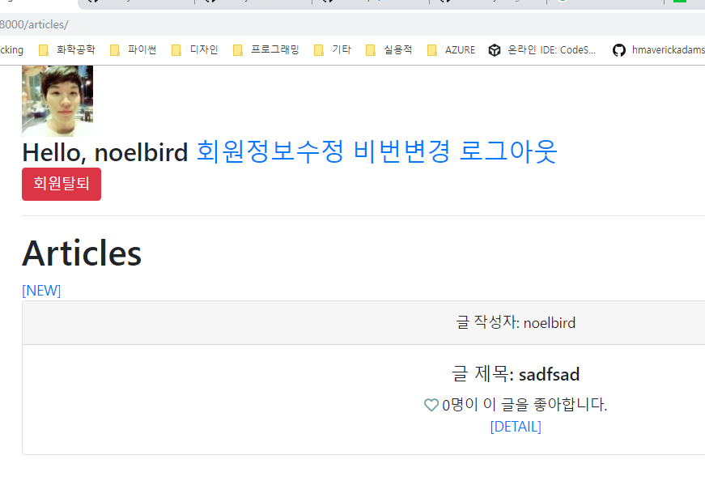

## Gravatar 이용해서 이미지 달기

gravatar에 들어가서 가입을 하고, 개발자 리소스로 들어가면 해쉬 값을 요청을 합니다.

```python
>>> hashlib.md5('이메일주소'.encode('utf-8')).hexdigest()
```

위와 같이 해쉬값을 생성해줘서 해쉬값을 만들어 줍니다.


## 가입할 때 이메일 주소 받도록 form 수정


```bash
(venv) $ mkdir templatestags
(venv) $ cd templates
(venv) $ cd templatestags/
(venv) $ touch __init__.py
(venv)
```


아래와 같이 요청하는 사람의 email을 md5해쉬를 적용해서 url에 붙여줍니다.

요청하는 최종 주소는 `http://gravatar.com/avatar/<해쉬값>/`의 형태로 되기 때문입니다.

```python
# articles/views.py

...

import hashlib

...

# Create your views here.
def index(request):
    articles = Article.objects.all()
    gravatar_url = hashlib.md5(request.user.email.strip().lower().encode('utf-8')).hexdigest()
    context = {
        'articles': articles,
        'gravatar_url': gravatar_url,
    }
    return render(request, 'articles/index.html', context)
...
```


base.html에 이미지를 삽입하도록 태그를 수정해 줍시다.

```python
<!-- myform/templates/base.html -->

...

<body>
    <div class="container">
        
        
        ...
```


그리고 작동이 잘 되는 것을 확인했다면, views.py에 있던 것을 따로 떼어서 필터로 만들어주도록 합시다.

```python
# accounts/templatestags/gravatar.py

import hashlib
from django import template

register = template.Library()

@register.filter # 아래의 함수를 필터로 추가한다.
def makemd5(email):
    return hashlib.md5(email.strip().lower().encode('utf-8')).hexdigest()
```


views.py에 있는 gravatar를 넣는 부분은 간소하게 만들어줍니다.

```python
# articles/views.py

# Create your views here.
def index(request):
    articles = Article.objects.all()
    context = {
        'articles': articles,
    }
    return render(request, 'articles/index.html', context)
```


필터를 사용해 주려면, load gravatar를 하는 것을 잊어버리면 안됩니다.

```html
<!-- myform/templates/base.html -->



<!DOCTYPE html>
<html lang="ko">
    
...
    
<body>
    <div class="container">
        
        
        ...
```


# django orm 연습(1:N)


1:N에 대해서 값을 가져오는 연습을 조금 더 하도록 하겠습니다.

새로운 프로젝트 명을 `django_model_relations`로 만들어 주고, `manytoone`이라는 이름으로 앱을 작성해 줍시다.

```bash
(venv) $ pip install django IPython django-extensions
```

필요한 라이브러리들은 위와 같습니다.

settings.py에 django_extensions와 manytoone을 등록해준 다음 아래와 같이 모델을 만듭니다.

```python
from django.db import models

# Create your models here.
class User(models.Model):
    name = models.TextField()

    def __str__(self):
        return self.name

class Article(models.Model):
    title = models.TextField()
    user = models.ForeignKey(User, on_delete=models.CASCADE)

    def __str__(self):
        return self.title

class Comment(models.Model):
    content = models.TextField()
    article = models.ForeignKey(Article, on_delete=models.CASCADE)
    user = models.ForeignKey(User, on_delete=models.CASCADE)

    def __str__(self):
        return self.content
```

```bash
(venv) $ python manage.py shell_plus
```


아래의 내용을 shell에 입력해주고 연습을 합니다.

```python
user1 = User.objects.create(name='Kim')
user2 = User.objects.create(name='Lee')
article1 = Article.objects.create(title='1글', user=user1)
article2 = Article.objects.create(title='2글', user=user1)
article3 = Article.objects.create(title='3글', user=user2)
c1 = Comment.objects.create(content='1글1댓글', user=user1, article=article1)
c2 = Comment.objects.create(content='1글2댓글', user=user2, article=article1)
c3 = Comment.objects.create(content='1글3댓글', user=user1, article=article1)
c4 = Comment.objects.create(content='1글4댓글', user=user2, article=article1)
c5 = Comment.objects.create(content='2글1댓글', user=user1, article=article2)
c6 = Comment.objects.create(content='!1글5댓글', user=user2, article=article1)
c7 = Comment.objects.create(content='!2글2댓글', user=user2, article=article2)
```


### 문제들

---


문제 1번. 사람이 작성한 게시글 모두 가져오기

```python
In [3]: user1.article_set.all()
Out[3]: <QuerySet [<Article: 1글>, <Article: 2글>]>
```


문제2번. 1번 사람이 작성한 게시물에 있는 댓글 출력

```python
for article in user1.article_set.all():
    for comment in article.comment_set.all():
        print(comment.content)
```


두번째 댓글을 작성한 사람의 user_id

```python
c2.user_id
c2.user.pk
# 위 둘은 같은 결과이지만 user_id를 사용하는 것이 최적화의 개념에서 더 좋다
```


2번 댓글을 작성한 사람의 모든 게시글

```python
In [5]: c2.user.article_set.all()
Out[5]: <QuerySet [<Article: 3글>]>
```


1번 글의 첫번째 댓글을 작성한 사람의 이름

```python
In [13]: article1.comment_set.all()[0].user.name
Out[13]: 'Kim'
    
In [14]: article1.comment_set.first().user.name
Out[14]: 'Kim'
```


1번 글의 첫 번째, 두번째 댓글

```python
In [19]: article1.comment_set.all()[:2]
Out[19]: <QuerySet [<Comment: 1글1댓글>, <Comment: 1글2댓글>]>
```


1번 글의 두번째 댓글을 작성한 사람의 첫번째 게시물의 작성자의 이름은?

```python
In [29]: article1.comment_set.all()[1].user.article_set.first().user.name
Out[29]: 'Lee'
```


1번 댓글의 user 정보만 가져온다면?

```python
In [33]: comment = Comment.objects.values('user').get(pk=1)

In [34]: comment
Out[34]: {'user': 1}
```


2번 사람이 작성한 댓글을 content의 내림차순으로 가져오면?

```python
In [39]: user2.comment_set.order_by('-content')
Out[39]: <QuerySet [<Comment: 1글4댓글>, <Comment: 1글2댓글>, <Comment: !2글2댓글>, <Comment: !1글5댓글>]>
```


제목이 '1글'이라는 게시글은?

```python
In [40]: Article.objects.filter(title='1글')
Out[40]: <QuerySet [<Article: 1글>, <Article: 1글>]>
```


# django M:N relation

병원진료기록 시스템, 의사 3명과 환자 3명이 있을 때

진료를 하는 시스템을 만들려고 합니다.

그 때 1:N으로 만든다면, 아래와 같습니다.

| PK   | Doctor  | Patient |
| ---- | ------- | ------- |
| 1    | Eric    |         |
| 2    | wansang |         |
| 3    | Dexter  |         |

| PK   | Patient   | Doctor |
| ---- | --------- | ------ |
| 1    | Kyung Hee |        |
| 2    | Brian     |        |
| 3    | NoelBird  |        |

하지만 1:1로 의사와 환자가 matching되는 것이 아니면, 이 모델(1:N)은 유효하지 않습니다.

따라서 Doctor와 Patient table은 놓아두고,

중계 table을 새로 만들어서 매칭시켜 주면 됩니다.

| PK   | Doctor | Patient |
| ---- | ------ | ------- |
|      |        |         |
|      |        |         |
|      |        |         |


이제 코드로 M:N을 코드로 구현합니다.

```bash
(venv) $ python manage.py startapp manytomany
```


```python
# manytomany/models.py

from django.db import models

# Create your models here.
class Doctor(models.Model):
    name = models.TextField()
    def __str__(self):
        return f'{self.pk}번 의사 {self.name}'

class Patient(models.Model):
    name = models.TextField()

    def __str__(self):
        return f'{self.pk}번 환자 {self.name}'

class Reservation(models.Model):
    doctor = models.ForeignKey(Doctor, on_delete=models.CASCADE)
    patient = models.ForeignKey(Patient, on_delete=models.CASCADE)

    def __str__(self):
        return f'{self.doctor_id}번 의사의 {self.patient_id}번 환자'
```

```python
# in shell
In [1]: doctor1 = Doctor.objects.create(name='wansang')

In [2]: patient1 = Patient.objects.create(name='Dexter')

In [4]: Reservation.objects.create(doctor=doctor1, patient=patient1)
Out[4]: <Reservation: 1번 의사의 1번 환자>

In [5]: doctor1.reservation_set.all()
Out[5]: <QuerySet [<Reservation: 1번 의사의 1번 환자>]>

In [6]: patient1.reservation_set.all()
Out[6]: <QuerySet [<Reservation: 1번 의사의 1번 환자>]>

In [7]: patient2 = Patient.objects.create(name='NoelBird')

In [8]: Reservation.objects.create(doctor=doctor1, patient=patient2)
Out[8]: <Reservation: 1번 의사의 2번 환자>

In [9]: doctor1.reservation_set.all()
Out[9]: <QuerySet [<Reservation: 1번 의사의 1번 환자>, <Reservation: 1번 의사의 2번 환자>]>
```


`ManyToManyField`를 사용하면 중계 table을 사용하지 않고도, M:N에서 데이터를 가져올 수 있습니다.

(모든 상황에서 중계 테이블이 없어도 되는 것은 아니고, 관계에 데이터를 저장하는 경우. 예를 들어

진료 시각을 기록하는 것이라면, 중계 테이블이 필요합니다.)

```python
# manytomany/models.py

from django.db import models

# Create your models here.
class Doctor(models.Model):
    name = models.TextField()
    def __str__(self):
        return f'{self.pk}번 의사 {self.name}'

class Patient(models.Model):
    name = models.TextField()
    doctors = models.ManyToManyField(Doctor)
    # doctors = models.ManyToManyField(Doctor, related_name='patients')
    # 위와 같이 두 번째 인자로 related_name을 주면 doctor에서도 patients로 접근 가능

    def __str__(self):
        return f'{self.pk}번 환자 {self.name}'

# class Reservation(models.Model):
#     doctor = models.ForeignKey(Doctor, on_delete=models.CASCADE)
#     patient = models.ForeignKey(Patient, on_delete=models.CASCADE)

#     def __str__(self):
#         return f'{self.doctor_id}번 의사의 {self.patient_id}번 환자'
```

```python
>>> doctor1 = Doctor.objects.create(name='wansang')
>>> patient1 = Patient.objects.create(name='eric')

>>> doctor1.patient_set.add(patient1)
>>> doctor1.patient_set.all() # related_name을 설정하면 doctor1.patients.all()로 접근 가능
>>> patient1.doctors.all()
```


# 좋아요 기능 만들기(django_form)

13일차에서 했던 django_form에서 계속해서 만듭니다.


models.py에서 like_users를 추가해 줍니다.

```python
# articles/models.py

from django.db import models
from django.conf import settings

# Create your models here.
class Article(models.Model):
    title = models.CharField(max_length=10)
    content = models.TextField()
    created_at = models.DateTimeField(auto_now_add=True)
    updated_at = models.DateTimeField(auto_now=True)
    user = models.ForeignKey(settings.AUTH_USER_MODEL, on_delete=models.CASCADE)
    like_users = models.ManyToManyField(
        settings.AUTH_USER_MODEL,
        related_name='like_articles',
        blank=True,
    )
    ...
```


우리가 M:N관계에 있는 데이터를 가져오기 위해서 사용할 수 있는 기능들

1. article.user: 게시글을 작성한 유저
2. article.like_users: 게시글을 좋아한 유저들
3. user.article_set: 유저가 작성한 게시글들
4. user.like_articles: 유저가 좋아요한 게시글들(user.article_set)


font-awesome에서 좋아요 버튼을 추가하기 위해서 가입하고, base.html에 다음과 같이 코드를 넣습니다.

```html
<!-- myform/templates/base.html -->



<!DOCTYPE html>
<html lang="ko">
<head>
    <meta charset="UTF-8">
    <meta name="viewport" content="width=device-width, initial-scale=1.0">
    <meta http-equiv="X-UA-Compatible" content="ie=edge">
    <script src="https://kit.fontawesome.com/<각자의 해쉬값>.js" crossorigin="anonymous"></script>
    ...
```


```python
# articles/views.py

...

# 해당 게시글에 좋아요를 누른 사람들 중에
# user.pk를 가진 유저가 존재하면, 
def like(request, article_pk):
    article = get_object_or_404(Article, pk=article_pk)
    user = request.user # 요청을 보낸 유저
    if article.like_users.filter(pk=user.pk).exists():
        # user를 삭제하고 (좋아요를 취소)
        article.like_users.remove(user)
    else:
        article.like_users.add(user)
    return redirect('articles:index')

...
```


```python
# articles/urls.py

from django.urls import path
from . import views

app_name = "articles"
urlpatterns = [
    path('', views.index, name="index"),
    path('create/', views.create, name="create"),
    path('<int:article_pk>/', views.detail, name="detail"),
    path('<int:article_pk>/delete/', views.delete, name="delete"),
    path('<int:article_pk>/update/', views.update, name="update"),
    path('<int:article_pk>/comments/', views.comments_create, name="comments_create"),
    path('<int:article_pk>/comments/<int:comment_pk>/delete/', views.comments_delete, name="comments_delete"),
    path('<int:article_pk>/like/', views.like, name='like'),
]
```


코드를 좀 더 쉽게 유지보수하기 위해서 `index.html`의 템플릿을 나누도록 합니다.

```html
<!-- articles/templates/articles/index.html -->




    <h1>Articles</h1>
    
    <a href="">[NEW]</a>
    
    <a href="">[새 글을 작성하려면 로그인을 해주세요!]</a>
    
    
    
    

```

```html
<!-- articles/templates/articles/_article.html -->

<div class="card text-center">
    <div class="card-header">
        글 작성자: {{article.user}}
    </div>
    <div class="card-body">
        <h5 class="card-title">글 제목: {{ article.title }}</h5>
        <p class="card-text">
            <a href="">
                
                <i class="fas fa-heart" style='color: cadetblue;'></i>
                
                <i class="far fa-heart" style='color: cadetblue;'></i>
                
            </a>
            {{article.like_users.all|length}}명이 이 글을 좋아합니다.<br>
            <a href="">[DETAIL]</a>
        </p>
    </div>
</div>
```


아래와 같은 화면을 볼 수 있습니다.





### tip

sqlite3 익스텐션 설치하면 편리하게 sqlite3 볼 수 있음

sqlite open database > 지금 내가 사용하고 있는 파일 선택 > 왼쪽 아래에서 sqlite explorer > 보고 싶은 테이블 선택


