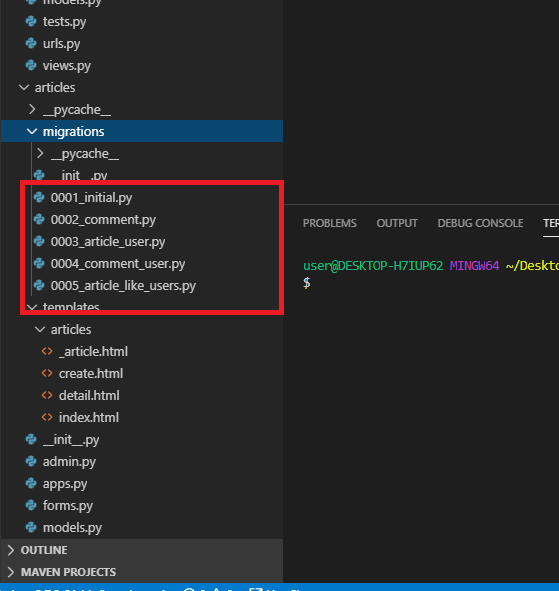
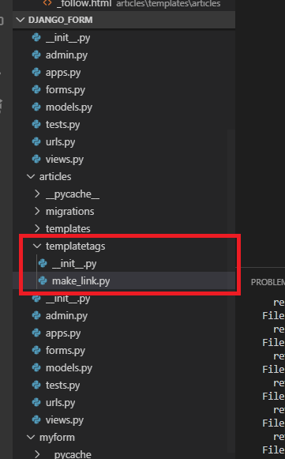
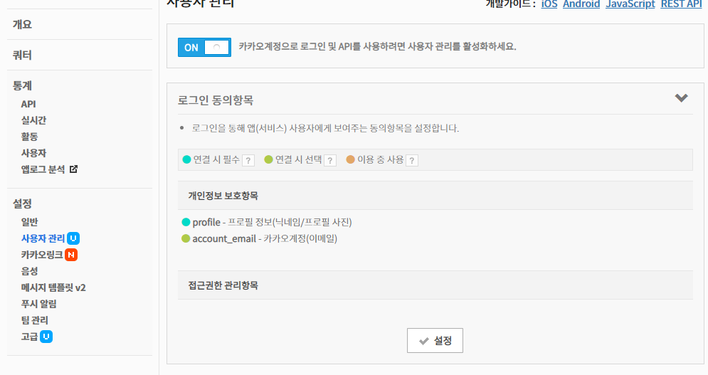
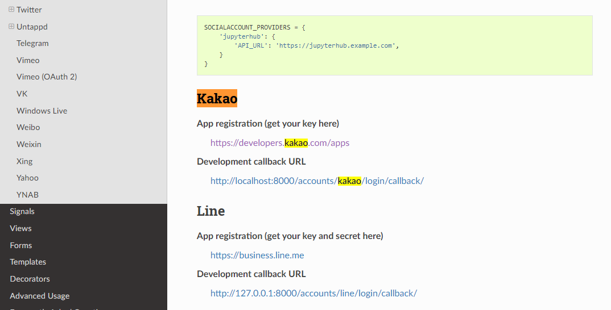
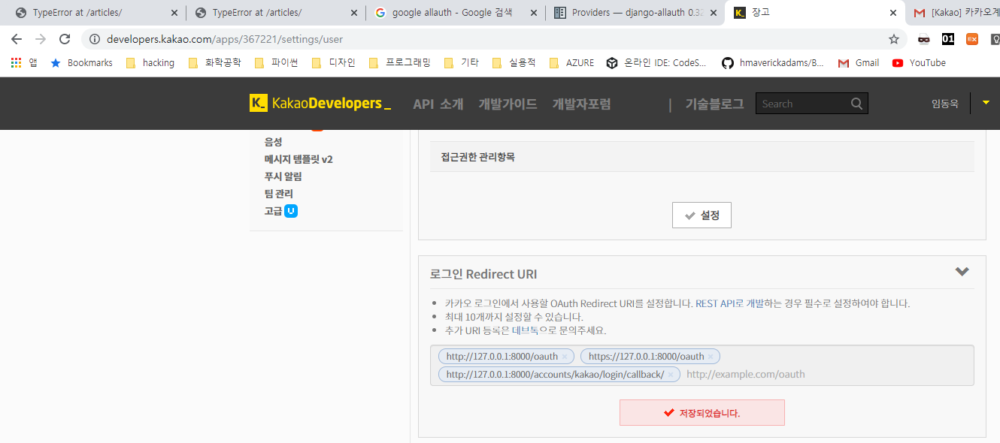

## TDD

```bash
(venv) $ pip install django_test_plus
```

```python
# articles/tests.py

from django.test import TestCase
from django.conf import settings
from .models import Article
from django.contrib.auth.models import User
# 위와 같이 불러오는 것도 가능한데, 테스트가 아닌 경우 이렇게 사용할 일은 없을 거에요

class SettingsTest(TestCase):
    def test_01_settings(self):
        self.assertEqual(settings.USE_I18N, True)
        self.assertEqual(settings.USE_TZ, True)
        self.assertEqual(settings.LANGUAGE_CODE, 'ko-kr')
        self.assertEqual(settings.TIME_ZONE, 'Asia/Seoul')

class ArticleModelTest(TestCase):
    def test_01_model(self):
        user = User.objects.create(username='test_user')
        article = Article.objects.create(title='test title', context='test content')
        self.assertEqual(str(article), f'{article.content}')
```


## 실행

```bash
(venv) $ python manage.py test articles
```


단점은 개발을 하면서 알게되는 부분들이 있는데,

그런 부분들은 고려해서 만들 수 없기 때문에, 커버를 하지 못합니다.


> `draw.io`에서 Entity Relationship Diagram (ERD)를 쉽게 그릴 수 있습니다.


## User model customizing

```python
# accounts/models.py

from django.db import models
from django.conf import settings
from django.contrib.auth.models import AbstractUser

# Create your models here.
class User(AbstractUser):
    followers = models.ManyToManyField(settings.AUTH_USER_MODEL, related_name='folowees')
```

위와 같이 모델을 만들어 줍니다.

맨 아랫줄에 다음과 같이 적어줍니다.

```python
# myform/settings.py

...

AUTH_USER_MODEL = 'accounts.User'
```



바뀐 설정을 적용하려면, 위의 migrations를 전부 삭제해줘야 합니다.

`migrations`에서 `__init__.py`를 제외하고 전부 삭제해 줍니다.

그리고 루트 디렉토리의 `db.sqlite3`파일을 삭제합니다.

```bash
(venv) $ python manage.py makemigrations
(venv) $ python manage.py migrate
```


db가 삭제되었으니, superuser를 새로 생성해줍니다.

```bash
(venv) $ python manage.py createsuperuser
```


이제 서버를 실행하고, 회원가입을 하면 오류가 뜹니다.

forms.py 파일로 가서 `CustomUserCreationForm`에서 `model = get_user_model()`을 추가합니다.

```python
# accounts/forms.py

from django.contrib.auth.forms import UserChangeForm, UserCreationForm
from django.contrib.auth import get_user_model

class CustomUserChangeForm(UserChangeForm):
    class Meta:
        model = get_user_model() # 원래는 여기에 유저 모델을 그대로 넣을 수 있겠지만, 지금은 그냥 모델을 가져오는 함수를 사용
        # https://github.com/django/django/blob/master/django/contrib/auth/forms.py
        # fields에는 모델의 내용을 모르기 때문에, 커스터마이징 해줍니다.
        fields = ('first_name', 'last_name')

class CustomUserCreationForm(UserCreationForm):
    class Meta(UserCreationForm.Meta):
        # username, password1, password2, email
        model = get_user_model()
        fields = UserCreationForm.Meta.fields + ('email', )
```


```python
# articles/views.py

...

def follow(request, article_pk, user_pk):
    # 게시글 유저
    you = get_object_or_404(get_user_model(), pk=user_pk)
    # 접속 유저
    me = request.user
    if you.followers.filter(pk=me.pk).exists():
        # if me in you.followers.all()
        # 위의 문법으로도 가능합니다.
        you.followers.remove(me)
    else:
        you.followers.add(me)
    return redirect('articles:detail', article_pk)
```


해당 주소에 접근할 수 있게 url에도 follow를 추가합니다.

```python
# articles/users.py

from django.urls import path
from . import views

app_name = "articles"
urlpatterns = [
    path('', views.index, name="index"),
    path('create/', views.create, name="create"),
    path('<int:article_pk>/', views.detail, name="detail"),
    path('<int:article_pk>/delete/', views.delete, name="delete"),
    path('<int:article_pk>/update/', views.update, name="update"),
    path('<int:article_pk>/comments/', views.comments_create, name="comments_create"),
    path('<int:article_pk>/comments/<int:comment_pk>/delete/', views.comments_delete, name="comments_delete"),
    path('<int:article_pk>/like/', views.like, name='like'),
    path('<int:article_pk>/follow/<int:user_pk>/', views.follow, name='follow'),
]
```


views.py 페이지 수정

```python
# articles/views.py

...

def detail(request, article_pk):
    # article = Article.objects.get(pk=article_pk)
    article = get_object_or_404(Article, pk=article_pk)
    comments = Comment.objects.filter(article=article)
    person = get_object_or_404(get_user_model(), pk=article_pk.user_id)
    comment_form = CommentForm()
    context = {'article': article, 'comment_form': comment_form, 'comments': comments, 'person':person}
    return render(request, 'articles/detail.html', context)
...
```


```html
<!-- articles/templates/articles/detail.html -->

...


    <hr>
    <a href="">[UPDATE]</a>
    <a href="">[BACK]</a>

```


팔로우 현황을 나타내는 페이지를 detail.html에 포함시켜 줍니다.

```html
<!-- articles/templates/articles/_follow.html -->

<div class="jumbotron">
    <h1 class="display-4">{{person.username}}</h1>
    <p class="lead">
        팔로잉: {{person.followees.all|length}}/ 팔로워: {{person.followers.all|length}}
    </p>

    
        
            <a class="btn btn-primary btn-lg" href="#" role="button">Unfollow</a>
        
            <a class="btn btn-primary btn-lg" href="#" role="button">Follow</a>
        
    
</div>
```


자기 자신은 follow가 안되도록 아래와 같이 `if you != me`구문을 추가합니다.

```python
# articles/views.py

...

def follow(request, article_pk, user_pk):
    # 게시글 유저
    you = get_object_or_404(get_user_model(), pk=user_pk)
    # 접속 유저
    me = request.user
    if you != me:
        if you.followers.filter(pk=me.pk).exists():
            # if me in you.followers.all()
            # 위의 문법으로도 가능합니다.
            you.followers.remove(me)
        else:
            you.followers.add(me)
    return redirect('articles:detail', article_pk)
```


## 리팩토링 및 Hashtag 기능 만들기

```python
# articles/models.py

from django.db import models
from django.conf import settings

class Hashtag(models.Model):
    content = models.TextField(unique=True)
    # 중복되는 값이 여기로 들어올 수 없음
    
    def __str__(self):
        return self.content

# Create your models here.
class Article(models.Model):
    title = models.CharField(max_length=10)
    content = models.TextField()
    created_at = models.DateTimeField(auto_now_add=True)
    updated_at = models.DateTimeField(auto_now=True)
    user = models.ForeignKey(settings.AUTH_USER_MODEL, on_delete=models.CASCADE)
    hashtag = models.ManyToManyField(Hashtag, blank=True)
    like_users = models.ManyToManyField(
```


Hashtag를 Admin에 등록해 줍니다.

```python
# articles/admin.py

from django.contrib import admin
from .models import Article, Comment, Hashtag

# Register your models here.
class ArticleAdmin(admin.ModelAdmin):
    list_display = ('pk', 'title', 'content', 'created_at', 'updated_at')

class CommentAdmin(admin.ModelAdmin):
    list_display = ('pk', 'content', 'created_at', 'updated_at')

class HashtagAdmin(admin.ModelAdmin):
    list_display = ('content', )

admin.site.register(Article, ArticleAdmin)
admin.site.register(Comment, CommentAdmin)
admin.site.register(Hashtag, HashtagAdmin)
```


hashtag를 추가하는 기능을 만들어줍니다. hashtag는 content에 연달아서 붙여줍니다.

```python
# articles/views.py

@login_required
def create(request):
    if request.method == "POST":
        # 폼 인스턴스를 생성하고 요청에 의한 데이터로 채운다. (binding)
        form = ArticleForm(request.POST)
        # 폼이 유효한지 체크한다.
        if form.is_valid():
            article = form.save(commit=False)
            article.user = request.user
            article = form.save()
            # hashtag
            for word in article.content.split():
                if word.startswith('#'):
                    hashtag, created = Hashtag.objects.get_or_create(content=word)
                    article.hashtags.add(hashtag)

            # title = form.cleaned_data.get("title")
            # content = form.cleaned_data.get("content")
            # article = Article(title=title, content=content)
            # article.save()
            return redirect("articles:detail", article.pk)
    else:
        form = ArticleForm()
    context = {'form': form}
    return render(request, 'articles/create.html', context)

...

def update(request, article_pk):
    article = get_object_or_404(Article, pk=article_pk)
    if request.user == article.user:
        if request.method == "POST":
            form = ArticleForm(request.POST, instance=article)
            if form.is_valid():
                form.save()
                article.hashtags.clear()
                for word in article.content.split():
                    if word.startswith('#'):
                        hashtag, created = Hashtag.objects.get_or_create(content=word)
                        article.hashtags.add(hashtag)
                return redirect('articles:detail', article_pk)
                # article.title = form.cleaned_data.get("title")
                # article.content = form.cleaned_data.get("content")
                # article.save()
                return redirect("articles:detail", article_pk)
        else:
            form = ArticleForm(instance=article)
    else: # 글의 주인이 아닌 사람이 접근한 경우에는 main으로 보냄
        return redirect('articles:index')
    context = {'form': form}
    return render(request, 'articles/create.html', context)
```


### 해쉬태그에 해당하는 게시물 보여주기

```python
# articles/views.py

def hashtag(request, hash_pk):
    hashtag = get_object_or_404(Hashtag, pk=hash_pk)
    articles = hashtag.article_set.order_by('-pk')
    context = {
        'hashtag': hashtag,
        'articles': articles,
    }
    return render(request, 'articles/hashtag.html', context)
```

```python
# articles/users.py

from django.urls import path
from . import views

app_name = "articles"
urlpatterns = [
    path('', views.index, name="index"),
    path('create/', views.create, name="create"),
    path('<int:article_pk>/', views.detail, name="detail"),
    path('<int:article_pk>/delete/', views.delete, name="delete"),
    path('<int:article_pk>/update/', views.update, name="update"),
    path('<int:article_pk>/comments/', views.comments_create, name="comments_create"),
    path('<int:article_pk>/comments/<int:comment_pk>/delete/', views.comments_delete, name="comments_delete"),
    path('<int:article_pk>/like/', views.like, name='like'),
    path('<int:article_pk>/follow/<int:user_pk>/', views.follow, name='follow'),
    path('<int:hash_pk>/hashtag/', views.hashtag, name='hashtag'),
]
```

```html
<!-- articles/templates/articles/hashtag.html -->



<div class="jumbotron jumbotron-fluid">
    <div class="container">
        <h1 class="display-4">{{hashtag.content}}</h1>
        <p class="lead">{{articles|length}}개의 게시글</p>
    </div>
</div>
<hr>
<h3>{{hashtag.content}}를 게시한 글</h3>
<div class="row">
    
        <div class="col4 my-2">
            <div class="card">
                <div class="card-body">
                    <h5 class="card-title">{{article.title}}</h5>
                    <p class="card-text">{{article.like_users.all|length}}명이 좋아요.</p>
                    <p class="card-text">{{article.comment_set.all|length}}개의 댓글.</p>
                </div>
            </div>
        </div>
    
</div>

```




위와 같이 폴더를 만들어주고, 빈 파일들을 생성해 줍니다.

```python
# articles/templatetags/make_link.py

from django import template

register = template.Library()

@register.filter
def hashtag_link(article):
    # word 대신 article이라고 매개변수를 이름지은 이유는 헷갈릴 수 있어서...!!
    content = article.content
    hashtags = article.hashtags.all()

    for hashtag in hashtags:
        content = content.replace(
            hashtag.content, 
            f'<a href="/articles/{hashtag.pk}/hashtag/">{hashtag.content}</a>'
        )
    return content
```


```html
<!-- articles/templates/articles/detail.html -->




    <h1>DETAIL</h1>
    <hr>
    <p>글 번호: {{ article.pk }}</p>
    <p>글 제목: {{ article.title }}</p>
    <p>글 내용: {{ article.content|hashtag_link|safe}}</p>
...
```


# social login 기능 추가하기

```bash
(venv) $ pip install django-allauth
```


```python
# myform/settings.py

# Application definition
AUTHENTICATION_BACKENDS = [
    # Needed to login by username in Django admin, regardless of `allauth`
    'django.contrib.auth.backends.ModelBackend',

    # `allauth` specific authentication methods, such as login by e-mail
    'allauth.account.auth_backends.AuthenticationBackend',
]

INSTALLED_APPS = (
    ...
    # The following apps are required:
    'django.contrib.auth',
    'django.contrib.messages',
    'django.contrib.sites',

    'allauth',
    'allauth.account',
    'allauth.socialaccount',
    'allauth.socialaccount.providers.kakao',

...

SITE_ID = 1
```

```python
# myform/urls.py

"""myform URL Configuration

The `urlpatterns` list routes URLs to views. For more information please see:
    https://docs.djangoproject.com/en/2.2/topics/http/urls/
Examples:
Function views
    1. Add an import:  from my_app import views
    2. Add a URL to urlpatterns:  path('', views.home, name='home')
Class-based views
    1. Add an import:  from other_app.views import Home
    2. Add a URL to urlpatterns:  path('', Home.as_view(), name='home')
Including another URLconf
    1. Import the include() function: from django.urls import include, path
    2. Add a URL to urlpatterns:  path('blog/', include('blog.urls'))
"""
from django.contrib import admin
from django.urls import path, include 

urlpatterns = [
    path('admin/', admin.site.urls),
    path('articles/', include('articles.urls')),
    path('accounts/', include('accounts.urls')),
    path('accounts/', include('allauth.urls')),
]
```


```bash
(venv) $ python manage.py makemigrations
(venv) $ python manage.py migrate
```


이제 우리쪽에서 설정하는 부분은 끝났습니다.

kakao개발자 페이지로 들어갑니다.

```
설정 > 플랫폼 추가
사이트 도메인을 아래와 같이 추가해 줍니다.
http://127.0.0.1:8000/oauth
https://127.0.0.1:8000/oauth
http://localhost:8000/accounts/kakao/login/callback/

설정 > 사용자 관리
프로필정보, 카카오 계정(이메일) 정보 수집을 합니다.
수집 목적은 둘 다 장고 로그인 선택이라고 합니다.

다시 django-allauth 공식 문서로 들어가서
providers로 들어가면 kakao가 있습니다.

```








다시 카카오 개발자 페이지로 들어가서



로그인 Redirect URI를

```
http://127.0.0.1/oauth
https://127.0.0.1/oauth
https://127.0.0.1:8000/accounts/kakao/callback/
```

위와 같이 설정합니다.


admin 페이지로 들어가서

소셜 어플리케이션 추가에 들어갑니다.

`클라이언트 아이디`와 `비밀키`가 중요합니다.

클라이언트 아이디는 카카오 개발자 페이지에서 `REST API`를 가져오면 되고,

카카오 개발자 페이지에서 설정 > 고급 >  상태 ON > 적용

이후에 secret key를 복사해서 장고 비밀키에다 넣어줍니다.

마지막으로 sites를 example.com을 일단 오른쪽으로 넣어줍니다.(바로 아래에서 변경합니다.)


### site 변경

장고 admin으로 가서

도메인명을 127.0.0.1:8000, 

표시명을 127.0.0.1:8000으로 저장


로그인 파일을 만들어 줍니다.

```html
<!-- articles/templates/articles/login.html -->






<h1>로그인</h1>
<form action="" method="POST">
    
    
    
</form>
<a href="" class="btn btn-warning">카카오 로그인</a>

```


카카오로 로그인 되면 에러가 뜰거에요.

기본적으로 `/accounts/profile/`로 결과 반환이 돌아오는데,

settings.py에서

```python
LOGIN_REDIRECT_URL = 'articles:index'
```

위와 같이 설정하면, 메인으로 가집니다.

Django 끝