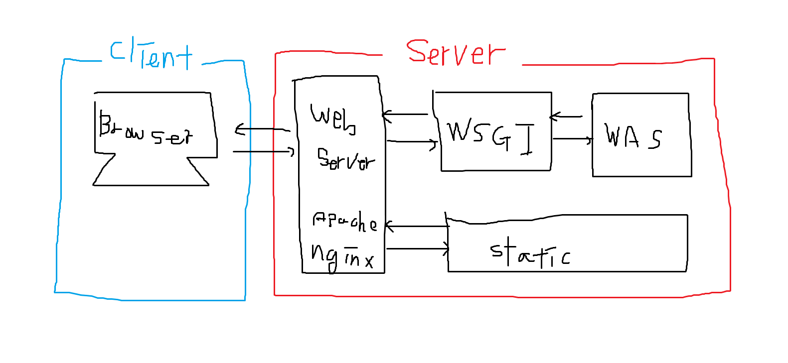
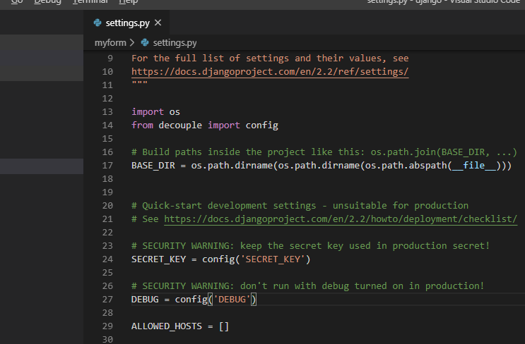
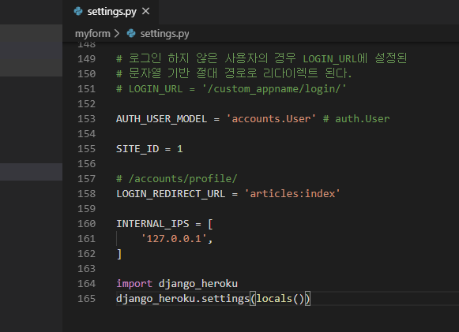

# 배포

전체 구조






```
# .env
SECRET_KEY='caau^3^02!3()!^vo$m0=*jyte!8#2yjhr02l4ws18##ony_+#'
DEBUG=True
```


```bash
(venv) $ pip install django-heroku
```


settings.py의 맨 마지막 줄에 이렇게 추가해 줍니다.




## Procfile 만들기

```bash
(venv) $ touch Procfile
```


Procfile

아래에서 myform은 다른 프로젝트 이름으로 대체될 수 있습니다.

```
web: gunicorn myform.wsgi --log-file -

```


```bash
(venv) $ pip install gunicorn
```

gunicorn은 WSGI의 일종입니다.


```bash
(venv) $ touch runtime.txt
```

```bash
(venv) $ python -V
```

위의 명령어에서 버젼을 확인한 다음

runtime.txt에다 그 내용을 적습니다. `dash(-)`가 있다는 점에 주의

```
python-3.7.5
```

```bash
(venv) $ pip freeze > requirements.txt
```


## 헤로쿠로 이동

로그인 한 다음,

왼쪽 아래에서 `heroku.com`을 선택

상단 바에서 `heroku cli`검색

```
https://devcenter.heroku.com/articles/heroku-cli
```

위의 주소로 이동합니다.


다운로드를 한 후, vs code를 재시작 해줍니다.

이제 `vs code의 git bash`에서 heroku라는 명령어를 사용할 수 있습니다.

```bash
(venv) $ heroku login
(venv) $ heroku create [app_name] # [app_name]에 아무것도 넣지 않으면, 자동으로 넣어줌
(venv) $ git remote -v # 명령어 실행을 했을 때, heroku라는 remote가 2개 생성되어 있어야 합니다.
(venv) $ git push heroku master
```


이제 dash보드로 와보면, 

Config Vars가 있습니다.

```
SECRET_KEY
DEBUG
```

이 두 값을 아까 .env 파일에 저장했던 값과 같이 저장을 해줍니다.

다만, DEBUG값은 False로 해줍니다.

```bash
(venv) $ git add .
(venv) $ git commit -m "commit message"
(venv) $ git push heroku master
```


맨 마지막 줄의

```
remote: Verifying deploy... done.
```

윗 줄이 출력되었는지 꼭 확인해야 합니다.


## 배포 확인

heroku dashboard에서 more 버튼 클릭
run console 클릭

```bash
python manage.py makemigrations
python manage.py migrate
python manage.py createsuperuser
```

하나의 명령어밖에 실행이 안되니까 anothoer command 버튼 클릭하기


로컬로 와서

```bash
$ heroku open
```


