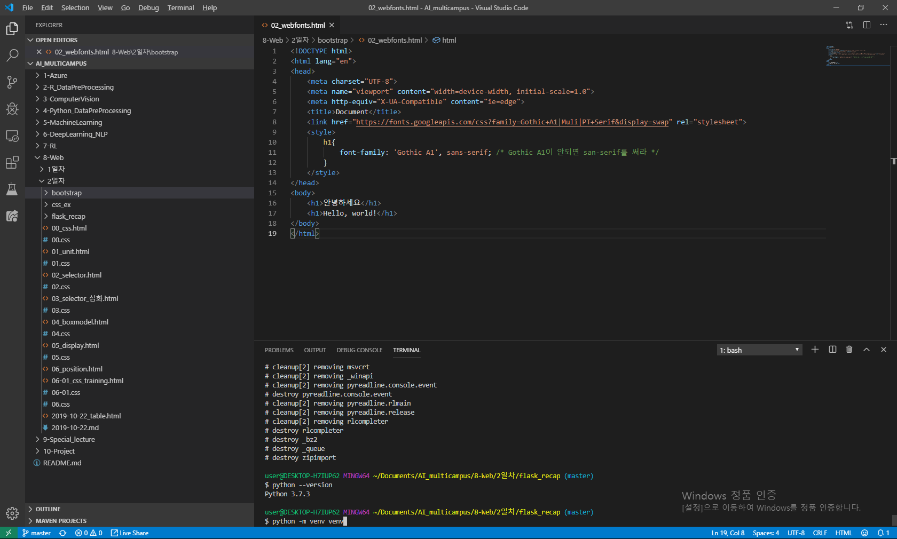

# css

- px: 디바이스 별로 px의 크기는 다르다
- %
- em은 배수 단위로 표현을 함
- rem(root em) 최상위 요소(html)의 사이즈를 기준으로 삼는다.
- Viewport 단위
  - vw: 너비의 1/100
  - vh: 높이의 1/100
  - vmin: 너비 또는 높이 중 작은 쪽의 1/100
  - vmax: 너비 또는 높이 중 큰 쪽의 1/100

## Color 표현

- hex: #ffffff
- rgb: rgb(0, 0, 0)
- rgba: rgba(0, 0, 0, 0)

## box model의 구성

### 1. block

항상 새로운 라인에서 시작한다.

화며ㅑㄴ 크기 전체의 가로폭을 을 차지한다. width: 100%

block 레벨 요소 내에 inline 레벨 요소를 포함할 수 있다.

### 2. inline

새로운 라인에서 시작하지 않으며 문장의 중간에 들어갈 수 있다.

content의 너비만큼 가로폭을 차지한다.

width, height, margin-top, margin-bottom 프로퍼티를 지정할 수 없다.

상, 하 여백은 inline-height로 지정한다.

inline 레벨 요소의 예

span, a, strong, img, br, input, select, textarea, button

> inline은 자신의 요소의 크기 만큼 공간차지를 함

### visibility Property

1. visible - 공간은 있지만 보이지 안는 것
2. hidden - 공간차지를 하지 않고 없음

### position

요소의 위치를 정의

1. static(기본 위치)

2. relative (상대 위치)

3. absolute (절대 위치)

   부모 요소 또는 가장 가까이 있는 조상 요소를 기준으로

4. fixed (고정 위치)

5. 

## 실습

## bootstrap

mx-0

mt-2: margin top -2

m margin

p padding

margin: 10px auto 10px; /* 좌우를 10px씩, 상하는 가운데 정렬  */

가상환경 만들 때는 `python -m venv venv`로 만듭니다.

## flask 코드 가져오기

google에서 flask 검색 > documentation > A minimal Application에서 코드 가져오기

### flask에서 template 사용하기

flask에서 template 사용하려면, 하위 폴더로 `template`라는 이름으로 폴더를 만들어 줘야 합니다.

