# Django

## history of django

django의 탄생

2005년 7월

2008년 v1.0

2017 v2.0

## django의 인기

https://hotframeworks.com


## 카페를 창업하는 두 가지 방법

- A-Z 전부 스스로 하는 방법
- 프렌차이즈 카페를 여는 방법


## 웹 서비스를 제작하는 두 가지 방법

- A-Z 전부 스스로 하는 방법
- 프레임워크를 사용해서 웹 서비스를 제작하는 방법


instagram, nasa, moz://a, youtube가 django를 사용했음


장고는 내부적으로 MVC를 사용하는데 장고는 MTV(model, template, view)로 구성되어 있습니다.

M: 데이터를 관리

T: 사용자가 보는 화면

V: 중간 관리자


## 데코레이터(학생들의 추가적인 이해를 돕기 위해)

```python
def hello(func):
    def wrapper():
        print('hihi')
        func()
        print('hihi')
    return wrapper

@hello
def bye():
    print("byebye")

bye()
```


## 가상환경 만들기

- git bash와 visual studio code가 설치되어 있다고 가정합니다.

visual studio code 내에서 

현재 폴더에서 가상환경에 관한 폴더를 만듭니다. 저는 8-web이라는 폴더 이하로 두겠습니다.

```bash
$ pwd
/c/Users/user/Documents/AI_multicampus/8-Web
$ python -m venv venv
```

이후

```bash
$ vi ~/.bashrc
```

```bash
export PATH="/c/Python/Python37:/c/Python/Python37/Scripts:$PATH"
alias python="winpty python"
alias activate="source venv/Scripts/activate"
```

위의 내용을 .bashrc에 기록합니다.

이후로 8-web에서 `activate`를 실행하면 됩니다.

```bash
# django 프로젝트 만들기
$ django-admin startproject django_intro .

# 서버 실행
$ python manage.py runserver
```

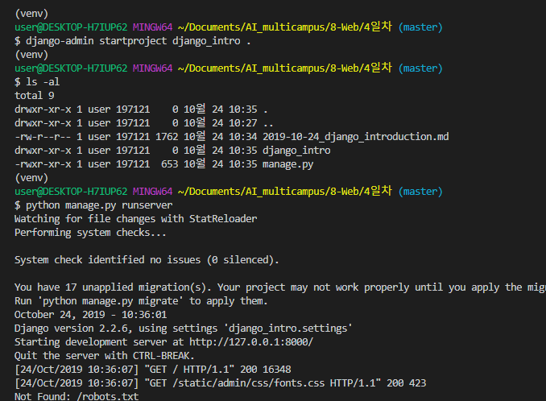

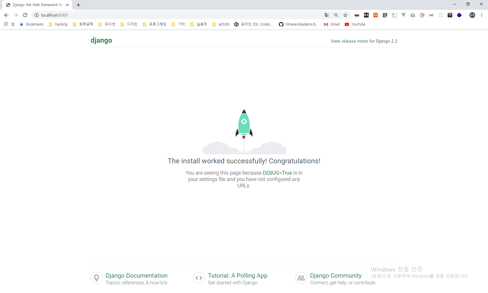

크롬을 켜고 localhost:8000으로 들어가면, django 페이지가 마중을 나와줍니다 !!

```bash
$ python manage.py startapp pages # pages는 앱 이름입니다.
```

model.py

django_admin에는 project에 관한 파일들이 있고, 앱을 만들면 앱에 관한 페이지가 나타납니다.


settings.py 파일에 여기에 INSTALLED_APPS에 'pages'를 한줄 추가해줘야 합니다.

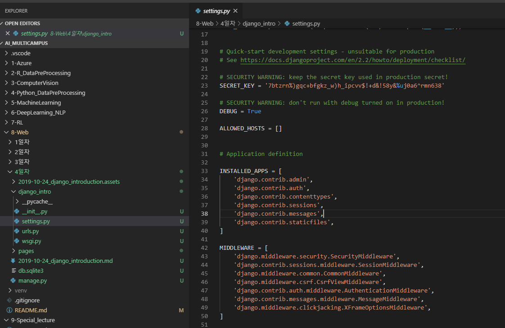

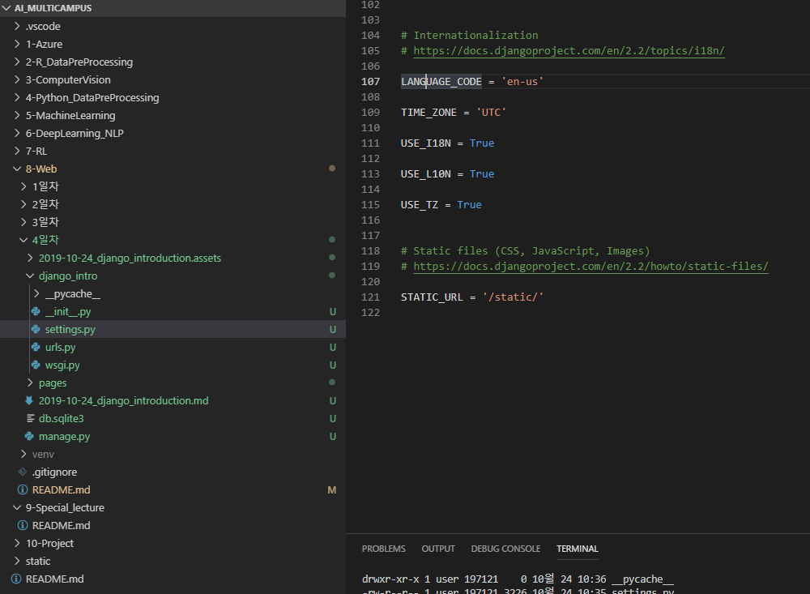

LANGUAGE_COD도 en-us에서 ko-kr로 바꿔줍니다.


## index페이지 작성(view 부분)

django_intro/pages/views.py를 다음과 같이 수정해줍니다.

```python
from django.shortcuts import render

# Create your views here.
def index(request):
    return render(request, 'index.html')
```


## urls 부분

django_intro/urls.py

```python
"""django_intro URL Configuration

The `urlpatterns` list routes URLs to views. For more information please see:
    https://docs.djangoproject.com/en/2.2/topics/http/urls/
Examples:
Function views
    1. Add an import:  from my_app import views
    2. Add a URL to urlpatterns:  path('', views.home, name='home')
Class-based views
    1. Add an import:  from other_app.views import Home
    2. Add a URL to urlpatterns:  path('', Home.as_view(), name='home')
Including another URLconf
    1. Import the include() function: from django.urls import include, path
    2. Add a URL to urlpatterns:  path('blog/', include('blog.urls'))
"""
from django.contrib import admin
from django.urls import path
from pages import views # pages앱의 views를 사용하기 위해서 불러오기

urlpatterns = [
    path('admin/', admin.site.urls),
    path('index/', views.index), # 경로 끝에 /를 붙이는 습관 만들기
]
```

```python
from django.shortcuts import render

# Create your views here.
def index(request):
    return render(request, 'pages/index.html')
```

위와 같이 적을 수 있는데, 장고가 자동으로 templates를 잡기 때문에 pages부터만 적으면 됩니다.


## 템플릿 만들기

pages/templates/pages/index.html

```html
<!DOCTYPE html>
<html lang="en">
<head>
    <meta charset="UTF-8">
    <meta name="viewport" content="width=device-width, initial-scale=1.0">
    <meta http-equiv="X-UA-Compatible" content="ie=edge">
    <title>Document</title>
</head>
<body>
    <h2>Hi django</h2>
</body>
</html>
```


```bash
$ python manage.py runserver
```

위의 명령어를 실행한 후, index로 접속하면 다음과 같은 창이 뜨게 됩니다.


## 실행 결과(localhost:8000/index)

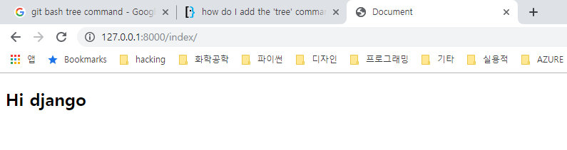


## 실습

자기소개 페이지를 `/introduce`라는 경로에 만들기

---

## get에서 restful 형태로 인자 넘기기

```python
# 라우팅: django_intro/urls.py
# <타입:이름> 형식으로 지정함

from django.contrib import admin
from django.urls import path
from pages import views

urlpatterns = [
    ...
    path('introduce/<str:name>/<int:age>/', views.introduce),
    ...
]
```

```python
# 뷰: pages/views.py
# context에 dictionary형식으로 넣어줍니다.
# views에서 request 이후에 인자로 받습니다.

from django.shortcuts import render

def introduce(request, name, age):
    context = {'name': name, 'age': age}
    return render(request, 'pages/introduce.html', context)
```

```html
<!-- 템플릿: pages/templates/pages/introduce.html -->
<!DOCTYPE html>
<html lang="en">
<head>
    <meta charset="UTF-8">
    <meta name="viewport" content="width=device-width, initial-scale=1.0">
    <meta http-equiv="X-UA-Compatible" content="ie=edge">
    <title>Document</title>
</head>
<body>
    😄안녕하세요 {{name}}입니다 {{age}}😄

</body>
</html>
```


아래와 같은 주소로 접근하면, 결과가 나오는 것을 볼 수 있습니다.


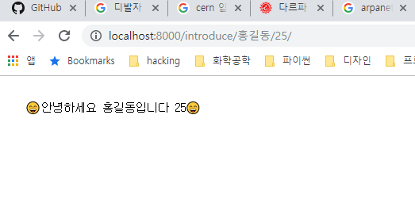


## DTL 사용하기


계속해서 기존에 만들어진 파일에 아래와 같이 코드들을 추가할 수 있습니다.

```python
# pages/views.py

# 중략

def template_language(request):
    menus = ['짜장면', '시저샐러드', '오트밀', '삼겹살']
    my_sentence = 'Life is short, you need python.'
    messages = ['apple', 'banana', 'cucumber', 'mango']
    datetimenow = datetime.now()
    empty_list = []
    context = {
        'menus': menus,
        'my_sentence': my_sentence,
        'datetimenow': datetimenow,
        'empty_list': empty_list,
        'messages': messages
    }
    return render(request, 'pages/template_language.html', context)

```

```html
<!-- pages/templates/pages/template_language.html -->
<!DOCTYPE html>
<html lang="en">
<head>
    <meta charset="UTF-8">
    <meta name="viewport" content="width=device-width, initial-scale=1.0">
    <meta http-equiv="X-UA-Compatible" content="ie=edge">
    <title>Document</title>
</head>
<body>
    <h3>1. 반복문</h3>
    
    <p>{{forloop.counter}} {{menu}}</p>
    <!-- forloop.counter를 넣으면 몇 번째 돌고 있는지 셀 수 있음 -->
    
    
    
    <p>{{user}}</p>
    
    <!-- empty: for 태그 안에 optional 하게 있음. 빈 리스트일 때 출력됨 -->
    <p>현재 가입한 유저가 없습니다.</p>
    
    <hr>

    <h3>2. 조건문</h3>
    
    <p>짜장면에는 고춧가루지 !</p>
    
    <hr>

    
        {{forloop.counter}}번째 도는 중..
        
        <p>짜장면 + 고춧가루</p>
        
            <p>{{menu}}</p>
        
    

    <h3>3. length filter 활용</h3>
    
    <!-- filter | -->
      
      <p>{{message}}, 글자가 너무 길어요.</p>
      
      <p>{{message }}, {{message|length}}</p>
      
    
    <hr><hr>

    <h3>4. lorem ipsum</h3>
    Lorem ipsum dolor sit amet consectetur adipisicing elit. Nostrum vero quibusdam voluptates officiis a harum corporis deleniti, veritatis impedit iure in, hic amet eaque, placeat molestias eligendi dolorum facilis fugit.
    <hr>
    <!-- 3개의 word를 뽑아줌 -->
    
    <!-- 2개의 paragraph를 뽑아줌 -->
    

    <h3>5. 글자수 제한(truncate)</h3>
    <!-- 단어 단위로 자르기 -->
    <p>{{my_sentence|truncatewords:3}}</p>
    <!-- 문자 단위로 자르기 -->
    <p>{{my_sentence|truncatechars:3}}</p>

    <h3>6. 글자 관련 필터</h3>
    <p>{{'abc'|length}}</p>
    <p>{{'ABC'|lower}}</p>
    <!-- 각 단어의 첫 번째 문자만 대문자로 나옴 -->
    <p>{{my_sentence|title}}</p>
    <!-- 첫 번째 문자만 대문자로 나옴 -->
    <p>{{'abc def'|capfirst}}</p>
    <!-- 하나만 랜덤으로 뽑아서 반환함 -->
    <p>{{menus|random}}</p>

    <h3>7. 연산</h3>
    <!-- 연산은 파이썬에서 처리하는게 낫기 때문에 사용할 일이 없습니다. -->
    <p>{{ 4|add:6}}</p>
    <hr>

    <h3>8. 날짜 표현</h3>
    {{ datetimenow }}<br>
    <!-- 같은 날짜표현이지만 now는 장고에서 제공해주는 기능입니다, -->
    <br>
    <br>
    <br>
    <br>

    <h3>9. 기타</h3>
    {{ 'google.com'| urlize }}


</body>
</html>
```

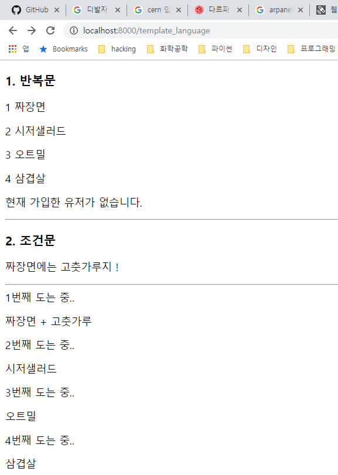

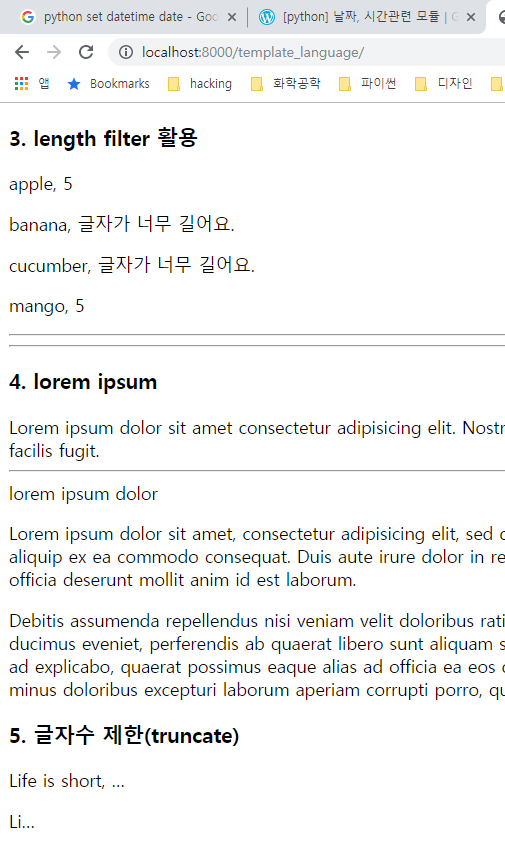

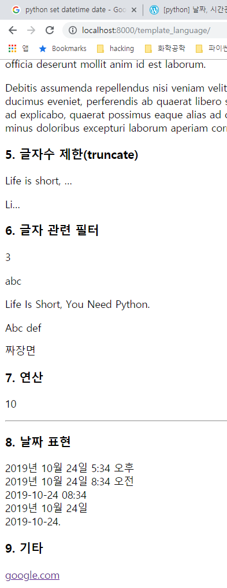

## 실습#1

오늘이 내 생일이면 '예' 아니면 '아니요'를 화면에 띄워주세요.

```python
# pages/views.py
def check_mybirth(request):
    return render(request, 'pages/check_mybirth.html')
```

```html
<!-- pages/check_mybirth.html -->
<!DOCTYPE html>
<html lang="en">
<head>
    <meta charset="UTF-8">
    <meta name="viewport" content="width=device-width, initial-scale=1.0">
    <meta http-equiv="X-UA-Compatible" content="ie=edge">
    <title>Document</title>
</head>
<body>
    
    
    
    예
    
    아니요
    
</body>
</html>
```


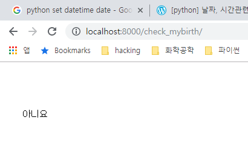


## 실습#2

문자열을 입력받아서, 회문 문자열인지 아닌지 판별하기

```python
# pages/views.py
def check_palindrom(request, str_pal):
    n_pal = len(str_pal)
    is_pal = True
    for i in range(0, n_pal//2):
        if str_pal[i] != str_pal[-i-1]:
            is_pal = False
    context = {'is_pal': is_pal, 'str_pal': str_pal}

    return render(request, 'pages/check_palindrom.html', context)
```

```html
<!-- pages/check_palindrom.html -->
<!DOCTYPE html>
<html lang="en">
<head>
    <meta charset="UTF-8">
    <meta name="viewport" content="width=device-width, initial-scale=1.0">
    <meta http-equiv="X-UA-Compatible" content="ie=edge">
    <title>Document</title>
</head>
<body>
    <p>{{str_pal}}은<br></p>

    
        <p>회문 문자열입니다.</p>
    
        <p>회문 문자열이 아닙니다.</p>
    
</body>
</html>
```


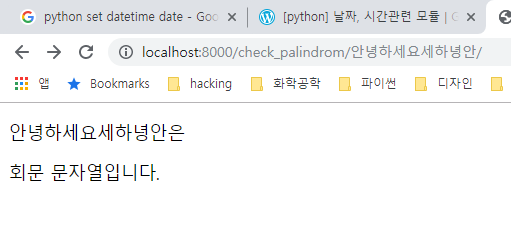