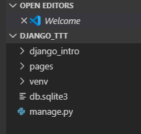

# HTML 복습


레이블 태그 사용하기

```html
<form action="" method="">
    <!-- 레이블을 사용하는 이유는 label을 클릭하면 자동으로 input이 활성화 됩니다. -->
    <label for="name">name</label>
    <input type="text" name="" id="name">
    <input type="submit">
</form>
```


# 장고 복습


```bash
# 가상환경 만들기
$ python -m venv venv

# 가상환경 활성화(~/.bashrc에 activate 설정이 되어 있어야 합니다.)
$ activate

# 장고 설치
$ pip install django

# 프로젝트 만들기
$ django-admin startproject django_intro_recap .

# 서버 실행 테스트
$ python manage.py runserver

# 앱 만들기
$ python manage.py startapp pages
```


위의 명령어들을 입력하면, 다음과 같은 구조가 형성됩니다.



그리고 settings.py에서 pages앱을 추가합니다.

```python
# urls.py

"""django_intro URL Configuration

The `urlpatterns` list routes URLs to views. For more information please see:
    https://docs.djangoproject.com/en/2.2/topics/http/urls/
Examples:
Function views
    1. Add an import:  from my_app import views
    2. Add a URL to urlpatterns:  path('', views.home, name='home')
Class-based views
    1. Add an import:  from other_app.views import Home
    2. Add a URL to urlpatterns:  path('', Home.as_view(), name='home')
Including another URLconf
    1. Import the include() function: from django.urls import include, path
    2. Add a URL to urlpatterns:  path('blog/', include('blog.urls'))
"""
from django.contrib import admin
from django.urls import path

from pages import views # pages 앱의 view

urlpatterns = [
    path('admin/', admin.site.urls),
    path('', views.index) # root url에는 views.index를 연결합니다.
]

```


루트 url에 접근할 때, path를 `''`로 해야 하고, `'/'`로 하면 오류가 납니다. (약속이기 때문에)


```python
# pages/views.py
from django.shortcuts import render

# Create your views here.
def index(request):
    return render(request, 'index.html')
```

```html
<!-- pages/templates/index.html -->
<h1>
    안녕하세요! 메인페이지 입니다.
</h1>
```

위의 `pages/templates/index.html` 파일에서는 앱 경로(pages)의 템플릿 폴더(templates)에 바로 파일을 두었지만, 앱 별로 스태틱 파일을 분리하기 위해서 `pages/templates/pages/index.html`의 형식이 더 좋습니다.


## 우리가 요청하고, 우리가 받기(throw & catch)

```python
# pages/views.py

# throw & catch 연습
def throw(request):
    return render(request, 'throw.html')
```

```html
<!-- throw.html -->
<form action="/catch/" method="get">
    <input type="text" name="message">
    <input type="text" name="message2">
    <input type="submit">
</form>
```

```python
# urls.py
urlpatterns = [
    path('throw/', views.throw),
    path('catch/', views.catch)
]
```

```python
# views.py
def throw(request):
    return render(request, 'throw.html')

def catch(request):
    message = request.GET.get("message")
    context = {
        'message': message,
        'message2': message2
    }
    return render(request, 'catch.html', context)
```

```html
<!-- catch.html -->
<h1>
    너가 던져서 내가 받은건
    {{message}}이랑
    {{message2}}야
    
</h1>
```


## request

```python
request
request.scheme
request.path
request.method
request.headers
request.META
request.GET
```

```python
# 4. 1~45 까지의 수 중에서 6개를 뽑아 리스트에 담자
l = random.sample(range(1,46), 6)
# 5. set를 활용해 교집합 연산을 활용, 실제 로또 당첨 번호의 검사기가 뽑아준 번호의 겹치는 개수
winner = []
a = set(l)
b = set(winner)
intersection = a.intersection(b)
len_intersection = len(intersection)

# 6. 매칭 결과에 따라 다른 응답 메시지 나타내기(보너스 번호 제외)
resp = ''
if len_intersection == 6:
    resp = '축하드립니다! 1등에 당첨되셨습니다.'
elif len_intersection == 5:
    resp = '2등에 당쳠되셨습니다 !!! 다음에는 1등에 도전하세요'
elif len_intersection == 4:
    resp = '4개가 겹치셨습니다. 우승상금 받아가세요 !!'
elif len_intersection == 3:
    resp = '대충 블라블라'
else:
    resp = '화이팅 !!! '

# 7. 딕셔너리를 넘기자!

context = {'resp':resp}
return render(request, 'jackpot.html', context)
```


## post로 데이터 전달하기

폼 태그에 ``을 넣어줘야 에러가 뜨지 않습니다.

```html
<form>
    
    <label for="name">아이디</label>
    <input type="text" id="name" name="name">
    <label for="password"
</form>
```


html에다 임의의 코드를 삽입하는 것을 xss라고 합니다. 코드를 때려박아서 공격하는 것을 XSS라고 하고, CSRF는 크로스 사이트 리퀘스트 forgery 라고 합니다.

```html



```

```html
<!-- static_example.html -->

...중략...
<link rel="stylesheet" href="">
...중략...

```

pages 앱의 하위로 static이라는 폴더를 만들어서 그 하위에 stylesheets 폴더와 images 폴더를 만들어 줍니다.


## url 로직 분리

```bash
$ python manage.py startapp utilities
```

```python
# urls.py
from django.contrib import admin
from django.urls import path, include

urlpatterns = [
    path('admin', admin.site.urls),
    path('pages/', include('pages.urls')),
    path('utilities/', include('utilies.urls'))
]
```


```python
# pages/urls.py
from django.urls import path
from . import views

urlpatterns = [
    path('', views.index),
]
```

## 장고의 static 페이지

templates 폴더를 찾을 때 settings.py에서

```python
INSTALLED_APPS = [
    'abc',
    'bcd',
    ...
]
```

위에서 부터 차례대로 templates 파일을 찾습니다. 따라서 페이지들이 같은 이름이 있을 경우에 겹치게 됩니다.

따라서 페이지들이 겹쳐지지 않도록 각 앱들의 templates 폴더 하위에 해당 앱의 이름으로 한 번 더 폴더를 만드는 것이 필요한 것입니다.


## 추가적인 페이지를 붙이기

```html
<!-- base.html -->
<!DOCTYPE html>
<html lang="en">
<head>
    <meta charset="UTF-8">
    <meta name="viewport" content="width=device-width, initial-scale=1.0">
    <meta http-equiv="X-UA-Compatible" content="ie=edge">
    <title>Document</title>
</head>
<body>
    <h1>템플릿 상속</h1>
    
    
</body>
</html>
```

```html
<!-- pages/index.html -->



<h1>안녕하세요! 메인페이지 입니다.</h1>

```

하지만 여기까지만 하면, 동작이 안됩니다.

settings.py에는 TEMPLATES에 DIRS가 기본적으로 자신의 앱만 볼 수 있도록 되어 있습니다.

```python
TEMPLATES = [
    ...
    'DIRS': [os.path.join('BASE_DIR, django_intro_recap', 'templates')],
    ...
]

```

따라서 위와 같이, 적어주시면 동작합니다.


## navbar 넣기

부트스트랩에서 css에 1개, js에 3개를 base.html에 추가하고, 

부트스트랩 사이트에서 components > navbar를 복사해서 붙여넣기

## 가상환경 외부로 내보내기

```bash
$ pip freeze > requirements.txt
$ pip install -r requirements.txt
```


## 실습: artii.herokuapp.com

위의 사이트에서

```text
http://artii.herokuapp.com/make?text=abc
```

해당 주소로 들어가면, 

```
        _          
       | |         
   __ _| |__   ___ 
  / _` | '_ \ / __|
 | (_| | |_) | (__ 
  \__,_|_.__/ \___|
```

위와 같은 결과를 얻을 수 있습니다. text에 abc 대신 다른 문자를 넣으면 아스키 아트로 결과물이 나옵니다.

위 사이트를 활용해서 영문자를 입력받고, 아스키아트를 출력하는 사이트를 만들기

(힌트: requests 활용)