# Database(ORM: Object-relational mapping 활용)


데이터베이스는 체계화된 데이터의 모임입니다.

몇 개의 자료 파일을 조직적으로 통합하여 자료항목의 중복을 없애고 조작할 수 있습니다.


- 스키마(scheme)
  데이터베이스에서 자료의 구조, 표현방법, 관계 등을 정의한 구조

1. 어떠한 구조로 데이터를 저장할지 스키마를 만들어야 합니다.
2. 각각의 속성이 어떠한 데이터 타입을 가질지 명시해야 합니다.
3. 우리가 만든 스키마를 토대로 데이터를 조작합니다.

- DDL(Data Definition Langauge), DML(Data Manufacturing Language), DCL(Data Control Langauge)
  - DDL의 예: CREATE, DROP, ALTER
  - DML의 예: INSERT, UPDATE, DELETE, SELECT
  - DCL의 예: GRANT, REVOKE

CRUD 오퍼레이션을 ORM을 통해서 합니다.


## sqlite3

sqlite 다운로드 받기

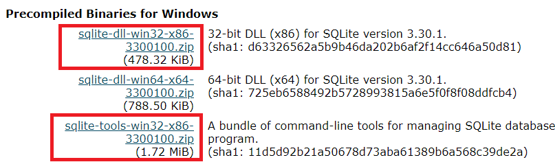


파일을 두개 다 받아서 하나의 폴더에다 넣습니다.

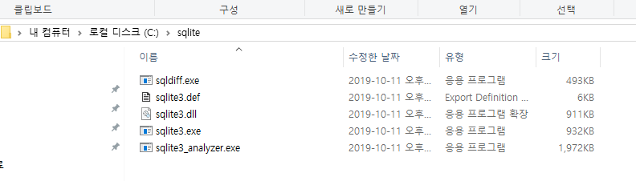


git bash에서 바로 실행하기 위해서 환경변수에도 설정해줍니다.

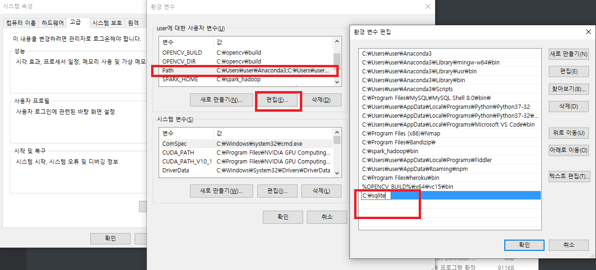


여기까지 하면, command 창에서는 실행이 되지만 git bash에서 실행이 되지 않습니다. 따라서, `~/.bashrc` 파일을 수정해야 합니다.


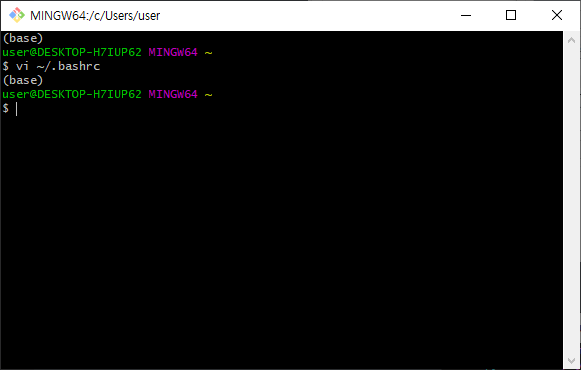


```bash
(venv) $ source ~/.bashrc
```

위의 명령어를 입력한 후, 이제 sqlite3가 git bash에서 실행이 됩니다.

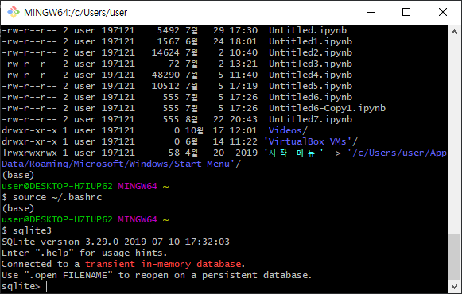

```bash
(venv) $ django-admin startproject crud .
```

settings.py에서 해당 앱(articles)를 추가해주고, 시간 값, 언어를 설정해줍니다.

이후 models.py를 수정해줍니다.

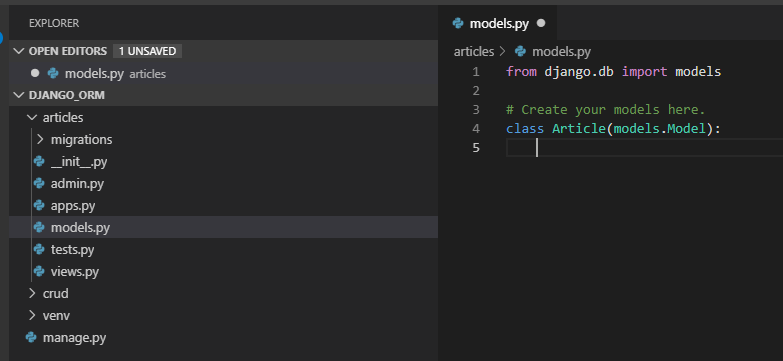

`Article`이라는 클래스를 만드는데 이 클래스는 `models.Model`을 항상 상속 받습니다.


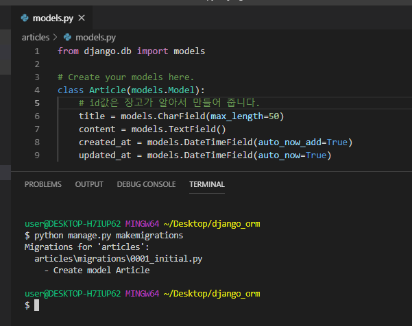

위와 같이

```python
# models.py

from django.db import models

class Article(models.Model):
    # id값은 장고가 알아서 만들어 줍니다.
    title = models.CharField(max_length=50)
    content = models.TextField()
    created_at = models.DateTimeField(auto_now_add=True)
    updated_at = models.DateTimeField(auto_now=True)
```

```bash
$ python manage.py makemigrations
```


명령을 실행시키면, articles/migrations 폴더에 다음과 같은 파일이 만들어집니다. 이게 설계도 같은거에요

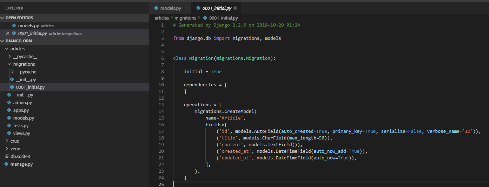


migrations는 설계도일뿐 아직 데이터베이스에 실제로 반영되지는 않은거에요

```bash
$ python manage.py migrate
```

위의 명령어를 입력해주면 실제로 반영이 됩니다.

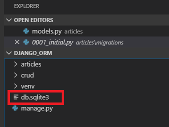

제대로 반영이 잘 되었는지 sqlite로 확인할 수 있습니다.

```bash
# django_orm 폴더에서
$ sqlite3 db.sqlite3
```


- 간단한 sqlite 명령어

```sqlite
.table
.exit
```


## sql문이 실제로 어떻게 적용되었는지 확인하는 명령어

sql문만 보여줄 뿐, 적용이 되는 것은 아닙니다.

```bash
$ python manage.py sqlmigrate articles 0001
# python manage.py sqlmigrate <앱 이름> <migration 번호만>
```


## migration이 적용되었는지 확인하는 명령어

```bash
$ python manage.py showmigrations
```

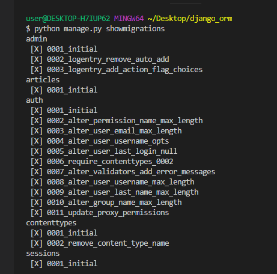

[x] 표시가 된 것은 makemigrations를 통해서 마이그레이션이 만들어졌고, migrate를 통해서 적용이 된 것이고

[x] 표시가 되지 않은 것은 makemigrations를 통해서 마이그레이션은 만들어졌지만, migrate가 되지 않은 것입니다.

```
1. models.py: 모델 작성 및 변경
2. makemigrations: migration 파일 생성 (설계도)
3. migrate: 실제 DB에 적용(테이블 생성)
```


## shell로 들어가기

```bash
$ python manage.py shell
```


## record를 만드는 첫 번째 방법(인스턴스를 만든 후 데이터 넣고 save)

```python
# Article 클래스를 불러옵니다.
>>> from articles.models import Article

# select * from <table>에 해당하는 명령어 입니다.
>>> Article.objects.all()
<QuerySet []>
>>> article1 = Article()
>>> article1
<Article: Article object (None)>
>>> article1.title = '1번제목'
>>> article1.title
'1번제목'
>>> article1.content = '1번내용'
>>> article1.content
'1번내용'
>>> article1.save()
>>> article1.created_at
datetime.datetime(2019, 10, 29, 1, 46, 35, 161295, tzinfo=<UTC>)
```


## record를 만드는 두 번째 방법(인스턴스를 만들면서 값을 넣어서 초기화 한 후 save)

```python
>>> article2 = Article(title='2번제목', content='2번내용')
>>> article2.title
'2번제목'
>>> article2.save()
>>>
```


## record를 만드는 세 번재 방법(create메소드 호출)

```python
>>> Article.objects.create(title='3번제목', content='3번 내용')
<Article: Article object (3)>
```

위의 방법은 save까지 한꺼번에 됩니다.

## validation check

```python
>>> article4 = Article()
>>> article4.title = '4번제목'
>>> article4.full_clean()
Traceback (most recent call last):
  File "<console>", line 1, in <module>
  File "C:\Users\user\Desktop\django_orm\venv\lib\site-packages\django\db\models\base.py", line 1203, in full_clean
    raise ValidationError(errors)
django.core.exceptions.ValidationError: {'content': ['이 필드는 빈 칸으로 둘 수 없습니다.']}
>>> article4.save()
>>> article4
<Article: Article object (4)>
>>> Article.objects.all()
<QuerySet [<Article: Article object (1)>, <Article: Article object (2)>, <Article: Article object (3)>, <Article: Article object (4)>]>
>>>
```

필수 항목인 Article.content를 입력하지 않았기 때문에, `article4.full_clean()`으로 유효성 검사를 하면

에러가 나옵니다. 따라서, 수동으로 수정을 해줘야 합니다. (자동으로 수정되지 않음)

그리고 유효성 검사를 통과하지 못하더라도 article의 저장은 됩니다.


## class의 출력 형식 변경

```python
# articles/models.py
from django.db import models

# Create your models here.
class Article(models.Model):
    # id값은 장고가 알아서 만들어 줍니다.
    title = models.CharField(max_length=50)
    content = models.TextField()
    created_at = models.DateTimeField(auto_now_add=True)
    updated_at = models.DateTimeField(auto_now=True)

    def __str__(self):
        return f'{self.id}번글- {self.title}: {self.content}'
```

models.py의 내용은 변경이 되었지만, 모델이 변경되지 않았기 때문에 마이그레이션은 해주지 않아도 됩니다.


shell을 종료해 주시고, 다시 shell을 실행합니다.

```bash
$ python manage.py shell
```


```python
>>> from articles.models import Article
>>> Article.objects.all()
<QuerySet [<Article: 1번글- 1번제목: 1번내용>, <Article: 2번글- 2번제목: 2번내용>, <Article: 3번글- 3번제목: 3번 내용>, <Article: 4번글- 4번제목: >]>
```

실행해보면, 출력 형식이 달라진 것을 확인할 수 있습니다.


## 데이터 가져오기

### get - 하나의 레코드를 가져올 때

```python
>>> article3 = Article.objects.get(pk=3)
# >>> article3 = Article.objects.get(id=3)
# id와 pk는 같습니다.
```


### filter - 필터 적용

```python
# filter 적용하기
>>> article = Article.objects.filter(title='3번제목')
>>> article
<QuerySet [<Article: 3번글- 3번제목: 3번 내용>]>
```


### last - 마지막 항목 가져오기

```python
>>> article = Article.objects.all().last()
>>> article
<Article: 4번글- 4번제목 : >
```


### order_by - 쿼리 결과를 정렬해서 반환

```python
# 오름차순 정렬
>>> articles = Article.objects.all().order_by('pk')
>>> articles
<QuerySet [<Article: 1번글- 1번제목: 1번내용>, <Article: 2번글- 2번제목: 2번내용>, <Article: 3번글- 3번제목: 3번 내용>, <Article: 4번글- 4번제목: >]>
```

```python
# 내림차순 정렬
>>> articles = Article.objects.all().order_by('-pk')
>>> articles
<QuerySet [<Article: 4번글- 4번제목: >, <Article: 3번글- 3번제목: 3번 내용>, <Article: 2번글- 2번제목: 2번내용>, <Article: 1번글- 1번제목: 1번내용>]>
```


### indexing, slicing

```python
# 슬라이싱
>>> articles[:2]
<QuerySet [<Article: 4번글- 4번제목: >, <Article: 3번글- 3번제목: 3번 내용>]>

# 인덱싱
>>> articles[0]
<Article: 4번글- 4번제목: >
```


## 특정 데이터를 포함하는 레코드 찾기

```python
# SQL의 'like' 표현
>>> Article.objects.filter(title__contains='1번')
<QuerySet [<Article: 1번글- 1번제목: 1번내용>]>

# 특정 데이터로 시작하는 것 찾기
>>> Article.objects.filter(title__startswith='1')
<QuerySet [<Article: 1번글- 1번제목: 1번내용>]>

# 특정 데이터로 끝나는 것 찾기
>>> Article.objects.filter(title__endswith='목')
<QuerySet [<Article: 1번글- 1번제목: 1번내용>, <Article: 2번글- 2번제목: 2번내용>, <Article: 3번글- 3번제목: 3번 내용>, <Article: 4번글- 4번제목: >]>
```


## update

단순히 레코드를 가져와서 정보를 바꾸고 save()해주면 정보가 업데이트 됩니다.

```python
>>> article = Article.objects.get(pk=1)
>>> article.title
'1번제목'
>>> article.title = '2번제목'
>>> article.title
'2번제목'
>>> article.save()
```


## delete

```python
>>> article = Article.objects.get(pk=1)
>>> article.delete()
```


## admin page

`localhost:8000/admin`: 페이지에서 관리자 권한으로 데이터를 관리할 수 있습니다.

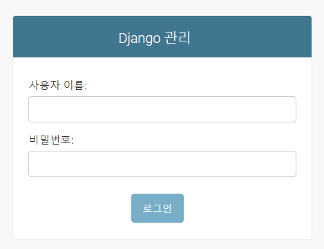

하지만, 슈퍼유저가 없기 때문에 만들어줘야 합니다.

```bash
$ python manage.py createsuperuser
사용자 이름 (leave blank to use 'user'): noelbird
이메일 주소:
Password:
Password (again):
Superuser created successfully.
```

또한 슈퍼유저를 만들려면 최초의 migrate를 해줘야 합니다.


```python
# articles/admin.py
from django.contrib import admin
from .models import Article

# Register your models here.
admin.site.register(Article)
```


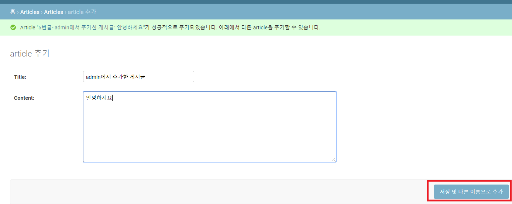

밖으로 나가면 다음과 같이 게시글들이 있습니다.


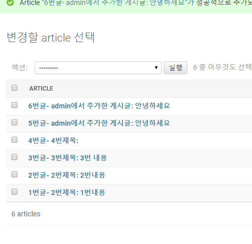


하지만 깔끔하게 보이도록 하기 위해서 다음과 같이 코드를 추가해 줍니다.

```python
# articles/admin.py
from django.contrib import admin
from .models import Article

# Register your models here.
class ArticleAdmin(admin.ModelAdmin):
    list_display = ('pk','title', 'content', 'created_at', 'updated_at')
    list_filter = ('created_at',) # 콤마를 찍지 않으면 튜플로 인식되지 않아 오류가 납니다.

admin.site.register(Article, ArticleAdmin)
```

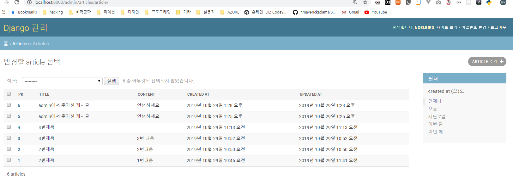


## django extentions

설치

```bash
$ pip install django-extensions
```

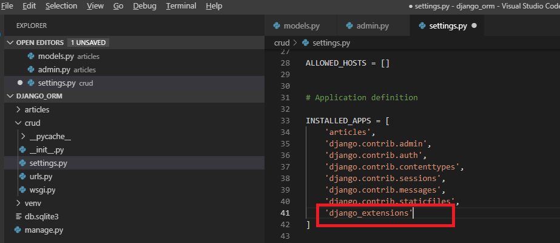

주의할 점은 설치는 `-`로 했으나, 불러올 때는 django_extensions로 `_`가 들어갑니다.

이제 `python manage.py shell_plus`로 접속하면 알아서 모델들을 불러와 줍니다.

```bash
$ python manage.py shell_plus
# Shell Plus Model Imports
from articles.models import Article
from django.contrib.admin.models import LogEntry
from django.contrib.auth.models import Group, Permission, User
from django.contrib.contenttypes.models import ContentType
from django.contrib.sessions.models import Session
# Shell Plus Django Imports
from django.core.cache import cache
from django.conf import settings
from django.contrib.auth import get_user_model
from django.db import transaction
from django.db.models import Avg, Case, Count, F, Max, Min, Prefetch, Q, Sum, When, Exists, OuterRef, Subquery
from django.utils import timezone
from django.urls import reverse
Python 3.7.3 (default, Apr 24 2019, 15:29:51) [MSC v.1915 64 bit (AMD64)] on win32
Type "help", "copyright", "credits" or "license" for more information.
(InteractiveConsole)
>>>
```


## CRUD

```bash
$ mkdir django_crud && cd django_crud # 프로젝트 폴더 만들고 이동
$ python -m venv venv # venv라는 이름으로 가상환경 만들기
$ pip install django # 장고 다운로드
```


두개의 templates 폴더를 프로젝트 폴더(django_crud)와 앱 폴더(articles)에 만들어 줍니다.

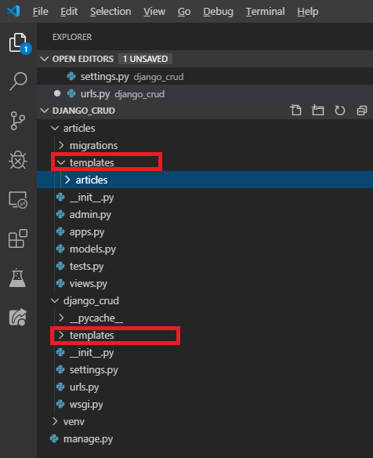


기본적으로 프로젝트 폴더에 들어 있는 templates 폴더는 장고가 인식하지 못하기 때문에,

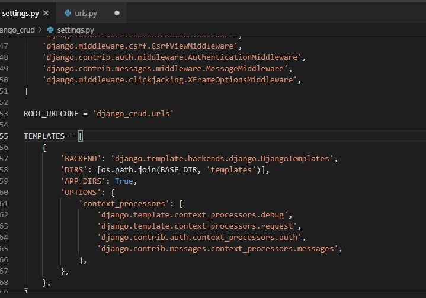

```python
TEMPLATES = [
    {
        ...
        'DIRS': [os.path.join(BASE_DIR, 'templates')],
        ...
    }
]
```

위와 같이 입력해 줍니다. (os는 기본적으로 import 되어 있습니다.)


### base 템플릿 파일 만들기

```html
<!-- django_crud/base.html -->
<!DOCTYPE html>
<html lang="en">

<head>
    <meta charset="UTF-8">
    <meta name="viewport" content="width=device-width, initial-scale=1.0">
    <meta http-equiv="X-UA-Compatible" content="ie=edge">
    <title>Document</title>
    <link rel="stylesheet" href="https://stackpath.bootstrapcdn.com/bootstrap/4.3.1/css/bootstrap.min.css"
        integrity="sha384-ggOyR0iXCbMQv3Xipma34MD+dH/1fQ784/j6cY/iJTQUOhcWr7x9JvoRxT2MZw1T" crossorigin="anonymous">

</head>

<body>
    
    
    <script src="https://code.jquery.com/jquery-3.3.1.slim.min.js"
        integrity="sha384-q8i/X+965DzO0rT7abK41JStQIAqVgRVzpbzo5smXKp4YfRvH+8abtTE1Pi6jizo" crossorigin="anonymous">
    </script>
    <script src="https://cdnjs.cloudflare.com/ajax/libs/popper.js/1.14.7/umd/popper.min.js"
        integrity="sha384-UO2eT0CpHqdSJQ6hJty5KVphtPhzWj9WO1clHTMGa3JDZwrnQq4sF86dIHNDz0W1" crossorigin="anonymous">
    </script>
    <script src="https://stackpath.bootstrapcdn.com/bootstrap/4.3.1/js/bootstrap.min.js"
        integrity="sha384-JjSmVgyd0p3pXB1rRibZUAYoIIy6OrQ6VrjIEaFf/nJGzIxFDsf4x0xIM+B07jRM" crossorigin="anonymous">
    </script>
</body>

</html>
```


### url 나누기

프로젝트 urls.py 파일

```python
# django_crud/urls.py

"""django_crud URL Configuration

The `urlpatterns` list routes URLs to views. For more information please see:
    https://docs.djangoproject.com/en/2.2/topics/http/urls/
Examples:
Function views
    1. Add an import:  from my_app import views
    2. Add a URL to urlpatterns:  path('', views.home, name='home')
Class-based views
    1. Add an import:  from other_app.views import Home
    2. Add a URL to urlpatterns:  path('', Home.as_view(), name='home')
Including another URLconf
    1. Import the include() function: from django.urls import include, path
    2. Add a URL to urlpatterns:  path('blog/', include('blog.urls'))
"""
from django.contrib import admin
from django.urls import path, include

urlpatterns = [
    path('admin/', admin.site.urls),
    path('articles/', include('articles.urls')),
]

```


앱(articles)의 urls.py 파일

```python
# articles/urls.py
from django import path
from . import path

urlpatterns = [
    path('', views.index)
]
```


```python
# articles/models.py

from django.db import models

# Create your models here.
class Article(models.Model):
    # 필수적으로 CharField는 필수적으로 max_length를 넣어야 합니다.
    title = models.CharField(max_length=20)
    content = models.TextField()
    created_at = models.DateTimeField(auto_now_add=True)
    updated_at = models.DateTimeField(auto_now=True)

    def __str__(self):
        return self.title # 표현되는 방식은 간단하게 title만
```

```bash
$ python manage.py makemigrations
$ python manage.py migrate
```


## 새로운 게시글을 만드는 페이지 만들기

```python
# articles/views.py

from django.shortcuts import render

# Create your views here.
def index(request):
    return render(request, 'articles/index.html')

def new(request):
    return render(request, 'articles/new.html')
```


## urls.py

```python
# articles/urls.py
from django.urls import path
from . import views

urlpatterns = [
    path('', views.index),
    path('new/', views.new),
    path('create/', views.create)
]
```


## 템플릿 만들기(new.html)

```html
<!-- articles/templates/articles/new.html -->



    <h1 class="text-center">NEW</h1>
    <form action="/articles/create/">
        <input type="text" name="title"><br>
        <textarea name="content" id="" cols="30" rows="10"></textarea><br>
        <input type="submit" value="submit">
    </form>

```


```html
<!-- articles/templates/articles/create.html -->



    <h1 class="text-center">성공적으로 글이 작성되었습니다!</h1>

```


## admin 페이지 설정하기

```python
# articles/
from django.contrib import admin
from .models import Article # 이 부분 실수 많이하는데, 빠뜨리면 안됩니다.

# Register your models here.
class ArticleAdmin(admin.ModelAdmin):
    list_display = ('pk', 'title', 'content', 'created_at', 'updated_at')

admin.site.register(Article, ArticleAdmin)
```


## index에서 글들 볼 수 있게 만들기

```html
<!-- articles/index.html -->



<h1 class="text-center">Aritcles</h1>
<ul>
    
        <p>글 번호: {{article.pk}}</p>
        <p>글 제목: {{article.title}}</p>
        <p>글 내용: {{article.content}}</p>
        <hr>
    
</ul>


```


## 전송 형식을 POST로 바꾸기

```python
# articles/views.py

from django.shortcuts import render
from .models import Article

# Create your views here.
def index(request):
    context = {
        'articles': Article.objects.all()
    }
    return render(request, 'articles/index.html', context)

def new(request):
    return render(request, 'articles/new.html')

def create(request):
    title = request.POST.get('title')
    content = request.POST.get('content')
    Article.objects.create(title=title, content=content)
    return render(request, 'articles/create.html')

```

```html
<!-- articles/new.html-->



    <h1 class="text-center">NEW</h1>
    <form action="/articles/create/" method="POST">
        
        <input type="text" name="title"><br>
        <textarea name="content" id="" cols="30" rows="10"></textarea><br>
        <input type="submit" value="submit">
    </form>

```


## 리다이렉트

글을 작성한 후에 바로 /articles/로 이동하려고 합니다.

```python
# articles/views.py

from django.shortcuts import render, redirect
from .models import Article
...

def create(request):
    ...
    return redirect('/articles/')
```


get방식은 html을 요청하는 것이기 때문에 서버가 페이지를 렌더링 해줍니다. 하지만, post는 `어떤 요청을 처리해줘`하는 것이기 때문에 페이지를 렌더링 하지 않습니다.

예를 들어 아래와 같은 코드는 동작하지 않습니다.

```python
# articles/views.py

def create(request):
    title = request.POST.get('title')
    content = request.POST.get('content')
    Article.objects.create(title=title, content=content)
    return render(request, '/articles/')
```

