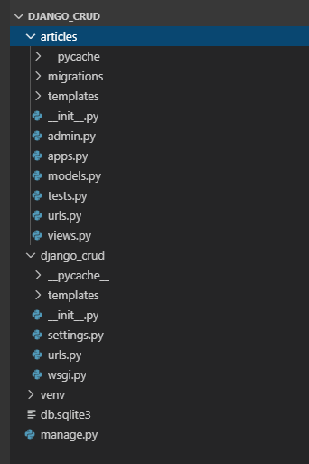

# REST

어제 내용에 이어서 하는 부분입니다.

```python
# articles/urls.py
from django.urls import path
from . import views

urlpatterns = [
    path('', views.index),
    path('new/', views.new),
    path('create/', views.create),
    path('detail/<int:pk>', views.detail)
]
```


```python
# articles/views.py

from django.shortcuts import render, redirect
from .models import Article

# Create your views here.
def index(request):
    context = {
        'articles': Article.objects.all()
    }
    return render(request, 'articles/index.html', context)

def new(request):
    return render(request, 'articles/new.html')

def create(request):
    title = request.POST.get('title')
    content = request.POST.get('content')
    Article.objects.create(title=title, content=content)
    return redirect('/articles/')

def detail(request, pk):
    article = Article.objects.get(pk=pk)
    context = {'article': article}
    return render(request, 'articles/detail.html', context)
```


```html
<!-- articles/detail.html -->

<h1 class="text-center">DETAIL</h1>
<h2>{{article.pk}}번째 글</h2>
<hr>
<p>{{article.title}}</p>
<p>{{article.content}}</p>
<p>{{article.create_at|date:"SHORT_DATE_FORMAT"}}</p>
<p>{{article.updated_at|date:"M, j, Y"}}</p>
<a href="/articles/">[BACK]</a>
```


## 삭제 기능 만들기

```python
# articles/views.py
...

def delete(request, pk):
    article = Article.objects.get(pk=pk)
    article.delete()
    return redirect('/articles/')
```

```python
# articles/urls.py

from django.urls import path
from . import views

urlpatterns = [
    path('', views.index),
    path('new/', views.new),
    path('create/', views.create),
    path('detail/<int:pk>', views.detail),
    path('<int:pk>/delete/', views.delete)
]
```


## 업데이트 기능 만들기

```python
# articles/urls.py
from django.urls import path
from . import views

urlpatterns = [
    path('', views.index),
    path('new/', views.new),
    path('create/', views.create),
    path('detail/<int:pk>', views.detail),
    path('<int:pk>/delete/', views.delete),
    path('<int:pk>/edit/', views.edit),
    path('<int:pk>/update/', views.update)
]
```

```python
# articles/views.py
...

def edit(request, pk):
    article = Article.objects.get(pk=pk)
    context = {'article': article}
    return render(request, 'articles/edit.html', context)

def update(request, pk):
    article = Article.objects.get(pk=pk)
    title = request.POST.get('title')
    content = request.POST.get('content')
    
    article.title = title
    article.content = content

    article.save()

    return redirect('/articles/')

```

```html
<!-- articles/detail.html -->
<h1 class="text-center">DETAIL</h1>
<h2>{{article.pk}}번째 글</h2>
<hr>
<p>{{article.title}}</p>
<p>{{article.content}}</p>
<p>{{article.create_at|date:"SHORT_DATE_FORMAT"}}</p>
<p>{{article.updated_at|date:"M, j, Y"}}</p>
<a href="/articles/{{article.pk}}/delete/">[DELETE]</a>
<a href="/articles/">[BACK]</a>
<a href="/articles/{{article.pk}}/edit/">[EDIT]</a>
```


수정하는 화면

```html
<!-- articles/edit.html -->


<h1 class="text-center">EDIT</h1>
<form action="/articles/{{article.pk}}/update/" method="POST">
    
    <input type="text" name="title" value="{{article.title}}"><br>
    <textarea name="content" id="" cols="30" rows="10">{{article.content}}</textarea><br>
    <input type="submit" value="submit">
</form>

```


## CRUD 실습

```markdown

# CRUD 실습

## 0. students 앱을 만들어주세요.

- `django_crud` 프로젝트에서 진행해주세요.


## 1. Student 모델을 만들어주세요.

- `name`: 이름의 최대 길이는 20입니다.
- `email`: 이메일의 최대 길이는 20입니다.
- `birthday`: `DateField`를 이용해서 생일날짜를 저장해주세요.
- `age`: `IntegerField` 이용해주세요.

- `str`:  Student 모델의 인스턴스를 출력했을 때 함수를 사용하여 학생의 이름을 출력할 수 있도록 해주세요.


## 2. Student 모델을 Admin 사이트에 등록해주세요.

- `StudentAdmin` 클래스를 만들어주세요.
- `list_display` 이용하여 `Student` 모델의 필드값들을 관리자 페이지에서 볼 수 있도록 설정해주세요.


## 3. 전체 학생 목록을 보여주는 페이지를 구성해주세요.

- 경로는 `/students/` 입니다.
```


## url 태그

만약 html파일에다 링크를 하드코딩 했다면, 나중에 사이트 주소가 바뀌었을 때 일일이 손으로 수정해줘야 합니다.

하지만, 페이지 수가 많고 찾기가 힘들 수 있습니다. 따라서 url 태그를 사용해야 합니다.

```python
# articles/urls.py
from django.urls import path
from . import views

app_name = 'articles' # 앱 이름을 설정할 수도 있습니다.
# 앱 이름을 설정하면 html 파일에서 <a href="">
# 위와 같이 사용해야 하고, 만약 앱 이름이 없다면,
# <a href="">과 같이 사용합니다.

urlpatterns = [
    path('', views.index, name="index"),
    path('new/', views.new, name="new"),
    path('create/', views.create, name="create"),
    path('<int:pk>/', views.detail, name="detail"),
    path('<int:pk>/delete/', views.delete, name="delete"),
    path('<int:pk>/edit/', views.edit, name="edit"),
    path('<int:pk>/update/', views.update, name="update")
]
```


수정 전

```html
<!-- articles/detail.html -->
<h1 class="text-center">DETAIL</h1>
<h2>{{article.pk}}번째 글</h2>
<hr>
<p>{{article.title}}</p>
<p>{{article.content}}</p>
<p>{{article.create_at|date:"SHORT_DATE_FORMAT"}}</p>
<p>{{article.updated_at|date:"M, j, Y"}}</p>
<a href="/articles/{{article.pk}}/delete/" onclick="return confirm('삭제하시겠어요?')">[DELETE]</a>
<a href="/articles/">[BACK]</a>
<a href="/articles/{{article.pk}}/edit/">[EDIT]</a>
```


수정 후

```html
<!-- articles/detail.html -->
<h1 class="text-center">DETAIL</h1>
<h2>{{article.pk}}번째 글</h2>
<hr>
<p>{{article.title}}</p>
<p>{{article.content}}</p>
<p>{{article.create_at|date:"SHORT_DATE_FORMAT"}}</p>
<p>{{article.updated_at|date:"M, j, Y"}}</p>
<a href="">[EDIT]</a>
<a href="" onclick="return confirm('삭제하시겠어요?')">[DELETE]</a>
<a href="">[BACK]</a>
```


## views.py

```python
# articles/views.py

def func1(request):
    # 아래와 같이 사용할 수 있습니다.
    return redirect('articles:index')
```


## HTTP 기초

REST API, RESTful Architecture

HTTP 기본 속성: Stateless(상태정보가 저장되지 않음), Connecless(서버에 요청을 하고 응답을 한 이후에 연결은 끊어짐)


### HTML 에러

- 405 method not allowed:  예를 들어 post만 받는 경로인데, 사용자가 get 메소드를 사용해서 접속한 경우


### REST 구성

- 자원: URI
- 행위: HTTP Method
- 표현: Representations


### REST 특징

- Uniform: 지정한 리소스에 대한 조직을 일되고 한정적인 인터페이스로 활용
- stateless: 무상태성 성격을 가지고 있으며, 세션 정보나 쿠키 정보를 별도로 저장하지 않고 관리
- cacheable
- self-descriptiveness(가장 중요)
- client - server 구조
- 계층형 구조


### REST 중심 규칙

1. URI는 정보의 자원을 표현해야 한다.
2. 자원에 대한 행위는 HTTP Method로 표현한다.

`GET /users/1/read/` (X)

`GET /users/1/` (O)

1에 해당하는 컨텐츠를 `GET`한다는 의미이기 때문에 `read`같은 동사를 따로 쓸 필요가 없습니다.

`GET /users/1/delete` (X)

`DELETE /users/1/` (O)


### 기본

1. 슬래시(/)는 계층 관계를 나타내는데 사용
2. URI에는 소문자를 사용
3. 파일 확장자는 포함시키지 않음
4. 밑줄(_) 대신에 하이픈(-)을 사용


### restful on Django(show_urls)

```bash
$ python manage.py show_urls
```


## RESTful하게 앱을 바꾸기

```python
# articles/urls.py
from django.urls import path
from . import views

app_name = 'articles'

urlpatterns = [
    # 기존 url
    # path('', views.index, name="index"),
    # path('new/', views.new, name="new"),
    # path('create/', views.create, name="create"),
    # path('<int:pk>/', views.detail, name="detail"),
    # path('<int:pk>/delete/', views.delete, name="delete"),
    # path('<int:pk>/edit/', views.edit, name="edit"),
    # path('<int:pk>/update/', views.update, name="update")

    # 변경 후 url
    path('', views.index, name="index"),
    path('create/', views.create, name='create'),
    path('<int:pk>/', views.detail, name='detail'),
    path('<int:pk>/delete/', views.detail, name='delete'),
    path('<int:pk>/update/', views.update, name='update')

]
```


```python
# articles/views.py
# new 메소드를 삭제해 주고 create와 합쳐줍니다.

def create(request):
    if request.method == "POST":    
        title = request.POST.get('title')
        content = request.POST.get('content')
        article = Article.objects.create(title=title, content=content)
        return redirect('articles:detail', article.pk)
    else:
        return render(request, 'articles/new.html')
```


## 절대경로로 바꿔주는 기능


```python
# articles/model.py

from django.db import models
from django.urls import reverse

# Create your models here.
class Article(models.Model):
    title = models.CharField(max_length=20)
    content = models.TextField()
    created_at = models.DateTimeField(auto_now_add=True)
    updated_at = models.DateTimeField(auto_now=True)

    def __str__(self):
        return self.title
    
    def get_absolute_url(self):
        # ex. 'articles/10/'
        return reverse('articles:detail', args=[str(self.pk)])

```


index.html파일에서는 주석처리된 부분과 같은 기능을 아래의 a태그에서 가능하도록 해줍니다.

```html
<!-- articles/templates/index.html -->



<h1 class="text-center">Aritcles</h1>
<ul>
    
        <p>글 번호: {{article.pk}}</p>
        <p>글 제목: {{article.title}}</p>
        <p>글 내용: {{article.content}}</p>
        <!-- <a href="">[DETAIL]</a> -->
        <a href="{{article.get_absolute_url}}"> [DETAIL] </a>
        <hr>
    
</ul>


```


views.py에서도 아래와 같이 redirect를 간단하게 사용할 수 있습니다.

```python
# articles/views.py

...

def delete(request, pk):
    article = Article.objects.get(pk=pk)
    if request.method == "POST":
        article.delete()
        return redirect('articles:index')
    else:
        # return redirect('articles:detail', article.pk) # before
        return redirect(article) # after
```


## 현재까지 전체 소스 코드(CRUD)

폴더 구조



articles 앱 관련 파일

```python
# articles/admin.py

from django.contrib import admin
from .models import Article

# Register your models here.
class ArticleAdmin(admin.ModelAdmin):
    list_display = ('pk', 'title', 'content', 'created_at', 'updated_at')

admin.site.register(Article, ArticleAdmin)
```

```python
# articles/models.py

from django.db import models
from django.urls import reverse

# Create your models here.
class Article(models.Model):
    title = models.CharField(max_length=20)
    content = models.TextField()
    created_at = models.DateTimeField(auto_now_add=True)
    updated_at = models.DateTimeField(auto_now=True)

    def __str__(self):
        return self.title
    
    def get_absolute_url(self):
        # ex. 'articles/10/'
        return reverse('articles:detail', args=[str(self.pk)])

```

```python
# articles/urls.py

from django.urls import path
from . import views

app_name = 'articles'

urlpatterns = [
    # 기존 url
    # path('', views.index, name="index"),
    # path('new/', views.new, name="new"),
    # path('create/', views.create, name="create"),
    # path('<int:pk>/', views.detail, name="detail"),
    # path('<int:pk>/delete/', views.delete, name="delete"),
    # path('<int:pk>/edit/', views.edit, name="edit"),
    # path('<int:pk>/update/', views.update, name="update")

    # 변경 후 url
    path('', views.index, name="index"),
    path('create/', views.create, name='create'),
    path('<int:pk>/', views.detail, name='detail'),
    path('<int:pk>/delete/', views.delete, name='delete'),
    path('<int:pk>/update/', views.update, name='update')

]
```

```python
# articles/views.py

from django.shortcuts import render, redirect
from .models import Article

# Create your views here.
def index(request):
    context = {
        'articles': Article.objects.all()
    }
    return render(request, 'articles/index.html', context)

def create(request):
    if request.method == "POST":    
        title = request.POST.get('title')
        content = request.POST.get('content')
        article = Article.objects.create(title=title, content=content)
        return redirect('articles:detail', article.pk)
    else:
        return render(request, 'articles/new.html')

def detail(request, pk):
    article = Article.objects.get(pk=pk)
    context = {'article': article}
    return render(request, 'articles/detail.html', context)

def delete(request, pk):
    article = Article.objects.get(pk=pk)
    if request.method == "POST":
        article.delete()
        return redirect('articles:index')
    else:
        return redirect(article)

def update(request, pk):
    article = Article.objects.get(pk=pk)
    if request.method == "POST":
        title = request.POST.get('title')
        content = request.POST.get('content')
        
        article.title = title
        article.content = content

        article.save()

        return redirect('articles:index')
    else:
        context = {'article': article}
        return render(request, 'articles/update.html', context)
```


articles 앱의 템플릿들

```html
<!-- articles/templates/articles/create.html -->




    <h1 class="text-center">성공적으로 글이 작성되었습니다!</h1>

```

```html
<!-- articles/templates/articles/detail.html -->



<h1 class="text-center">DETAIL</h1>
<h2>{{article.pk}}번째 글</h2>
<hr>
<p>{{article.title}}</p>
<p>{{article.content}}</p>
<p>{{article.create_at|date:"SHORT_DATE_FORMAT"}}</p>
<p>{{article.updated_at|date:"M, j, Y"}}</p>
<a href="">[EDIT]</a>
<a href="" onclick="return confirm('삭제하시겠어요?')">[DELETE]</a>
<a href="">[BACK]</a>



```

```html
<!-- articles/templates/articles/index.html -->




<h1 class="text-center">Aritcles</h1>
<ul>
    
        <p>글 번호: {{article.pk}}</p>
        <p>글 제목: {{article.title}}</p>
        <p>글 내용: {{article.content}}</p>
        <a href="">[DETAIL]</a>
        <a href="{{article.get_absolute_url}}"> detail2 </a>
        <hr>
    
</ul>


```

```html
<!-- articles/templates/articles/new.html -->



    <h1 class="text-center">NEW</h1>
    <form action="" method="POST">
        
        <input type="text" name="title"><br>
        <textarea name="content" id="" cols="30" rows="10"></textarea><br>
        <input type="submit" value="submit">
    </form>

```

```html
<!-- articles/templates/articles/update.html -->


<h1 class="text-center">UPDATE</h1>
<form action="" method="POST">
    
    <input type="text" name="title" value="{{article.title}}"><br>
    <textarea name="content" id="" cols="30" rows="10">{{article.content}}</textarea><br>
    <input type="submit" value="submit">
</form>

```


프로젝트 관련 파일들

```python
# settings.py

"""
Django settings for django_crud project.

Generated by 'django-admin startproject' using Django 2.2.6.

For more information on this file, see
https://docs.djangoproject.com/en/2.2/topics/settings/

For the full list of settings and their values, see
https://docs.djangoproject.com/en/2.2/ref/settings/
"""

import os

# Build paths inside the project like this: os.path.join(BASE_DIR, ...)
BASE_DIR = os.path.dirname(os.path.dirname(os.path.abspath(__file__)))


# Quick-start development settings - unsuitable for production
# See https://docs.djangoproject.com/en/2.2/howto/deployment/checklist/

# SECURITY WARNING: keep the secret key used in production secret!
SECRET_KEY = 'v$k4t26*^5dxaxirdn*oka!xby!lm&1275f^4_%i@+)lylta5*'

# SECURITY WARNING: don't run with debug turned on in production!
DEBUG = True

ALLOWED_HOSTS = []


# Application definition

INSTALLED_APPS = [
    'articles',
    'django.contrib.admin',
    'django.contrib.auth',
    'django.contrib.contenttypes',
    'django.contrib.sessions',
    'django.contrib.messages',
    'django.contrib.staticfiles',
]

MIDDLEWARE = [
    'django.middleware.security.SecurityMiddleware',
    'django.contrib.sessions.middleware.SessionMiddleware',
    'django.middleware.common.CommonMiddleware',
    'django.middleware.csrf.CsrfViewMiddleware',
    'django.contrib.auth.middleware.AuthenticationMiddleware',
    'django.contrib.messages.middleware.MessageMiddleware',
    'django.middleware.clickjacking.XFrameOptionsMiddleware',
]

ROOT_URLCONF = 'django_crud.urls'

TEMPLATES = [
    {
        'BACKEND': 'django.template.backends.django.DjangoTemplates',
        'DIRS': [os.path.join(BASE_DIR, 'django_crud', 'templates')],
        'APP_DIRS': True,
        'OPTIONS': {
            'context_processors': [
                'django.template.context_processors.debug',
                'django.template.context_processors.request',
                'django.contrib.auth.context_processors.auth',
                'django.contrib.messages.context_processors.messages',
            ],
        },
    },
]

WSGI_APPLICATION = 'django_crud.wsgi.application'


# Database
# https://docs.djangoproject.com/en/2.2/ref/settings/#databases

DATABASES = {
    'default': {
        'ENGINE': 'django.db.backends.sqlite3',
        'NAME': os.path.join(BASE_DIR, 'db.sqlite3'),
    }
}


# Password validation
# https://docs.djangoproject.com/en/2.2/ref/settings/#auth-password-validators

AUTH_PASSWORD_VALIDATORS = [
    {
        'NAME': 'django.contrib.auth.password_validation.UserAttributeSimilarityValidator',
    },
    {
        'NAME': 'django.contrib.auth.password_validation.MinimumLengthValidator',
    },
    {
        'NAME': 'django.contrib.auth.password_validation.CommonPasswordValidator',
    },
    {
        'NAME': 'django.contrib.auth.password_validation.NumericPasswordValidator',
    },
]


# Internationalization
# https://docs.djangoproject.com/en/2.2/topics/i18n/

LANGUAGE_CODE = 'ko-kr'

TIME_ZONE = 'Asia/Seoul'

USE_I18N = True

USE_L10N = True

USE_TZ = True


# Static files (CSS, JavaScript, Images)
# https://docs.djangoproject.com/en/2.2/howto/static-files/

STATIC_URL = '/static/'

```


```python
# urls.py

"""django_crud URL Configuration

The `urlpatterns` list routes URLs to views. For more information please see:
    https://docs.djangoproject.com/en/2.2/topics/http/urls/
Examples:
Function views
    1. Add an import:  from my_app import views
    2. Add a URL to urlpatterns:  path('', views.home, name='home')
Class-based views
    1. Add an import:  from other_app.views import Home
    2. Add a URL to urlpatterns:  path('', Home.as_view(), name='home')
Including another URLconf
    1. Import the include() function: from django.urls import include, path
    2. Add a URL to urlpatterns:  path('blog/', include('blog.urls'))
"""
from django.contrib import admin
from django.urls import path, include

urlpatterns = [
    path('admin/', admin.site.urls),
    path('articles/', include('articles.urls')),
]

```


프로젝트의 기본 템플릿

```html
<!-- templates/base.html -->

<!DOCTYPE html>
<html lang="en">

<head>
    <meta charset="UTF-8">
    <meta name="viewport" content="width=device-width, initial-scale=1.0">
    <meta http-equiv="X-UA-Compatible" content="ie=edge">
    <title>Document</title>
    <link rel="stylesheet" href="https://stackpath.bootstrapcdn.com/bootstrap/4.3.1/css/bootstrap.min.css"
        integrity="sha384-ggOyR0iXCbMQv3Xipma34MD+dH/1fQ784/j6cY/iJTQUOhcWr7x9JvoRxT2MZw1T" crossorigin="anonymous">

</head>

<body>
    <div class="container">
        <a href="">[HOME]</a>
            
            
    </div>
    
    <script src="https://code.jquery.com/jquery-3.3.1.slim.min.js"
        integrity="sha384-q8i/X+965DzO0rT7abK41JStQIAqVgRVzpbzo5smXKp4YfRvH+8abtTE1Pi6jizo" crossorigin="anonymous">
    </script>
    <script src="https://cdnjs.cloudflare.com/ajax/libs/popper.js/1.14.7/umd/popper.min.js"
        integrity="sha384-UO2eT0CpHqdSJQ6hJty5KVphtPhzWj9WO1clHTMGa3JDZwrnQq4sF86dIHNDz0W1" crossorigin="anonymous">
    </script>
    <script src="https://stackpath.bootstrapcdn.com/bootstrap/4.3.1/js/bootstrap.min.js"
        integrity="sha384-JjSmVgyd0p3pXB1rRibZUAYoIIy6OrQ6VrjIEaFf/nJGzIxFDsf4x0xIM+B07jRM" crossorigin="anonymous">
    </script>
</body>

</html>
```

