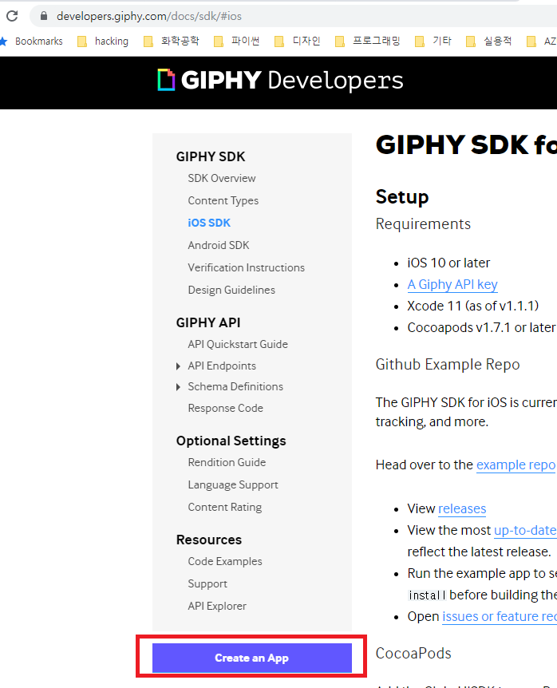
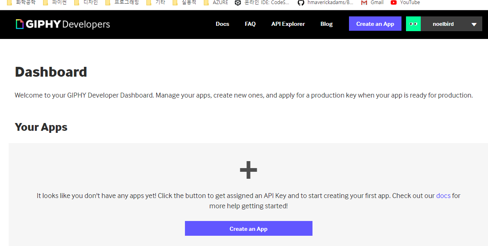
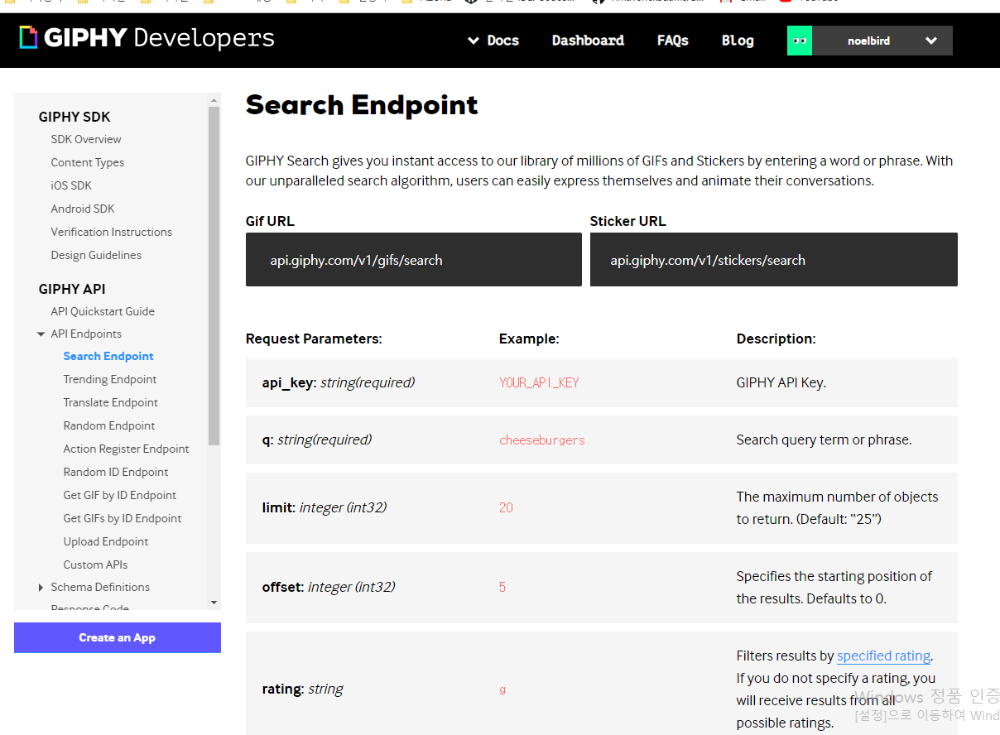
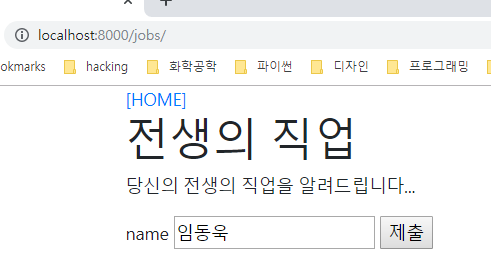
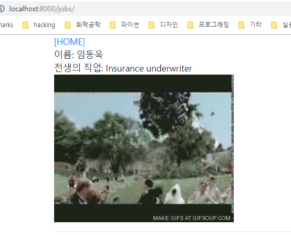

# 전생 직업 app 만들기, comment 기능 구현


## 전생 직업 app 만들기

7일차에 했던 django_crud에 이어서 합니다.

```bash
(venv) $ pip install faker
```


### faker 모듈 사용 방법

```python
>>> from faker import Faker
>>> fake = Faker('ko_KR') # 한국어가 아닌 경우 Faker() 로 호출
>>> fake.name()
>>> fake.address()
>>> fake.job()
```


### jobs 앱 만들기

jobs 앱을 새로 만들어줍니다.

```bash
(venv) $ python manage.py startapp jobs
```


settings.py에다 방금 추가한 앱을 등록해줍니다.

```python
# settings.py

INSTALLED_APPS = [
    'articles',
    'jobs',
    ...
```


모델을 만들어 줍니다.

```python
# jobs/models.py

from django.db import models

# Create your models here.
class Job(models.Model):
    name = models.CharField(max_length=20)
    past_job = models.TextField()

    def __str__(self):
        return self.name
```


관리자 페이지에 등록해줍니다.

```python
# jobs/admin.py

from django.contrib import admin
from .models import Job


# Register your models here.
class JobAdmin(admin.ModelAdmin):
    list_display = ('pk', 'name', 'past_job')

admin.site.register(Job, JobAdmin)
```


url 경로를 설정하기 위해서 프로젝트의 urls.py와 jobs/urls.py를 설정해줘야 합니다.


```python
# urls.py
"""django_crud URL Configuration

The `urlpatterns` list routes URLs to views. For more information please see:
    https://docs.djangoproject.com/en/2.2/topics/http/urls/
Examples:
Function views
    1. Add an import:  from my_app import views
    2. Add a URL to urlpatterns:  path('', views.home, name='home')
Class-based views
    1. Add an import:  from other_app.views import Home
    2. Add a URL to urlpatterns:  path('', Home.as_view(), name='home')
Including another URLconf
    1. Import the include() function: from django.urls import include, path
    2. Add a URL to urlpatterns:  path('blog/', include('blog.urls'))
"""
from django.contrib import admin
from django.urls import path, include

urlpatterns = [
    path('admin/', admin.site.urls),
    path('articles/', include('articles.urls')),
    path('jobs/', include('jobs'))
]

```


```python
# jobs/urls.py

from django.urls import path
from . import views

app_name = 'jobs' # 템플릿 내에서 url 태그를 사용하기 위해서 app_name을 지정해 줍니다.

urlpatterns = [
    path('', views.index, name='index')
]
```


템플릿 파일을 만듭니다.

```html
<!-- jobs/templates/jobs/index.html -->



<h1>전생의 직업</h1>
<p>당신의 전생의 직업을 알려드립니다...</p>

<form action="" method="POST">
    
    <label for="name">name</label>
    <input type="text" name="name" id="name">
    <input type="submit" value="제출">
</form>


```


## ORM에서 수행하는 SQL문 살펴보기

아래와 같은 식으로 동작합니다.

```python
print(Job.objects.all().query)
print(Job.objects.filter(name=name).query)
```


## jobs 앱에 사진 넣기

https://developers.giphy.com/docs/sdk

위의 주소에 들어가서 api를 사용합니다.




가입하고 나면 다음과 같이 화면이 표시됩니다.




GIPHY API > API Endpoints > Search Endpoints에 보면 사용 방법이 나와 있습니다.




```python
# jobs/views.py

from django.shortcuts import render
from decouple import config # API키를 .env파일에 숨기기 위해서 불러오기
import requests
from .models import Job

# Create your views here.
def index(request):
    if request.method == 'POST':
        name = request.POST.get("name")

        # db에 이름이 있는지 확인
        # db에 이미 같은 name이 있으면 기존 name의 past_job을 가져오기
        jobs = Job.objects.all()

        cur_job = None
        for job in jobs:
            if name == job.name:
                cur_job = job
        
        # 없으면 db에 저장한 후 가져오기
        if cur_job == None:
            from faker import Faker
            fake = Faker() # fake = Faker('ko_KR')
            past_job = fake.job()
            cur_job = Job()
            cur_job.name = name
            cur_job.past_job = past_job
            cur_job.save()
        
        GIPHY_API_KEY = config('GIPHY_API_KEY') # jobs/.env 파일로 GIPHY_API_KEY가 들어가 있습니다.
        url = f'https://api.giphy.com/v1/gifs/search?api_key={GIPHY_API_KEY}&q={cur_job.past_job}'
        # api를 사용해서 요청한 후 json 파싱까지 한번에 하기
        img_url = requests.get(url).json()['data'][0]['images']['downsized_large']['url']
        
        
        # 컨텍스트 딕셔너리 생성
        context = {
            'job': cur_job,
            'img_url': img_url
        }

        # 렌더링
        return render(request, 'jobs/job.html', context)
        # 선생님 코드
        # person = Job.objects.filter(name=name).first()
        # if person:
        #     past_job = person.past_job
        # else:
        #     fake = Faker('ko_KR')
        #     past_job = fake.job()
        #     past_job.name = name
        #     past_job.past_job = past_job
        #     past_job.save()
    else: # POST문이 아닌 방법으로 요청 받은 경우
        return render(request, 'jobs/index.html')

```


### 결과







## 1:N (one to many) 형식(comment 기능 구현)

Article과 Comment에서 보면,


| Article    | Comment         |
| ---------- | --------------- |
| PK         | PK              |
| title      | FK(Foreign Key) |
| content    | content         |
| created_at | created_at      |
| updated_at | updatedat       |


각 모델들은 위와 같이 구성되어 있습니다.

그리고 소스코드는 다음과 같습니다.

```python
# articles/models.py
from django.db import models
from django.urls import reverse

# Create your models here.
class Article(models.Model):
    title = models.CharField(max_length=20)
    content = models.TextField()
    created_at = models.DateTimeField(auto_now_add=True)
    updated_at = models.DateTimeField(auto_now=True)

    def __str__(self):
        return self.title
    
    def get_absolute_url(self):
        # ex. 'articles/10/'
        return reverse('articles:detail', args=[str(self.pk)])

class Comment(models.Model):
    content = models.CharField(max_length=200)
    created_at = models.DateTimeField(auto_now_add=True)
    updated_at = models.DateTimeField(auto_now=True)
    # models.CASCADE 외래키의 부모가 삭제 되었을 때 함께 삭제하도록 하는 옵션.
    # SET_NULL, SET_DEFAULT 옵션도 있음.
    article = models.ForeignKey(Article, on_delete=models.CASCADE)

    class Meta: # 메타 클래스를 지정해서, 순서를 정렬할 수도 있음
        # 맨 마지막에 생성된 것 기준으로 내림차순 정렬함
        ordering = ['-pk', ]
    
    def __str__(self):
        return self.content

```


변경된 모델들의 적용을 위해서 migrate를 해주어야 합니다.

```bash
(venv) $ python manage.py makemigrations
(venv) $ python manage.py migrate
```


sql로 직접 확인하려면 다음과 같이 sqlite3 쉘을 통해서 접근할 수 있습니다.

```sqlite
$ sqlite3 db.sqlite3
SQLite version 3.29.0 2019-07-10 17:32:03
Enter ".help" for usage hints.
sqlite> .tables -- 존재하는 테이블을 확인하는 명령어
articles_article            auth_user_user_permissions
articles_comment            django_admin_log
auth_group                  django_content_type
auth_group_permissions      django_migrations
auth_permission             django_session
auth_user                   jobs_job
auth_user_groups
sqlite> .schema articles_comment -- schema 명령어는 테이블의 스키마를 확인하는 명령어
CREATE TABLE IF NOT EXISTS "articles_comment" ("id" integer NOT NULL PRIMARY KEY AUTOINCREMENT, "content" varchar(200) NOT NULL, "created_at" datetime NOT NULL, "upda
ted_at" datetime NOT NULL, "article_id" integer NOT NULL REFERENCES "articles_article" ("id") DEFERRABLE INITIALLY DEFERRED);
CREATE INDEX "articles_comment_article_id_59ff1409" ON "articles_comment" ("article_id");
sqlite>
```


## 장고 extensions 설치, shell_plus 진입

shell_plus를 사용하는 이유는

기존에 `python manage.py shell`로 접속하면 클래스들을 알아서 인클루드 하지 않기 때문에 수동으로

인클루드 해야하는 불편함이 있었습니다. shell_plus를 사용하면 자동으로 인클루드를 해줍니다.

```bash
(venv) $ pip install django-extensions
```

```python
# settings.py

...

INSTALLED_APPS = [
    'articles',
    'jobs',
    'django.contrib.admin',
    'django.contrib.auth',
    'django.contrib.contenttypes',
    'django.contrib.sessions',
    'django.contrib.messages',
    'django.contrib.staticfiles',
    'django_extensions' # 장고 익스텐션을 추가해줍니다. (_)underscore에 주의해야 합니다.
]
```

```bash
(venv) $ python manage.py shell_plus
```


## 댓글 생성하기

```python
>>> article = Article.objects.get(pk=1)
>>> article
<Article: 제목>
>>> comment = Comment()
>>> comment
<Comment: <Article(None):Comment(None)->>
>>> comment.content = '댓글입니다'
>>> comment.article = article
>>> comment.save()
>>> comment
<Comment: <Article(1):Comment(1)-댓글입니다>>
>>> comment.pk
1
>>>
```


```python
# 다음의 방법으로도 가능합니다.
>>> comment = Comment(article=article, content="second comment")
>>> comment.save()
```


게시글에서 댓글 확인하기

```python
>>> article = Article.objects.get(pk=1)
>>> article.comment_set.all()
<QuerySet [<Comment: <Article(1):Comment(2)-second comment>>, <Comment: <Article(1):Comment(1)-댓글입니다>>]>
```


## article.comment_set.all()이 사용하기 불편한 경우

`article.comments.all()`을 이용해서 다음과 같이 접근할 수 있습니다.


```python
# articles/models.py
...

class Comment(models.Model):
    content = models.CharField(max_length=200)
    created_at = models.DateTimeField(auto_now_add=True)
    updated_at = models.DateTimeField(auto_now=True)
    # models.CASCADE 외래키의 부모가 삭제 되었을 때 함께 삭제하도록 하는 옵션.
    # SET_NULL, SET_DEFAULT 옵션도 있음.
    article = models.ForeignKey(Article, on_delete=models.CASCADE, related_name='comments')

...
```

주의점: related_name을 `comments`로 설정하면, `comment_set`으로 접근할 수 없습니다.


```python
# articles/views.py
...

def detail(request, pk):
    article = Article.objects.get(pk=pk)
    comments = article.comments.all()
    
    context = {'article': article,
    'comments': comments}
    return render(request, 'articles/detail.html', context)

...
```

```html
<!-- articles/templates/articles/detail.html-->
...

<ol>
    
    <li>{{comment.content}} -
        <small>생성일자: {{comment.created_at|date:"SHORT_DATE_FORMAT"}}</small> /
        <small>수정일자 : {{comment.updated_at|date:"SHORT_DATE_FORMAT"}}</small>
    </li>
    
    <p><strong>댓글이 없어요...ㅠ_ㅠ</strong></p>
    
</ol>

...
```

detail.html 파일에서 만약 댓글이 없는 경우에는 ` ` 윗쪽에 ``라는 것을 집어 넣어주면 됩니다.

그리고 그 empty 구문 아래에 `comments`가 비어있는 경우에 어떻게 반응할지 적어줍니다.

Comment 모델에서 외래키(FK; Foreign Key)로 Article을 참조한다는 점 빼고는 CRUD만드는 방법은 동일했습니다.

저는 comment의 CRUD를 다음과 같이 작성했습니다. (더 좋은 구현이 있으면 알려주세요)


urls

```python
# articles/urls.py

from django.urls import path
from . import views

app_name = 'articles'

urlpatterns = [
    path('', views.index, name="index"),
    path('create/', views.create, name='create'),
    path('<int:pk>/', views.detail, name='detail'),
    path('<int:pk>/delete/', views.delete, name='delete'),
    path('<int:pk>/update/', views.update, name='update'),

    # Comment의 url
    path('<int:pk>/comments/create/', views.comment_create, name='comment_create'),
    path('<int:article_pk>/comments/<int:comment_pk>/update/', views.comment_update, name='comment_update'),
    path('<int:article_pk>/comments/<int:comment_pk>/delete/', views.comment_delete, name='comment_delete')

]
```


views

```python
# articles/views.py

from django.shortcuts import render, redirect
from .models import Article, Comment

...

def comment_create(request, pk):
    # 댓글을 달 게시물
    article = Article.objects.get(pk=pk)

    if request.method == "POST": # POST로 요청이 오면, 댓글을 생성합니다.
        comment = Comment()
        content = request.POST.get('content')
        comment.content = content
        comment.article = article
        comment.save()
        return redirect(article)
    else:
        # return redirect('articles:detail', article.pk)
        return redirect(article) # absolute url을 설정했기 때문에 가능합니다.

def comment_update(request, article_pk, comment_pk):
    article = Article.objects.get(pk=article_pk)
    if request.method == 'POST': # POST로 요청이 오면 댓글을 업데이트합니다.
        content = request.POST.get('content')
        comment = Comment.objects.get(pk=comment_pk)
        comment.content = content
        comment.save()
        return redirect(article)
    else:
        article = Article.objects.get(pk=article_pk) # GET으로 요청이 오면 업데이트하는 화면을 보여줍니다.
        comments = article.comments.all()

        context = {
            'article': article,
            'comments': comments,
            'comment_pk': comment_pk
        }

        return render(request, 'articles/comment_update.html', context)
    

def comment_delete(request, article_pk, comment_pk):
    article = Article.objects.get(pk=article_pk)
    comment = Comment.objects.get(pk=comment_pk)
    comment.delete()
    return redirect(article)
```


```python
# articles/models.py

from django.db import models
from django.urls import reverse

# Create your models here.
class Article(models.Model):
    title = models.CharField(max_length=20)
    content = models.TextField()
    created_at = models.DateTimeField(auto_now_add=True)
    updated_at = models.DateTimeField(auto_now=True)

    def __str__(self):
        return self.title
    
    def get_absolute_url(self):
        # ex. 'articles/10/'
        return reverse('articles:detail', args=[str(self.pk)])

class Comment(models.Model):
    content = models.CharField(max_length=200)
    created_at = models.DateTimeField(auto_now_add=True)
    updated_at = models.DateTimeField(auto_now=True)
    # models.CASCADE 외래키의 부모가 삭제 되었을 때 함께 삭제하도록 하는 옵션.
    # SET_NULL, SET_DEFAULT 옵션도 있음.
    article = models.ForeignKey(Article, on_delete=models.CASCADE, related_name='comments')

    class Meta: # 메타 클래스를 지정해서, 순서를 정렬할 수도 있음
        # 맨 마지막에 생성된 것 기준으로 내림차순 정렬함
        ordering = ['-pk', ]
    
    def __str__(self):
        return f'<Article({self.article_id}):Comment({self.pk})-{self.content}>'
        # return self.content
    
    def get_absolute_url(self):
        # ex. 'articles/10/'
        return reverse('articles:comment_update', args=[str(self.article_id), str(self.pk)])

```


템플릿들

```html
<!-- articles/templates/articles/index.html -->



<h1 class="text-center">Aritcles</h1>
<ul>
    
        <p>글 번호: {{article.pk}}</p>
        <p>글 제목: {{article.title}}</p>
        <p>글 내용: {{article.content}}</p>
        <a href="">[DETAIL]</a>
        <hr>
    
</ul>


```


```html
<!-- articles/templates/articles/detail.html -->



<h1 class="text-center">DETAIL</h1>
<h2>{{article.pk}}번째 글</h2>
<hr>
<p>{{article.title}}</p>
<p>{{article.content}}</p>
<p>{{article.create_at|date:"SHORT_DATE_FORMAT"}}</p>
<p>{{article.updated_at|date:"M, j, Y"}}</p>
<ul>
    
    <li>{{comment.content}} -
        <small>생성일자: {{comment.created_at|date:"SHORT_DATE_FORMAT"}}</small> /
        <small>수정일자 : {{comment.updated_at|date:"SHORT_DATE_FORMAT"}}</small>
        <a href="">[수정]</a>
        <a href="">[삭제]</a>
    </li>
    
    <p><strong>댓글이 없어요...ㅠ_ㅠ</strong></p>
    
    <!-- 댓글 개수 확인하는 방법3가지 -->
    {{comments|length}} <br>
    {{article.comments.all|length}} <br>
    {{comments.count}} <br> <!-- 이것은 비추천임. 왜냐하면 .count로 인해서 쿼리를 한 번 더 날리니까 -->
    <form action="" method='POST'>
        
        <input type="text" name="content">
        <input type="submit" value="댓글 작성">
    </form>
</ul>
<a href="">[EDIT]</a>
<a href="" onclick="return confirm('삭제하시겠어요?')">[DELETE]</a>
<a href="">[BACK]</a>


```


```html
<!-- articles/templates/articles/comment_update.html -->



<h1 class="text-center">DETAIL</h1>
<h2>{{article.pk}}번째 글</h2>
<hr>
<p>{{article.title}}</p>
<p>{{article.content}}</p>
<p>{{article.create_at|date:"SHORT_DATE_FORMAT"}}</p>
<p>{{article.updated_at|date:"M, j, Y"}}</p>
<ul>
    
    
        <li>
            <form action="" method='POST'>
                
                <input type="text" value="{{comment.content}}" name='content'>
                <input type="submit" value="확인">
                <a href=""><input type="button" value="취소"></a>
            </form>
        </li>
    
        <li>{{comment.content}} -
            <small>생성일자: {{comment.created_at|date:"SHORT_DATE_FORMAT"}}</small> /
            <small>수정일자 : {{comment.updated_at|date:"SHORT_DATE_FORMAT"}}</small>
            <a href="">[수정]</a>
            <a href="">[삭제]</a>
        </li>
    
    
    
    <p><strong>댓글이 없어요...ㅠ_ㅠ</strong></p>
    
    <!-- 댓글 개수 확인하는 방법3가지 -->
    {{comments|length}} <br>
    {{article.comments.all|length}} <br>
    {{comments.count}} <br> <!-- 이것은 비추천임. 왜냐하면 .count로 인해서 쿼리를 한 번 더 날리니까 -->
    <form action="" method='POST'>
        
        <input type="text" name="content">
        <input type="submit" value="댓글 작성">
    </form>
</ul>
<a href="">[EDIT]</a>
<a href="" onclick="return confirm('삭제하시겠어요?')">[DELETE]</a>
<a href="">[BACK]</a>

```

