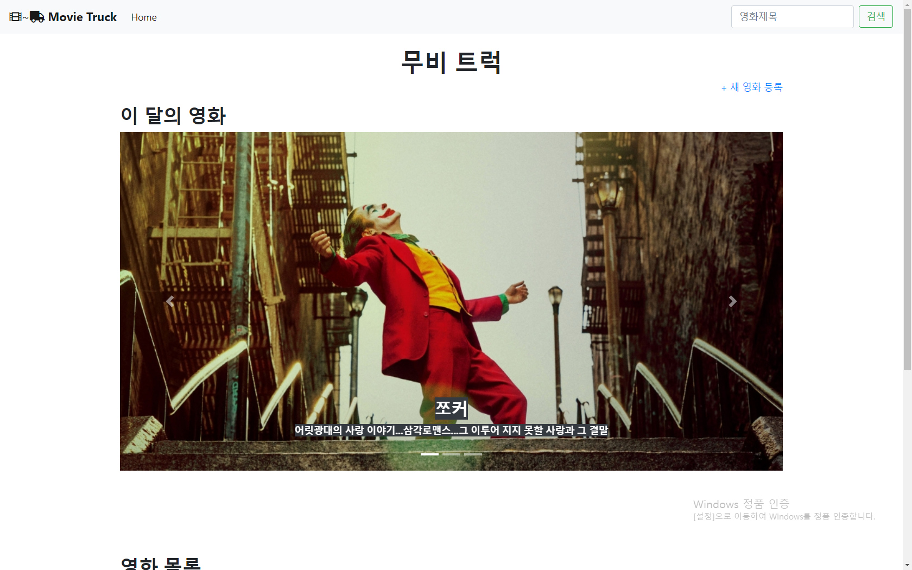
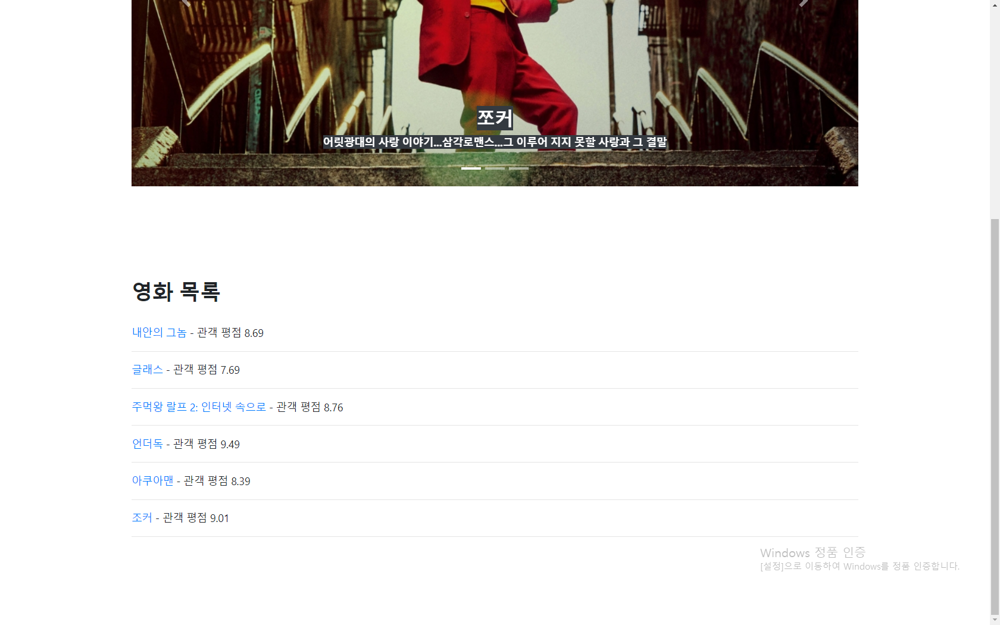
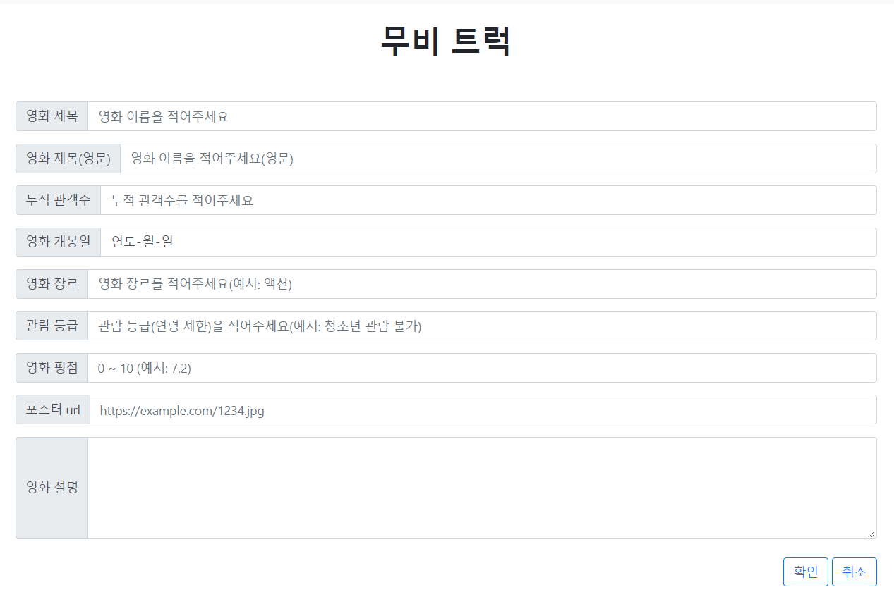
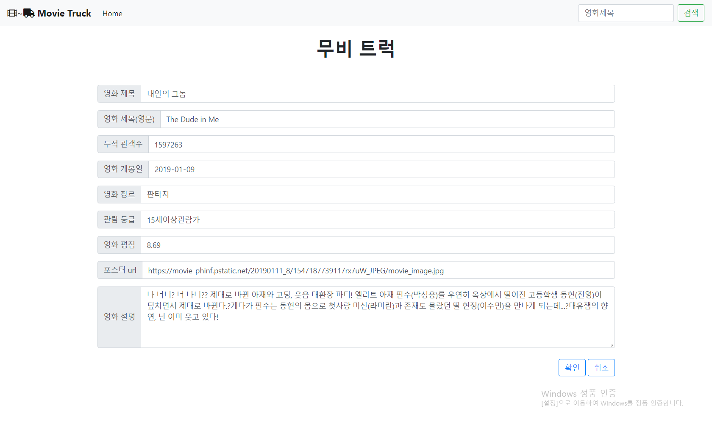
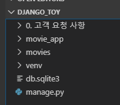
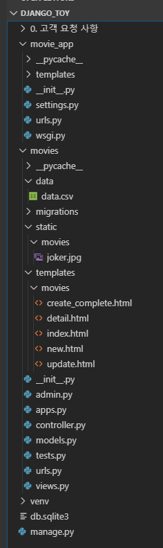

# CRUD 실습 - 영화 평점 사이트


## 내 결과물


- 메인 페이지







- 새 영화 정보 등록 페이지




- 상세 영화 정보 페이지


- 수정 페이지




기타 기능들

- 영화 정보 삭제 기능
- 검색 기능(by 영화 제목)


## 명세 사항

[PDF 파일 링크](./project.pdf)


## 폴더 구조



자세한 화면




## 소스 코드

### settings.py

```python
# settings.py

"""
Django settings for movie_app project.

Generated by 'django-admin startproject' using Django 2.2.6.

For more information on this file, see
https://docs.djangoproject.com/en/2.2/topics/settings/

For the full list of settings and their values, see
https://docs.djangoproject.com/en/2.2/ref/settings/
"""

import os

# Build paths inside the project like this: os.path.join(BASE_DIR, ...)
BASE_DIR = os.path.dirname(os.path.dirname(os.path.abspath(__file__)))


# Quick-start development settings - unsuitable for production
# See https://docs.djangoproject.com/en/2.2/howto/deployment/checklist/

# SECURITY WARNING: keep the secret key used in production secret!
SECRET_KEY = '#%-y5mpjj*i8441$!z14165neujnr-+35-2%e&0n3qmh8elc%0'

# SECURITY WARNING: don't run with debug turned on in production!
DEBUG = True

ALLOWED_HOSTS = []


# Application definition

INSTALLED_APPS = [
    'movies',
    'django.contrib.admin',
    'django.contrib.auth',
    'django.contrib.contenttypes',
    'django.contrib.sessions',
    'django.contrib.messages',
    'django.contrib.staticfiles',
]

MIDDLEWARE = [
    'django.middleware.security.SecurityMiddleware',
    'django.contrib.sessions.middleware.SessionMiddleware',
    'django.middleware.common.CommonMiddleware',
    'django.middleware.csrf.CsrfViewMiddleware',
    'django.contrib.auth.middleware.AuthenticationMiddleware',
    'django.contrib.messages.middleware.MessageMiddleware',
    'django.middleware.clickjacking.XFrameOptionsMiddleware',
]

ROOT_URLCONF = 'movie_app.urls'

TEMPLATES = [
    {
        'BACKEND': 'django.template.backends.django.DjangoTemplates',
        'DIRS': [os.path.join(BASE_DIR, 'movie_app', 'templates')],
        'APP_DIRS': True,
        'OPTIONS': {
            'context_processors': [
                'django.template.context_processors.debug',
                'django.template.context_processors.request',
                'django.contrib.auth.context_processors.auth',
                'django.contrib.messages.context_processors.messages',
            ],
        },
    },
]

WSGI_APPLICATION = 'movie_app.wsgi.application'


# Database
# https://docs.djangoproject.com/en/2.2/ref/settings/#databases

DATABASES = {
    'default': {
        'ENGINE': 'django.db.backends.sqlite3',
        'NAME': os.path.join(BASE_DIR, 'db.sqlite3'),
    }
}


# Password validation
# https://docs.djangoproject.com/en/2.2/ref/settings/#auth-password-validators

AUTH_PASSWORD_VALIDATORS = [
    {
        'NAME': 'django.contrib.auth.password_validation.UserAttributeSimilarityValidator',
    },
    {
        'NAME': 'django.contrib.auth.password_validation.MinimumLengthValidator',
    },
    {
        'NAME': 'django.contrib.auth.password_validation.CommonPasswordValidator',
    },
    {
        'NAME': 'django.contrib.auth.password_validation.NumericPasswordValidator',
    },
]


# Internationalization
# https://docs.djangoproject.com/en/2.2/topics/i18n/

LANGUAGE_CODE = 'ko-kr'

TIME_ZONE = 'Asia/Seoul'

USE_I18N = True

USE_L10N = True

USE_TZ = True


# Static files (CSS, JavaScript, Images)
# https://docs.djangoproject.com/en/2.2/howto/static-files/

STATIC_URL = '/static/'

```


### urls

```python
# urls.py

"""movie_app URL Configuration

The `urlpatterns` list routes URLs to views. For more information please see:
    https://docs.djangoproject.com/en/2.2/topics/http/urls/
Examples:
Function views
    1. Add an import:  from my_app import views
    2. Add a URL to urlpatterns:  path('', views.home, name='home')
Class-based views
    1. Add an import:  from other_app.views import Home
    2. Add a URL to urlpatterns:  path('', Home.as_view(), name='home')
Including another URLconf
    1. Import the include() function: from django.urls import include, path
    2. Add a URL to urlpatterns:  path('blog/', include('blog.urls'))
"""
from django.contrib import admin
from django.urls import path, include

urlpatterns = [
    path('admin/', admin.site.urls),
    path('movies/', include('movies.urls'))
]

```

```python
# movies/urls.py
from django.urls import path
from . import views

app_name = 'movies'

urlpatterns = [
    # index
    path('', views.index, name='index'),
    # search data
    path('search/', views.search, name='search'),

    # movies CRUD
    path('<int:pk>/', views.detail, name='detail'), # Read
    path('new/', views.new, name='new'), # Create
    path('create/', views.create, name='create'),
    path('<int:pk>/update', views.update, name='update'), # Update
    path('<int:pk>/delete', views.delete, name='delete'), # Delete
    path('create_complete', views.create_complete, name='create_complete'),

    # load data from csv
    path('load_data_from_csv', views.load_data_from_csv, name='load_data_from_csv'),
]
```


### models

```python
# movies/models.py

from django.db import models

# Create your models here.
class Movie(models.Model):
    # 영화 제목의 길이는 세상에서 가장 긴 영화의 제목을 참조했습니다.
    # https://post.naver.com/viewer/postView.nhn?volumeNo=19316172&memberNo=31724756
    title = models.CharField(max_length=200)
    title_en = models.CharField(max_length=200)
    audience = models.IntegerField()
    open_date = models.DateField()
    genre = models.CharField(max_length=30)
    watch_grade = models.CharField(max_length=10)
    score = models.FloatField() # floatfield and decimalfield
    poster_url = models.TextField()
    description = models.TextField()

    def __str__(self):
        return self.title

```


### views

```python
# movies/views.py

# django libraries
from django.shortcuts import render, redirect
# django custom libraries
from .models import Movie

# general libraries
from datetime import datetime as dt

# Create your views here.
def index(request):
    movies = Movie.objects.all() #TODO: limit items
    context = {
        'movies':movies
    }
    return render(request, 'movies/index.html', context)

def search(request):
    title = request.GET.get('title')
    movies = Movie.objects.filter(title__icontains=title) #TODO: limit items
    context = {
        'movies':movies
    }
    return render(request, 'movies/index.html', context)

def new(request):
    return render(request, 'movies/new.html')

def create(request):
    if request.method == 'POST': # 영화 생성 요청 처리
        data = request.POST # 포스트로 받은 내용 가져오기
        movie = Movie()
        movie.title = data.get('title')
        movie.title_en = data.get('title_en')
        movie.audience = int(data.get('audience'))
        movie.open_date = dt.strptime(data.get('open_date'), '%Y-%m-%d').date()
        movie.genre = data.get('genre')
        movie.watch_grade = data.get('watch_grade')
        movie.score = float(data.get('score'))
        movie.poster_url = data.get('poster_url')
        movie.description = data.get('description')
        movie.save()
        return redirect('movies:create_complete')
    else:
        return redirect('movies:index')

def create_complete(request):
    return render(request, 'movies/create_complete.html')

def update(request, pk):
    if request.method == 'POST': # 영화 생성 요청 처리
        data = request.POST # 포스트로 받은 내용 가져오기
        movie = Movie.objects.get(pk=pk)
        movie.title = data.get('title')
        movie.title_en = data.get('title_en')
        movie.audience = int(data.get('audience'))
        movie.open_date = dt.strptime(data.get('open_date'), '%Y-%m-%d').date()
        movie.genre = data.get('genre')
        movie.watch_grade = data.get('watch_grade')
        movie.score = float(data.get('score'))
        movie.poster_url = data.get('poster_url')
        movie.description = data.get('description')
        movie.save()
        return redirect('movies:detail', pk)
    else:
        movie = Movie.objects.get(pk=pk)
        context = {
            'movie': movie
        }
        return render(request, 'movies/update.html', context)

def delete(request, pk):
    movie = Movie.objects.get(pk=pk)
    movie.delete()
    return redirect('movies:index')

def detail(request, pk):
    movie = Movie.objects.get(pk=pk)
    context = {
        'movie': movie
    }
    return render(request, 'movies/detail.html', context)

def load_data_from_csv(request):
    #TODO: controller로 분리하기. 하지만 contoller로 분리했을 때, Movie 클래스가 불러와 지지 않았습니다.
    import pandas as pd

    df = pd.read_csv('movies/data/data.csv')
    for i in range(df.shape[0]):
        movie = Movie()
        movie.title = str(df.ix[i]['title'])
        movie.title_en = str(df.ix[i]['title_en'])
        movie.audience = int(df.ix[i]['audience'])
        movie.open_date = dt.strptime(str(df.ix[i]['open_date']), '%Y%m%d').date()
        movie.genre = str(df.ix[i]['genre'])
        movie.watch_grade = str(df.ix[i]['watch_grade'])
        movie.score = float(df.ix[i]['score'])
        movie.poster_url = str(df.ix[i]['poster_url'])
        movie.description = str(df.ix[i]['description'])
        movie.save()

    return redirect('movies:index')
```


### templates

모든 템플릿은 templates/base.html을 상속해서 만듭니다.

그리고 base.html을 읽기 위해서 settings.py에 TEMPLATES의 dirs가 설정되어 있습니다.

```html
<!-- templates/base.html -->

<!DOCTYPE html>
<html lang="en">

<head>
    <meta charset="UTF-8">
    <meta name="viewport" content="width=device-width, initial-scale=1.0">
    <meta http-equiv="X-UA-Compatible" content="ie=edge">
    <title>Document</title>
    <link rel="stylesheet" href="https://stackpath.bootstrapcdn.com/bootstrap/4.3.1/css/bootstrap.min.css"
        integrity="sha384-ggOyR0iXCbMQv3Xipma34MD+dH/1fQ784/j6cY/iJTQUOhcWr7x9JvoRxT2MZw1T" crossorigin="anonymous">
</head>

<body>
    <!-- 네비게이션 바 -->
    <nav class="navbar navbar-expand-lg navbar-light bg-light">
        <a class="navbar-brand" href=""><i class="fas fa-film"></i>~<i class="fas fa-truck"></i>
            <strong> Movie Truck</strong></a>
        <button class="navbar-toggler" type="button" data-toggle="collapse" data-target="#navbarSupportedContent"
            aria-controls="navbarSupportedContent" aria-expanded="false" aria-label="Toggle navigation">
            <span class="navbar-toggler-icon"></span>
        </button>

        <div class="collapse navbar-collapse" id="navbarSupportedContent">
            <ul class="navbar-nav mr-auto">
                <li class="nav-item active">
                    <a class="nav-link" href="">Home <span class="sr-only">(current)</span></a>
                </li>
            </ul>
            <form class="form-inline my-2 my-lg-0" action="" method="GET">
                <input class="form-control mr-sm-2" type="search" placeholder="영화제목" aria-label="Search" name="title">
                <button class="btn btn-outline-success my-2 my-sm-0" type="submit">검색</button>
            </form>
        </div>
    </nav>
    <br>
    <!-- 제목 -->
    <header>
        <h1 class="text-center"><strong>무비 트럭</strong></h1>
    </header>


    <!-- 본문 -->
    <div class="container">
        
        
    </div>

    <!-- 푸터 -->
    <footer>

    </footer>
    <script src="https://code.jquery.com/jquery-3.3.1.slim.min.js"
        integrity="sha384-q8i/X+965DzO0rT7abK41JStQIAqVgRVzpbzo5smXKp4YfRvH+8abtTE1Pi6jizo" crossorigin="anonymous">
    </script>
    <script src="https://cdnjs.cloudflare.com/ajax/libs/popper.js/1.14.7/umd/popper.min.js"
        integrity="sha384-UO2eT0CpHqdSJQ6hJty5KVphtPhzWj9WO1clHTMGa3JDZwrnQq4sF86dIHNDz0W1" crossorigin="anonymous">
    </script>
    <script src="https://stackpath.bootstrapcdn.com/bootstrap/4.3.1/js/bootstrap.min.js"
        integrity="sha384-JjSmVgyd0p3pXB1rRibZUAYoIIy6OrQ6VrjIEaFf/nJGzIxFDsf4x0xIM+B07jRM" crossorigin="anonymous">
    </script>
    <script src="https://kit.fontawesome.com/c1fc8dfbec.js" crossorigin="anonymous"></script>
</body>

</html>
```


```html
<!-- movies/templates/movies/index.html -->





<p class="text-right"><a href="">+ 새 영화 등록</a></p>

<!-- 최신 영화 소개 -->
<h2><strong>이 달의 영화</strong></h2>
<div class="bd-example">
    <div id="carouselExampleCaptions" class="carousel slide" data-ride="carousel">
        <ol class="carousel-indicators">
            <li data-target="#carouselExampleCaptions" data-slide-to="0" class="active"></li>
            <li data-target="#carouselExampleCaptions" data-slide-to="1"></li>
            <li data-target="#carouselExampleCaptions" data-slide-to="2"></li>
        </ol>
        <div class="carousel-inner">
            <div class="carousel-item active">
                <a href=""></a>
                <div class="carousel-caption d-none d-md-block">
                    <h3><span class="bg-dark text-white"><strong>쪼커</strong></span></h3>
                    <p><span class="bg-dark text-white"><strong>어릿광대의 사랑 이야기...삼각로맨스...그 이루어 지지 못할 사랑과 그 결말</strong></span></p>
                </div>
            </div>
            <!-- <div class="carousel-item">
                
                <div class="carousel-caption d-none d-md-block">
                    <h5>Second slide label</h5>
                    <p>Lorem ipsum dolor sit amet, consectetur adipiscing elit.</p>
                </div>
            </div>
            <div class="carousel-item">
                
                <div class="carousel-caption d-none d-md-block">
                    <h5>Third slide label</h5>
                    <p>Praesent commodo cursus magna, vel scelerisque nisl consectetur.</p>
                </div>
            </div> -->
        </div>
        <a class="carousel-control-prev" href="#carouselExampleCaptions" role="button" data-slide="prev">
            <span class="carousel-control-prev-icon" aria-hidden="true"></span>
            <span class="sr-only">Previous</span>
        </a>
        <a class="carousel-control-next" href="#carouselExampleCaptions" role="button" data-slide="next">
            <span class="carousel-control-next-icon" aria-hidden="true"></span>
            <span class="sr-only">Next</span>
        </a>
    </div>
</div>
<br>

<br>
<br>
<br>
<br>
<br>
<h2><strong>영화 목록</strong></h2><br>


<p><a href="">{{movie.title}}</a> - 관객 평점 {{movie.score}}</p>
<hr>


<br>
<br>
<br>
<br>
<br>

```


```html
<!-- movies/templates/movies/new.html -->


<br>
<br>

<form action="" method="POST">
    
    <!-- 영화 제목 -->
    <div class="input-group mb-3">
        <div class="input-group-prepend">
            <span class="input-group-text" id="basic-addon1">영화 제목</span>
        </div>
        <input type="text" class="form-control" placeholder="영화 이름을 적어주세요" aria-label="title"
            aria-describedby="basic-addon1" name="title">
    </div>

    <!-- 영문 제목 -->
    <div class="input-group mb-3">
        <div class="input-group-prepend">
            <span class="input-group-text" id="basic-addon1">영화 제목(영문)</span>
        </div>
        <input type="text" class="form-control" placeholder="영화 이름을 적어주세요(영문)" aria-label="title_en"
            aria-describedby="basic-addon1" name="title_en">
    </div>

    <!-- 누적 관객수 -->
    <div class="input-group mb-3">
        <div class="input-group-prepend">
            <span class="input-group-text" id="basic-addon1">누적 관객수</span>
        </div>
        <input type="number" class="form-control" placeholder="누적 관객수를 적어주세요" aria-label="audience"
            aria-describedby="basic-addon1" name="audience">
    </div>

    <!-- 개봉일 -->
    <div class="input-group mb-3">
        <div class="input-group-prepend">
            <span class="input-group-text" id="basic-addon1">영화 개봉일</span>
        </div>
        <input type="date" class="form-control" aria-label="open_date" aria-describedby="basic-addon1" name="open_date">
    </div>

    <!-- 장르 -->
    <div class="input-group mb-3">
        <div class="input-group-prepend">
            <span class="input-group-text" id="basic-addon1">영화 장르</span>
        </div>
        <input type="text" class="form-control" placeholder="영화 장르를 적어주세요(예시: 액션)" aria-label="genre"
            aria-describedby="basic-addon1" name="genre">
    </div>

    <!-- 관람 등급 -->
    <div class="input-group mb-3">
        <div class="input-group-prepend">
            <span class="input-group-text" id="basic-addon1">관람 등급</span>
        </div>
        <input type="text" class="form-control" placeholder="관람 등급(연령 제한)을 적어주세요(예시: 청소년 관람 불가)"
            aria-label="watch_grade" aria-describedby="basic-addon1" name="watch_grade">
    </div>

    <!-- 영화 평점 -->
    <div class="input-group mb-3">
        <div class="input-group-prepend">
            <span class="input-group-text" id="basic-addon1">영화 평점</span>
        </div>
        <input type="text" class="form-control" placeholder="0 ~ 10 (예시: 7.2)" aria-label="score"
            aria-describedby="basic-addon1" name="score">
    </div>

    <!-- 포스터 url -->
    <div class="input-group mb-3">
        <div class="input-group-prepend">
            <span class="input-group-text" id="basic-addon1">포스터 url</span>
        </div>
        <input type="text" class="form-control" placeholder="https://example.com/1234.jpg" aria-label="poster_url"
            aria-describedby="basic-addon1" name="poster_url">
    </div>

    <!-- 상세 설명 -->
    <div class="input-group">
        <div class="input-group-prepend">
            <span class="input-group-text">영화 설명</span>
        </div>
        <textarea class="form-control" aria-label="With textarea" name="description" rows="5"></textarea>
    </div>
    <br>
    <p class="text-right">
        <button type="submit" class="btn btn-outline-primary">확인</button>
        <button type="button" class="btn btn-outline-primary" onclick="javascript:history.back(1);">취소</button>
    </p>


</form>


```


```html
<!-- movies/templates/movies/create_complete.html -->



영화 생성이 완료되었습니다. 3초 후에 메인 페이지로 이동합니다.
<script>
    setTimeout(function () {
        location.href = ""
    }, 3000);
</script>

```


```html
<!-- movies/templates/movies/detail.html -->



<br>
<br>
<br>
<!-- 영화 제목 -->
<p class="text-center">
    <br>
    <h3 class="text-center"><strong>{{movie.title}}({{movie.title_en}})</strong></h3>
</p>

<br>
<br>
상세정보
<br>
<table class="table table-hover">
    <tbody>
        <tr>
            <th scope="row" width="200">관람객수(명)</th>
            <td>{{movie.audience}}</td>
        </tr>
        <tr>
            <th scope="row" width="200">개봉일</th>
            <td>{{movie.open_date}}</td>
        </tr>
        <tr>
            <th scope="row" width="200">장르</th>
            <td>{{movie.genre}}</td>
        </tr>
        <tr>
            <th scope="row" width="200">관람 등급</th>
            <td>{{movie.watch_grade}}</td>
        </tr>
        <tr>
            <th scope="row" width="200">영화 평점</th>
            <td>{{movie.score}}</td>
        </tr>
        <tr>
            <th scope="row" width="200">설명</th>
            <td>{{movie.description|linebreaksbr}}</td>
        </tr>
    </tbody>
</table>
<p class="text-center">
    <a class="btn btn-outline-primary" href="">목록</a>
    <a class="btn btn-outline-primary" href="">수정</a>
    <a class="btn btn-outline-primary" href="">삭제</a>
</p>

<br><br><br>


```


```html
<!-- movies/templates/movies/update.html -->



<br>
<br>

<form action="" method="POST">
    
    <!-- 영화 제목 -->
    <div class="input-group mb-3">
        <div class="input-group-prepend">
            <span class="input-group-text" id="basic-addon1">영화 제목</span>
        </div>
        <input type="text" class="form-control" placeholder="영화 이름을 적어주세요" aria-label="title"
            aria-describedby="basic-addon1" name="title" value="{{movie.title}}">
    </div>

    <!-- 영문 제목 -->
    <div class="input-group mb-3">
        <div class="input-group-prepend">
            <span class="input-group-text" id="basic-addon1">영화 제목(영문)</span>
        </div>
        <input type="text" class="form-control" placeholder="영화 이름을 적어주세요(영문)" aria-label="title_en"
            aria-describedby="basic-addon1" name="title_en" value="{{movie.title_en}}">
    </div>

    <!-- 누적 관객수 -->
    <div class="input-group mb-3">
        <div class="input-group-prepend">
            <span class="input-group-text" id="basic-addon1">누적 관객수</span>
        </div>
        <input type="number" class="form-control" placeholder="누적 관객수를 적어주세요" aria-label="audience"
            aria-describedby="basic-addon1" name="audience" value="{{movie.audience}}">
    </div>

    <!-- 개봉일 -->
    <div class="input-group mb-3">
        <div class="input-group-prepend">
            <span class="input-group-text" id="basic-addon1">영화 개봉일</span>
        </div>
        <input type="date" class="form-control" aria-label="open_date" aria-describedby="basic-addon1" name="open_date"
            value="{{movie.open_date|date:'Y-m-d'}}">
    </div>

    <!-- 장르 -->
    <div class="input-group mb-3">
        <div class="input-group-prepend">
            <span class="input-group-text" id="basic-addon1">영화 장르</span>
        </div>
        <input type="text" class="form-control" placeholder="영화 장르를 적어주세요(예시: 액션)" aria-label="genre"
            aria-describedby="basic-addon1" name="genre" value="{{movie.genre}}">
    </div>

    <!-- 관람 등급 -->
    <div class="input-group mb-3">
        <div class="input-group-prepend">
            <span class="input-group-text" id="basic-addon1">관람 등급</span>
        </div>
        <input type="text" class="form-control" placeholder="관람 등급(연령 제한)을 적어주세요(예시: 청소년 관람 불가)"
            aria-label="watch_grade" aria-describedby="basic-addon1" name="watch_grade" value="{{movie.watch_grade}}">
    </div>

    <!-- 영화 평점 -->
    <div class="input-group mb-3">
        <div class="input-group-prepend">
            <span class="input-group-text" id="basic-addon1">영화 평점</span>
        </div>
        <input type="text" class="form-control" placeholder="0 ~ 10 (예시: 7.2)" aria-label="score"
            aria-describedby="basic-addon1" name="score" value="{{movie.score}}">
    </div>

    <!-- 포스터 url -->
    <div class="input-group mb-3">
        <div class="input-group-prepend">
            <span class="input-group-text" id="basic-addon1">포스터 url</span>
        </div>
        <input type="text" class="form-control" placeholder="https://example.com/1234.jpg" aria-label="poster_url"
            aria-describedby="basic-addon1" name="poster_url" value="{{movie.poster_url}}">
    </div>

    <!-- 상세 설명 -->
    <div class="input-group">
        <div class="input-group-prepend">
            <span class="input-group-text">영화 설명</span>
        </div>
        <textarea class="form-control" aria-label="With textarea" name="description" rows="5">{{movie.description}}</textarea>
    </div>
    <br>
    <p class="text-right">
        <button type="submit" class="btn btn-outline-primary">확인</button>
        <button type="button" class="btn btn-outline-primary" onclick="javascript:history.back(1);">취소</button>
    </p>


</form>


```


### admin

```python
# movies/admin.py

from django.contrib import admin
from .models import Movie

# Register your models here.
class MovieAdmin(admin.ModelAdmin):
    list_display = ('pk', 'title', 'title_en', 'audience', 'open_date', 'genre', 'watch_grade', 'score', 'poster_url', 'description')

admin.site.register(Movie, MovieAdmin)
```


### data

movies/data/data.csv

```csv
title,title_en,audience,open_date,genre,watch_grade,score,poster_url,description
말모이,MAL·MO·E: The Secret Mission,2224910,20190109,드라마,12세이상관람가,9.04,https://movie-phinf.pstatic.net/20181227_80/1545901137289EGbWK_JPEG/movie_image.jpg,"까막눈 판수, 우리말에 눈뜨다! vs 조선어학회 대표 정환, '우리'의 소중함에 눈뜨다! 1940년대 우리말이 점점 사라져가고 있는 경성. 얼마 남지 않은 시간, 바짝 조여오는 일제의 감시를 피해 '말모이'를 끝내야 하는데... 우리말이 금지된 시대, 말과 마음이 모여 사전이 되다."
내안의 그놈,The Dude in Me,1597263,20190109,판타지,15세이상관람가,8.69,https://movie-phinf.pstatic.net/20190111_8/1547187739117rx7uW_JPEG/movie_image.jpg,"나 너니? 너 나니?? 제대로 바뀐 아재와 고딩, 웃음 대환장 파티! 엘리트 아재 판수(박성웅)를 우연히 옥상에서 떨어진 고등학생 동현(진영)이 덮치면서 제대로 바뀐다.?게다가 판수는 동현의 몸으로 첫사랑 미선(라미란)과 존재도 몰랐던 딸 현정(이수민)을 만나게 되는데...?대유잼의 향연, 넌 이미 웃고 있다!"
글래스,Glass,339707,20190117,드라마,15세이상관람가,7.69,https://movie-phinf.pstatic.net/20181227_126/1545900402100CiQHx_JPEG/movie_image.jpg,"24개의 인격ㆍ강철 같은 신체ㆍ천재적 두뇌 통제불가한 24번째 인격 비스트를 깨운 케빈, 강철 같은 신체 능력을 지닌 의문의 남자 던, 천재적 두뇌를 지닌 미스터리한 설계자 미스터 글래스, 마침내 그들이 한 자리에 모이게 되고 이들의 존재가 세상에 드러나면서 예상치 못한 일이 벌어지는데..."
주먹왕 랄프 2: 인터넷 속으로,Ralph Breaks the Internet,1606967,20190103,애니메이션,전체관람가,8.76,https://movie-phinf.pstatic.net/20181204_287/1543888062606NHMh7_JPEG/movie_image.jpg,"오락실 게임 세상에 이어 이번엔 인터넷 세상이 발칵 뒤집힌다?! 지금껏 경험한 적 없는 엄청난 스케일과 새로운 재미에 흠뻑 빠진 '랄프'와 '바넬로피'는 랜섬웨어급 사고로 인터넷 세상을 혼란에 빠뜨리는데... 과연, 이들은 무사히 집에 돌아갈 수 있을까?"
언더독,Underdog,122479,20190116,애니메이션,전체관람가,9.49,https://movie-phinf.pstatic.net/20181224_250/1545613244716iYHTg_JPEG/movie_image.jpg,"견생역전을 꿈꾸는 댕댕이들의 위대한 모험이 시작된다! 하루아침에 운명이 바뀐 강아지 '뭉치'는 우연히 만난 거리 생활의 고참 '짱아' 일당을 만나 목숨을 구하게 된다. 차츰 ‘짱아’ 무리의 스트릿 라이프에 적응하던 찰나 그들의 소중한 아지트가 사라질 위기에 처하고, 마침내 그들은 진정한 자유를 찾기 위한 모험을 떠나기로 결심하는데..."
아쿠아맨,AQUAMAN,5019236,20181219,액션,12세이상관람가,8.39,https://movie-phinf.pstatic.net/20181210_126/1544403103928nczJs_JPEG/movie_image.jpg,"땅의 아들이자 바다의 왕, 심해의 수호자인 슈퍼히어로 아쿠아맨의 탄생을 그린 액션 블록버스터"

```


### static files

`movies/static/movies/joker.jpg`

index 페이지에서 carousel 태그 안에 들어갈 이미지 입니다.