## 복습

VM도 스케일 아웃 할 수 있고, 스케일 인 할 수 있습니다.

PaaS환경의 확장은 웹앱만 확장하기 때문에

굉장히 신속하게 스케일인 스케일 아웃 할 수 있습니다

앞으로 점점 `서버리스`라는 얘기가 나옵니다.

서버리스는 VM이 필요 없다는 얘기입니다.

윗 단에 있는 서비스만 필요하다는 말입니다

VM도 결국 하드웨어를 쓰는데 VM자체의 용량이 너무 크기 때문에 docker베이스로 해서 아주 신속하게 빠르게 확장하고 축소할 수 있습니다

IaaS환경의 스케일 아웃은 신축성이 별로 없습니다. 왜냐면 용량이 크기 때문입니다.

IaaS환경보다 PaaS환경이 신축성이 있고, 용량도 적고(과금의 단위가 됨), 성능도 더 뛰어남

docker가 뜨고 있고, 구글의 데이터 센터가 도커 베이스로 되어있습니다.

IaaS배포하려면 VM 배포하고, IIS 설치하고 배포해야 합니다.

PaaS배포하려면 웹앱만 배포하면 되니까 간편합니다.

Docker나 Openstack같은 서비스를 사용하면 네트워크 구조가 유동적으로 바뀝니다. Software Defined Network(SDN)

docker에 instance가 올라가면 ip가 부여되고, 내려가면 ip가 사라지고

유동적으로 ip 변경하는 것을 지원하는 것이 firewall-cmd 데몬입니다.

iptable과 firewall은 동시에 사용하시면 안됩니다.

명령어가 달라서 새롭게 공부해야합니다.

VM 앞단에 NSG가 만들어집니다.

따라서 방화벽 세팅을 할 때 Azure에서는 VM의 방화벽을 열어주고 NSG의 방화벽도 열어주셔야 합니다.

웹서버 설정 파일 : /etc/httpd/conf/httpd.conf
```bash
$ sudo find -name httpd.conf
/etc/httpd/conf/httpd.conf
$ sudo cat -n /etc/httpd/conf/httpd.conf | grep DocumentRoot
119 DocumentRoot "/var/www/html"
$ sudo cat -n /etc/httpd/conf/httpd.conf | grep DirectoryIndex
164 DirectoryIndex index.html
$ sudo vi /var/www/html/index.html
Linux Web Server Text ~~~~
```

visual studio code는 하나의 코드를 가지고 여러명이 붙어서 하나의 페이지를 만들 수는 없음

그럴때는 visual studio임.

slot이라는 것은 하나의 

production환경에 있는 소스코드를 그대로 clone해서 staging 환경에서 작업을 하고 swap을 할 수 있음

traffic manager는 traffic 처리를 DNS로 region별로 할 수 있음(L7에서 동작)

Load balancer는 TCP 또는 UDP(L4에서 작동)포트 별로 룰을 만들어서 동작함

## Module 8. Configuring and managing Azure AD(AAD)

### Lesson 1. AD DS

- `Active Directory`: `디렉토리 서비스`
  - Directory Service, X.500 (디렉토리 서비스 표준, 하지만 이것은 구현하기 너무 어렵고 복잡합니다.)
  - MS의 Directory
  - 중앙화된 보안 관리.
  - 중앙화된 관리(GPO)
- `domain`: 보안의 논리적인 범위
  - DC(Domain Controller): 도메인의 보안 관리하는 시스템(Active Directory 설치)
  - 중앙화된 관리
  - SSO(Single Sign On)
- `WorkGroup`: 각자 시스템이 보안을 관리
  - 기업의 시스템이 20대 미만(소규모)
  - 자신의 시스템의 SAM 인증
- `domain-join`: 

### Active Directory 이해

Active Directory를 이해하기 위해서는 Domain 환경과 Work그룹 환경을 이해해야합니다

Active Directory는 Directory service입니다.

계정이나 그룹을 오브젝트라고 합니다. 네트웍의 정보를 중앙에 있는 디렉토리에 저장해서 공유해서 쓰자 하는 서비스

Directory 안에는 네트워크에 대한 정보를 담습니다.

Directory Service의 표준은 x.500인데, 구성하기 어렵고 복잡해서

불필요한 것들을 다 제거하고 쉽게 구성한 것을 Active Directory라고 합니다.

Sun이 오라클로 넘어갔죠. 노벨의 net ware 처럼 각 회사들도 Directory 서비스를 가지고 있습니다.

Active Directory를 사용하면 `중앙화된 보안` 뿐만 아니라 `중앙화된 관리`(GPO를 통해서)도 할 수 있습니다.

### Domain

도메인은 보안의 논리적인 범위입니다.

도메인을 관리하기 위해서는 DC(Domain Controller)가 필요합니다.

Domain환경은 `△`로 표시합니다. 도메인은 네트워크의 많은 컴퓨터들을 하나의 보안단위로 구성하는 것입니다.

작업 그룹이라는 것은 각자각자 컴퓨터가 보안단위입니다.

도메인이라는 환경은 네트워크의 컴퓨터들을 그루핑해서 하나의 보안 단위로 만드는 것을 말합니다.

도메인 환경을 만들 때 반드시 필요한게 뭐냐 ? DC라는 것입니다.

`DC`는 `도메인을 컨트롤하는 시스템`입니다. 도메인을 만들 때는 DC가 반드시 있어야 합니다.

도메인을 만들 때 가장 먼저 해야 할 것은 DC를 만들어주는 것입니다.

그럼 DC를 어떻게 만드냐? DC는 `Active Directory를 설치`해주는 것을 말합니다.

사용자 계정이나 그룹은 각자의 컴퓨터에서 만드는 것이 아니라 DC에서 계정을 만들고, 그룹을 만들고

도메인이 적용된 사용자는 ID와 PW를 자신의 컴퓨터에서 인증 받는 것이 아니라

도메인 컨트롤러에 가서 인증을 받아서 이 컴퓨터를 시작하게 됩니다.

자, 그러면 워크그룹과 도메인의 차이점은 웤그룹일 때는 A라는 컴퓨터에서 B라는 컴퓨터로 가면요

B라는 컴퓨터에 갔을 때 B라는 컴퓨터의 폴더나 파일에 접근합니다. B컴퓨터의 ID나 PW 정보를 알아야합니다.

그래야 B컴퓨터의 폴더나 파일에 접근할 수 있습니다.

그렇다면 A라는 컴퓨터가 C라는 컴퓨터에 접근했어요

그럼 C라는 컴퓨터의 ID와 PW를 알아야 접근이 가능하겠죠.

이렇게 클라이언트가 있고, 서버가 10대가 있는데 A라는 사용자가 10대의 서버에 접근할 때마다 매 번 인증을 받아야 하죠

웤그룹 환경일 때는 각자의 컴퓨터에서 인증을 받기 때문에 회사에 서버가 10대가 있으면, 

회사의 10대의 서버에 매 번 인증을 받아야 합니다. 즉 하나의 컴퓨터가 10대의 계정 정보를 가지고 있어야 한다는 거죠

따라서 각 서버에 사용자 계정을 만들어야 하니까 계정들을 관리하기가 매우 힘들다는 거죠.

만약 서버가 10대가 넘는다 하면,

DC에 계정을 만들어 두고 중앙에서 공유해서 쓰는 환경을 구축하게됩니다.

그래서 도메인 환경은 SSO(Single Sign On; 한 번만 인증하면 다른 서버에 접근할 때에도 인증을 안 해도 됨)를 지원합니다.

### WorkGroup
- 각자 시스템이 보안을 관리
- 자신의 시스템에서 인증
- 기업의 시스템이 20대 미만(소규모)
- 자신의 시스템의 SAM인증

소규모 네크워크일 때 이렇게 쓰고요

기업 환경은 Domain환경으로 되어 있습니다.

### SID(Security ID)
자신의 시스템의 SAM 인증(C:\Windows\System32\config\SAM)을 이용 하는 방식

컴퓨터를 켜서 로그인 할 때, SAM파일에 그 정보가 있는지 확인하고

인증을 하고, 인증을 하면 Token이라는 것을 만들어 줌.

토큰에는 다음과 같은 정보가 저장되어있음

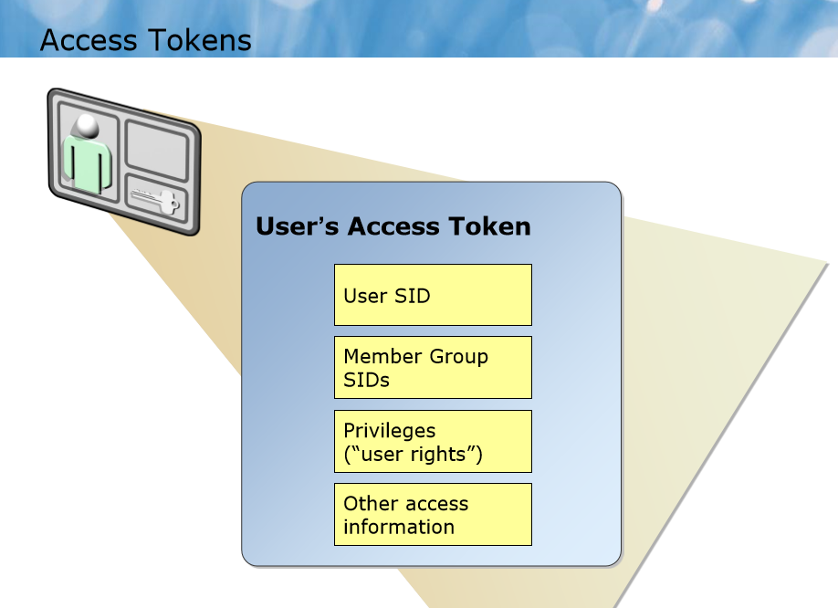

토큰이 메모리 상에 올라가게 됩니다.

사용자 계정, 그룹, 컴퓨터 계정 또는 Administrator에 숫자로된 고유 번호가 할당되는데 이것이 SID임

내부적으로 운영체제에서는 숫자로된 고유번호로 식별하는 것임

폴더나 파일에는 보안(권한 정책??인가)이 할당 되어 있습니다.

폴더에 확인할 때는 `보안 할당자`를 확인합니다. 그 정보들을 확인하고 접근할 수 있으면 들어갑니다.

폴더에 접근할 때 SID를 확인하고, 해당 그룹에 속해있는 사람인지 확인하고, 권한이 없으면 접근이 되지 않습니다.

컴퓨터를 종료하려고 그래요. 토큰에 권한이 들어가 있어야 합니다.

토큰에 권한이 없으면 종료를 할 수 없습니다.

토큰은 로그인하게 되면 메모리에 올라가 있게 되고,

시스템에 액션을 취했을 때

폴더에 들어갈 때는 그룹SID를 확인해보고, 권한이 필요한 액션을 취하면 그 때 privileges가 필요합니다.

## 실습 Domain 환경 구성

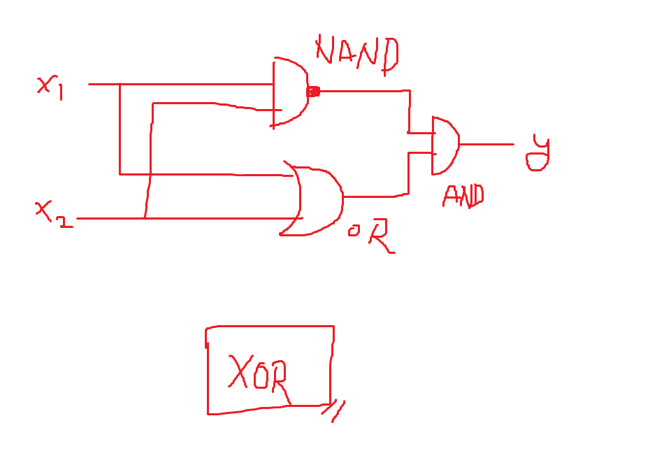

네트워크를 먼저 생성해 줍니다.

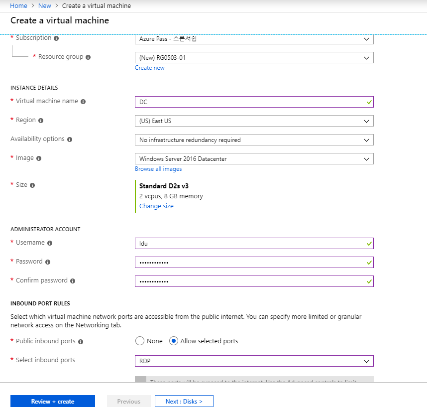

만들어져 있는 vnet에다 이 vm을 배포하도록 하겠습니다.

또한, 서버VM을 하나 더 만들어줍니다

AD DS를 사용하려면 Server version 이상이 되어야 (2008, 2012, 2016, 2018 서버) DS를 설치할 수 있습니다.

Active Directory의 서비스는 총 5가지가 있습니다. 왜 5가지인데 하나가 없어졌지

교재 6425C_01 (AD DS).pdf - 14p 의 4가지 서비스에 하나가 더 있습니다. `Active Directory Domain Service(ADDS)`

제일 밑 단에 AD DS가 있고, 그 위에 CS, LDS, RMS, FS(Federation Service)

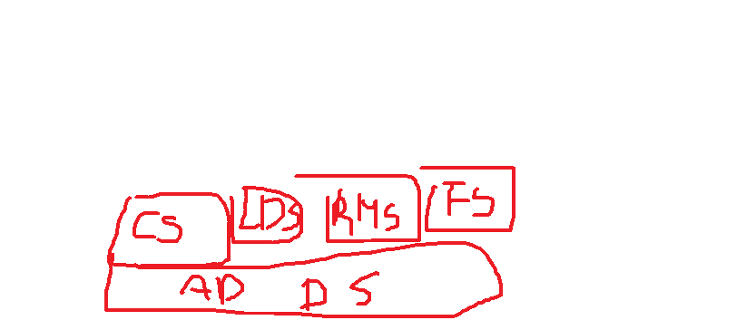

- `CS`는 `인증서를 배포하는 서버`
- `LDS`(Lightweight Directory Service): AD객체 속성의 `일부`를 가져다 주는 것(원본정보의 간략한 정보를 가져오는 것)
  - 주로 LDS는 DMZ에 연결을 합니다. 인터넷 망에 있는 구간입니다. DMZ는 메일 서버의 exchange 서버와 연동해서 사용하는 것입니다.
- `RMS`는 `권한 관리 서버`입니다.
- `FS(Federation Service`: `도메인과 도메인(회사와 회사) 사이에 싱글 사인 온(한번만 로그인하면 도메인 내의 리소스들을 전부 사용할 수 있게 하는 것)`을 해주는 서비스. 회사와 회사 사이에 Federation 설정을 합니다. 원청의 도메인이 있고 하청업체의 도메인이 있습니다. 하청에 있는 직원이 원청의 서버에 접근할 때, 자신의 회사에서 인증을 받으면 원청에 접근할 수 있습니다. 인증은 자신의 회사에만 인증을 받으면 됩니다.
- AD DS: 도메인 객체의 모든 정보를 담고 있는 것

따라서 AD DS가 있어야 다른 서비스들을 작동시킬 수 있음

Azure에 있는 서비스를 접근할 때 Azure에 있는 서비스는 인증을 받아야합니다.

AAD에 정보가 있어야 Azure의 서비스에 접근을 할 수 있습니다.

회사에 사원들 계정이 있습니다. 그 많은 계정들을 Azure AD에 다 만들 수 없습니다.

관리자가 Azure와 Federation을 합니다. Federation을 통해서 사원들이 Azure의 리소스에 접근할 수 있습니다.

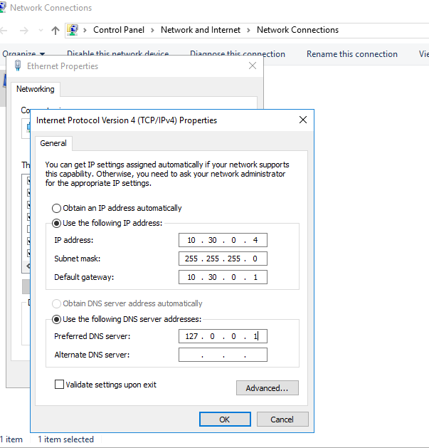

DC는 IP가 바뀌면 안되기 때문에 고정 IP를 사용함


AD DS를 설치하기 위해서는 Manage >  Add roles and features > Active Directory Domain Service > 나머지는 다 기본 설치 > 재시작 필요하면 재시작하기

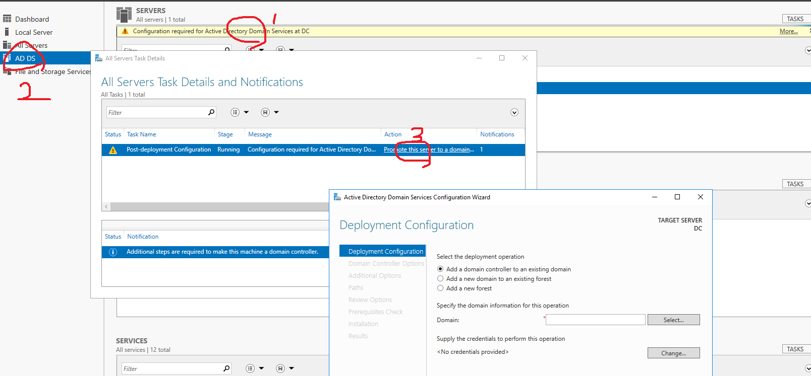

위처럼 눌러서 해당 컴퓨터를 DC로 만들어줍니다.

Add a new forest

이름은 multicampus.com

설치경로가 C:\windows\NTDS로 되는데(NT Database System의 약자입니다)

Domain 환경 구성
1. DC 구성
   1. 고정 IP
   2. AD DS Role 설치
   3. DC Promotion(multicampus.com)

SVR1 VM을 같은 도메인으로 넣어서(join domain) 같은 도메인 내에 구성을 해줍니다.

기업의 내부 환경은 도메인 환경으로 되어있어서

기업에 입사하고 괜찮은 기업들에서는 노트북을 하나씩 받는데, 야동같은거 보면 다 걸립니다.

TOOLS > Active Directory and Computers > (새창) multicampus.com > Users > 오른쪽 마우스 클릭 > New


계정 오른쪽 클릭 > Add a group > 이름을 `Domain Admins`로 설정 > 이후 properties 창에 member of를 확인해보면 2개의 row가 들어가 있는 것을 확인 할 수 있음

### server1 로 돌아와서 Server Manager에서 Local Server 클릭 > workgroup이라고 있는 부분을 클릭 > 도메인을 multicampus.com으로 변경
앞으로 도메인으로 접속할 때에는

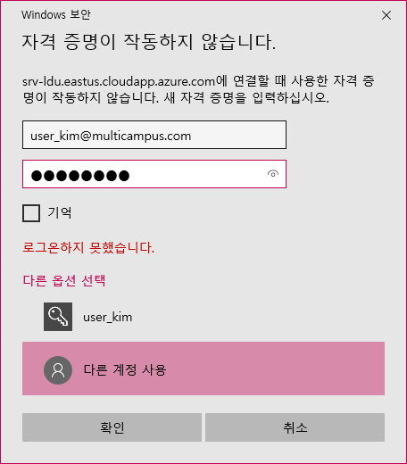

위와 같은 방식으로 접속 할 수 있습니다.

srv1에서 \\dc라고 하면 별도의 인증없이 공유폴더에 바로 접근할 수 있습니다.

DC로 다시 들어가서 properties

Domain Admins 그룹은 모든 컴퓨터의 권한을 가집니다.

`\\dc\c$` 로 들어가면 dc의 c드라이브로 바로 접근할 수 있습니다.

GPO를 통해서 원격에 있는 방화벽 설정도 가능합니다. (실제로 실습하지는 않았음)

srv1에서도 file & print 공유설정을 완료하면 `\\srv1\c$`으로 접속 가능합니다.

optimized drive

### GPO만들기(srv1의 제어판 접속 차단)

DC에 들어가서 TOOLs에서 다음으로 들어갑니다.

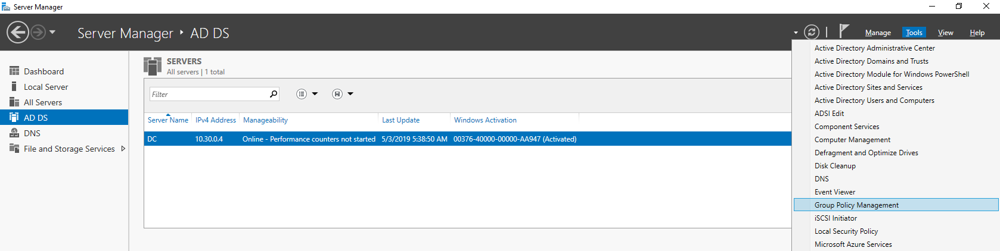

## AD DS

AD DS는 인증과 허가를 담당하는 것입니다.

GPO는 중앙에서 정책을 만들어놓으면 domain에 조인된 컴퓨터에 설정이 적용됩니다.

OU(organized unit)을 만들어서 GPO를 만들어서 특정 컴퓨터에만 적용할 수 있습니다.

기업에서 핵심적인 서비스가 AD DS. 기업 내에서 보안을 관리함

관리를 하려면 컴퓨터들이 도메인에 가입되어있어야합니다.

특정 부서에 정책을 내려줄 수도 있습니다.

도메인의 확장된 개념을 forest라고 합니다.

기업에서 중앙화된 관리를 할 때에는 도메인 환경을 구성하고

`active directory domain service`가 구현된 것을 DC라고 합니다.

AD DS는 on-premise solution(private solution)입니다.

AAD는 Azure의 cloud에 사람들이 접속할 수 있도록 AD 서비스를 주는 것

### Overview of Azure AD(PaaS Service)

마이크로소프트가 관리를 합니다.

계정을 만들어서 바로 사용할 수 있습니다.

하나의 계정에서 여러개의 도메인을 구성할 수 있습니다.

각각의 도메인은 보안 바운더리입니다.

이 보안 바운더리를 multitenant by design라고 합니다.

하나의 아파트에 여러 세대가 있고 각각의 세대를 `tenant`

`tenant`도 하나의 보안 바운더리입니다.

AAD는 GPO를 사용할 수 없습니다.

OU를 사용할 수 없습니다.

COMPUTER Object라는 것이 없어요

Azure Portal

10년정도 회사에서 근무하면 10만명정도 컴퓨터를 관리하게 됩니다.

10만명정도를 혼자 관리할 수 없기 때문에 부하직원들에게 시켜서 관리를 하게 됩니다.

Azure AD에는 권한을 만들고 최고 관리자가 있고 작은 관리자들을 만들어서 Azure AD를 쓸 수 있도록 권한을 분산시켜줌

10979_08 - 7page의 Delegation model within an Azure AD tenant는 넘어갔음

Azure AD는 rule을 만들어서 권한을 위임(delegation)할 수 있습니다.

Local에 있는 계정과 Azure AD에 있는 계정과 동기화 할 수 있습니다.(그냥 넘어감)

### Azure AD 계정 만들기

Create a resource > Itentity > Azure Active Directory 이 아이콘을 클릭해서 즐겨찾기하고

즐겨찾기된 Azure Active Directory로 들어가면 기본 디렉터리가 나옵니다.

기본 디렉터리 위 `dbclicknaver.onmicrosoft.com`라고 있습니다.

메모장에 일단 저장해놓고 나중에 쓸거에요

기본 디렉토입니다.

여기에 Users 클릭하면 현재 microsoft 계정으로 하나만 나옵니다.

Azure 계정을 추가해보도록 하죠

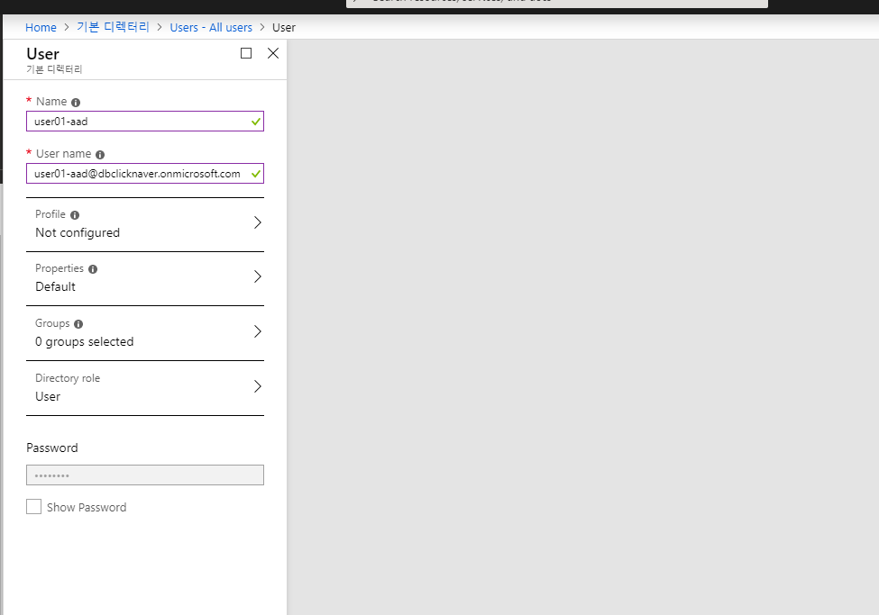

그 다음에 프로파일 클릭해보겠습니다.

그룹설정은 현재 하지 않습니다.

Directory role은 클릭하면 User / Global administrator / Limited administrator가 있습니다.

패스워드는 현재 부여를 할 수 없습니다.

비밀번호를 저장합니다. `user01-aad@dbclicknaver.onmicrosoft.com`, `Wuhu5195`

또 다른 User를 추가해봅니다. `user02-aad@dbclicknaver.onmicrosoft.com`, `Caba0754`

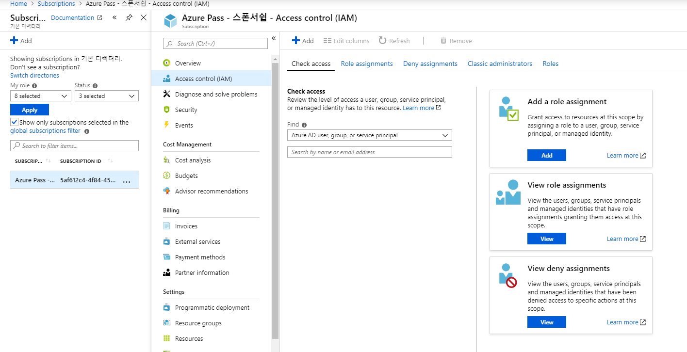

IAM으로 들어가면, 각 계정에 권한을 부여할 수 있습니다.

모든 Azure의 resource는 overview 밑에 IAM이 있습니다.

- Authentication(인증): ID와 Password를 확인
- Authorization(허가): 리소스 접근 권한

서브스크립션에 권한을 부여하게 되면 권한은 상속이 됩니다. 리소스 그룹, 리소스에도 접근할 수 있습니다.

`서브스크립션 > 리소스 그룹 > 리소스` 순으로 상속이 됩니다.

### Add role Assignments

role들이 각각 Azure의 리소스를 권한이 부여된 role들입니다.

이것은 Azure에서 만들어놓은 role들입니다.

커스터마이징해서 사용할 수 있습니다.(sql에 접근할 수 있는 권한)

컨트리뷰터는 읽기 권한만 있는 것

가장 큰 권한은 Owner입니다.

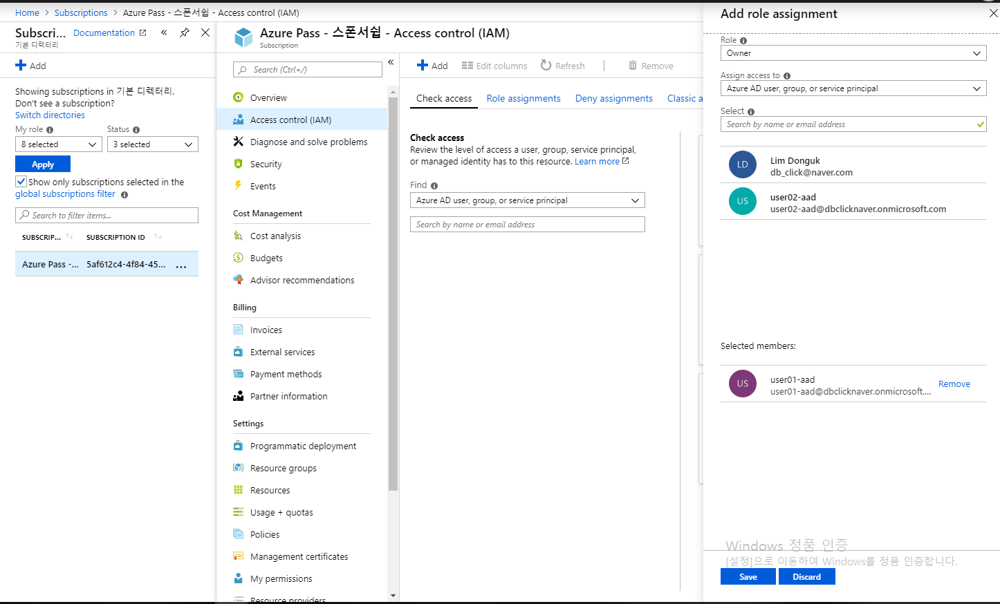

위와 같이 설정하면 user01은 모든 권한을 가지게 됩니다.

User01은 Owner 권한을 갖게됩니다.

크롬 시크릿창을 키면 새로운 세션을 사용할 수 있습니다.

`user01-aad@dbclicknaver.onmicrosoft.com`, `Wuhu5195`를 사용해서 들어갈 수 있습니다.

`구독 > IAM > 역할 할당`을 보면 소유자로 되어있습니다.

`user02-aad@dbclicknaver.onmicrosoft.com`, `Caba0754`를 사용해서 들어갈 수 있습니다.


두 번째 계정으로 들어간 경우에는 구독이 없어서 새로운 리소스를 만들지 못합니다.

## 실습 - Azure AD

10979 Module AK 8장

[실습 링크](https://github.com/MicrosoftLearning/10979-MicrosoftAzureFundamentals/blob/master/Instructions/10979E_LAB_AK_08.md)

### 도메인 구입해서 DNS txt, MX 존 설정하기

서버 VM에서 TOOLS > DNS > Forward Lookup Zone > New Zone > primary zone > 다른 내용은 기본으로 설정함

DNS 서비스의 상단에서 View > Advanced 체크

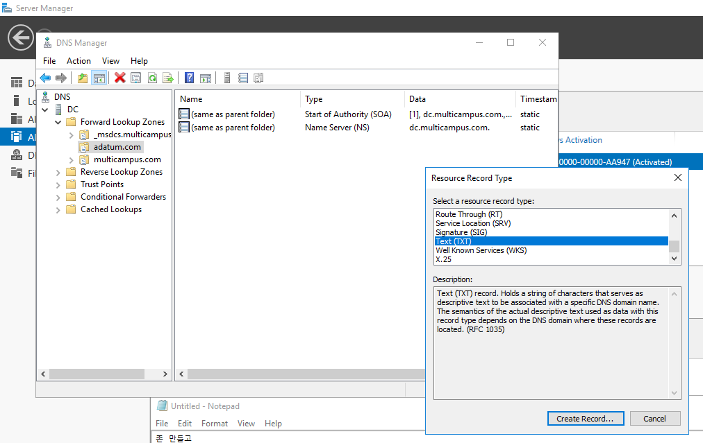


존 만들고

view advanced menu check > 오른쪽 클릭해서 보면 Other New record가 있음 > 클릭 > 텍스트 레코드 > 

MS:ms97541792

@는 자기 자신입니다.

따라서 호스트이름은 비워두면 됩니다.

메일을 보낼 때도 마찬가지로 

Azure에서 mx레코드의 destination 주소 복사해서 > DNS의 Manager > new resource record > FQDN

Azure에서도 할 수 있는데, 

Advanced를 켜야 TTL값을 변경할 수 있습니다.

## Multi-Factor Authentication

한 번 더 Azure에서 확인 작업을 합니다.

메일에서 인증 코드를 한 번 더 넣도록 하는 것입니다.
