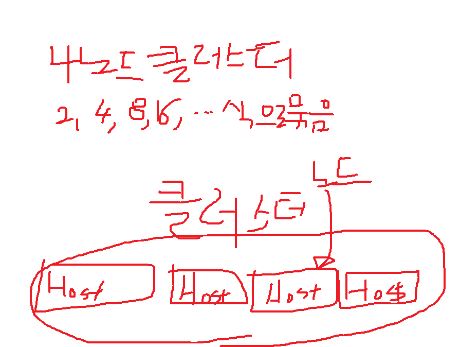

오케스트레이션 서비스는 swarm과 kubernetes가 있음

점점 kubernetes로 가는 추세이기 때문에 kubernetes를 공부하는 것이 좋음

마지막날 개인당 10분정도 발표하는 시간을 가짐

9일날 시험마치고 한 4~5시간 정도 발표수업으로 함

## 복습

AD가 뭐죠 ?

Azure에 있는 서비스를 사용하려면 인증, 허가를 받아야합니다.

클라우드베이스의 인증입니다. 이것이 Azure AD입니다.

AAD는 http 기반이고, 클라우드에 접근할 때 인증을 담당합니다.

AD DS는 토큰 베이스입니다. 

회사에 있는 ID가 회사에 접근하려면 Federation을 구현해줘야합니다.(AD FS)

Azure에 있는 Resource를 접근하기 위해서는 AAD의 계정을 가지고 있어야 하고, 없더라도 Federation을 맺으면

회사에 있는 ID를 가지고 Azure에 있는 Resource에 접근할 수 있음

회사에 있는 ID를 동기화 시켜줄 수도 있고 Federation해줄 수도 있음

AD DS는 온프레미스 솔루션이고 중앙화된 보안 관리를 합니다.

DC는 win10에는 설치할 수 없고, win server 운영체제 2012, 2016, 2019에서 role을 설치해줘야 합니다.

DC가 되기 위해서는 다섯 정도 role이 있습니다. Active Directory에 기초해서 DS, CS, LDS, RMS, FS가 있습니다.

`도메인 환경`은 `하나의 보안 단위로 그루핑 하는 것`을 말합니다. 단일 보안(SSO)가 적용됩니다.

기업 환경은 전부 도메인으로 되어 있고, DC 설치해주고 AD DS설치해 주고 DC로 프로모션을 해줘야합니다.

도메인에 조인 할 때에는 도메인 이름은 DNS 이름을 넣게 됩니다.(ex. multi.com)

DC에서 뭘 만드느냐하면 GPO를 만듭니다. 도메인에 있는 컴퓨터가 로그인하면 GPO가 내려가게 됩니다.

그래서 컴퓨터를 제어할 수 있게 됩니다.

AAD에는 GPO를 사용 할 수 없고, OU를 사용 할 수 없습니다. (cf. AD에는 둘 다 사용할 수 있음)

Azure의 모든 리소에는 overview 밑에 IAM이 있습니다. 이 것은 리소스에 권한을 부여해주는 것입니다. Subscription레벨의 계정을 만들고,

subscription에 있는 IAM에서 권한을 할당했습니다. Owner권한은 그 resource에 대해 모든 권한을 가지고 있는 것입니다.

contributor, reader, owner 등 많은 룰이 있는데 RBAC(Rule Based Access Control)을 구성했습니다.

리소스를 사용할 수 잇도록 권한이 부여된 것이 RBAC입니다.


## MFA - 시험 문제 나옴

533 나오는 내용 중에서 MFA(다단계 인증) 나옴

MFA를 등록하려면 프리미엄 계정이 있어야 합니다.

Azure AD Free, Basic, Premium 1, Premium 2가 있습니다.

Free나 Basic에서는 Multi Factor Authentication을 지원하지 않습니다.

MFA는 한 번 더 인증받도록 하는 것입니다. 그럴려면 Premium 1이나, Premium2를 업그레이드 하면 됩니다.

업그레이드하면 30일동안 무료로 사용할 수 있습니다.

MFA 설정하기

All Users > 상단에 Multi-Factor Authentication > 들어가면 sign-in이 있음

단 프리미엄 계정(P1 or P2)이 필요합니다.

## Module 7. containers and serverless computing in Azure(10979)

container는 4세대 환경이다.

데이터센터를 Software Defined Network(SDN), Software defined compute(SDC), software defined server(SDS)

많은 서버들을 하나로 풀링해서 소프트웨어로 관리하는 용어를 SDC라고 합니다.

네트워크 장비들은 시스코, 쥬니퍼도 있습니다.

네트워크 장비들을 소프트웨어로 관리하는 것을 SDN이라고 합니다.

이렇게 풀링된 데이터 센터를 SDDC라고 합니다.

이렇게 하나로 만들어주는 것이 `WS(windows server의 Hyper V; 가상화 구현하는 툴, KVM, openstack 등 가능)`, `SC(system center; 많은 시스템을 가운데서 관리하는 툴)`

이렇게 하면 스케일 아웃, 스케일 인을 할 수 있습니다.

Hypver-V 위에는 VM이 올라가고 VM 위에는 OS가 올라갑니다.

이렇게 되면 용량이 매우 큰데, 컨테이너 환경으로 가면 용량이 상당히 줄어들게 됩니다.

가상화 기반이 3세대 였다면,

컨테이너 기반은 `4세대 데이터 센타의 솔루션`이라고 할 수 있습니다.

앞으로는 서버도 필요 없다 해서 서버리스라고 합니다.

밑단의 VM도 없이 계산을 바로 해서, 확장성 등을 구현할 수 있는 기능이 컨테이너와 서버리스 컴퓨팅입니다.

컨테이너 위에 런타임과 프로그램만 넘겨주면 바로 실행해줄 수 있습니다.

구글의 데이터 센터 자체가 컨테이너 기반으로 되어 있습니다. 그리고 쿠버네티스로 되어 있습니다.

SDDC로 구현하기 위한 솔루션이 Hyper-V, system center였다면, 컨테이너가 Hyper-V와 같이 호스트를 가상화시켜 줍니다.

컨테이너를 자동화하는 솔루션이 swarm과 kubernetes가 있습니다. 한마디로 말해서 system center라고 보시면 됩니다.

확장하고 축소하고, 등을 관리하는 것이 쿠버네티스와 swarm 두가지가 있습니다.

쿠버네티스가 swarm의 모든 기능을 가지고 있어요. 그리고 swarm에는 없는 새로운 기술들이 들어가 있어요

초창기에는 swarm을 썼고, swarm의 모든 기능을 포함하면서 swarm의 없는 기능을 가지고 있는 쿠버네티스가

모든 클라우드에서 지원하고 있어요

올 1월달에 그런 발표를 했어요. 스웜보다는 쿠버네티스가 낫다 !

그래서 컨테이너가 있고, 사용자가 많아지면 컨테이너를 다른 사용자로 넘겨줘야 합니다.

호스트가 망가졌을 때, 다른 호스트에서 서비스 할 수 있도록 넘겨주는 것을 클러스터링이라고 하는데, 이런 기능을합니다.

호스트를 그루핑해서 만들어줘야 합니다. 이런 것을 클러스터링이라고 하는데

이런 기능을 쿠버네티스와 스웜에서 합니다.

많이 들어왔을 때는 확장하고, 적게 들어왔을 때는 축소하고. 이런 기능을 오케스트레이션이라고 하는데

그런 기능을 합니다.(쿠버네티스)

Linux에는 컨테이너 서비스가 있고, windows server에도 컨테이너가 있습니다.

server에는 엔터프라이즈 에디션이고, CE에디션은 클러스터 구성이나 오케스트레이션 구성이 안되는거에요

CE에디션은 개발자들이 개발하고, 테스트하고 컨테이너를 만들어서 서버에 로드하고 하는 용도로 CE에디션이에요

윈도우즈 10에 들어가있고요

실제로 서비스 하는 것은 엔터프라이즈 에디션이에요

컨테이너가 리눅스에서 나왔고, `윈도우 서버에서도 2016이나 2019`에 기본적으로 내장이 되어있습니다.

`docker`의 `enterprise`에디션이 있습니다. `windows 10`에도 프로그램 추가 제거에도 있습니다. `CE 에디션`

Azure의 서버리스가 함수라는 건데, 함수는 VM이 필요 없어요. 모든 계산을 함수에서 처리를 합니다.

함수에서 compute작업을 합니다.

VM위에 컨테이너를 올리는 경우가 있고, VM없이 컨테이너를 올리는 경우가 있습니다.


실제로는 하드웨어 바로 위에 컨테이너 엔진을 올릴 수도 있고, 위의 사진은 VM위에 올린 경우입니다.

OS에는 linux, windows가 있고, 

APP 1, Binaries/libraries가 컨테이너입니다.

컨테이너 엔진을 하드웨어에 바로 올려서 하는 것이 성능이 더 뛰어납니다.

VM 없이 구현할 수 있습니다.

컨테이너 엔진이 뭘하느냐면 컨테이너들의 리소스를 공유해서 쓰도록 하는 것입니다.

컨테이너 엔진 위에 OS가 없어요. OS없이 바로, 라이브러리와 앱만 바로 배포할 수 있습니다.

컨테이너 엔진만 있으면, 어떤 컴퓨터에 가더라도 앱의 세팅된 내용이 라이브러리와 바이너리로 묶여서 넘어가기 때문에

그 서버의 환경에 맞게 세팅할 필요가 없습니다.

그냥 가져가기만 하면 된다는 것입니다.

클라우드로 올릴 수도 있고.

그래서 데이터 센터의 4세대 환경이 컨테이너이다

이렇게 하면 성능이 많이 좋아지고, 확장 축소가 잘 됩니다.

`컨테이너`는 `메모리 위에 올라가 있는 서비스`입니다.

앱과 라이브러리가 실행되서 메모리로 로드됩니다. 실행된 상태를 컨테이너라고 합니다.

`각각의 컨테이너`에는 `IP가 자동으로 들어갑`니다.

IP가 없어지면 자동으로 부여 받고요


Docker가 컨테이너 기술이고요

Docker 엔진은 호스트 위에 컨테이너 엔진(또는, =도커 엔진)입니다.

도커 엔진은 커널이에요. 커널은 운영체제에서 가장 중요한거죠

커널은 약 4MB밖에 안됩니다.

이미지는 도커 레지스트리에 저장되어 있습니다. Docker Registry는 Docker 이미지를 저장하고 있는 곳입니다.

실행되지 않은 컨테이너를 이미지`(컨테이너 이미지, 도커 이미지)`라고 합니다.(파일로 저장된 상태)

공용 레지스트리가 뭐냐면 도커 허브라는 곳이 docker 이미지가 저장되어 있는 곳입니다.

도커 허브는 공용 레지스트리입니다. 일반적으로 리눅스나 윈도우에서 도커 이미지를 실행을 하면 도커 허브에서 다운받아서 실행합니다.

<!-- docker registry에서 image를 다운받아서, -->

`컨테이너 이미지`가 `실행된 상태`를 `컨테이너`라고 해요

docker containr를 명령어를 줘서 할 수도 있지만, 도커 파일을 실행할 수도 있어요

`도커 파일`은 즉 `도커를 실행할 수 있는 스크립트`에요

컨테이너는 컨테이너 레지스트리에서 다운을 받아옵니다. 공용레지스트리를 만들 수도 있고, 프라이빗한 레지스트리를 만들 수도 있어요

공용 레지스트리는 도커 허브가 있고 많은 도커 이미지가 있는데 도커 허브에서 이미지를 가져와서 여러분의 컴퓨터에서 실행을 시킵니다.

### Implementing Docker hosts in Azure

Docker를 설치할 때 (Azure)VM에다 설치할 수 있습니다. VM에는 extension기능이 있습니다. VM을 만들 때 tag기능과 extension 기능이 있어요

확장해서 PowerShell과 CLI에서 관리할 수 있어요

Docker는 CE버전(테스트 환경)이 있고, EE버전이 있습니다.(프로덕션 환경)

AKS(쿠버네티스 서비스)

중앙에서 관리하는 서비스입니다.

Docker는 하루만에 나갈 분량이 아니에요

추천교재

[시작하세요! 도커](http://book.interpark.com/product/BookDisplay.do?_method=detail&sc.prdNo=266797740)

[쿠버네티스 - Kubernetes in Action(아마존에서 가장 많이 팔리는 책)](http://book.interpark.com/product/BookDisplay.do?_method=detail&sc.shopNo=0000400000&sc.prdNo=297833565&sc.saNo=007004&bnid1=book_2015&bnid2=relate&bnid3=buytogether&bnid4=prd_07)

도커에 굉장히 많은 명령어들이 있어요

도커에 명령어들을 이해하고 쿠버네티스를 이해해야합니다.

도커허브의 Explore를 클릭하면, 도커 이미지가 저장되어 있는 곳입니다.

[도커](http://www.docker.com)

[도커허브 - Docker Public Registry](http://hub.docker.com/)

533 내용을 좀 보도록 하겠습니다.

## 실습

[링크](https://github.com/MicrosoftLearning/20533-ImplementingMicrosoftAzureInfrastructureSolutions/blob/master/Instructions/20533E_LAB_AK_07.md)

533교재 7-11페이지에 있습니다

`Azure Container Registry`는 이미지를 만들어서 여러분의 레지스트리를 만들 수 있습니다. 프라이빗 레지스트리입니다.

도커 퍼블릭망에서 다운로드 받을 수 있고, 여러분이 만든 레지스트리에 다운로드 받을 수 있습니다.

- docker login
- docker pull(이미지를 다운로드 받기;퍼블릭에서 다운로드 받을 수 있고, 프라이빗에서 다운로드 받을 수 있습니다.)
- docker tag(도커 태그는 이미지의 버전을 만들 때 사용하는 것입니다.)
- docker push(여러분의 이미지를 레지스트리에 업로드 할 때 사용하는 명령어)
- docker pull or docker run(도커 이미지를 실행해서 메모리로 로드하는 것; docker run은 docker pull을 내장하고 있어요. 그래서 docker hub에서 이미지를 먼저 다운받고 실행합니다.)
- docker rmi(이미지를 삭제할 때 사용하는 명령어;메모리에 올라가지 않은 이미지를 삭제하는 것)
- docker rm(컨테이너를 삭제할 때 사용하는 명령어;실행되어서 메모리에 올라가 있는 컨테이너를 삭제하는 것)

## 발표 공고 - 제품에 대해서 대리정도 되면 다른 기업들에 제품발표회를 합니다. 따라서 발표를 할 수 있어야 합니다.

이론 5분 / 데모 2분(세팅된 화면을 캡쳐해서 PPT로) / 질의응답 3분

요즘 기업에서 가장 중요한 것이 협업입니다.

실습은 533과 979의 AK를 세팅해서 실습하면 됩니다.

4시간 ~ 5시간 

## Multicontainer applications with docker compose

Install docker compose : 설치하는 과정

설치할 때 docker-compose.yml를 사용하면 스크립트로 한꺼번에 다운받고 한꺼번에 실행할 수 있습니다.

한마디로 스크립트라고 할 수 있습니다.

1. docker compose를 설치하기
2. docker-compose.yml 만들기
   - yml파일은 문법이 있고 여러개의 이미지를 하나의 문서로 만들어서 배포하고 실행할 수 있도록 하는 것이 docker compose입니다.
3. `docker-compose up` 명령어 실행(compose를 실행하는 명령어)

## Lesson 2. docker 쿠버네티스

`클러스터링`은 `서버를 하나로 묶어서 사용하는 것`

호스트 장치가 오류가 날 수 있어요

하드웨어가 망가지면 컨테이너가 작동안하죠



클러스터를 구성하면 다른 노드로 넘겨줄 수 있는데, `fail over cluster` 라고 할 수 있습니다.

이렇게 구성하는 것을 클러스터링이라고 합니다.

클러스터링을 구성하기 위한 것이 swarm과 kubernetes입니다.

현재 swarm은 사용되지 않는 솔루션입니다.

- ACS(Azure container service)
- AKS(Azure Kubernetes Service) 쿠버네티스 약어는 k8s 총 여덟글자라서.


DC를 8개로 묶을 수 있고.

쿠버네티스를 세팅하는 과정입니다.

Azure Container 서비스 위에 kubernetes가 돌아가는데, SSH RSA key가 들어갑니다. 명령어를 주면 자동으로 암호화 키를 만들어줍니다.

Azure AD에 서비스 계정을 만들어 줘야합니다.(Azure AD에 service를 작동시켜주는 서비스 계정이 따로 있습니다. contributor 권한 부여 필요)

쿠버네티스에 마스터 노드가 있고, docker host를 노드라고 해요. 각각의 노드에 `agent 설명해야함`, `VM size 설명해야함`

우리가 배우는건 docker clustor를 구성하는 내용은 안나옵니다.

## 실습

마이애미20533VM 키고,

powershell에서 add-20533Environment하기 모듈 7장이라서 7 입력해야함

size는 Standard_D1_v2, D2_v2. (D1은 CPU 하나, D2는 CPU 두개)

12번으로 잡음 cpu 2개.

ubuntu로 설치

FQDN은 변수입니다. 

```bash
sudo docker run -d -p 80:80 --restart=always nginx  # (호스트포트 : 컨테이너 포트)
sudo docker ps # 현재 실행중인 docker process
```

나노에디터 shortcut: `ctrl + O 키를 누르면 저장이 되고, ctrl + X를 누르면 나노에디터가 빠져나와짐`

SKU는 예전이 basic이 기본이었고, standard가 기본이라서 standard 사용하면 됩니다.

Azure에 있는 레지스트리에 로그인하는 과정

### 쿠버네티스 실습하는 부분

`쿠버네티스`에 있는 `노드`는 `보통 3개`정도 올립니다.

쿠버네티스 배포단위를 pod라고 합니다. 여러개의 컨테이너를 그룹해서 배포합니다. 그걸 pod라고 합니다.

컨테이너가 여러개 그루핑 된 것이 pod라고 합니다.

아주 쉽게 쿠버네티스를 올릴 수 있습니다.

## 시험문제

[10979 문제]
1. 클라우드 소개(pdf10979 p.4): 클라우드 컴퓨팅의 특징(5가지). on-demand self-service (만들어진 서비스를 제공하는 업체를 프로바이더라고 합니다. ex. ms, 프로바이더가 제공하는 서비스가 아니라 직접 원하는 서비스를 만들어서 쓰는 것). 다음중 클라우드 서비스의 특징이 아닌 것을 고르시오. 클라우드는 네트워크를 접근을 이용한다. 리소스(컴퓻, 스토리지, 네트워크). 엘라스틱하게 확장한다. measured service는 사용한만큼 과금되는 서비스라는 의미입니다.
   - on-demand에서는 1. 장소, 2. 장비(서버, 스토리지, 네트워크 장비, 전원 끊기지 않도록 UPS시스템, 습도 유지(높으면 녹이슬고, 낮으면 정전기가 발생합니다.), ISP업체에 광케이블도 설치해야합니다.), 3. 소프트웨어 구매 4. 보안도 신경써야함(+ 인건비) 5. 개발비 등의 비용이 들기 때문에 이러한 비용이 절감됩니다.
2. 클라우드 컴퓨팅의 이점(5가지; 객)
   - Managed services: 클라우드 업체가 불필요한 부분들을 신경써줌. 우리는 비지니스만 열심히 하면 됨
   - 비용이 minimized됨
   - 관리비(operational expenses)가 적게듭니다.
   - 확장성(수평확장, 수직확장)이 좋다.
   - 사용한 만큼 돈을 내는 모델
3. 클라우드 컴퓨팅의 모델
   1. public cloud(AWS와 GCP는 public만 있음)
   2. private cloud(델이 vmware 가져갔음; vmware는 private만 가지고 있음)
   3. hybrid cloud(azure stack이 public과 private 왔다갔다 해줌)
4. 클라우드 서비스의 종류(PDF 10979 p. 6)
   - IaaS와 PaaS와 SaaS의 설명 구분 잘 하기(객). 선생님이 올려주신 표 참조. 관리 비용이 가장 적게 드는 것은 SaaS, PaaS, IaaS 순으로 증가합니다. 자유도는 SaaS, PaaS, IaaS 순으로 증가합니다.
5. 외워야 할 명령어들
   1. TCP/IP 확인: ipconfig /all(호스트 이름, IPv4, subnet mask, 게이트웨이)
   2. gpedit.msc: 로컬 시스템의 정책 보는 명령어
      - windows > 보안설정 > 계정 정책 > 암호 정책 > 최대 암호 사용기간 > 42일 확인
   3. ncpa.cpl: 네트워크 확인(제어판 > 네트워크 인터넷 > 네트워크 연결)
   4. netstat -an(열려있는 포트, 누구와 연결되었는지 보기; 로컬 주소; 외부 주소; listening은 접속을 받아들이기 위해서 대기하는 상태, established는 연결이 되어 있는 상태)
      1. IP: 네트워크 주소와 호스트 주소로 되어있음
      2. 게이트웨이: 외부와 통신하기 위해서 존재함(외부 네트ㅇ)
      3. 서브넷 마스크는 네트워크id와 host id를 구분해줌
      4. DNS 서버: FQDN(호스트 이름 + 네트워크 이름)을 ip로 변환하기 위해서 존재함
   5. 방화벽 세팅하는 것(주관식 3문제나옴)
      1. 원격 접속할 때 RDP: TCP 3389
      2. MSSQL TCP 1433, MYSQL TCP 3306, SSH TCP 22
   6. Web app: PaaS
   7. VM을 만들면 10.10.0.0/24일때 , Azure에서는 4번 호스트부터 사용됨. 0, 255는 원래 세팅하지 않음. 5개가 Azure에서 예약되어 있음(0, 255, 1, 2, 3) 따라서 256개의 ip 중에서 5개를 빼서 251개 사용가능함
   8. Azure에서 subnetting 할 수 있는 최소 개수는 29비트임(5개를 azure가 사용하니까)
   9. DNS
   10. MFA(다단계 인증): ID와 Password를 해킹당하더라도 휴대폰 등으로 코드를 받아서, 한 번 더 넣도록 하는 것(subscription이 Free, Basic은 안되고 premium1, premium2이 되어야 함)
   11. ARM(Azure Resource Manager): classic과 ARM 차이점. 클래식은 여러개의 서비스가 그루핑 되어서 배포하는 것. vm, public ip, nsg 등이 분리되어서 배포되는 것이 ARM임. ARM은 새로운 기능이 나왔을 때 갖다 붙이기가 쉬움. micro service. 클래식은 tag 지원하지 않음. 클래식은 RBAC 제한된 지원. `ARM의 특징을 고르시오`
   12. Availability set, Availability zone(VM을 만들면서 `폴트 도메인`은 `최대 3개`, `update 도메인` `20개`까지 만들 수 있음). 폴트 도메인은 하나의 렉이다. 렉은 서버들이 들어가 있는 박스. 폴트 도메인 2개라는 것은 두 개의 렉에 VM을 분산 저장하는 것임. 폴트 도메인 기본옵션은 2개. SLA를 `99.99%` `zone`, `99.95%` `set` 99.99%는 1년에 50분 정도. 99.999%는 1년에 5분 정도를 downtime을 허용함. SLA는 1년에 몇 분 이내로 server를 down시킬지 보장해주는 것임
   13. update도메인: 어떤 경우에는 리부팅을 해야 되는 경우가 있음. 5개가 한꺼번에 업데이트가 안됩니다. update domain 안에 있는 시스템만 한꺼번에 리부팅 됨. 한꺼번에 리부팅하고, 업데이트 하는 단위
   14. fault domain: 렉 단위로 복제하는 것(availability zone, abailability set)
   15. 로드밸런서와 트래픽 매니저: 둘 다 부하 분산 장치이고, 로드밸런서는 L4에서 작동. 트래픽 매니저는 L7에서 동작합니다. L1은 physical/ L2는 Datalink / L3는 Network / L4는 Transport / L5는 Session / L6은 Presentation / L7은 Applcation(http, DNS, SMTP) / L. http, 
       1.  로드 밸런서는 `포트 기반`으로 로드밸런서 룰을 만들어서 특정 포트로 들어오는 것을 부하분산합니다. L4. `같은 데이터 센터 내`에서 처리. 백엔드 풀은 부하 분산을 처리하는 VM들. 백엔드에 있는 애들이 살았는지 체크는 probe가 건강한지 체크함. 부하가 적게 걸리면 부라를 주고, 부하가 많이 걸려있으면 다른 VM으로 부하를 줌
       2.  트래픽 매니저는 DNS를 기반으로. `다른 region의 데이터 센터` 간의 부하분산을 함 region 단위로 부하 분산 처리를 할 수 있음

[20533의문제]
1. VPN(가상사설망): 인터넷망을 통해서 (P2S: point to site, S2S: site to site) 집에서 있지만 그 회사 네트워크로 넣어주는 네트워크. 집에 있는 컴퓨터로 마치 회사의 컴퓨터를 이용하는 것 처럼. `원격에 있는 컴퓨터를 마치 그 회사 네트워크에 있는 것처럼 만들어 주는 것`. (`터널링` 기술. 터널링 프로토콜 4가지 / PPTP / L2TP / SSTP / IKEv2). SSTP는 443번 포트만 열어주면 됨. IKEv2는 기차여행을 할 때 AP가 자주 바뀌는데, 접속이 끊어졌을 때 서버에서 다시 세션을 맺어줍니다. 따라서 사용자 단은 세션이 끊겼는지 아닌지 모를정도로 편리함.
   1. `P2S`는 `개인 PC`에서 `Azure에 있는 Vnet`과 터널링 연결을 하는 것입니다.
   2. `S2S`는 `라우터와 라우터` 사이에 터널링 연결을 만들어줍니다. 따라서 기업내의 컴퓨터 세팅을 안해도 됩니다.
   3. `Express Router`는 Azure 망과 여러분의 회사의 네트워크와 전용선을 깔아서 하는 것임. 가장 보안성이 좋다.
   4. 같은 데이터 센터에 있는 vnet과 vnet을 연결하는 것을 피어링이라고 합니다.(실습은 피어링만 했음. 시뮬레이션 문제로 많이 나옴; 꼭 해야함)
   5. 다른 데이터 센터에 있는 vnet과 vnet을 연결하는 것을 Vnet to VNet이라고 합니다.
2. NAT: 사설IP를 공인IP로 변환해서 내보내는 기술. Packet에는 source ip가 들어가고 destination ip가 들어갑니다. ip를 내 보낼 때 source ip의 주소를 공인ip로 변환해서 내 보냅니다.
3. 파워쉘. 선생님이 정리한 명령어만 보면 됨
   1. 파워쉘에서는 순서를 출제했음. 문제 출제하고, import하고, connection하고, subscription 세팅하기 전에 get해서 가져와야하고요 select subscription 해야 합니다. 명령어를 다 외워야 하는 것은 아님. Az 모듈로 출제했음. install module > set execution policy > import module account > connect > get subscription > select subscription. Az와 ARM 등 섞여 있는거 바르게 정렬하기.
4. 사설ip대역(어떤게 사설ip대역인지 확인할 수 있어야 함)
   1. A 10.0.0.0 ~ 10.255.255.255
   2. B 172.16.0.0 ~ 172.31.255.255
   3. C 192.168.0.0 ~ 192.168.255.255
5. ip를 50개 할당하려면 subnet mask는 몇 비트를 할당해야 할까요?
6. docker compose는 배포할 때 여러개의 이미지를 스크립트로 만들어서 한꺼번에 배포하고 실행할 수 있습니다. `docker-compose.yml`을 만들어줘야함. `docker-compose up`을 하면 현재 프롬프트 내의 폴더에 `docker-compose.yml`이 있어야 함.
7. kubernetes에서 컨테이너를 배포하는 단위는 `pod`임. swam은 kubernetes처럼 예전에 쓰던, 컨테이너들을 자동화 해주는 도구. public image는 docker hub에 있음. docker registry는 도커 이미지가 저장되어 있는 공간. docker pull, docker push, docker run(pull + 실행).

