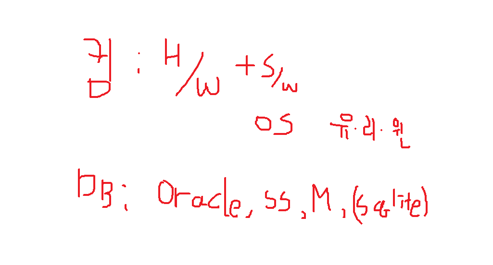

파이썬용 App -> 컴퓨터 비전/영상처리(하드웨어부터 끌고 오는 것을 영상처리라고 함)




우리나라 공정쪽은 C#으로 많이 해요.

```python

import random
#import random as rd
count = 0
for _ in range(10):
    for _ in range(10):
        num = random.randrange(0, 100) # randint(0, 99) # 주의: randint는 마지막 숫자를 포함 안함
        print("%2d" % (count), end='')
        count += 1
    print()
    
myList.reverse() # 배열 뒤집기(정렬 x)
myList.index(5)
myList.index(5, 8) # index에서 생략하면 0부터 찾고, 5로 지정하면 5부터 찾음
```

메소드는 .하고 있는거고, 함수는 단독적으로 있는거에요

```python
import random
myList = [random.randint(1, 5) for _ in range(10)]

NUMBER = 5

index = 0
while True:
    index = myList.index(NUMBER, index)
    print(index)
    index += 1
```

```python
import random
myList = [random.randint(1, 5) for _ in range(10)]

NUMBER = 5

index = 0
for i in range(myList.count(NUMBER)):
    index = myList.index(NUMBER, index)
    print(index)
    index += 1
myList.remove(1) # 1을 지운다.

myList.clear() # 리스트 비우기

del(myList[0])
del(myList[3]) # 에러남. 위치가 땡겨졌기 때문에

newList = myList # 이렇게 해서 하면, 주소만 복사됨
newList = myList.copy() # 이렇게 하거나
newList = myList[:] # 이것도 같음
```

```python
tL = sorted(tD.items(), key= operator.itemgetter(1), reverse=True)
print(tL)
```

```python
# 내부함수
def outFunc(v1, v2):
    def inFunc(n1, n2):
        return n1 + n2
    return inFunc(v1, v2)
print(outFunc(100, 200))
```

```python
from tkinter import *

window = Tk()
window.title('요기가 타이틀')
window.geometry("400x100")
window.resizable(width=False, height=True)

window.mainloop()
```

