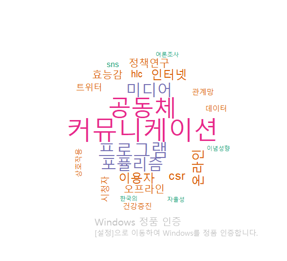

문서 분류
==

feature extractor

feature는 여러가지 형태가 될 수 있습니다.

단어가 될 수도 있고.

machine learning algorithms

큰 그림은 이렇게 된다는 것입니다.

누구의 연설문인가?

판단하는 방법이 여러가지가 있거든요?

아주 다향한 방법이 잇습니다.

아주 다양하게는 단어들의 빈도수를 계산을 해서 유추를 할 수도 있구요.


## Corpus

우리나라에는 한의학 코퍼스가 구축되어 있는 상황입니다.

감초부터 시작해서, 한의학에서 사용되는 수많은 약재들, 같은 정보가 이미 구축되어 있다구요.

Corpus를 이용해서 다양한 연구가 진행되고 있습니다.


tm에서 문서의 집합은 Corpus로

각 문서는 TextDocument로 부릅니다.

Corpus

## 수치화

문서를 직접적으로 모델링을 못합니다.

> vector space model 방법을 이용해야 합니다.

통일성 및 노이즈 제거를 위한 전처리 과정이 필요

- 문장 부호(.)를 제거
- 문자를 모두 소문자로 변환
- 불용어(stop words) 제거
  - the, a ,an, this, and , but...
- 어근추출(stemming) 등의 전처리 작업이 필요함

tm_map 함수를 사용

## 실습

n-gram도출하는 것과 관련해서 학습을 하지 않았었는데,

# 한국어와 영어의 차이

 ## 1) 분석 단위? 영어: 띄어쓰기, 한국어: 조사

영어: I am a boy => 4개

한국어: 나는 소년입니다. => 띄어쓰기: 2개, 품사: 8품사를 기준으로 단어를 구분(나, 는, 소년, 입니다)

## 2) 처리단위?

영어: 공란, 특수문자, 숫자, 불용어, 대소문자 통일, 어근 동일화,  엔그램

한국어: 공란, 특수문자, 숫자는 동일하나, 불용어 사전이 없습니다. 대소문자는 구분할 필요 없습니다. 어근 동일화를 하지 않고 명사를 추출하는 것으로 대신합니다. 엔그램

# 머신러닝 데이터 셋

[Machine Learning Repository](https://ics.uci.edu/ml/datasets.php)


```R
install.packages("RWeka")
library(RWeka)

NGramTokenizer() # n개의 그램으로 토큰을 분리하는 함수인데요,
# 첫 번째 인자는 캐릭터 벡터가 오게 되구요.
# control하는 부분인데, 

# weka contrl 이라는 것이 있어요
# 이것을 이용해 가지고, min값과 max값을 설정해 줄 수 있어요.

mytext <- c("The United States comprises fifty states. ", 
            "In the United States, each state has its own laws. ",
            "However, federal law overrides state law in the United States.")
# corpus를 만들 때는 VCorpus함수를 사용한다.
library(tm)
mytext <- VCorpus(VectorSource((mytext)))

# 말뭉치 생성
mytemp <- VCorpus(VectorSource(mytext))
ngram.tdm <- TermDocumentMatrix(mytemp)

# 예전에 했던 방법: VCorpus(DirSource("경로"))
# Non- / Sparse : 23 / 28
# Non은 값이 등장한 적 있는 것. Sparse는 0이 들어가 있는 것.
# Sparsity : 55% 0
inspect(ngram.tdm)

bigramTokenizer <- function(x){
  NGramTokenizer(x, Weka_control( # ngram으로 token을 나눠줍니다.
    min=2, max=3)) # bi-gram 또는 tri-gram 형성됨.
}

ngram.tdm <- TermDocumentMatrix(mytemp,
                   control=list(tokenize=bigramTokenizer))

str(ngram.tdm)
ngram.tdm$dimnames$Docs
ngram.tdm$dimnames$Terms
apply(ngram.tdm[,], 1, sum) # 기본적으로 array가 들어감.
# ngram.tdm[,]
bigramlist <- apply(ngram.tdm[,], 1, sum) # 기본적으로 array가 들어감.
sort(bigramlist, decreasing=T)

# mycorpus에도 위 작업을 수행
# 최상위 10개의 바이(트라이)그램을 수행

# 한국어 처리

install.packages("KoNLP")
install.packages("rJava")
library(KoNLP)
library(rJava)
library(stringr)
library(tm)


# 만약 KoNLP의 설치가 잘 안된다면,
# 1. KoNLP를 가장 먼저 로드한 다음, 나머지 패키지를 로드한다.
# 
# 2.
# 1) java설치
# 2) 내PC -> 고급설정 -> 시스템변수 -> 환경변수 추가 ->
#   변수 이름: JAVA_HOME
#   변수 값: JAVA설치 경로 지정: C:\Program Files\Java\jre1.8.0_211
# 3) 확인 -> 종료
# 4) rstudio실행 ->
#   install.packages("KoNLP")
#   library(KoNLP)
#   library(rJava)
#   library(stringr)
# 5) 그래도 에러가 발생한다면
# Sys.setenv(JAVA_HOME="C:\Program Files\Java\jre1.8.0_211") # R 명령어

mytextlocation <- "논문/"
# 파일들을 모두 가져와서 코퍼스 생성
mypaper <- VCorpus(DirSource(mytextlocation))
mypaper[[19]]$content

# 전처리 - 영어 제거, 소괄호 제거, 가운데 점 제거, 홑따옴표 제거
mykorean <- mypaper[[19]]$content
# 영문자 제거
mytext <- str_replace_all(mykorean, "[[a-zA-Z]]", "")
# 가-힣 <- 모든 한글
mykorean <- str_replace_all(mytext, "[\\(\\)·‘’]", "")
mytext

noun.mytext <- extractNoun(mykorean) # 한나눔 분석기를 사용해서, 한국어 문장을 추출할 때 사용합니다.
# 이것도 좀 문제가 있습니다. 방향성 -> 방향, 성으로 됩니다. 필요, 성으로 됩니다.
# 제도주의 같은 경우에도 구분되어 버립니다.
# 최소화시키 -> 최소, 화시, 키 ?

# 숫자표현 추출

func.extractNum <- function(x){
  str_extract_all(x, "[:digit:]{1,}")
}
table(unlist(lapply(mypaper, func.extractNum)))
# corpus에 대해서 일괄적으로 처리하는 함수가 tm_map
mycorpus <- tm_map(mypaper, removeNumbers)

mycorpus[[1]]$content

inspect(mycorpus[[3]])

# 중간에 특수문자가 들어가 있는 것들이 다 나옴
mypuncts <- lapply(mypaper, function(x) (str_extract_all(x, "\\b[[:alpha:]]{1,}[[:punct:]]{1,}\\b")))
table(unlist(mypuncts))

mytempfunc <- function(myobj, oldexp, newexp){
  tm_map(myobj, # 이전의 형식에 대해 새로운 형식으로 어떻게 바꿀지
         content_transformer( # content_transformer의 형식으로 함수를 줬음
           function(x, pattern){
             gsub(pattern, newexp, x)
             }
           ),
         oldexp)
}
mycorpus <- mytempfunct(mycorpus, "[[a-zA-Z]]", "")
mycorpus <- mytempfunct(mycorpus, "[\\(\\)_-·\\?]", "")
mycorpus <- mytempfunct(mycorpus, "[‘’]", "")
mycorpus <- tm_map(mycorpus, stripWhitespace)
mycorpus[[1]]$content

myNounFun <- function(mytext){
  myNounList <- paste(extractNoun(mytext), collapse = " ")
  return(myNounList)
  # print(myNounList)
}
myNounListRes <- myNounFun(mycorpus[[1]]$content)
myNounListRes

myNounCorpus <- mycorpus
for(i in 1:length(mycorpus)){
  myNounCorpus[[i]]$content <- myNounFun(mycorpus[[i]]$content)
}

table(unlist(lapply(myNounCorpus, function(x) str_extract_all(x, boundary("word")))))
# 과제. mycorpus[[1]]$content내용에 대해 명사 리스트를 출력

str_replace_all(mycorpus[[2]]$content, "커뮤니[[:alpha:]]{1,}", "커뮤니케이션")
str_extract_all(mycorpus[[2]]$content, "커뮤니[[:alpha:]]{1,}", "커뮤니케이션")

imsi <- myNounCorpus
for(i in 1:length(myNounCorpus)){
  myNounCorpus[[i]]$content <- str_replace_all(
    imsi[[i]]$content, "커뮤니[[:alpha:]]{1,}", "커뮤니케이션")
}

dtm.k <- DocumentTermMatrix(myNounCorpus)
colnames(dtm.k) # 단어들의 목록

imsi <- myNounCorpus
for(i in 1:length(myNounCorpus)){
  myNounCorpus[[i]]$content <- str_replace_all(
    imsi[[i]]$content, "위키리크스[[:alpha:]]{1,}", "위키리크스")
}

str_extract_all(imsi, "위키리크스([[:alpha:]]+)")
```


# 기술통계

```R
dtm.k

word.freq <- apply(dtm.k[,], 2, sum)
head(word.freq) # 
length(word.freq) # 216개 나옴.
sort.word.freq <- sort(word.freq, decreasing = T)
sort.word.freq[1:20]
cumsum.word.freq <- cumsum(sort.word.freq) # 누적 합

prop.word.freq <- cumsum.word.freq/cumsum.word.freq[length(cumsum.word.freq)]
# 전체 누적합으로 나눴음
prop.word.freq[1:20]

plot(1:length(word.freq), prop.word.freq)
# 단어들의 수가 x축, 

library("wordcloud")
library(RColorBrewer)
mypal <- brewer.pal(4, "Dark2")
wordcloud(names(word.freq),
          freq=word.freq,
          min.freq = 5,
          max.words = 100,
          colors=mypal,
          random.order = F,
          scale = c(4, 0.2)
          )

```



# 머신러닝

- 교사학습(지도학습)
- 비교사학습(비지도학습)
- 강화학습

k-means가 비교사학습의 대표적인 알고리즘입니다.

# k-means

각 그룹의 중심점을 얻어내는게 최종 목표에요.

처음에는 랜덤으로 2개의 그룹으로 나누어야 합니다.

2개의 임의의 점을 잡아서, 다른 점과의 거리를 구해봅니다.

각 점들은 가장 거리가 가까운 곳으로 소속이 됩니다.

그룹의 중앙(centroid)을 각 점들의 가운데 점으로 업데이트 합니다.

점들의 소속을 다시 구합니다.

더이상 변화가 없을 때 까지 위의 작업을 반복합니다.

문제점은 초기값이 어딘지 잡아서 하는데, 초기 값에 따라서 결과가 바뀝니다.

sns.csv파일을 읽어와서 gender를 읽어보면

NA가 들어있는 곳이 있습니다.

NA를 처리하는 방법이, 삭제하는 것이 가장 간단하고,

kNN이라는 방법으로 유추할 수도 있습니다.

KNN에서 K를 정할 때는, 엘보기법과 실루엣 알고리즘이 있습니다.


앞으로는 비지도학습의 시대가 올 거에요.

비지도 학습에서 대표적인 알고리즘이 K-means clustering이 아니고, GaN입니다.

GaN은 신경망 두개를 합쳐놓은 것입니다.

PCA가 중요합니다. 

# 오후 숙제

- mycorpus에도 위 작업을 수행
- 최상위 10개의 바이(트라이)그램을 수행